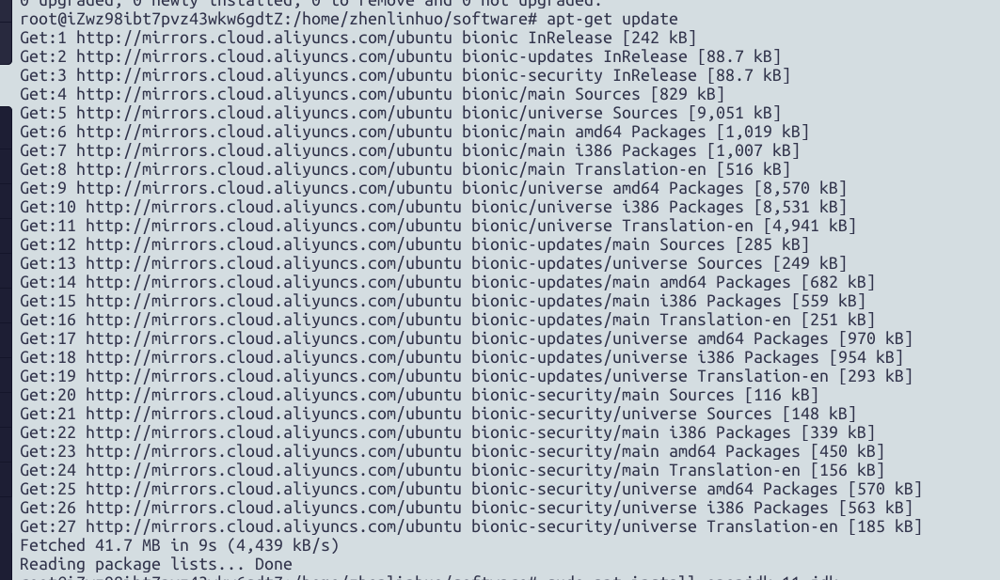
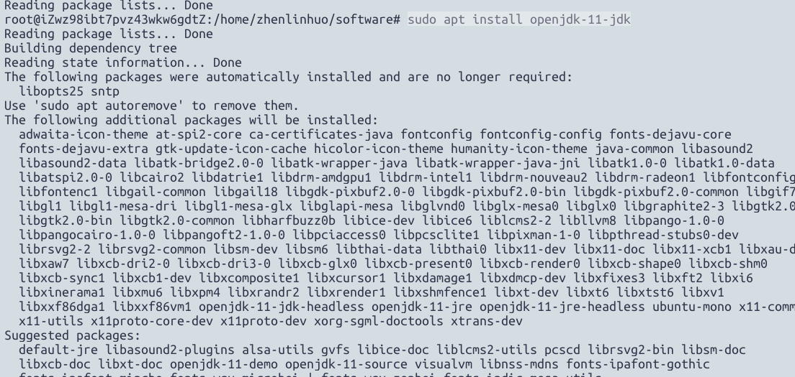

对应全新的ubuntu系统，我们要安装软件，第一步需要更新其自带源  
```bash
sudo apt-get update
```
  

  

由于Elasticsearch是由java开发，所以必须安装jdk  
```bash
sudo apt install openjdk-11-jdk
```
  

配置java_home变量  
```bash
sudo echo export JAVA_HOME=”/usr/lib/jvm/java-11-openjdk-amd64/bin”>>~/.bashrc
```
更新环境变量  
```bash
source ~/.bashrc
```
最后，查看java是否正常  
````bash
java -version
````