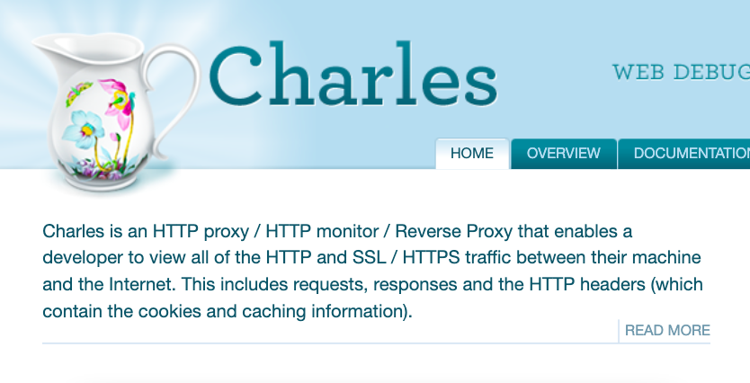  

# Charles简介  
[Charles](http://charlesproxy.com/) 是在 PC 端常用的网络封包截取工具，在做移动开发时，
我们为了调试与服务器端的网络通讯协议，常常需要截取网络封包来分析。
除了在做移动开发中调试端口外，Charles 也可以用于分析第三方应用的通讯协议。
配合 Charles 的 SSL 功能，Charles 还可以分析 Https 协议。  

## 工作原理
Charles 通过将自己设置成系统的网络访问代理服务器，使得所有的网络访问请求都通过它来完成，从而实现了网络封包的截取和分析。

## 主要功能  
* 截取 Http 和 Https 网络封包  
* 支持重发网络请求
* 支持修改网络请求参数
* 支持网络请求的截获并动态修改
* 支持模拟慢速网络  

## 下载安装  
Charles是通过Java 编写的，所以，它具有跨平台的特性。  
目前，它支持的操作系统包括:  

* Windows 64 bit(msi)  
* Windows 32 bit(msi)  
* macOS(dmg)  
* Linux 64 bit(tar.gz)  
* Linux 32 bit(tar.gz)  

打开[Charles官网](https://www.charlesproxy.com/), 根据你的机器选择对应[版本安装包](https://www.charlesproxy.com/download/)进行安装。

> 安装前请确保机器已正确配置jdk环境

# 软件界面  
Charles 的主界面视图如下图所示：  
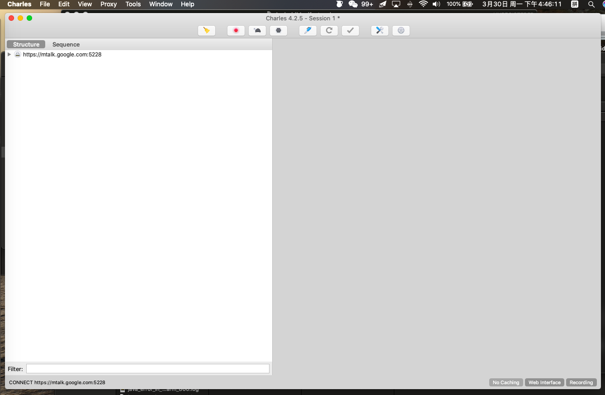  

## 工具导航栏  
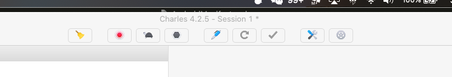  

工具导航栏主要提供了以下几种工具：
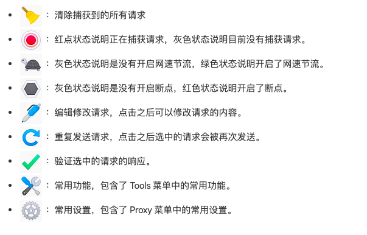

## 菜单导航栏
菜单导航栏提供了8个功能选项入口，如下图所示。
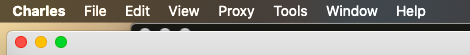 

* File：在这里可以从子选项中选择导入/导出网络请求包等等
* Edit: 在这里可以进行url的拷贝，查找  
* View: 视图切换，比如按照域名排序或者请求时间先后排序  
* Proxy: 最经常使用，在这里可以配置代理  
* Tool: 在这里可以配置资源映射  
* Window: 查看日志或者最大化窗口  
* Help: 帮助文档或者检查更新的入口就在这里  

其中，最重要的是：<b>Proxy</b>和<b>Tools</b>  
# Proxy菜单

Proxy菜单视图如下:  
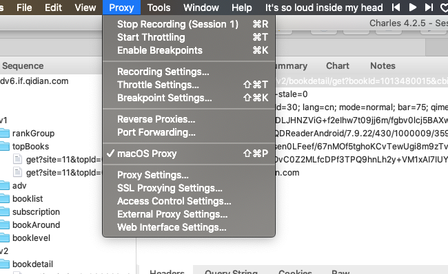  

Proxy菜单包含了以下功能: 
* Start/Stop Recording：开始/停止记录会话。
* Start/Stop Throttling：开始/停止节流。
* Enable/Disable Breakpoints：开启/关闭断点模式。
* Recording Settings：记录会话设置。
* Throttle Settings：节流设置。
* Breakpoint Settings：断点设置。
* Reverse Proxies Settings：反向代理设置。
* Port Forwarding Settings：端口转发。
* Windows/MacOS Proxy：记录计算机上的所有请求。
* Proxy Settings：代理设置。
* SSL Proxying Settings：SSL 代理设置。
* Access Control Settings：访问控制设置。
* External Proxy Settings：外部代理设置。
* Web Interface Settings：Web 界面设置。  

下面，重点介绍Windows/MacOS Proxy, Proxy Settings, SSL Proxying Settings及External Proxy Settings  
## Windows/MacOS Proxy  
在windows电脑上，该选项名叫Windows Proxy, 在Mac电脑上，该选项名叫MacOS Proxy。点击
选择即可让Charles监听电脑上所有的http/https请求。
> 如果你只需要抓手机app的请求，那么可以不选中此选项，那么，电脑中的请求将不被记录到charles记录表中。

## Proxy Settings  
Proxy Settings设置界面如下:  
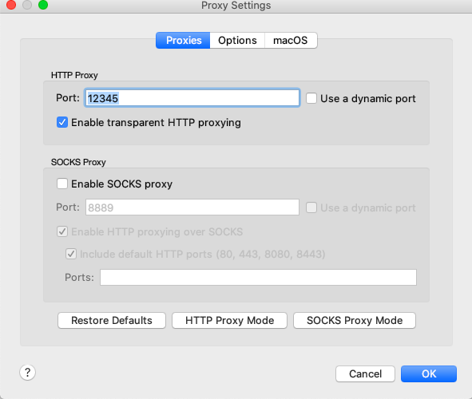    

代理端口默认为 8888(可以修改)，并且勾上 Enable transparent HTTP proxying 就完成了在 Charles 上的代理设置。 
原理: Charles在本地开启了一个8888监听端口, 其他设备在代理设置中，填入charles所在运行设备的ip及端口，即可实现监听
该设备的所有http请求。  

下面介绍如何配置手机代理及查看电脑ip  
* 查看电脑ip  
如果你是mac电脑, 打开网络实用工具或者终端输入ifconfig，找到你的网卡那一栏，即可找到IP地址。
如果你是windows电脑, 打开控制台，输入ipconfig,找到你的网卡那一栏，即可找到IP地址。  
下图是我的mac电脑获取ip地址的截图:
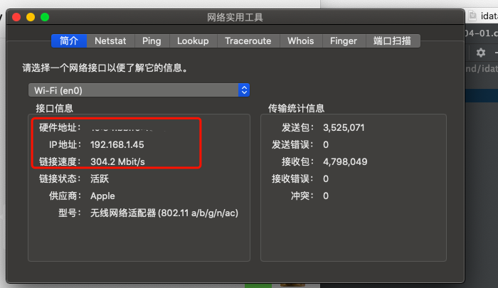  

* 配置手机代理  
打开手机设置-> 找到WIFI设置->选择当前连接的网络点击修改->在Proxy hostname中填入电脑的ip，在Proxy port
中填入charles开启的http监听端口-> 保存配置  
接下来，手机上进行的所有http请求将被记录在charles中。
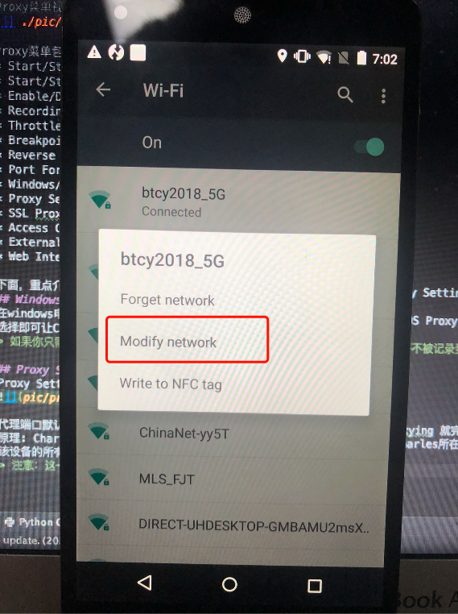  
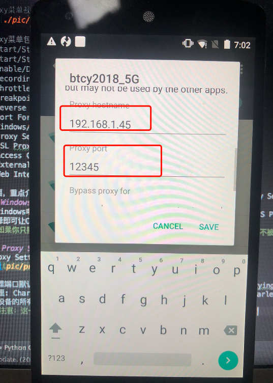
> 注意：这一步操作完成，只能实现对手机app的http协议的监听，https还不行， 要监听https协议的数据包，需要进一步配置
ssl证书   

## SSL Proxying Settings  
上面提到，需要配置ssl证书才能监听https的请求包，配置如下:  

点击add按钮,host填入\*， port填入\*,\*代表所有IP, 所有端口 
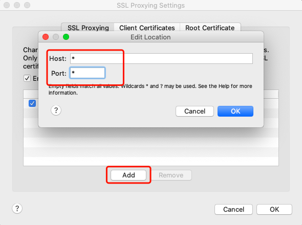    

接着, 电脑，手机上都需要安装由charles提供的ssl证书。  
* 电脑安装证书  
在菜单导航栏中，选择help->SSL Proxying-> install charles root certificate，按照提示步骤安装证书即可  

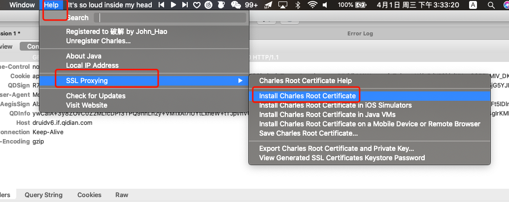  

* 手机安装证书  
已经连接上charles代理的手机上，打开浏览器，在地址栏中,输入chls.pro/ssl即可下载证书进行安装  

电脑和手机证书都安装完成后，手机发起的https请求，终于被记录在charles列表中了,我们能看到所有的https
协议的请求，一次请求中，携带的header有那些参数，是get/post请求，返回的response有那些内容，我们都能很清楚的看到。
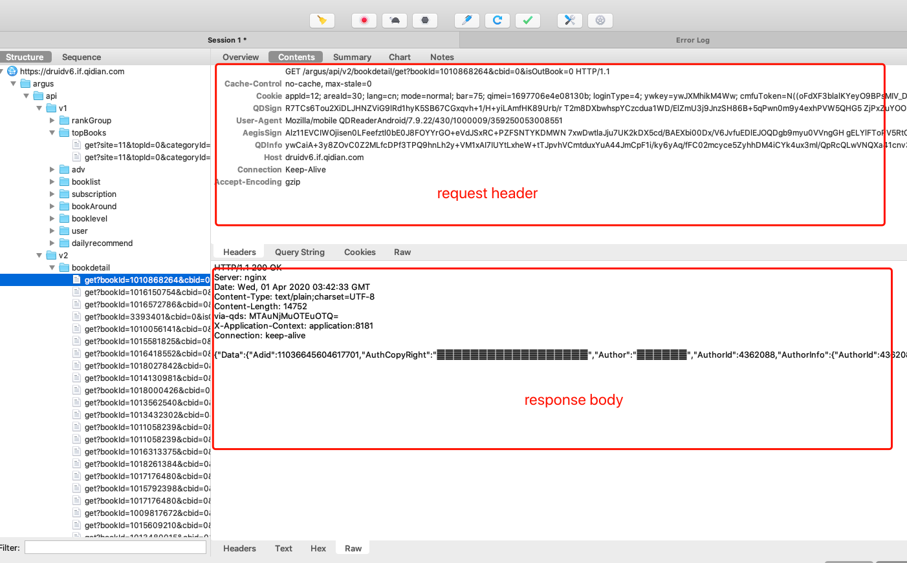  

## External Proxy Settings  
有时候，我们抓取的数据可能是内网或者外网才能访问到的，此刻，配合charles提供的外部代理设置，可轻松让我们
实现只连接charles代理，同样能正常访问内网或者外网。  
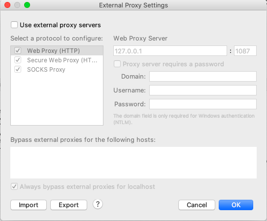  

# Charles抓包教程案例  

## 准备工作  
1. 使手机和电脑在一个局域网内，不一定非要是一个 IP 段，只要是在同一个路由器下即可  

2. 电脑端配置：
* 关掉电脑端的防火墙（这点很重要）
* 打开 Charles 的代理功能：通过主菜单打开 Proxy | Proxy Settings 弹窗，填入代理端口(端口默认为 8888，不用修改)，勾选 Enable transparent HTTP proxying
* 如果不需要抓取电脑上的请求，可以取消勾选 Proxy | Windows Proxy 和 Proxy | Mozilla FireFox Proxy.  

3. 手机配置:  
* 通过 Charles 的主菜单 Help | Local IP Address 或者通过命令行工具输入 ipconfig 查看本机的 IP 地址。
* 设置代理：打开手机端的 WIFI 代理设置，输入电脑 IP 和 Charles 的代理端口  

4. 设置好之后，我们打开手机上的任意需要网络请求的程序，就可以看到 Charles 弹出手机请求连接的确认菜单（只有首次弹出），点击 Allow 即可完成设置。  
> 以上4个步骤为http抓包配置，正常抓包流程，还需要完成https抓包配置,
HTTPS 的抓包需要在 HTTP 抓包基础上再进行设置。需要完成一下步骤

1. 电脑端安装 Charles 证书：通过 Charles 的主菜单 Help | SSL Proxying | Install Charles Root Certificate 安装证书。
2. 设置 SSL 代理：通过主菜单打开 Proxy | SSL Proxy Settings 弹窗，勾选 Enable SSL proxying。
3. 移动端安装 Charles 证书：通过 Charles 的主菜单 Help | SSL Proxying | Install Charles Root Certificate on a Mobile Device or Remote Browser 安装证书。
4. 设置好之后，我们打开手机上的任意需要网络请求的程序，就可以看到 Charles 弹出手机请求连接的确认菜单（只有首次弹出），点击 Allow 即可完成设置。
完成以上步骤，就可以进行 HTTPS 抓包了。

## 经典案例之锦江酒店app 
任务：获取锦江酒店app中所有的酒店  

步骤：
1. 打开锦江酒店app，通过城市搜索酒店列表页
2. 在charles抓包列表中，查找和酒店列表页显示相近的数据包
终于，在url为：https://booking.bestwehotel.com/apph5/proxy/trip-search/search/findHotel 的数据包下，找到了，如图所示
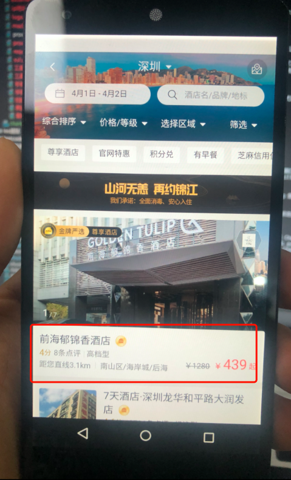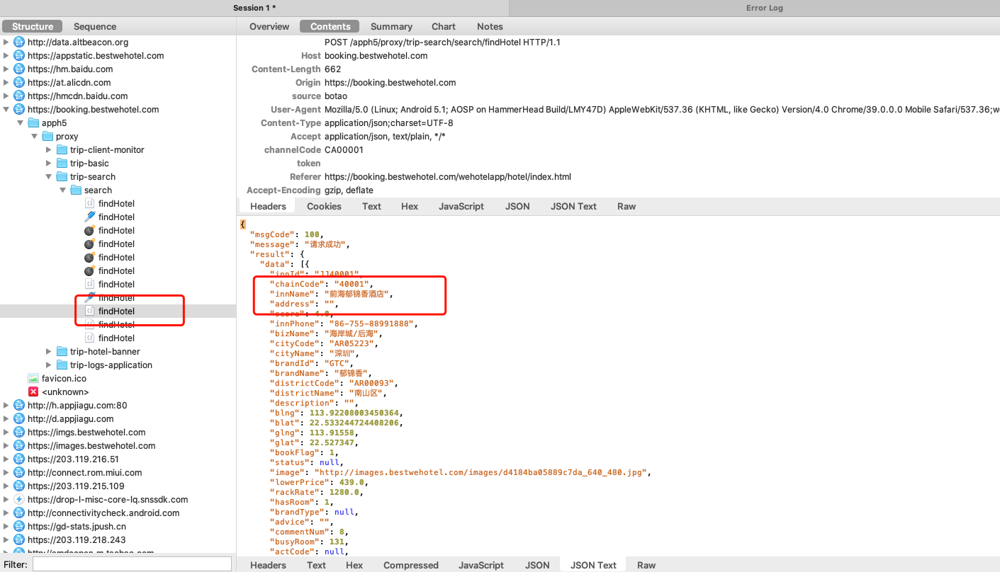
3. 分析请求：
headers信息如图:
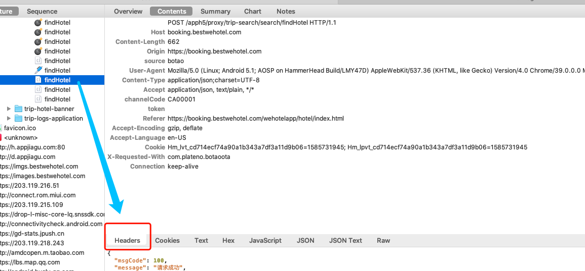  
可以看到，headers中，显示了请求方法为POST请求，构成headers的主要参数如下
* Host 必须有
* Origin 可有可无
* source 可有可无
* User-Agent 浏览器头，必须携带，常用于反爬
* Content-Type
* Accept
* channelCode 可能是个固定值，在charles中修改此值再次请求无数据
* token	为空
* Referer 通常大数据网站作为反爬参数之一，在此网站可有可无
* Accept-Encoding
* Accept-Language
* Cookie 记录用户信息用，可有可无
* X-Requested-With  
那么，我们利用charles的修改请求功能，修改headers部分信息，看看是否还能获取数据不
测试发现，refer,source,origin,cookie等参数可以为空，其他值如Host,channelCode必须有。
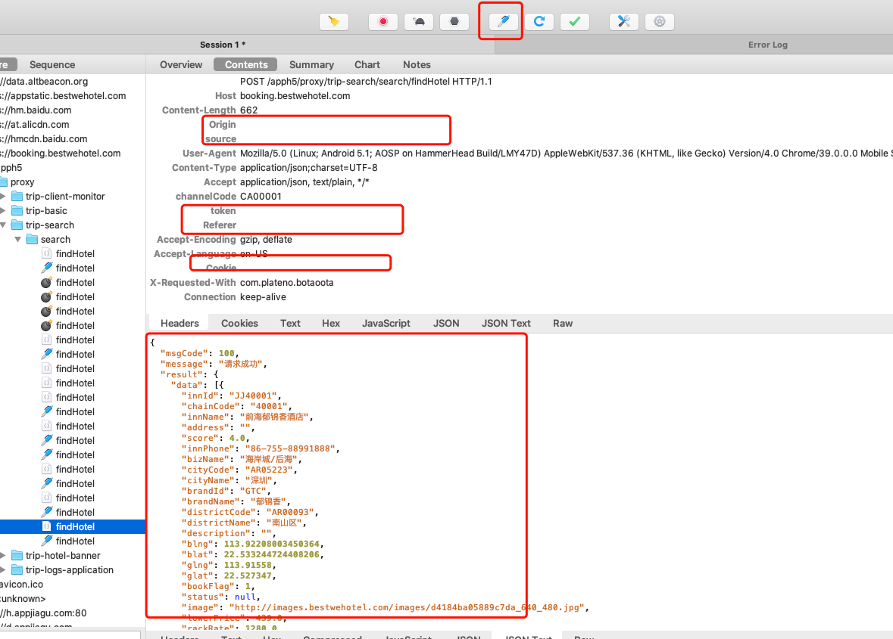

接下来，既然这个请求是post请求，那么我们看另一个关键部分，请求body 
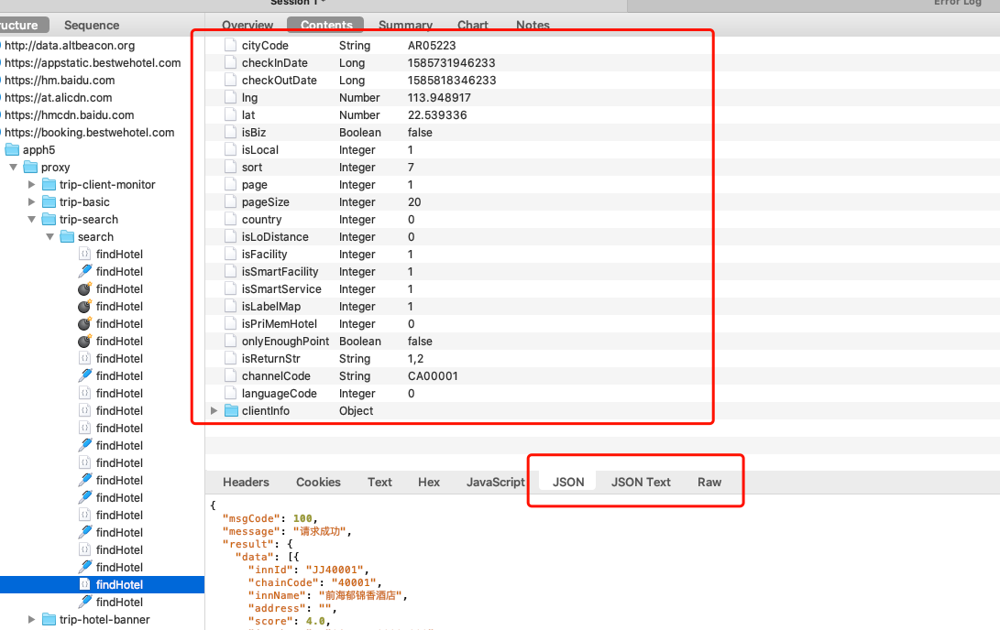  

如图所示，锦江酒店的请求body中，内容还是很多的。
```json
{
	"cityCode": "AR05223", //看名字，cityCode应该是个城市的id
	"checkInDate": 1585731946233, //看名字，是入住时间的意思，13位数的时间戳，转成北京时间为：2020-04-01 17:05:46:233
	"checkOutDate": 1585818346233, //看名字，是离开时间的意思，13位数的时间戳，转成北京时间为：2020-04-02 17:05:46:233
	"lng": 113.948917, //经度
	"lat": 22.539336, //维度
	"isBiz": false,
	"isLocal": 1,
	"sort": 7,
	"page": 1, //页码
	"pageSize": 20, //每页的返回条数？
	"country": 0, //可能用于区分国内国外
	"isLoDistance": 0,
	"isFacility": 1,
	"isSmartFacility": 1,
	"isSmartService": 1,
	"isLabelMap": 1,
	"isPriMemHotel": 0,
	"onlyEnoughPoint": false,
	"isReturnStr": "1,2",
	"channelCode": "CA00001", //很熟悉，header中也有这个参数
	"languageCode": 0, //可能区分中英文
	"clientInfo": { 
	    // 客户端信息，看名字是这个意思
		"appName": "botao",
		"appVersion": "4.2.9",
		"channelId": "306267",
		"deviceId": "359250053008551", //设备id
		"hardwareModel": "hammerhead",
		"os": "android",
		"partakeChannel": "a00",
		"scr": "9b48d7ab86736a099740f90d47e7c7a4",
		"sellerId": "306267",
		"shareCardNo": "",
		"systemVersion": "5.1", //安卓版本好
		"versionCode": "429"
	}
}
```
分析完毕，我们反过来思考，如此多参数，不一定每一个都需要，那么，我们尝试精简部分无用参数，看看是否能再次
拿到结果
精简后的body
```json
{
	"cityCode": "AR05223", //城市id
	"checkInDate": 1585731946233, // 入住时间
	"checkOutDate": 1585818346233, // 退房时间
	"sort": 7, //排序，后面发现，此值也可去除
	"page": 1, //页数
	"pageSize": 20, //每页返回条数
	"channelCode": "CA00001" //频道
}
```
返回数据:
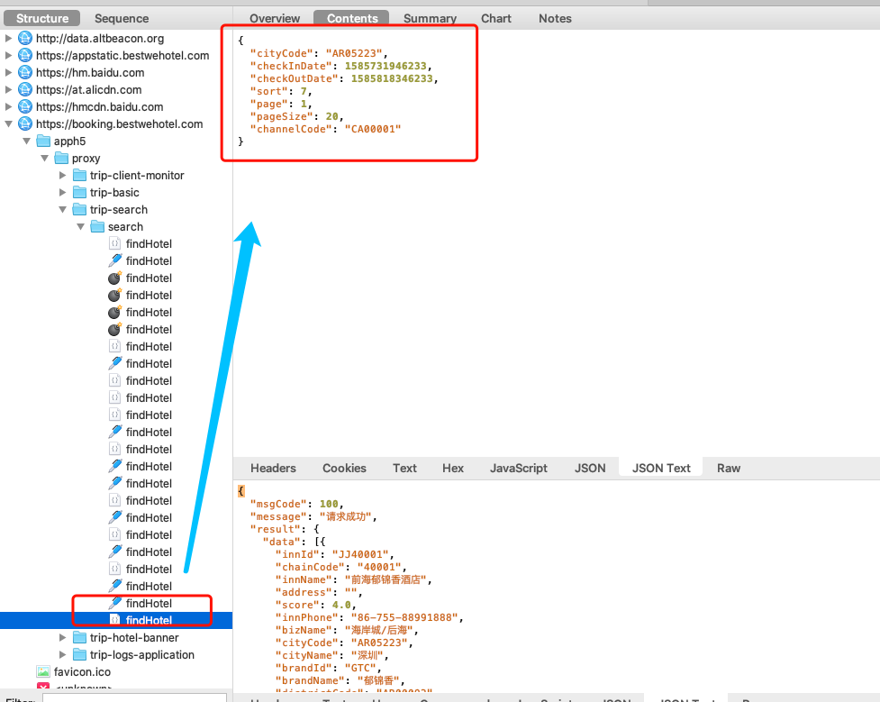  

问题来了，cityCode该怎么拿呢。按照程序的设计思维，一般这东西不固定在app中，就肯定可以通过网络请求拿到。
好，接下来我们去找这个请求在哪里。
1. 我们回到搜索酒店的入口，在那里我们可以通过选择城市来寻找酒店，那么，获取城市的入口一定就在这里了.    
在https://booking.bestwehotel.com/apph5/proxy/trip-basic/basic/getCity此链接请求下，找到这这个数据包
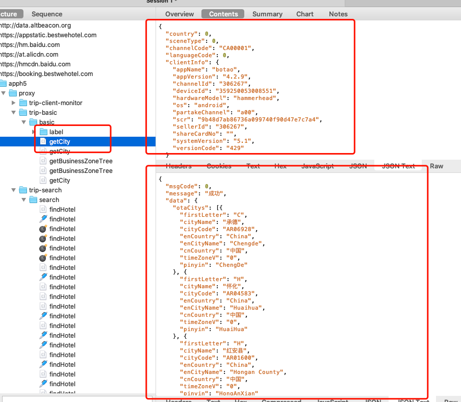
找到数据包，同样，我们去分析它。
和搜索酒店列表一样，它也是个post请求，请求header一致，body少了部分参数，其他没变化  
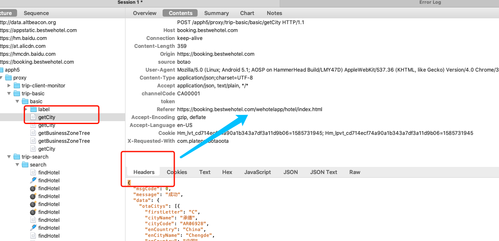 
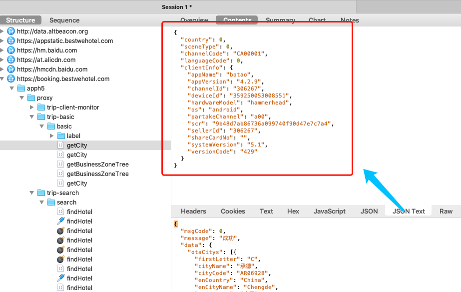  

既然cityCode的接口也找到了，那么，我们尝试写程序去获取数据  
```python
import requests
import json

headers = {
    "User-Agent": "Mozilla/5.0 (Linux; Android 5.1; AOSP on HammerHead Build/LMY47D) AppleWebKit/537.36 (KHTML, like Gecko) Version/4.0 Chrome/39.0.0.0 Mobile Safari/537.36;webank/h5face;webank/1.0;netType:NETWORK_WIFI;appVersion:429;packageName:com.plateno.botaoota;/wehotel botao v=4.2.9",

    "Content-Type": "application/json;charset=UTF-8",
    "Accept": "application/json, text/plain, */*",
    "channelCode": "CA00001"
}


def get_cityCode():
    """获取cityCode"""
    url = 'https://booking.bestwehotel.com/apph5/proxy/trip-basic/basic/getCity'
    body = {
        "country": 0,
        "sceneType": 0,
        "channelCode": "CA00001",
        "languageCode": 0,
        "clientInfo": {
            "appName": "botao",
            "appVersion": "4.2.9",
            "channelId": "306267",
            "deviceId": "359250053008551",
            "hardwareModel": "hammerhead",
            "os": "android",
            "partakeChannel": "a00",
            "scr": "9b48d7ab86736a099740f90d47e7c7a4",
            "sellerId": "306267",
            "shareCardNo": "",
            "systemVersion": "5.1",
            "versionCode": "429"
        }
    }
    response = requests.post(url=url, data=json.dumps(body), headers=headers)
    print(response.text)


def get_hoteList():
    """获取酒店列表"""
    url = 'https://booking.bestwehotel.com/apph5/proxy/trip-search/search/findHotel'
    body = {
        "cityCode": "AR05223",
        "checkInDate": 1585731946233,
        "checkOutDate": 1585818346233,
        "page": 1,
        "pageSize": 20,
        "channelCode": "CA00001"
    }
    response = requests.post(url=url, data=json.dumps(body), headers=headers)
    print(response.text)

get_cityCode()
get_hoteList()

```
输出结果如图:
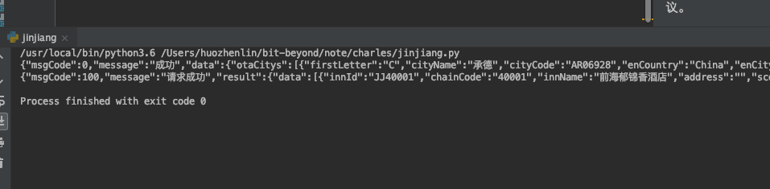  

## 特殊案例之oyo酒店
[frida安装教程及案例.md](../frida安装教程及案例.md)

# 参考资料

* [Charles 功能介绍和使用教程](https://juejin.im/post/5b8350b96fb9a019d9246c4c#heading-14)

