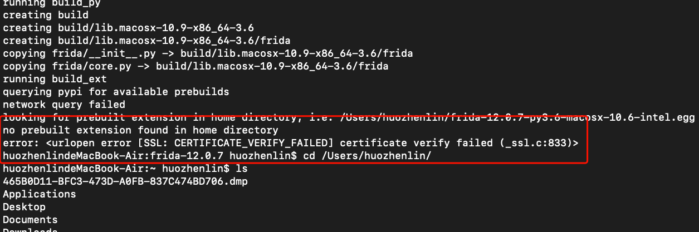
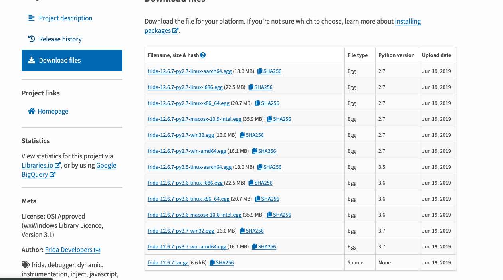
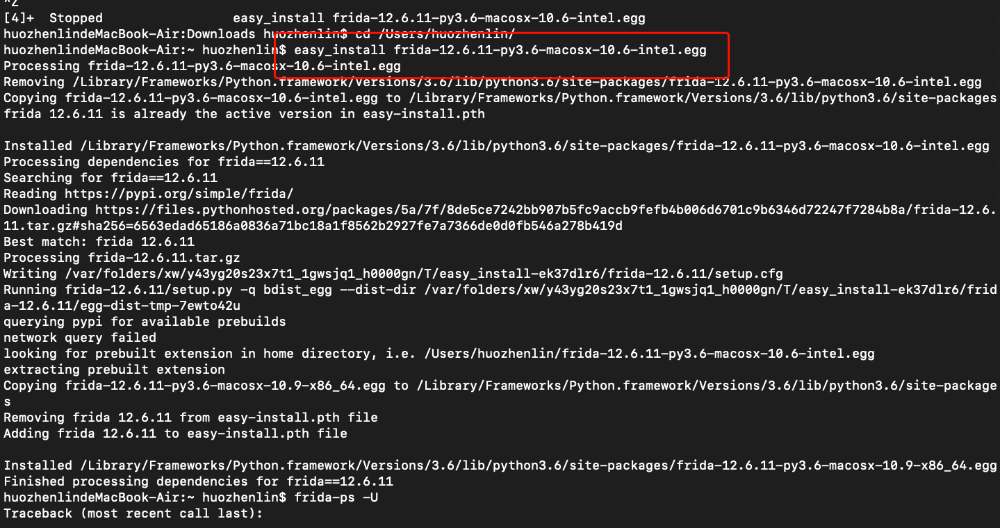
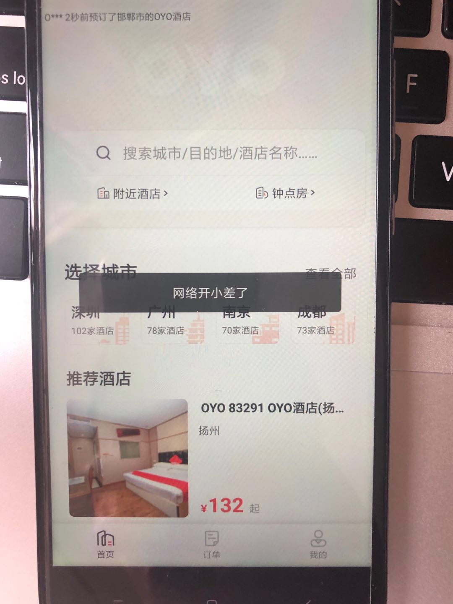
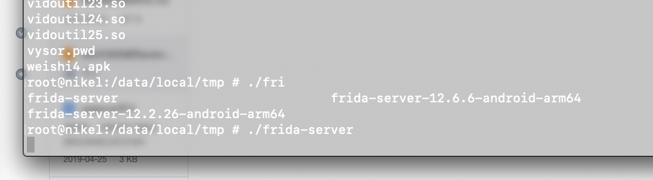
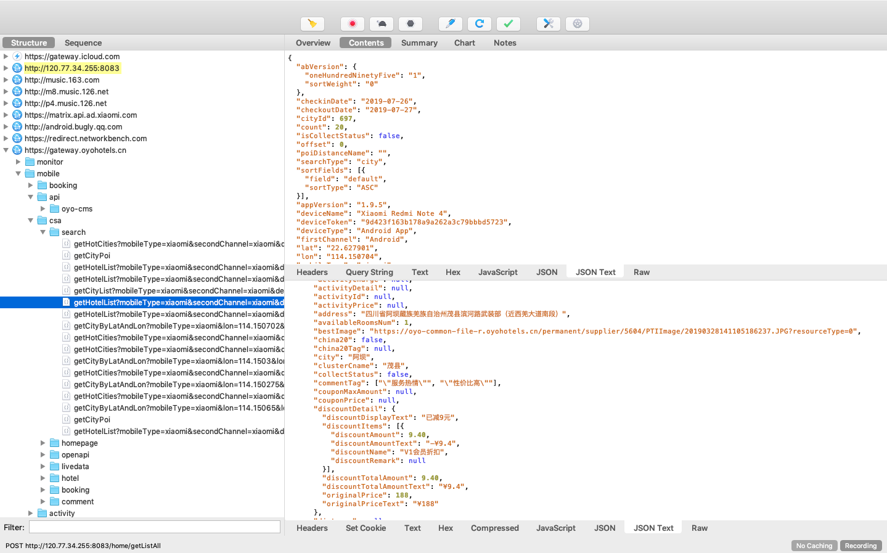

# 什么是frida  
frida是一款代码注入工具，它可以实现hook一个方法，让其返回我们需要的值。这是我刚接触这工具的理解。

# 如何安装  
网上的教程可以说是百花齐放，相得益彰,下面的
教程将教你如何手动安装，而非自动化。为什么不使用自动化呢？手动安装速度更快，可以避免很多如证书错误，
网络延迟等一系列外在因素，造成安装失败的结果。  


## 第一步，下载egg文件到用户目录下  
我电脑是mac，使用的版本是[12.6.7](https://pypi.org/project/frida/12.6.7/#files),
所以我下载的是
frida-12.6.7-py3.6-macosx-10.6-intel.egg,如果你的是
windows或linux，请选择对应版本下载。  
  

## 第二步，进入文件下载目录，手动进行安装  
```bash
easy_install frida-12.6.7-py3.6-macosx-10.6-intel.egg
```
  
* 提示。若出现以下错误，请将egg文件移动至对应目录再安装。
```bash
looking for prebuilt extension in home directory, i.e. /Users/huozhenlin/frida-12.6.11-py3.6-macosx-10.6-intel.egg
no prebuilt extension found in home directory
error: Setup script exited with error: <urlopen error [SSL: CERTIFICATE_VERIFY_FAILED] certificate verify failed (_ssl.c:833)>
```    
## 第三步，安装frida-tools  
```bash
pip3 install frida-tools
```
若提示如下信息，说明安装成功
```bash
Requirement already satisfied: frida-tools in /Library/Frameworks/Python.framework/Versions/3.6/lib/python3.6/site-packages/frida_tools-2.0.1-py3.6.egg (2.0.1)
Requirement already satisfied: colorama<1.0.0,>=0.2.7 in /Library/Frameworks/Python.framework/Versions/3.6/lib/python3.6/site-packages (from frida-tools) (0.4.1)
Requirement already satisfied: frida<13.0.0,>=12.5.9 in /Library/Frameworks/Python.framework/Versions/3.6/lib/python3.6/site-packages/frida-12.6.11-py3.6-macosx-10.9-x86_64.egg (from frida-tools) (12.6.11)
Requirement already satisfied: prompt-toolkit<3.0.0,>=2.0.0 in /Library/Frameworks/Python.framework/Versions/3.6/lib/python3.6/site-packages/prompt_toolkit-2.0.9-py3.6.egg (from frida-tools) (2.0.9)
Requirement already satisfied: pygments<3.0.0,>=2.0.2 in /Library/Frameworks/Python.framework/Versions/3.6/lib/python3.6/site-packages/Pygments-2.4.2-py3.6.egg (from frida-tools) (2.4.2)
Requirement already satisfied: six>=1.9.0 in /Library/Frameworks/Python.framework/Versions/3.6/lib/python3.6/site-packages (from prompt-toolkit<3.0.0,>=2.0.0->frida-tools) (1.12.0)
Collecting wcwidth (from prompt-toolkit<3.0.0,>=2.0.0->frida-tools)
  Using cached https://files.pythonhosted.org/packages/7e/9f/526a6947247599b084ee5232e4f9190a38f398d7300d866af3ab571a5bfe/wcwidth-0.1.7-py2.py3-none-any.whl
Installing collected packages: wcwidth
Successfully installed wcwidth-0.1.7
```
## 校验frida是否正常工作  
```bash
$ frida -h
```
若正常输出以下信息，说明安装成功  
```bash
Usage: frida [options] target

Options:
  --version             show program's version number and exit
  -h, --help            show this help message and exit
  -D ID, --device=ID    connect to device with the given ID
  -U, --usb             connect to USB device
  -R, --remote          connect to remote frida-server
  -H HOST, --host=HOST  connect to remote frida-server on HOST
  -f FILE, --file=FILE  spawn FILE
  -n NAME, --attach-name=NAME
                        attach to NAME
  -p PID, --attach-pid=PID
                        attach to PID
  --debug               enable the Node.js compatible script debugger
  --enable-jit          enable JIT
  -l SCRIPT, --load=SCRIPT
                        load SCRIPT
  -c CODESHARE_URI, --codeshare=CODESHARE_URI
                        load CODESHARE_URI
  -e CODE, --eval=CODE  evaluate CODE
  -q                    quiet mode (no prompt) and quit after -l and -e
  --no-pause            automatically start main thread after startup
  -o LOGFILE, --output=LOGFILE
                        output to log file
```
# 实战  

本次选取app为某酒店app,该app设置了任何代理后，都将无法联网。
  
面对这种情况，经验丰富的逆向人员肯定想到了，该app会监听网络情况，当网络使用了任何代理，都将无法联网。  
```javascript
/*
    * 判断设备 是否使用代理上网
    * */
    private boolean isWifiProxy(Context context) {
 
        final boolean IS_ICS_OR_LATER = Build.VERSION.SDK_INT >= Build.VERSION_CODES.ICE_CREAM_SANDWICH;
 
        String proxyAddress;
 
        int proxyPort;
 
        if (IS_ICS_OR_LATER) {
 
            proxyAddress = System.getProperty("http.proxyHost");
 
            String portStr = System.getProperty("http.proxyPort");
 
            proxyPort = Integer.parseInt((portStr != null ? portStr : "-1"));
 
        } else {
 
            proxyAddress = android.net.Proxy.getHost(context);
 
            proxyPort = android.net.Proxy.getPort(context);
 
        }
 
        return (!TextUtils.isEmpty(proxyAddress)) && (proxyPort != -1);
 
    }
```  
从以上代码中，我们可以知道，使用了代理，将返回true。那么，我们该怎么hook此函数，让其总返回false呢？
1. 手机安装frida-server，[下载地址](https://github.com/frida/frida/releases)  
我们将下载到的frida-server安装包放进手机data/local/tmp目录下。方法有很多，我是通过adb方式传送文件
的。
```bash
$ adb push frida-server-12.6.6-android-arm64 /data/local/tmp/
```  
2. 启动frida-server  
```bash
$ adb shell #进入adb终端
$ su # 切换至超级用户
$ cd data/local/tmp # 进入frida-server存放目录
$ chomd 777 ./frida-server-12.6.6-android-arm64 # 赋予目录可读可写执行权限  
$ ./frida-server
```
  
3. 手机启动目标程序，终端查看进程是否存在
```bash
$ adb forward tcp:27042 tcp:27042 # 端口转发，将frida端口映射至本地 
$ frida-ps -R
```
输出信息如下  
```bash
  PID  Name
-----  -----------------------------------------
  375  6620_launcher
  659  MPED
  670  MtkCodecService
  651  aal
  398  adbd
 3064  android.process.acore
 1715  android.process.media
  668  batterywarning
  380  ccci_fsd
  382  ccci_fsd
  381  ccci_mdinit
  383  ccci_mdinit
 2468  com.amap.android.location
 5051  com.android.calendar
28273  com.android.camera
 3766  com.android.defcontainer
 3669  com.android.fileexplorer:remote
 2673  com.android.phone
 5435  com.android.settings
 2176  com.android.settings:remote
 1699  com.android.systemui
14787  com.android.thememanager
22936  com.android.vending
20588  com.android.vending:instant_app_installer
 2017  com.miui.whetstone
26764  com.oyohotels.consumer
27064  com.oyohotels.consumer:remote
 6464  com.tencent.mm
 4701  com.tencent.mm:push

```  
4. 确认进程存在。接着，启动注入程序  
```bash
$ frida -U com.oyohotels.consumer --no-pause -l hooks.js
```
此时，我们观察app运行情况及控制台日志输出  
```bash
huozhenlindeMacBook-Air:frida_demo huozhenlin$ frida -U com.oyohotels.consumer --no-pause -l hooks.js
     ____
    / _  |   Frida 12.6.11 - A world-class dynamic instrumentation toolkit
   | (_| |
    > _  |   Commands:
   /_/ |_|       help      -> Displays the help system
   . . . .       object?   -> Display information about 'object'
   . . . .       exit/quit -> Exit
   . . . .
   . . . .   More info at http://www.frida.re/docs/home/
Attaching...                                                            
OkHTTP 3.x Found
com.squareup.okhttp not found
Xutils hooks not Found
httpclientandroidlib Hooks not found
TrustManagerImpl verifyChain nout found below 7.0
message: {'type': 'send', 'payload': 'Custom, Empty TrustManager ready'} data: None
[Xiaomi Redmi Note 4::com.oyohotels.consumer]-> message: {'type': 'send', 'payload': 'OkHTTP 3.x check() called. Not throwing an exception.'} data: None
message: {'type': 'send', 'payload': 'OkHTTP 3.x check() called. Not throwing an exception.'} data: None
message: {'type': 'send', 'payload': 'OkHTTP 3.x check() called. Not throwing an exception.'} data: None
message: {'type': 'send', 'payload': 'OkHTTP 3.x check() called. Not throwing an exception.'} data: None
message: {'type': 'send', 'payload': 'OkHTTP 3.x check() called. Not throwing an exception.'} data: None
message: {'type': 'send', 'payload': 'OkHTTP 3.x check() called. Not throwing an exception.'} data: None
message: {'type': 'send', 'payload': 'OkHTTP 3.x check() called. Not throwing an exception.'} data: None                          
message: {'type': 'send', 'payload': 'TrustManagerFactory getTrustManagers invoked'} data: None
message: {'type': 'send', 'payload': 'Overriding SSLContext.init() with the custom TrustManager'} data: None
message: {'type': 'send', 'payload': 'OkHTTP 3.x check() called. Not throwing an exception.'} data: None
message: {'type': 'send', 'payload': 'TrustManagerFactory getTrustManagers invoked'} data: None
message: {'type': 'send', 'payload': 'Overriding SSLContext.init() with the custom TrustManager'} data: None
message: {'type': 'send', 'payload': 'OkHTTP 3.x check() called. Not throwing an exception.'} data: None
```
抓包情况

 

最后。献上注入代码  
Python版
```python
# coding=utf-8
import frida
import sys

ip45 = frida.get_usb_device()
session = ip45.attach("com.oyohotels.consumer:remote")

js = '''
Java.perform(function () {
    var b = Java.use("okhttp3.CertificatePinner");
    console.log("run script!");
    b.check.overload('java.lang.String', 'java.util.List').implementation = function () {
        return null;
    };
});
'''


def on_message(message, data):
    print(message)


script = session.create_script(js)
script.on('message', on_message)
script.load()
sys.stdin.read()
```  
Javascript版  
```javascript
Java.perform(function() {

/*
hook list:
1.SSLcontext
2.okhttp
3.webview
4.XUtils
5.httpclientandroidlib
6.JSSE
7.network\_security\_config (android 7.0+)
8.Apache Http client (support partly)
*/

// Attempts to bypass SSL pinning implementations in a number of
// ways. These include implementing a new TrustManager that will
// accept any SSL certificate, overriding OkHTTP v3 check()
// method etc.
var X509TrustManager = Java.use('javax.net.ssl.X509TrustManager');
var HostnameVerifier = Java.use('javax.net.ssl.HostnameVerifier');
var SSLContext = Java.use('javax.net.ssl.SSLContext');
var quiet_output = false;

// Helper method to honor the quiet flag.
function quiet_send(data) {

    if (quiet_output) {

        return;
    }

    send(data)
}


// Implement a new TrustManager
// ref: https://gist.github.com/oleavr/3ca67a173ff7d207c6b8c3b0ca65a9d8
// Java.registerClass() is only supported on ART for now(201803). 所以android 4.4以下不兼容,4.4要切换成ART使用.
/*
06-07 16:15:38.541 27021-27073/mi.sslpinningdemo W/System.err: java.lang.IllegalArgumentException: Required method checkServerTrusted(X509Certificate[], String, String, String) missing
06-07 16:15:38.542 27021-27073/mi.sslpinningdemo W/System.err:     at android.net.http.X509TrustManagerExtensions.<init>(X509TrustManagerExtensions.java:73)
        at mi.ssl.MiPinningTrustManger.<init>(MiPinningTrustManger.java:61)
06-07 16:15:38.543 27021-27073/mi.sslpinningdemo W/System.err:     at mi.sslpinningdemo.OkHttpUtil.getSecPinningClient(OkHttpUtil.java:112)
        at mi.sslpinningdemo.OkHttpUtil.get(OkHttpUtil.java:62)
        at mi.sslpinningdemo.MainActivity$1$1.run(MainActivity.java:36)
*/
var X509Certificate = Java.use("java.security.cert.X509Certificate");
var TrustManager;
try {
    TrustManager = Java.registerClass({
        name: 'org.wooyun.TrustManager',
        implements: [X509TrustManager],
        methods: {
            checkClientTrusted: function (chain, authType) {
            },
            checkServerTrusted: function (chain, authType) {
            },
            getAcceptedIssuers: function () {
                // var certs = [X509Certificate.$new()];
                // return certs;
                return [];
            }
        }
    });
} catch (e) {
    console.log("registerClass from X509TrustManager >>>>>>>> " + e.message);
}


// Prepare the TrustManagers array to pass to SSLContext.init()
var TrustManagers = [TrustManager.$new()];

try {
    // Prepare a Empty SSLFactory
    var TLS_SSLContext = SSLContext.getInstance("TLS");
    TLS_SSLContext.init(null,TrustManagers,null);
    var EmptySSLFactory = TLS_SSLContext.getSocketFactory();
} catch (e) {
    console.log(e.message);
}

send('Custom, Empty TrustManager ready');

// Get a handle on the init() on the SSLContext class
var SSLContext_init = SSLContext.init.overload(
    '[Ljavax.net.ssl.KeyManager;', '[Ljavax.net.ssl.TrustManager;', 'java.security.SecureRandom');

// Override the init method, specifying our new TrustManager
SSLContext_init.implementation = function (keyManager, trustManager, secureRandom) {

    quiet_send('Overriding SSLContext.init() with the custom TrustManager');

    SSLContext_init.call(this, null, TrustManagers, null);
};

/*** okhttp3.x unpinning ***/


// Wrap the logic in a try/catch as not all applications will have
// okhttp as part of the app.
try {

    var CertificatePinner = Java.use('okhttp3.CertificatePinner');

    console.log('OkHTTP 3.x Found');

    CertificatePinner.check.overload('java.lang.String', 'java.util.List').implementation = function () {

        quiet_send('OkHTTP 3.x check() called. Not throwing an exception.');
    }

} catch (err) {

    // If we dont have a ClassNotFoundException exception, raise the
    // problem encountered.
    if (err.message.indexOf('ClassNotFoundException') === 0) {

        throw new Error(err);
    }
}

// Appcelerator Titanium PinningTrustManager

// Wrap the logic in a try/catch as not all applications will have
// appcelerator as part of the app.
try {

    var PinningTrustManager = Java.use('appcelerator.https.PinningTrustManager');

    send('Appcelerator Titanium Found');

    PinningTrustManager.checkServerTrusted.implementation = function () {

        quiet_send('Appcelerator checkServerTrusted() called. Not throwing an exception.');
    }

} catch (err) {

    // If we dont have a ClassNotFoundException exception, raise the
    // problem encountered.
    if (err.message.indexOf('ClassNotFoundException') === 0) {

        throw new Error(err);
    }
}

/*** okhttp unpinning ***/


try {
    var OkHttpClient = Java.use("com.squareup.okhttp.OkHttpClient");
    OkHttpClient.setCertificatePinner.implementation = function(certificatePinner){
        // do nothing
        console.log("OkHttpClient.setCertificatePinner Called!");
        return this;
    };

    // Invalidate the certificate pinnet checks (if "setCertificatePinner" was called before the previous invalidation)
    var CertificatePinner = Java.use("com.squareup.okhttp.CertificatePinner");
    CertificatePinner.check.overload('java.lang.String', '[Ljava.security.cert.Certificate;').implementation = function(p0, p1){
        // do nothing
        console.log("okhttp Called! [Certificate]");
        return;
    };
    CertificatePinner.check.overload('java.lang.String', 'java.util.List').implementation = function(p0, p1){
        // do nothing
        console.log("okhttp Called! [List]");
        return;
    };
} catch (e) {
 console.log("com.squareup.okhttp not found");
}

/*** WebView Hooks ***/

/* frameworks/base/core/java/android/webkit/WebViewClient.java */
/* public void onReceivedSslError(Webview, SslErrorHandler, SslError) */
var WebViewClient = Java.use("android.webkit.WebViewClient");

WebViewClient.onReceivedSslError.implementation = function (webView,sslErrorHandler,sslError){
    quiet_send("WebViewClient onReceivedSslError invoke");
    //执行proceed方法
    sslErrorHandler.proceed();
    return ;
};

WebViewClient.onReceivedError.overload('android.webkit.WebView', 'int', 'java.lang.String', 'java.lang.String').implementation = function (a,b,c,d){
    quiet_send("WebViewClient onReceivedError invoked");
    return ;
};

WebViewClient.onReceivedError.overload('android.webkit.WebView', 'android.webkit.WebResourceRequest', 'android.webkit.WebResourceError').implementation = function (){
    quiet_send("WebViewClient onReceivedError invoked");
    return ;
};

/*** JSSE Hooks ***/

/* libcore/luni/src/main/java/javax/net/ssl/TrustManagerFactory.java */
/* public final TrustManager[] getTrustManager() */

var TrustManagerFactory = Java.use("javax.net.ssl.TrustManagerFactory");
TrustManagerFactory.getTrustManagers.implementation = function(){
    quiet_send("TrustManagerFactory getTrustManagers invoked");
    return TrustManagers;
}

var HttpsURLConnection = Java.use("javax.net.ssl.HttpsURLConnection");
/* libcore/luni/src/main/java/javax/net/ssl/HttpsURLConnection.java */
/* public void setDefaultHostnameVerifier(HostnameVerifier) */
HttpsURLConnection.setDefaultHostnameVerifier.implementation = function(hostnameVerifier){
    quiet_send("HttpsURLConnection.setDefaultHostnameVerifier invoked");
        return null;
};
/* libcore/luni/src/main/java/javax/net/ssl/HttpsURLConnection.java */
/* public void setSSLSocketFactory(SSLSocketFactory) */
HttpsURLConnection.setSSLSocketFactory.implementation = function(SSLSocketFactory){
    quiet_send("HttpsURLConnection.setSSLSocketFactory invoked");
        return null;
};
/* libcore/luni/src/main/java/javax/net/ssl/HttpsURLConnection.java */
/* public void setHostnameVerifier(HostnameVerifier) */
HttpsURLConnection.setHostnameVerifier.implementation = function(hostnameVerifier){
    quiet_send("HttpsURLConnection.setHostnameVerifier invoked");
        return null;
};

/*** Xutils3.x hooks ***/
//Implement a new HostnameVerifier
var TrustHostnameVerifier;
try {
    TrustHostnameVerifier = Java.registerClass({
        name: 'org.wooyun.TrustHostnameVerifier',
        implements: [HostnameVerifier],
        method: {
            verify: function (hostname, session) {
                return true;
            }
        }
    });

} catch (e) {
    //java.lang.ClassNotFoundException: Didn't find class "org.wooyun.TrustHostnameVerifier"
    console.log("registerClass from hostnameVerifier >>>>>>>> " + e.message);
}

try {
    var RequestParams = Java.use('org.xutils.http.RequestParams');
    RequestParams.setSslSocketFactory.implementation = function(sslSocketFactory){
        sslSocketFactory = EmptySSLFactory;
        return null;
    }

    RequestParams.setHostnameVerifier.implementation = function(hostnameVerifier){
        hostnameVerifier = TrustHostnameVerifier.$new();
        return null;
    }

} catch (e) {
    console.log("Xutils hooks not Found");
}

/*** httpclientandroidlib Hooks ***/
try {
    var AbstractVerifier = Java.use("ch.boye.httpclientandroidlib.conn.ssl.AbstractVerifier");
    AbstractVerifier.verify.overload('java.lang.String','[Ljava.lang.String','[Ljava.lang.String','boolean').implementation = function(){
        quiet_send("httpclientandroidlib Hooks");
        return null;
    }
} catch (e) {
    console.log("httpclientandroidlib Hooks not found");
}

/***
android 7.0+ network_security_config TrustManagerImpl hook
apache httpclient partly
***/
var TrustManagerImpl = Java.use("com.android.org.conscrypt.TrustManagerImpl");
// try {
//     var Arrays = Java.use("java.util.Arrays");
//     //apache http client pinning maybe baypass
//     //https://github.com/google/conscrypt/blob/c88f9f55a523f128f0e4dace76a34724bfa1e88c/platform/src/main/java/org/conscrypt/TrustManagerImpl.java#471
//     TrustManagerImpl.checkTrusted.implementation = function (chain, authType, session, parameters, authType) {
//         quiet_send("TrustManagerImpl checkTrusted called");
//         //Generics currently result in java.lang.Object
//         return Arrays.asList(chain);
//     }
//
// } catch (e) {
//     console.log("TrustManagerImpl checkTrusted nout found");
// }

try {
    // Android 7+ TrustManagerImpl
    TrustManagerImpl.verifyChain.implementation = function (untrustedChain, trustAnchorChain, host, clientAuth, ocspData, tlsSctData) {
        quiet_send("TrustManagerImpl verifyChain called");
        // Skip all the logic and just return the chain again :P
        //https://www.nccgroup.trust/uk/about-us/newsroom-and-events/blogs/2017/november/bypassing-androids-network-security-configuration/
        // https://github.com/google/conscrypt/blob/c88f9f55a523f128f0e4dace76a34724bfa1e88c/platform/src/main/java/org/conscrypt/TrustManagerImpl.java#L650
        return untrustedChain;
    }
} catch (e) {
    console.log("TrustManagerImpl verifyChain nout found below 7.0");
}
// -- Sample Java
//
// "Generic" TrustManager Example
//
// TrustManager[] trustAllCerts = new TrustManager[] {
//     new X509TrustManager() {
//         public java.security.cert.X509Certificate[] getAcceptedIssuers() {
//             return null;
//         }
//         public void checkClientTrusted(X509Certificate[] certs, String authType) {  }

//         public void checkServerTrusted(X509Certificate[] certs, String authType) {  }

//     }
// };

// SSLContext sslcontect = SSLContext.getInstance("TLS");
// sslcontect.init(null, trustAllCerts, null);

// OkHTTP 3 Pinning Example
// String hostname = "swapi.co";
// CertificatePinner certificatePinner = new CertificatePinner.Builder()
//         .add(hostname, "sha256/AAAAAAAAAAAAAAAAAAAAAAAAAAAAAAAAAAAAAAAAAAA=")
//         .build();

// OkHttpClient client = new OkHttpClient.Builder()
//         .certificatePinner(certificatePinner)
//         .build();

// Request request = new Request.Builder()
//         .url("https://swapi.co/api/people/1")
//         .build();

// Response response = client.newCall(request).execute();
});

```