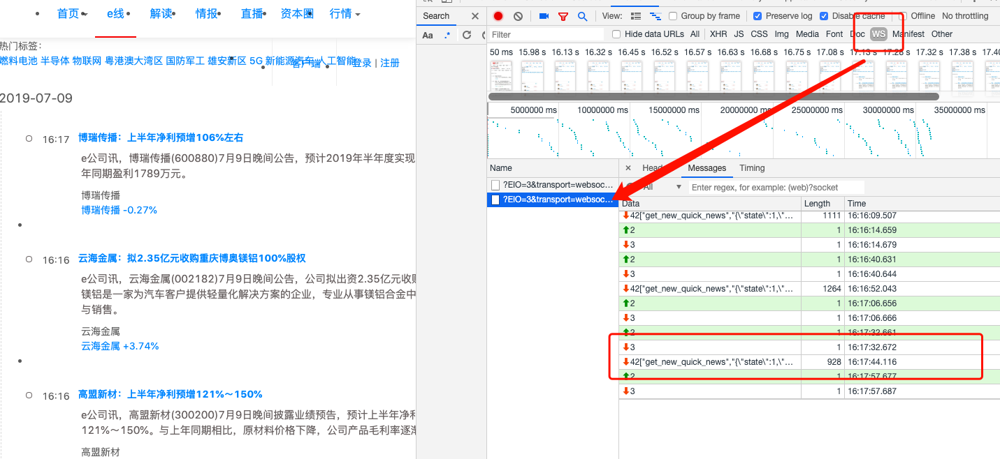

# websocket介绍  
## [百度百科](https://baike.baidu.com/item/WebSocket/1953845?fr=aladdin) 摘要：
<b>WebSocket</b>是一种在单个TCP连接上进行全双工通信的协议。WebSocket通信协议于2011年被IETF定为标准RFC 6455，并由RFC7936补充规范。WebSocketAPI也被W3C定为标准。
WebSocket使得客户端和服务器之间的数据交换变得更加简单，允许服务端主动向客户端推送数据。在WebSocket API中，浏览器和服务器只需要完成一次握手，两者之间就直接可以创建持久性的连接，并进行双向数据传输。

## 优点
* 较少的控制开销。在连接创建后，服务器和客户端之间交换数据时，用于协议控制的数据包头部相对较小。在不包含扩展的情况下，对于服务器到客户端的内容，此头部大小只有2至10字节（和数据包长度有关）；对于客户端到服务器的内容，此头部还需要加上额外的4字节的掩码。相对于HTTP请求每次都要携带完整的头部，此项开销显著减少了。
* 更强的实时性。由于协议是全双工的，所以服务器可以随时主动给客户端下发数据。相对于HTTP请求需要等待客户端发起请求服务端才能响应，延迟明显更少；即使是和Comet等类似的长轮询比较，其也能在短时间内更多次地传递数据。
* 保持连接状态。与HTTP不同的是，Websocket需要先创建连接，这就使得其成为一种有状态的协议，之后通信时可以省略部分状态信息。而HTTP请求可能需要在每个请求都携带状态信息（如身份认证等）。
* 更好的二进制支持。Websocket定义了二进制帧，相对HTTP，可以更轻松地处理二进制内容。
* 可以支持扩展。Websocket定义了扩展，用户可以扩展协议、实现部分自定义的子协议。如部分浏览器支持压缩等。
* 更好的压缩效果。相对于HTTP压缩，Websocket在适当的扩展支持下，可以沿用之前内容的上下文，在传递类似的数据时，可以显著地提高压缩率。
## 应用：

* 直播弹幕
* 比特币交易
* 股票交易  

# 爬虫获取websocket数据  
## 背景  
最近接手个项目，对数据实时性有严格要求，需要实现网站一更新，我们就得拿到数据。  
分析需求，我们有两种设计方案。  
1. 寻找目标网站api，定时发送http请求。
2. 根据经验，对数据实时性有要求的网站一般都有自己的websocket接口。

假如我们用http请求获取数据，频率控制为1次/秒。那么一天得发起86400次请求。这种无脑请求无论对数据方还是爬虫方都是百害无一利的。增加对方服务器压力的同时给自己增加了暴露的风险。所以，我们决定采用第二种方案，寻找websocket接口，让对方服务器主动给我们推送数据。

目标网站：http://www.egsea.com/news/flash   
分析请求：
1. 打开chrome的开发者选项，切换到network选项卡，勾选ws。若不出现任何请求，请求刷新当前页面。若网站不支持websocket，刷新页面也是不会有任何新请求产生。

2. 分析上面网站，我们得到了websocket的链接地址wss://socket.egsea.com:4455/socket.io/?EIO=3&transport=websocket&sid=5e8401a6f948d74105212a3d。该地址有一个加密参数，需要解参的话，那就调试网页的js代码。  


以下教程就使用到puppeterr去驱动一个chromeium，模拟一个真实的浏览器环境，所有的加解密都由该浏览器完成，开发者只需把精力花在控制浏览器上就好。  
* 思考，我们有办法利用puppeteer只监听websocket的请求吗？
## 编码实现

```nodejs
const puppeteer = require('puppeteer');

function parse(data) {
    console.log(`收到 WebSocket 消息：${data}`);
    obj = JSON.parse(data.replace(/"icon(.*?),/g, ''));
    console.log(obj);
}


(async () => {
    browser = await puppeteer.launch(headless=false);
    page = await browser.newPage();
    const client = await page.target().createCDPSession();
    await client.send('Network.enable');

    client.on('Network.webSocketCreated',
        function (params) {
            console.log(`创建 WebSocket 连接：${params.url}`)
        }
    );
    client.on('Network.webSocketClosed',
        function (params) {
            console.log(`WebSocket 连接关闭`)
        }
    );
    client.on('Network.webSocketFrameSent',
        function (params) {
            console.log(`发送 WebSocket 消息：${params.response.payloadData}`)
        }
    );
    client.on('Network.webSocketFrameReceived',
        function (params) {
            quick_news = params.response.payloadData;
            parse(quick_news)
        }
    );
    client.on('Network.webSocketWillSendHandshakeRequest',
        function (params) {
            console.log(`准备发送 WebSocket 握手消息`)
        }
    );
    client.on('Network.webSocketHandshakeResponseReceived',
        function (params) {
            console.log(`接收到 WebSocket 握手消息`)
        }
    );
    // 开始浏览
    await page.goto('http://www.egsea.com/news/flash')

})();


```

参考链接: https://www.lfhacks.com/tech/puppeteer-websocket
