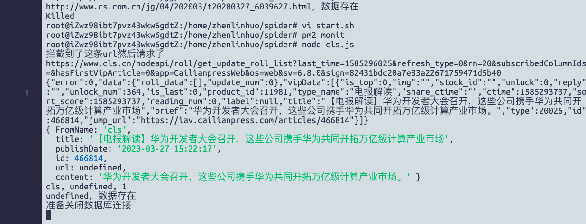

# 背景:
最近有个需求需要抓某个金融网站[https://www.cls.cn/]，此网站的特点是:不间断返回新闻快讯。  

看到这里，不由想起，能让网页按时间先后自动刷新数据的技术，一个是websocket,另一个就是ajax异步请求。
但是，相信也没多少网站愿意
通过ajax的方式实时去后台请求数据吧，因为这么多请求对服务器是个不小的压力。那这个网站究竟是怎样的呢。不猜了，直接看在chrome的network
栏中看看这个网站究竟是怎样请求数据的  
   

分析了header，发现原来这个网站是通过get的方式定时刷新数据来获取数据的。  
好了，既然不是通过websocket，那么我们要采集数据，就有两种方案了.
* 分析请求参数，构造请求链接，发送请求。
```bash
https://www.cls.cn/nodeapi/roll/get_update_roll_list?last_time=1585295035&refresh_type=0&rn=20&subscribedColumnIds=&hasFirstVipArticle=1&app=CailianpressWeb&os=web&sv=6.8.0&sign=77a2d9e875da397333e8615d2d910982
```
可以看到，此链接由几个参数构成，分别是：
last_time  
refresh_type  
subscribedColumnIds  
hasFirstVipArticle  
sign  
sv  
...  
其中，最重要的参数莫过于sign和last_time了。
看名字，可知:sign就是一个签名，last_time就是时间戳，上一次更新的时间。    
要揭秘sign参数，直接通过关键字在源码中搜索，肯定要找到加密的js函数，如果复杂，
就吧这个函数复制出来，用python的javascript v8引擎运行即可。本文重点将第二种办法  

* . 使用puppeteer监听此网站的后台所有请求 
上面提到，我们的需求就是拿最新的数据，及时性和网站保持一致，那么，我想，使用puppeteer监听此网站的后台所有请求这个办法
没有比它更合适了的吧。  
思路：  
了解puppeteer的同学都知道，puppeteer每发起一个请求，就会调用page.on(request)方法，每收到一个响应，就会调用
page.on(response)方法。那么，我们试试只需要修改response方法即可呢？
```javascript
var _exports = require('./util/exports');
const puppeteer = require('puppeteer');
var getLocalTime = _exports.getLocalTime;
var fetchData = _exports.fetchData;
var insert = _exports.insert;
puppeteer.launch({headless: true, args: ['--no-sandbox']}).then(async browser => {
    const page = await browser.newPage();
    await page.setRequestInterception(true);
    var patt = /get_update_roll_list/;
    await page.on('request', interceptedRequest => {
        interceptedRequest.continue();

    });

    // 响应response
    await page.on('response',
        function (response) {
            if (patt.test(response.url())) {
                console.log("拦截到了这条url然后请求了");
                console.log(response.url());
                let message = response.text();
                message.then(function (result1) {
                    parse(result1, insert);
                });
            }


        });

    await page.goto('https://www.cls.cn/');
});


//解析json
function parse(data, callback) {
    /**
     * 解析数据，get_new_quick_news update_quick_news
     * @param data: 源数据
     */
    obj = JSON.parse(data);
    console.log(data);
    obj.vipData.forEach(function(item) {
        _item = {};
        _item['FromName'] = 'cls';
        _item['title'] = item.title;
        _item['publishDate'] = getLocalTime(Number(item.ctime) * 1000);
        _item['id'] = item.id;
        if(item.url)
            _item['url'] = item.url;
        else
            _item['url'] = item.shareurl;
        if(item.content)
            _item['content'] = item.content;
        else
            _item['content'] = item.brief;
        console.log(_item);
        callback('t_newspapers', _item);
        });


    obj.data.roll_data.forEach(function(item) {
        _item = {};
        _item['FromName'] = 'cls';
        _item['title'] = item.title;
        _item['publishDate'] = getLocalTime(Number(item.ctime) * 1000);
        _item['id'] = item.id;
        if(item.url)
            _item['url'] = item.url;
        else
            _item['url'] = item.shareurl;
        if(item.content)
            _item['content'] = item.content;
        else
            _item['content'] = item.brief;
        console.log(_item);
        callback('t_newspapers', _item)
        });

}


```
  
