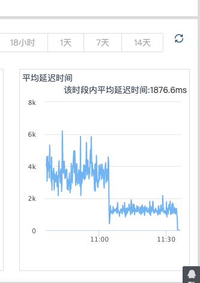

# 前言  
json序列化和反序列化，其实都是一个非常消耗性能的过程，假如在服务器中进行json反序列化工作，将导致
系统的qps大幅度下降。同时，在不同的业务场景，一个json文件的大小也不一样，越大的json文件，包含内容
量就多，解析所需时间越长。因此，选用一个快速的json解析器很有必要.  

一个普通的json例子  
```json
{"rewardIds": "", "guranteeList": {"guaranteeMessage": "\u30102020-07-29 12:00\u3011\u524d\u53ef\u514d\u8d39\u53d6\u6d88\u4fee\u6539\uff0c\u82e5\u672a\u5165\u4f4f\u6216\u8fc7\u65f6\u53d6\u6d88\u4fee\u6539\u5c06\u6536\u53d6\u60a8\u5168\u989d\u623f\u8d39RMB 146\u3002\u643a\u7a0b\u4f1a\u6839\u636e\u60a8\u7684\u4ed8\u6b3e\u65b9\u5f0f\u8fdb\u884c\u9884\u6388\u6743\u6216\u6263\u9664\u623f\u8d39\uff0c\u8ba2\u5355\u9700\u7b49\u9152\u5e97\u6216\u4f9b\u5e94\u5546\u786e\u8ba4\u540e\u751f\u6548\uff0c\u8ba2\u5355\u786e\u8ba4\u7ed3\u679c\u4ee5\u643a\u7a0b\u77ed\u4fe1\u6216\u90ae\u4ef6\u901a\u77e5\u4e3a\u51c6\uff0c\u5982\u8ba2\u5355\u4e0d\u786e\u8ba4\u5c06\u89e3\u9664\u9884\u6388\u6743\u6216\u5168\u989d\u9000\u6b3e\u81f3\u60a8\u7684\u4ed8\u6b3e\u8d26\u6237\u3002", "gurantee": 0}, "bookingRule": {"holdRoomQuantity": 0, "remainMaxBookingRoom": 10, "maxBookingRoom": 8, "minBookingRoom": 1, "maxCheckInPerson": 2}, "encryptedRoomId": "\u7f16\u53f7:4SGRY8", "roomType": 0, "japanMealInfo": {"title": "\u623f\u578b\u6240\u542b\u9910\u996e\u4ecb\u7ecd"}, "postTraceData": "{\"commonFeatureIds\":[],\"priceDetails\":[],\"specialFeatureIds\":[]}", "mealInfo": {"iConId": "breakfast_132", "title": "\u65e0\u9910\u98df"}, "checkAvID": 0, "roomStatus": 22, "passToOrderInput": "{\"advantageBubbles\":[{\"desc\":\"\u643a\u7a0b\u53ef\u5728\u7ebf\u4fee\u6539\u8ba2\u5355\uff0c\u8f7b\u677e\u7701\u65f6\",\"icon\":\"https://pages.c-ctrip.com/wireless-app/imgs/advantangebubble/changeorder.png\",\"type\":\"changeOrder\"},{\"desc\":\"\u6b64\u8ba2\u5355\u53ef\u7acb\u5373\u786e\u8ba4\uff0c\u9884\u8ba2\u9501\u5b9a\u623f\u6e90\",\"icon\":\"https://pages.c-ctrip.com/wireless-app/imgs/advantangebubble/immediatelyconfirm.png\",\"type\":\"immediatelyConfirm\"},{\"desc\":\"\u643a\u7a0b\u8ba2\u9152\u5e97\uff0c15\u5206\u949f\u5185\u53ef\u514d\u8d39\u53d6\u6d88\",\"icon\":\"https://pages.c-ctrip.com/wireless-app/imgs/advantangebubble/freecancel.png\",\"type\":\"freeCancel\"},{\"desc\":\"\u786e\u8ba4\u540e\u53d8\u66f4\uff0c\u6700\u9ad8\u8d54\u9996\u665a\u623f\u8d393\u500d\",\"icon\":\"https://pages.c-ctrip.com/wireless-app/imgs/advantangebubble/noroom.png\",\"type\":\"changeCompensate\"},{\"desc\":\"\u5230\u5e97\u65e0\u623f\uff0c\u6700\u9ad8\u8d54\u9996\u665a\u623f\u8d393\u500d\",\"icon\":\"https://pages.c-ctrip.com/wireless-app/imgs/advantangebubble/noroom.png\",\"type\":\"noRoom\"},{\"desc\":\"7*24\u7535\u8bdd\u5ba2\u670d\uff0c\u51fa\u884c\u653e\u5fc3\",\"icon\":\"https://pages.c-ctrip.com/wireless-app/imgs/advantangebubble/telephone.png\",\"type\":\"telephone\"},{\"desc\":\"\u643a\u7a0b\u51fa\u884c\u52a9\u624b\uff0c\u51fa\u884c\u66f4\u65b9\u4fbf\",\"icon\":\"https://pages.c-ctrip.com/wireless-app/imgs/advantangebubble/assistant.png\",\"type\":\"assistant\"}],\"amount\":0,\"basicRoomName\":\"\u5927\u5e8a\u623f\",\"bedDescription\":\"1\u5f20\u5927\u5e8a1.8\u7c73\",\"breakfastDescription\":\"\u65e0\u9910\u98df\",\"breakfastInfoList\":[{\"mealType\":4,\"offerDate\":\"2020/07/29\",\"quantity\":0}],\"breakfastPolicy\":{\"amount\":0,\"hidden\":false},\"cancelPolicyInfo\":{\"cancelDeadline\":1595995200000,\"cancelStatus\":1,\"freeCancelPolicyScene\":0,\"guarantee\":true,\"payType\":\"PP\",\"quantity\":1},\"couponGetStatus\":0,\"crawler\":false,\"detailPageTimeStamp\":1595990349196,\"directMining\":false,\"exchangeRate\":1.0,\"freeRoom\":false,\"fromList\":false,\"fromPromotHotelByAlone\":false,\"fromPromotHotelByStudent\":false,\"guarentee\":false,\"hasThirdPartyAuthorized\":false,\"hotelID\":0,\"hotelNewCustomer\":false,\"insuranceIdAndCodeMap\":{},\"interface\":false,\"justifyConfirm\":true,\"manyRoom\":false,\"manyRoomAmount\":0.0,\"manyRoomNum\":0,\"masterHotelID\":0,\"notCashBackFromPromotion\":false,\"orderHourRoom\":false,\"orderInputPageTimeStamp\":0,\"orderRoomPriceTrace\":{},\"oriCurrencyCode\":\"RMB\",\"payType\":0,\"paymentType\":0,\"platformNewUser\":true,\"pointRewardHotel\":false,\"priceDiffTolerance\":false,\"productID\":0,\"recommendRoom\":false,\"replaceRoomArgs\":{\"avgRoomPrice\":\"146.0\",\"baseRoomId\":3584665,\"bedType\":1,\"bestCouponPromotionId\":0,\"breakfastCount\":1,\"breakfastList\":0,\"cancelPolicy\":1,\"cityId\":30,\"deductAvgPrice\":146.0,\"delayNewOrder\":false,\"facility\":{9:\"\u9650\u65f6\u53d6\u6d88\",10:\"\u7acb\u5373\u786e\u8ba4\"},\"fastCheckIn\":false,\"filtersFromOtherValue\":\"\",\"fireflyCurrency\":\"\",\"fireflyEndTime\":\"\",\"fireflyStartTime\":\"\",\"flagshipHideMemberPrice\":false,\"flagshipSearch\":false,\"flightPromotion\":false,\"getFilteredPrepayValues\":[],\"guarantee\":false,\"identity\":\"8e70b1769f6445e2a10ec27bba613e55\",\"ifSameBasicRoom\":false,\"mealType\":4,\"multiQtyMultiNightTotalPriceRefresh\":false,\"notLogInGuide\":true,\"onlyFlagshipMemberRoom\":false,\"payType\":0,\"prepayDiscount\":false,\"primeDiscount\":false,\"refreshPrice\":false,\"roomListCustomerTag\":{\"PrepayDiscountHotelNewCustomer\":\"T\",\"PrepayDiscountCtripNewCustomer\":\"T\",\"OpenNewPersonCountFilter\":\"T\",\"SwitchList\":\"50,53,69,87,73,71,75,90,24,44,61\",\"RoomQuantity\":\"1\",\"FilterShadowExtensionType\":\"112\",\"NotFilterByRoomQuantityAndPerson\":\"T\",\"CtripGroupID\":\"-1\",\"FilterRoomByPerson\":\"1,999\",\"CtripGroupLevel\":\"10005\",\"UidRegisterDays\":\"12\",\"MemberPoints\":\"0\",\"ChildrenAgeList\":\"\",\"TopStrategy\":\"1\",\"MaskCampaignCityBlackList\":\"578\",\"IsPrepayDiscountMoney\":\"T\",\"TagStrategy\":\"1\"},\"roomType\":0,\"subPayType\":1,\"vendorId\":88,\"weeHoursOld\":false},\"roomImageList\":[\"http://dimg04.c-ctrip.com/images/200p180000013s4psCDF0_C_1280_853_Q90.jpg\",\"http://dimg04.c-ctrip.com/images/200v190000016sbx4CB03_C_1280_853_Q90.jpg\",\"http://dimg04.c-ctrip.com/images/200d190000016ft980D30_C_1280_853_Q90.jpg\",\"http://dimg04.c-ctrip.com/images/20071800000149nkb2A15_C_1280_853_Q90.jpg\",\"http://dimg04.c-ctrip.com/images/2005180000013vi4yA169_C_1280_853_Q90.jpg\",\"http://dimg04.c-ctrip.com/images/200t180000013us8rF73A_C_1280_853_Q90.jpg\",\"http://dimg04.c-ctrip.com/images/20071800000149nkdCA57_C_1280_853_Q90.jpg\"],\"roomInfoTrace\":{\"isSameAllowSmoke\":false,\"isSameFloorRange\":false,\"isSameMealNum\":false,\"isSamePersonNumber\":false,\"isSameRoomArea\":false,\"isSameRoomName\":false,\"isSameWindowType\":false,\"resResidentNumer\":0,\"resSmokeType\":0,\"resWindowInfo\":0,\"roomAreaRange\":\"18\",\"roomBreakfastData\":[{\"mealType\":4,\"offerDate\":\"2020/07/29\",\"quantity\":0}],\"roomBreakfastDescription\":\"\u65e0\u9910\u98df\",\"roomFloorRange\":\"2-6\",\"roomIsAllowSmoking\":3,\"roomPersonCount\":2,\"roomWindowType\":2,\"sameBreakfastDescription\":false,\"sameBreakfastDescrption\":false,\"sameMealType\":false,\"sameRoomName\":false,\"sellRoomName\":\"\u5927\u5e8a\u623f(\u5929\u5929\u7279\u60e0)\"},\"roomOriPrice\":0,\"roomPriceInfo\":\"{\\\"ptp\\\":1,\\\"rl\\\":[{\\\"ca\\\":0.0,\\\"cr\\\":false,\\\"cur\\\":\\\"RMB\\\",\\\"drp\\\":[{\\\"ccost\\\":124.1,\\\"cost\\\":124.1,\\\"cprice\\\":146.0,\\\"currency\\\":\\\"RMB\\\",\\\"dt\\\":\\\"2020-07-29\\\",\\\"ppddl\\\":[],\\\"price\\\":146.0}],\\\"ex\\\":1.0,\\\"hid\\\":1387291,\\\"mid\\\":\\\"0\\\",\\\"pa\\\":146.0,\\\"ppdl\\\":[],\\\"qs\\\":1,\\\"ra\\\":0.0,\\\"rid\\\":896064499,\\\"sid\\\":0,\\\"tpa\\\":146.0,\\\"tra\\\":0.0,\\\"tx\\\":0.0}],\\\"sc\\\":{\\\"ar\\\":\\\"20200729\\\",\\\"de\\\":\\\"20200730\\\"},\\\"tid\\\":\\\"09757150CFEA11EABD912082C02244E6-2-9-15959903480750103-17100212\\\",\\\"ts\\\":\\\"2020-07-29 10:39:09\\\"}\",\"roomProperty\":0,\"roomStatus\":22,\"roomStatusTrace\":{\"orderCancelPolicy\":\"\",\"orderCancelPolicyText\":\"\",\"orderConfirmStatus\":\"\",\"orderCreateTraceLogId\":\"\",\"orderGuarantee\":false,\"orderGuaranteeAmount\":0,\"orderGuaranteeText\":\"\",\"orderId\":\"\",\"orderPaymentType\":\"\",\"resCancelPolicy\":\"\",\"resCancelPolicyText\":\"\",\"resConfirmImmediately\":\"\",\"resGuarentee\":false,\"resGuarenteePrice\":0,\"resIsBookable\":false,\"resLadderCancelPolicy\":\"\",\"resPaymentType\":\"\",\"resQuantity\":0,\"roomCancelPolicy\":\"\u9650\u65f6\u53d6\u6d88\",\"roomCancelPolicyText\":\"\u5165\u4f4f\u5f53\u592912:00\u524d\u53ef\u514d\u8d39\u53d6\u6d88\",\"roomConfirmImmediately\":\"\u7acb\u5373\u786e\u8ba4\",\"roomGuarentee\":false,\"roomGuarenteePrice\":0,\"roomId\":0,\"roomIsBookable\":false,\"roomLadderCancelPolicy\":\"\u65e0\",\"roomPaymentType\":\"\u9884\u4ed8\",\"roomQuantity\":9999,\"sameBookable\":false,\"sameCancelPolicy\":false,\"sameConfirmTime\":false,\"sameGuaranteeAmount\":false,\"sameGurantee\":false,\"sameOrderCancelPolicy\":false,\"sameOrderGuaranteeAmount\":false,\"sameOrderGurantee\":false,\"sameOrderPaymentType\":false,\"samePaymentType\":false,\"sameQuantity\":false,\"shadowId\":0},\"showAgent\":false,\"star\":0,\"studentWelfare\":false,\"subHotelId\":0,\"subPayType\":1,\"totalAmountAfterDiscount\":\"146\",\"totalIncludeFeeRoomAmount\":\"146\",\"totalIncludeFeeRoomLocalAmount\":\"146\",\"traceLogIdOfRoomList\":\"09757150CFEA11EABD912082C02244E6-2-9-15959903480750103-17100212\",\"uid\":\"M4163357538\",\"veilDifPriceArgs\":{\"roomId\":0,\"tagId\":0},\"vendorId\":88}", "roomTagList": [{"featureID": 0, "tagID": 12220, "tagPosition": 0, "actualTagID": 12220, "tagDesc": "\u9884\u5b9a\u65f6\u63d0\u524d\u586b\u5199\u53d1\u7968\u4fe1\u606f\uff0c\u79bb\u5e97\u53ef\u5230\u524d\u53f0\u76f4\u63a5\u9886\u53d6\u53d1\u7968\uff0c\u65b9\u4fbf\u5feb\u6377\u66f4\u7701\u5fc3", "tagStyleID": 20216, "ignoreScene": 0, "roomScene": 1, "tagSubName": "", "tagName": "\u9884\u7ea6\u53d1\u7968", "ruleID": 0}, {"featureID": 0, "tagID": 10580, "tagPosition": 102, "actualTagID": 10580, "tagDesc": "\u5165\u4f4f\u5f53\u592912:00\u524d\u53ef\u514d\u8d39\u53d6\u6d88", "tagStyleID": 20204, "ignoreScene": 2, "roomScene": 0, "tagSubName": "", "tagName": "\u9650\u65f6\u53d6\u6d88", "ruleID": 0}, {"featureID": 0, "tagID": 10020, "tagPosition": 102, "actualTagID": 10020, "tagDesc": "\u9884\u8ba2\u6b64\u623f\u578b\u540e\u53ef\u5feb\u901f\u786e\u8ba4\u8ba2\u5355\u3002", "tagStyleID": 20204, "ignoreScene": 0, "roomScene": 0, "tagSubName": "", "tagName": "\u7acb\u5373\u786e\u8ba4", "ruleID": 0}], "textDicts": [{"iConId": "", "key": 700, "name": "", "type": 7, "additionalInfo": "", "value": "\u5927\u5e8a\u623f(\u5929\u5929\u7279\u60e0)"}, {"iConId": "", "key": 702, "name": "", "type": 7, "additionalInfo": "", "value": "7\u670829\u65e5-7\u670830\u65e5 1\u665a"}, {"iConId": "bed_105", "key": 105, "name": "\u5e8a\u578b", "type": 1, "additionalInfo": "", "value": "\u5927\u5e8a"}, {"iConId": "", "key": 301, "name": "", "type": 3, "additionalInfo": "", "value": "2"}, {"iConId": "", "key": 601, "name": "", "type": 5, "additionalInfo": "", "value": "1"}, {"iConId": "", "key": 201, "name": "\u6fc0\u52b1\u8bdd\u672f", "type": 2, "additionalInfo": "", "value": "\u6bd4\u6df1\u5733\u591a\u6570\u7ecf\u6d4e\u578b\u9152\u5e97\u7684\u5ba2\u623f\u5bbd\u655e"}, {"iConId": "breakfast_132", "key": 111, "name": "\u9910\u98df\u4fe1\u606f", "type": 1, "additionalInfo": "", "value": "\u65e0\u9910\u98df"}, {"iConId": "floor_103", "key": 103, "name": "\u697c\u5c42", "type": 1, "additionalInfo": "", "value": "2-6\u5c42"}, {"type": 2, "key": 202, "value": ""}, {"iConId": "", "key": 401, "name": "", "type": 4, "additionalInfo": "", "value": "{1:\"2\",2:\"0\",3:\"1\",4:\"1\",5:\"1\",7:\"1\",9:\"1\",10:\"3584665\",11:\"2\",12:\"18\",13:\"146.0\",14:\"0.0\",15:\"896064499\",16:\"false\",17:\"\",18:\"0\",19:\"0.0\",20:\"0\",21:\"97\",22:\"8e70b1769f6445e2a10ec27bba613e55\",23:\"131.0\",24:\"false\",25:\"1387291\",100:\"1595990349196\",101:\"09757150CFEA11EABD912082C02244E6-2-9-15959903480750103-17100212\"}"}, {"iConId": "bed_105", "key": 108, "name": "\u5e8a\u578b", "type": 1, "additionalInfo": "", "value": "1\u5f20\u5927\u5e8a1.8\u7c73"}, {"iConId": "", "key": 211, "name": "", "type": 2, "additionalInfo": "", "value": "\u7a0e/\u5176\u4ed6\u8d39\u7528\u7ea6"}, {"iConId": "", "key": 212, "name": "", "type": 2, "additionalInfo": "", "value": ""}, {"iConId": "checkin_120", "key": 120, "name": "\u5165\u4f4f\u4eba\u6570", "type": 1, "additionalInfo": "", "value": "2\u4eba\u5165\u4f4f"}, {"iConId": "area_102", "key": 102, "name": "\u5efa\u7b51\u9762\u79ef", "type": 1, "additionalInfo": "", "value": "18"}, {"iConId": "window_122", "key": 122, "name": "\u7a97\u6237", "type": 1, "additionalInfo": "complete", "value": "\u6709\u7a97"}, {"iConId": "broadnet_135", "key": 135, "name": "\u6709\u7ebf\u5bbd\u5e26", "type": 1, "additionalInfo": "", "value": "\u6709\u7ebf\u5bbd\u5e26\u514d\u8d39"}, {"iConId": "wifi_136", "key": 136, "name": "WIFI", "type": 1, "additionalInfo": "", "value": "WIFI\u514d\u8d39"}, {"iConId": "", "key": 119, "name": "\u505c\u8f66\u573a", "type": 1, "additionalInfo": "", "value": "\u514d\u8d39\u505c\u8f66\u573a"}, {"iConId": "", "key": 109, "name": "\u52a0\u5e8a", "type": 1, "additionalInfo": "", "value": "\u8be5\u623f\u578b\u4e0d\u53ef\u52a0\u5e8a"}, {"iConId": "smoke_106", "key": 151, "name": "\u5438\u70df\u653f\u7b56", "type": 1, "additionalInfo": "", "value": "\u90e8\u5206\u7981\u70df"}], "identity": "8e70b1769f6445e2a10ec27bba613e55", "bestPromotionId": "0", "roomID": 896064499, "pointsPolicy": "\u8ba2\u5355\u5b8c\u6210\u540e\uff0c\u6bcf\u95f4\u6bcf\u665a\u9884\u8ba1\u53ef\u83b773\u79ef\u5206", "isTujiaNew": false, "invoicePolicy": "", "orderByRank": 4, "roomFilters": [{"filterID": "4|1"}, {"filterID": "3|F-1"}, {"filterID": "3|F-16"}, {"filterID": "7|2"}, {"filterID": "1|99999996"}, {"filterID": "22|666667"}, {"filterID": "23|5"}, {"filterID": "23|10"}, {"filterID": "23|6"}, {"filterID": "76|1"}, {"filterID": "76|2"}, {"filterID": "76|3"}, {"filterID": "76|4"}], "bedMealInfo": "\u5927\u5e8a\u65e0\u9910\u98df", "verdorID": 88, "payType": 0, "roomName": "(\u5929\u5929\u7279\u60e0)", "roomCouponRefunds": [{"refundType": 124, "description": "\u6bcf\u95f41\u665a\u603b\u4ef7"}, {"refundType": 10, "amount": "146", "refundName": "1\u665a\u603b\u4ef7\uff1a", "description": "\u00a5146"}], "couponDetailInfo": {}, "manyRoomThreshould": 0, "ratePlanID": "0|0", "shadow": {"supplierCtx": "", "agentName": "", "jumpLayer": false, "isShadowRoom": false, "vendorIconUrl": "", "dataSourceTitle": "", "shadowID": 0, "dataSourceSubTitle": ""}, "roomProperty": 0, "isNewRoomName": true, "hourRoomDesc": "", "stringInfo": [{"avgPriceAfterDiscountIncludeTax": "146", "currencyCode": "RMB", "totalPriceAfterDiscountIncludeTax": "146", "totalDays": 1, "totalTax": "0", "avgTax": "0", "avgPriceIncludeTax": "146", "cashBackTotalAmount": "0", "totalPriceAfterDiscount": "146", "avgPriceAfterDiscount": "146", "cashBackAvgAmount": "0", "totalPriceIncludeTax": "146", "totalPrice": "146", "avgPrice": "146", "primeDiscount": "0"}], "subPayType": 1, "mgrGroupID": 0, "uniqueRoomCode": "4SGRY8", "showPointsModule": true, "baseRoomID": 3584665, "hotelID": 1387292}

```
要取出passToOrderInput字段下的的字段
```text
\\\"sc\\\":{\\\"ar\\\":\\\"20200729\\\",\\\"de\\\":\\\"20200730\\\"}
```
用普通的解析方式，我们可能是这样子操作的

```python
roomPriceInfo = demjson.decode(demjson.decode(room_info).get('roomPriceInfo'))
heckinDate = datetime.now().strptime(roomPriceInfo['sc']['ar'], '%Y%m%d').strftime('%Y-%m-%d')
```

这个方式带来的后果是什么呢？需要对字段再进行一次反序列化后再反序列化，需要的时间更长，堵塞了服务器的cpu时间，
因此，这时候，假如这个对象有多个，我们用多线程的话，效果会比单线程更慢，因为线程创建及切换都是需要消耗时间的。

聪明的我们可能想到多进程。没错，多线程确实能提速,不过能把解析时间降到一半吗？测试发现，是不可以的，
有时候，需要更多的时候，因为进程切换等等各种原因。实现方法肯能类似这样子的  

```python
from concurrent.futures import ProcessPoolExecutor

with ProcessPoolExecutor(max_workers=4) as pool:
    for each_room in json_obj[roomList]:
        future_result = pool.submit(analyse, each_room)
        flat, createDate, hotelId, cancelDesc = future_result.result()

```

既然多进程的效果也不理想，那么，我们该怎么办呢？  思考，json反序列化才是耗时的大户，那么，我们跳过
反序列化步骤，用jsonpath或者正则取提取我们需要的字段，效果会不会很好呢？

我们实现一下
````python
import re
room_info = each_room.get('passToOrderInput')
inDate = re.findall(r'\\\"ar\\\":\\\"(\d+)\\\"', room_info)[0]
checkinDate = datetime.now().strptime(inDate, '%Y%m%d').strftime('%Y-%m-%d')
crawDate = re.findall(r'\\\"ts\\\":\\\"(.*?)\\\"}\"', room_info)[0]  

````


# 总结  
json反序列化是个异常耗时的操作，并且，它会堵塞线程，因此，在支持异步操作的服务器，不建议直接进行json反序列化
操作。实在要操作，应该尽量较少反序列化的次数，尽量通过正则匹配或者其他办法，获取所需要的字段。    
google开源的protocolbuf，是一个很优秀的对象序列化和反序列化框架，它序列化后的对象体积更小，适合在网络传输，
它反序列化的对象，能快速变成json对象，方便解析。大家以后在服务端和客户端直接数据传输，可以优先选择protobuf。  

