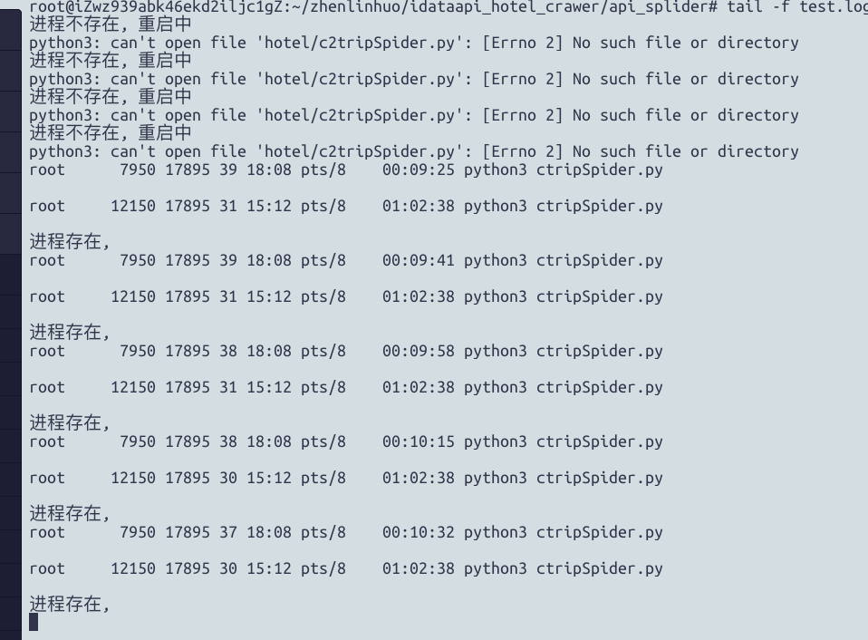

## 背景  
最近有个程序，在后台运行的时候，总是莫名其妙就挂了，看报错日志，只弹了个core dumped。在网上
寻求了解决方案，都无解。程序莫名奇妙掉线对日常的工作任务影响极大，因此，在问题没解决之前，只能
写个守护进程来及时发现程序是否掉线，若掉线，就重启。  

## 技术依赖  
* python os系统库  
* linux进程查看  
* crontab 定时任务  

## 编码实现  
```python

import argparse
import os
import time

parser = argparse.ArgumentParser(description='manual to this script')
parser.add_argument('--pid', type=str, default=None)

"""
用于检查程序是否异常退出，若退出，则重启
"""

def parse(pid):
    command = 'ps -ef| grep  {}'.format(pid)
    result = os.popen(command)
    status = False
    for line in result.readlines():
        # 检查特殊字符
        if '--pid' not in line and 'grep' not in line and pid in line:
            print(line)
            status = True

    if not status:
        print('进程不存在, 重启中')
        os.chdir('./hotel')
        print(os.getcwd())
        os.popen('nohup python3 {} restart > /dev/null &'.format(pid))
    else:
        print('进程存在,')


def run():
    args = parser.parse_args()
    pid = args.pid
    if not pid:
        raise Exception

    parse(pid)

if __name__ == '__main__':
    run()

```


## crontab命令  
凌晨2点至晚上21点，间隔一秒检查一次
```bash
*/1 2-21 * * *   root    cd $PATH && sh start.sh
```
