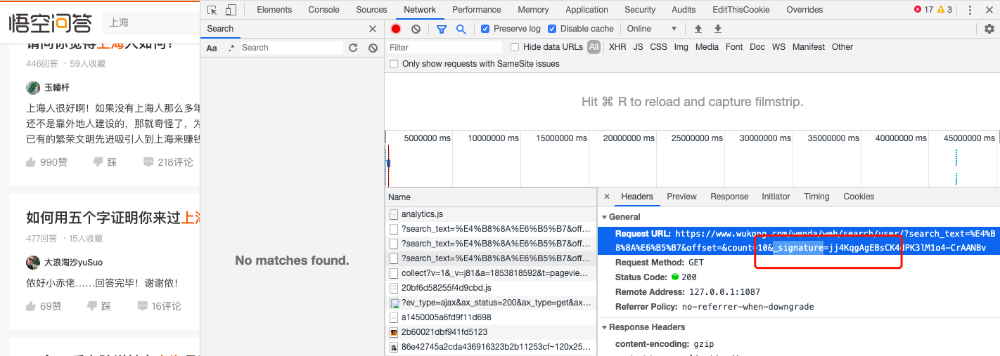
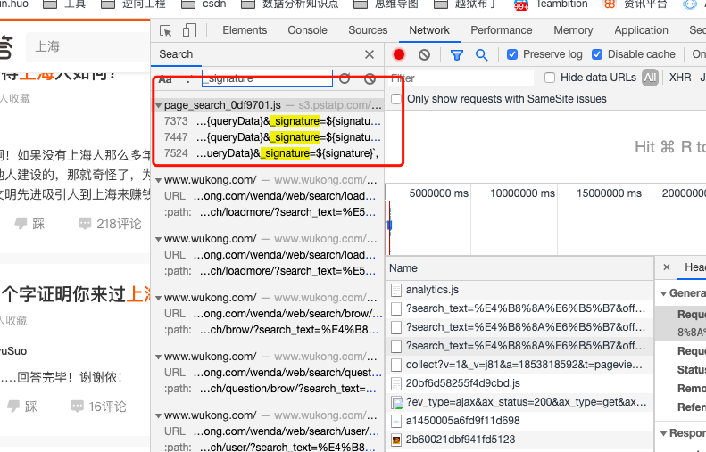
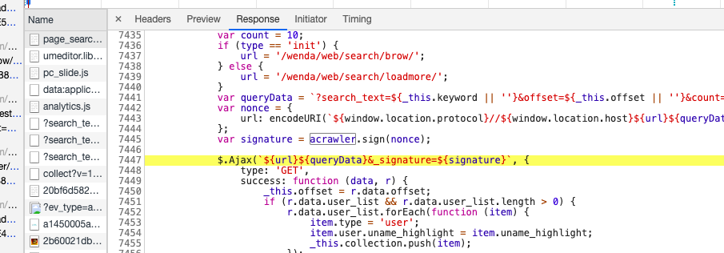
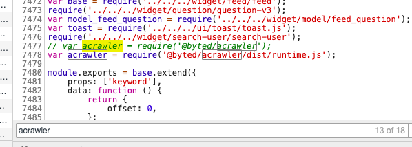
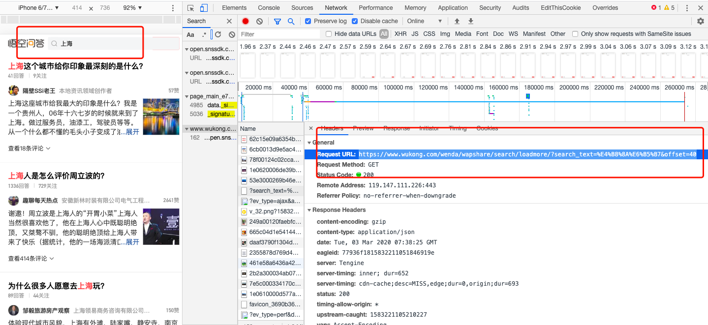

# 悟空问答升级啦？  
最近发现2019年做的悟空问答的爬虫突然不工作了，分析了官方数据接口，
各种请求参数都一样，只是多了个_signature值。测试发现，去掉此参数，
就无法获取数据了。  
  
# 解参  
天真的我一开始以为，此请求是get请求，那么_signature值必定和请求api中
携带的参数有关，可能通过各种奇怪的算法将值拼接起来。那么，接下来的工作就是
找加密方法。
## 第一步，查找关键字  
  
没错，加密参数应用在page_search_0df9701.js这个文件中，下一步，看源码。
  
```javascript
var signature = acrawler.sign(nonce);
```
signature 定义在了这里，通过acrawler.sign()方法取得，那么，我们就需要
acrawler定义在了什么地方  
  
```javascript
var acrawler = require('@byted/acrawler/dist/runtime.js');
```
一目了解，通过require引入了一个runtime.js的依赖包， 那么，runtime.js里面写的必然
就是加密方法。好，继续深入，尝试通过runtime关键字能否找到有用的信息呢?  
  
oh no ,没有任何有关的数据， 接下来怎么办呢？
## 需求搜索引擎帮助  
  
可以看到，整个头条系都在用着这一认证算法。要想解开，估计得费不少功夫了。  
# 没有办法了吗？  
  
pc web不行，咱们找h5页面，惊奇得发现，h5页面中，居然没有_signature参数，天啊，
头条系也有自己疏忽得地方。 
# 总结  
遇到暂时无法解开得加密参数，可以尝试从各个平台寻找突破口，万一就这么幸运呢？  
另外，_signature参数还是要解的，毕竟这个参数在头条系的产品里应用十分广泛。  
