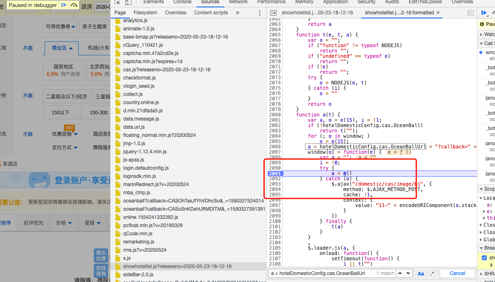
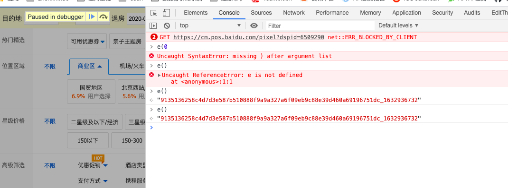
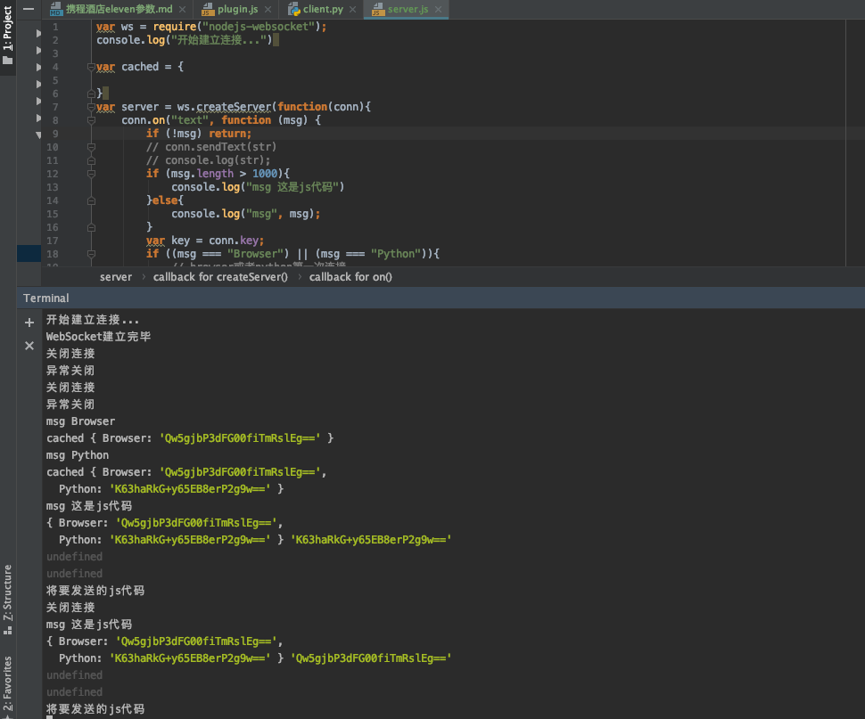
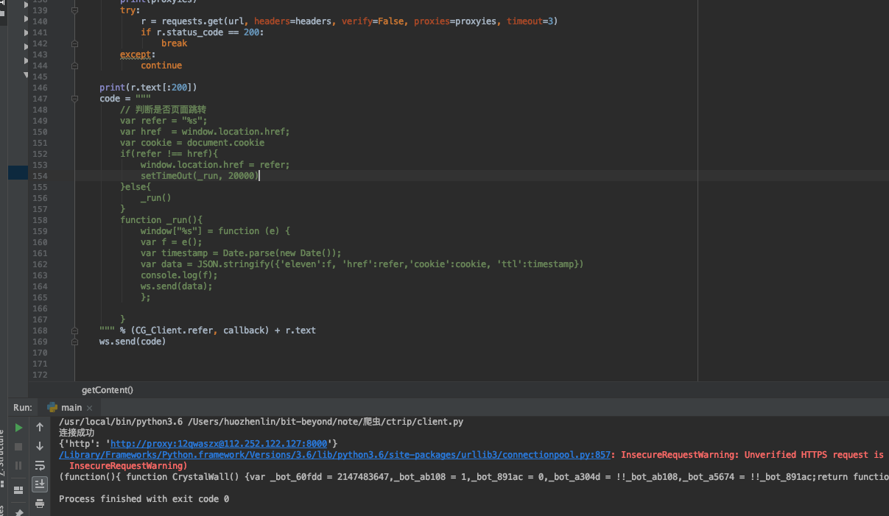
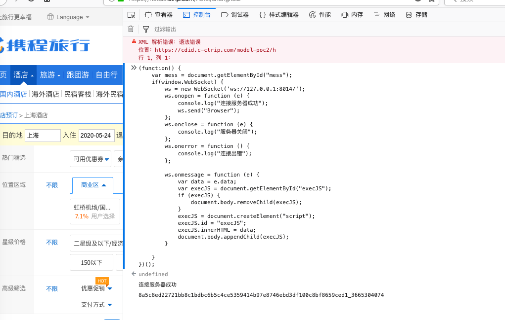

# 前言  
携程eleven参数的意义：用于验证当前环境是否有风险，和refer,cookie,oceanball.js有关。其生成主要是由
oceanball.js文件直接执行得到。如图，在e()函数下个断点即可  
  



oceanball.js特点：混淆极其复杂，代码量大，一般人还真解不了，没错，我就那个一般人。  
  

# 分析
前面提到，eleven参数是由oceanball.js自我执行得到的，那么，我们是否能够构造一个oceanball.js执行需要的
环境呢？
答案：可以。
1. 可以用nodejs构造，不过我不会，哈哈
2. 直接使用真实的浏览器环境（为什么不用selenium或者其他无头浏览器呢？因为oceanball.js就是用来
反爬的呀，它会检查当前的浏览器特性，比如canvas功能，document功能等等）  

# 打造我们需要的携程环境
辅助依赖：
1. HTML5中新引入的websocket协议。主要是为了和我们的websocket通许服务，将我们的脚本在携程环境下执行并返回。  
2. Python。没错，就是用来编写websocket客户端的。用于请求oceanball.js并将代码发送给服务器
nodejs或者python，哈哈，我用的是nodejs.使用这两种语言之一搭建websocket服务器。  

构想的流程如下：

客户端请求oceanball.js代码，发送给websocket服务器---》服务器接收的脚本----》转发给浏览器，在携程环境下进行执行得到返回值，同时，将返回值返回----》客户端拿到返回值，可以存redis或者任何地方---》携程爬虫取出返回值，
请求数据

效果如图： 

> 启动websocket服务  
  

> 获取oceanball.js文件，并推送给服务器  
  

> 在携程环境下打开控制台，启动webserver接收服务  
  

上面的工作都准备好了之后，只要我们主动给websocket服务器发送数据，服务器将会将转发给
携程环境并执行，直接拿到结果。  

# 关于cookie  

cookie中也有比较难搞的参数，携程的酒店列表页的请求cookie是这样的一个格式:
```text
"magicid=euc5g/IQHHend3cWTIW0IaDLoYGJDXdryMkLbWCF1YPBaLSQv4yIN4/TI76Mhhde; _abtest_userid=b5d89a4d-6be6-40e0-9f43-8f20c665684a; hoteluuidkeys=Hq4wUtW3qeq1E9QrtY6Ya5YG6EqYkYs7eF8EpBj7TWpY7Yt0jPMI0UYd8jtYaYpbjs7w5LwpPj1YBYSTR1GYg0vO9jbY6YF5vTfYtMyOXjkGvLAeFnYgbjHByAYgYpzvSBYpAyhDjdbvlTeLPY0SedLy7YOY3YkYOFrd3EBGwD5xakY5ljtzjq6WGYpYQ0vOHY4sytPESpjLXwB7eAdvTOeOFjzMy5YOYmY6YX1Y1DibZinTi4sjtYAYP6Yk5iZOiQ8JOAv1Sjzoi6SwHYbYhNR35JThvUaWqBi7aYc7y63v0pipAy41EF4YScjQYNYLlYZSWncr4ByTcEacJcoJl3w7UJnoycXrpcidQYqcvhtJamyUYbYSqR36Js4v6oWNTY1Qvm6wHtvLXylbWqhwtOvdciOYLY38jc9wDOv53; _RF1=27.38.251.115; _RSG=b_KjGDFEnT7W76Z1WOc.B9; _RDG=2818318d26a47025c00282793f186bafc7; _RGUID=777138f3-50b5-4fe5-92fe-9988018c61e0; MKT_CKID_LMT=1590296973489; HotelCityID=2split%E4%B8%8A%E6%B5%B7splitShanghaisplit2020-05-24split2020-05-25split0; hoteluuid=A0zFC5Dc5sMo2Hbd; _bfa=1.1590296970693.3jtst3.1.1590303836020.1590327939118.4.14; _bfs=1.1; OID_ForOnlineHotel=15902969706933jtst31590327939381102032; MKT_CKID=1590296973488.ahdo1.g70b; __zpspc=9.4.1590327941.1590327941.1%234%7C%7C%7C%7C%7C%23; _ga=GA1.2.1413044398.1590296974; _gid=GA1.2.1120226318.1590296974; _bfi=p1%3D102002%26p2%3D0%26v1%3D14%26v2%3D0; _jzqco=%7C%7C%7C%7C1590296974757%7C1.1371477744.1590296973479.1590303838031.1590327940995.1590303838031.1590327940995.undefined.0.0.14.14; MKT_Pagesource=PC; appFloatCnt=14"
```
一个个去分析的话，太难了,可不可以用selenium等自动化测试工具去扣呢？答案，可以。不过，我测试的过程中遇到了太多的困难了。  
比如用puppeteer的话，会报各种奇怪的语法错误，毕竟它也就是个假的浏览器。  
比如最新版的chromedriver，一样不行，携程直接跳转至登录页面了，试了下修改window.navigator.webdriver的属性，一样不行。看来
携程检查的不仅仅是这个属性。我尝试在携程文件中搜索webdriver的关键词，很遗憾，一个也没找到，看来携程也不是用这些特征去识别用户用的
浏览器是真的还是假的。  
灵感来源。我下了个八爪鱼采集器，因为它是内置浏览器的，我发现它居然可以打开，太神奇了。为什么嗯，我关注了下它浏览器的版本号。  
