# 前言  
前面我们学习到了普通app的java层的反编译，这些app有个共同点：无加固，加密函数写在Java层。通过jadx，jdgui,jeb
等工具可直接查看源代码，安全性极低，关于这些app的分析，可查阅如下文档
1. [永辉生活分析](../永辉生活/永辉生活.md)  
  
2. [花粉俱乐部](../花粉俱乐部.md)  

3. [华为音乐app加密参数分析](../华为音乐app加密参数分析.md)  

接下来，我们分析另一款app,它叫人民日报，版本号为V7.1.7.2。我们尝试像上面的工作流程那样，把app拖进jadx工具查看源码，发现长
这样子的  

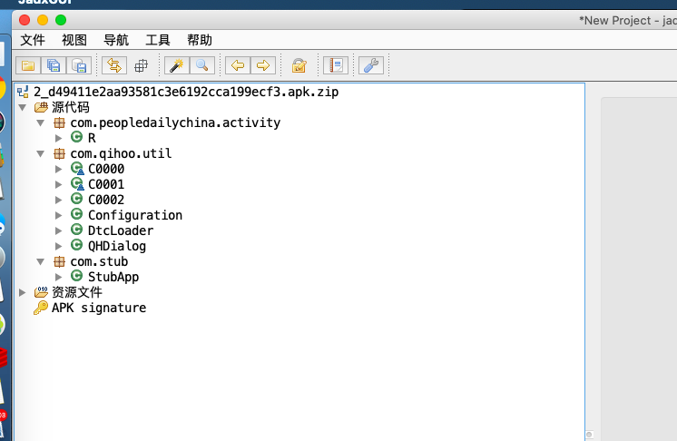  

没错，它就是用了360加固，app是没办法通过反编译的方式拿到源码的。要拿到源码，怎么办呢？  

我们先来了解app的加固原理以及加固后的app是怎么运行在手机上的。 [文献参考](https://www.jianshu.com/p/4ff48b761ff6)

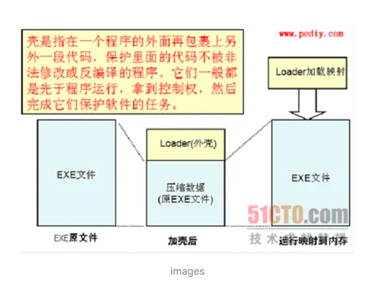  

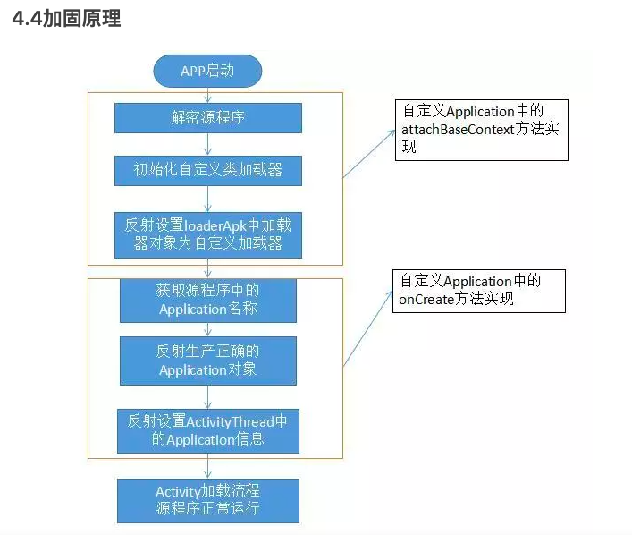  

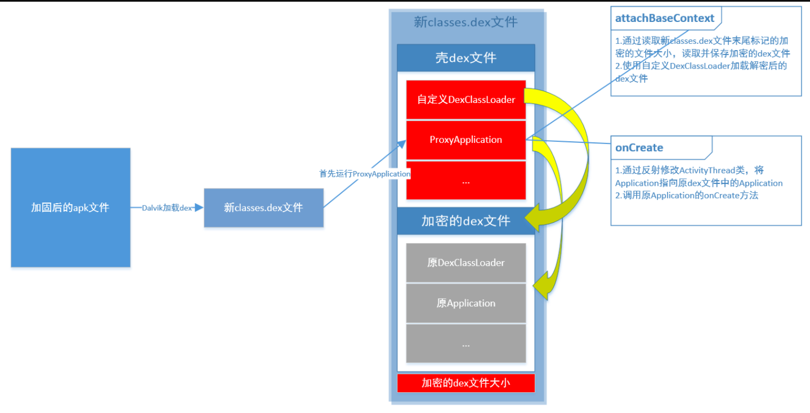  

我们了解到，加壳程序是这样子的。  
加壳阶段：会对app进行修改，提取dex 文件合并成一个，并用壳的加密程序对其进行加密  
解密阶段：Dalvik虚拟机会加载我们经过修改的新的classes.dex文件，并最先运行ProxyApplication类。  
在这个类里面，有2个关键的方法：attachBaseContext和onCreate方法。
ProxyApplication显示运行attachBaseContext再运行onCreate方法。  

在attachBaseContext方法里，主要做两个工作：

1. 读取classes.dex文件末尾记录加密dex文件大小的数值，则加密dex文件在新classes.dex文件中的位置为：len(新classes.dex文件) – len(加密dex文件大小)。然后将加密的dex文件读取出来，加密并保存到资源目录下
2. 然后使用自定义的DexClassLoader加载解密后的原dex文件

在onCreate方法中，主要做两个工作：

1. 通过反射修改ActivityThread类，并将Application指向原dex文件中的Application

2. 创建原Application对象，并调用原Application的onCreate方法启动原程序  

总结一下，加壳后的app要运行，必然要经历一个解密的过程，那么，我们是不是可以从这里入手，在内存中
在解密后的dex给dump 下来呢？  

没错，目前市面上的做法很懂都是这么样。  
这里，我用的是frida工具，当然，你可以写xposed插件。  

```javascript
frida -U -f com.peopledailychina.activity -l dumpDex.js --no-pause
```
如图所示，.dex文件为从内存中dump出来的dex文件，我这里将这些文件用dex2jar转成jar包再合并成一个jar，方便后续分析。
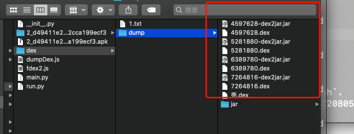  

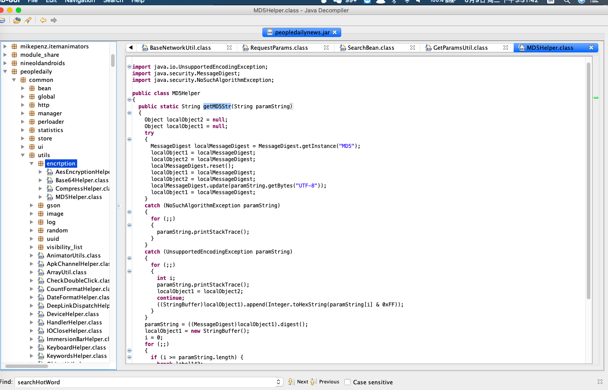  

# 砸壳结束，进入分析阶段  

抓包，看情况  

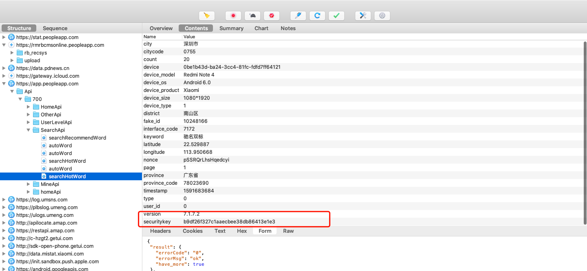  

可见，app中唯一个加密参数叫 securitykey,并且，它的关键字接口是searchHotWord。  
那么，我们直接从这个关键字接口入手，尝试找出securitykey的加密过程    

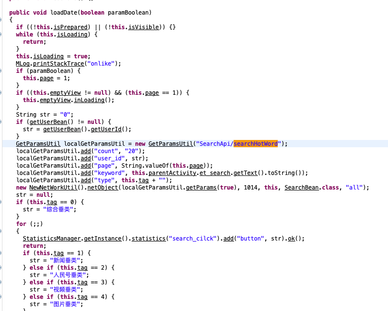  

```javascript
public void loadDate(boolean paramBoolean)
  {
    .....
    GetParamsUtil localGetParamsUtil = new GetParamsUtil("SearchApi/searchHotWord");
    localGetParamsUtil.add("count", "20");
    localGetParamsUtil.add("user_id", str);
    localGetParamsUtil.add("page", String.valueOf(this.page));
    localGetParamsUtil.add("keyword", this.parentActivity.et_search.getText().toString());
    localGetParamsUtil.add("type", this.tag + "");
    new NewNetWorkUtil().netObject(localGetParamsUtil.getParams(true), 1014, this, SearchBean.class, "all");
    str = null;
    .....
```
如上图所示，通过静态分析，关键字调用的方法就是这一个。我们发现这方法在这里是构建了几个post请求参数，我们根据，看看getParams的调用过程。  

```javascript
public RequestParams getParams(boolean paramBoolean)
  {
    if (paramBoolean) {}
    RequestParams localRequestParams;
    for (String str1 = Constant.BASE_URL + this.url;; str1 = this.url)
    {
      localRequestParams = new RequestParams(str1);
      localRequestParams.setMethod(HttpMethod.POST);
      localRequestParams.setConnectTimeout(5000);
      localObject1 = this.paramMap.keySet().iterator();
      while (((Iterator)localObject1).hasNext())
      {
        localObject2 = (String)((Iterator)localObject1).next();
        if (!filterCacheKey((String)localObject2)) {
          localRequestParams.addCacheParams((String)localObject2, (String)this.paramMap.get(localObject2));
        }
      }
    }
    addGlobalParams();
    Object localObject1 = new ArrayList();
    Object localObject2 = this.paramMap.keySet().iterator();
    while (((Iterator)localObject2).hasNext()) {
      ((List)localObject1).add((String)((Iterator)localObject2).next());
    }
    localObject2 = sortParamsKey((List)localObject1);
    localObject1 = "";
    Iterator localIterator = ((List)localObject2).iterator();
    while (localIterator.hasNext())
    {
      String str2 = (String)localIterator.next();
      localRequestParams.addBodyParameter(str2, (String)this.paramMap.get(str2));
      localObject1 = (String)localObject1 + (String)this.paramMap.get(str2) + "|";
    }
    localObject1 = ((String)localObject1).substring(0, ((String)localObject1).length() - 1);
    localObject1 = MD5Helper.getMD5Str((String)localObject1 + Constant.SECURITY_PARAM_KEY);
    localRequestParams.addBodyParameter("securitykey", (String)localObject1);
    printNetworkRequest(str1, (List)localObject2, (String)localObject1);
    addUAHeader(localRequestParams);
    return localRequestParams;
  }
}
```  
观察上面方法，我们可以知道，这里就是对表单进行一个遍历，取出值和 | 进行拼接，接着，还调用了这个方法  
```javascript
 localObject1 = MD5Helper.getMD5Str((String)localObject1 + Constant.SECURITY_PARAM_KEY);
```
我们去看看这个变量是啥  
```text
Constant.SECURITY_PARAM_KEY
```  

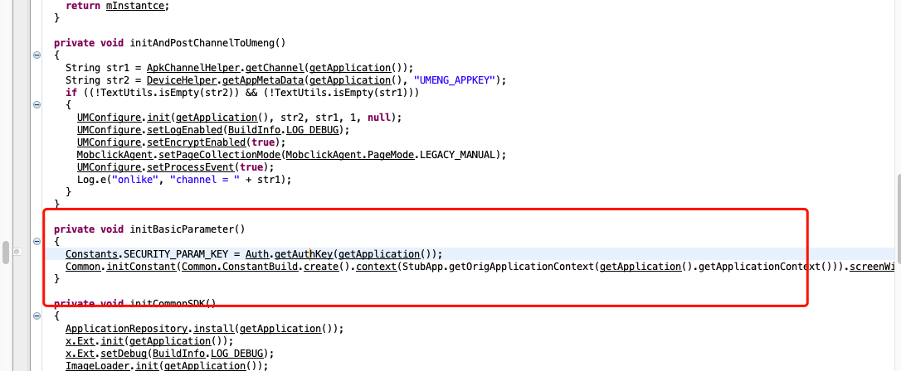  

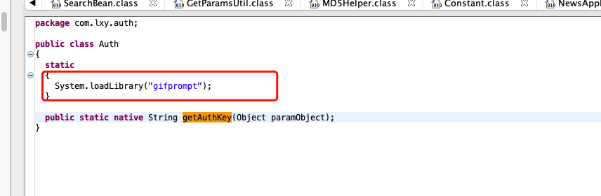  

如上图所示，这个key是写在native层的，观察函数，是静态的，那么，它就是静态注册的了，我们拷贝libgifprompt.so在ida中观察，看看什么情况。  

tips: ida打开so，我喜欢先看导出函数有那些，接着f5看下伪代码。 

从导出函数看，我们看到了以java_开头的函数体，确定了它是用静态注册
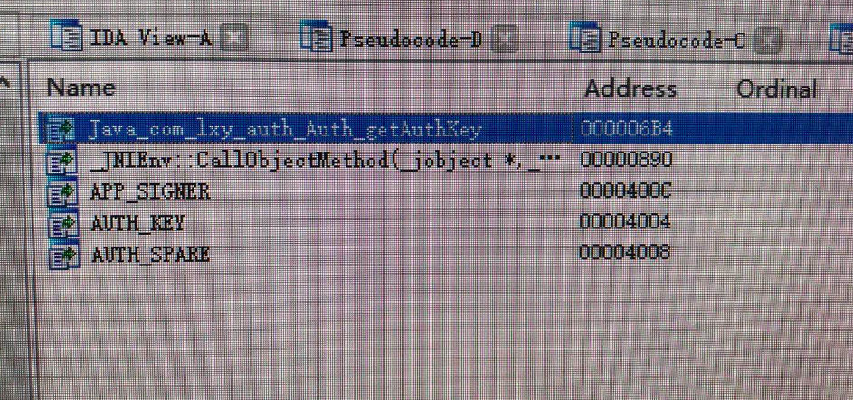  


观察伪代码，熟悉ndk开发的同学应该都知道，它呢，采用静态注册，先获取了getPackageManager这个类，无参数，方法签名是PackageManager;  

然后拿到该类的getPackageInfo方法，带string类型参数，方法签名是PackageInfo;  

同时拿到getPackageName方法，该方法不带参数,签名是String类型。  

接下来，调用上面方法，得到返回值存放值v14寄存器，  

接着，获取静态字段，也就是签名，  

最后，做判断，将v24寄存器中的值取出转换类型返回。  


方法签名是字符串类型
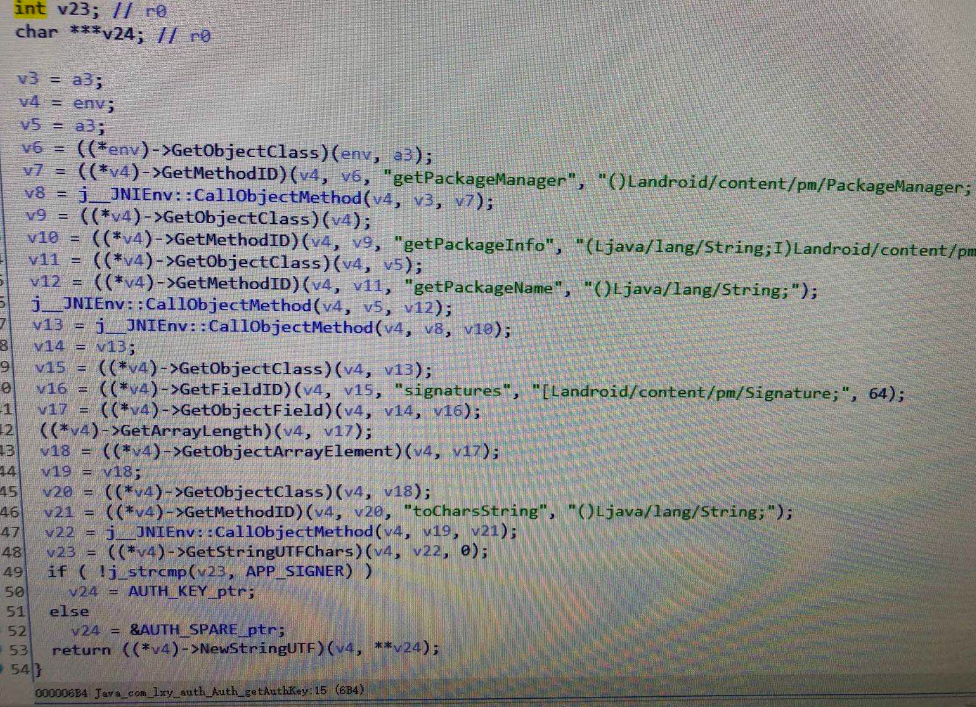  


上面伪代码了解得差不多了，我们发现，上面这个方法也没啥外部其他变量传进去，无法就是包名，apk签名信息，那么，
它的输出值肯定是个固定值呀。那么，我们直接hook 这个方法，拿到这个值不就完事了？  

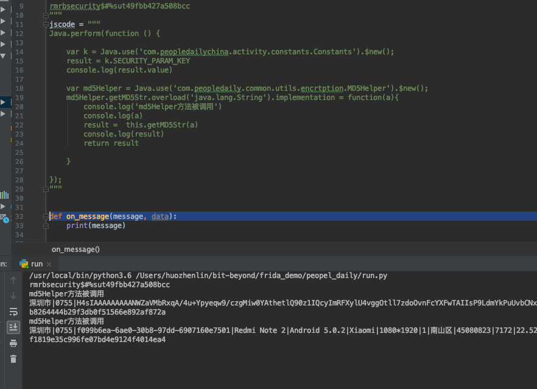  

果真如此。  


# 总结  

人民日报当前版本用了360加固，对于普通只会反编译看下java源码的同学来说会有难度，authkey的代码逻辑也写在了so层。可是，脱壳分析一波，
写在so里面的代码感觉写和没写没区别呀，它只用了application对象的包名和签名信息，其他动态信息没用，造成了一hook 就拿到了密钥，接着，
参数加密这块也是，用的是md5算法，表单构造参数合并，然后和authkey拼接，hash。额，也太随便了。  

从安全角度来看，逆向人员对系统底层的md5对象进行hook，不就一下子知道了你的入参和返回值了嘛，呃呃呃。