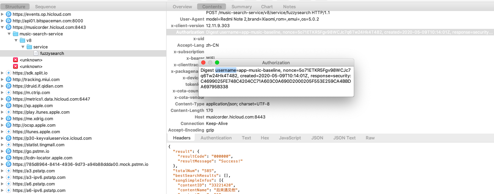
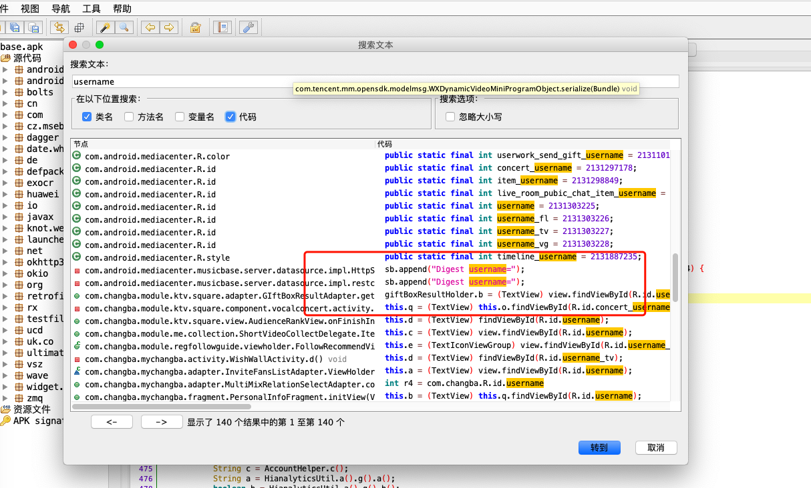
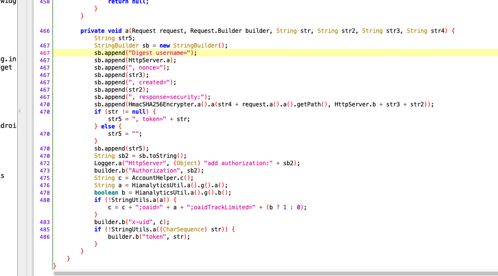
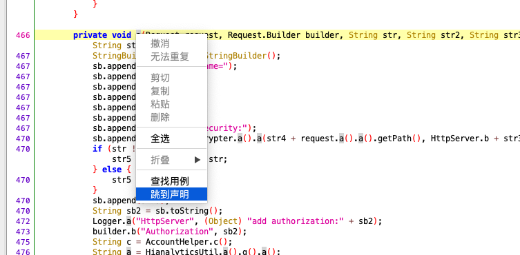
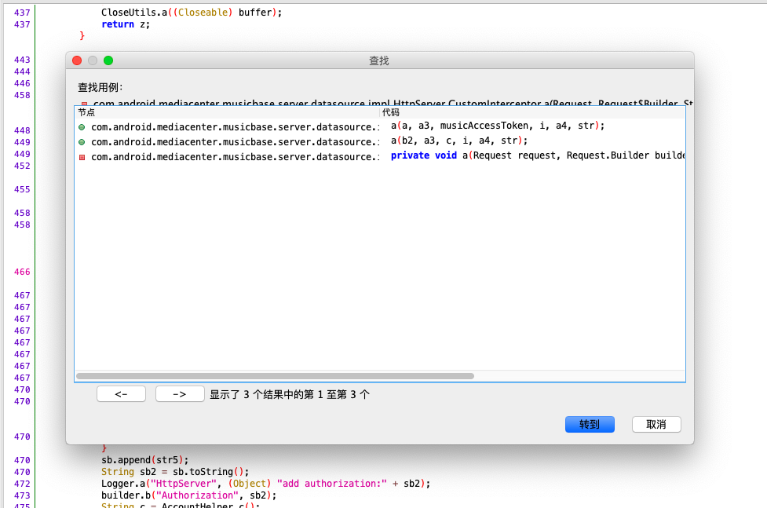
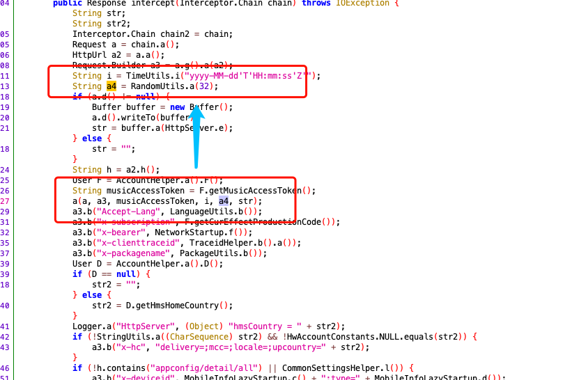
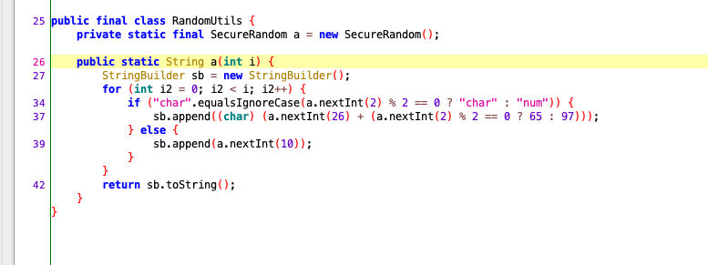
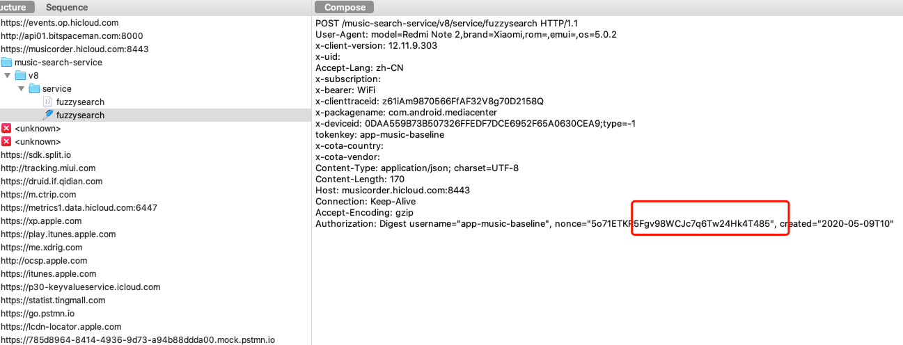
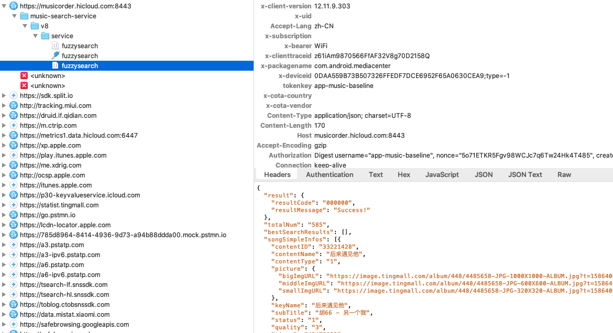

华为应用同华为花粉俱乐部一样，默认是不允许抓包的，设置代理后app将无法联网。具体反反抓包
教程可查阅[花粉俱乐部逆向分析](花粉俱乐部.md)  

顺利抓包后，我们看到里面也有加密参数,如图：
  

看到加密餐素，我们就可以通过关键字在jadx中定位关键位置了.

  

  

我们发现，这个代码里面的参数，和我们抓包是一致的，那么，加密参数肯定就是在这里了。

```javascript
private void a(Request request, Request.Builder builder, String str, String str2, String str3, String str4) {
            String str5;
            StringBuilder sb = new StringBuilder();
            sb.append("Digest username=");
            sb.append(HttpServer.a);
            sb.append(", nonce=");
            sb.append(str3);
            sb.append(", created=");
            sb.append(str2);
            sb.append(", response=security:");
            sb.append(HmacSHA256Encrypter.a().a(str4 + request.a().a().getPath(), HttpServer.b + str3 + str2));
            if (str != null) {
                str5 = ", token=" + str;
            } else {
                str5 = "";
            }
            sb.append(str5);
            String sb2 = sb.toString();
            Logger.a("HttpServer", (Object) "add authorization:" + sb2);
            builder.b("Authorization", sb2);
            String c = AccountHelper.c();
            String a = HianalyticsUtil.a().g().a();
            boolean b = HianalyticsUtil.a().g().b();
            if (!StringUtils.a(a)) {
                c = c + ";oaid=" + a + ";oaidTrackLimited=" + (b ? 1 : 0);
            }
            builder.b("x-uid", c);
            if (!StringUtils.a((CharSequence) str)) {
                builder.b("token", str);
            }
        }
    }
```
从代码查阅得到, nonce是由str3赋值，str3是从外部函数调用传递进来的来，那么，我们看下
它的声明/用例地方.

  

  

可见，有3个方法用到了a,我们可以一个个查看  

  
很幸运，方法一中就直接看到nonce的声明地方了，
````javascript
public Response intercept(Interceptor.Chain chain) throws IOException {
            String str;
            String str2;
            Interceptor.Chain chain2 = chain;
            Request a = chain.a();
            HttpUrl a2 = a.a();
            Request.Builder a3 = a.g().a(a2);
            String i = TimeUtils.i("yyyy-MM-dd'T'HH:mm:ss'Z'");
            String a4 = RandomUtils.a(32);
            if (a.d() != null) {
                Buffer buffer = new Buffer();
                a.d().writeTo(buffer);
                str = buffer.a(HttpServer.e);
            } else {
                str = "";
            }
            String h = a2.h();
            User F = AccountHelper.a().F();
            String musicAccessToken = F.getMusicAccessToken();
            a(a, a3, musicAccessToken, i, a4, str);
            a3.b("Accept-Lang", LanguageUtils.b());
            //省略其他代码
````

可见，a4是由RandomUtils.a(32)生成.我们看下a4是由RandomUtils.a()的方法实现 
  

```javascript
package com.android.common.utils;

import java.security.SecureRandom;

public final class RandomUtils {
    private static final SecureRandom a = new SecureRandom();

    public static String a(int i) {
        StringBuilder sb = new StringBuilder();
        for (int i2 = 0; i2 < i; i2++) {
            if ("char".equalsIgnoreCase(a.nextInt(2) % 2 == 0 ? "char" : "num")) {
                sb.append((char) (a.nextInt(26) + (a.nextInt(2) % 2 == 0 ? 65 : 97)));
            } else {
                sb.append(a.nextInt(10));
            }
        }
        return sb.toString();
    }
}
```
整个类都是挺简单的，就是传入一个长度，然后随机生成这个长度的一个字符串。嗯嗯，
挺简单的。

既然是随机生成的，那么，我们尝试下改变抓包中的参数，看下能否正常请求.  

  

 

结论如下，此值没意义，可随意修改。  

