最近是想学习chrome的断点调试知识点，确定了练手网站[同程旅游](https://www.ly.com)。在调试过程中遇到了挺多坑。  
# 坑：打开控制就重复debugger  
比较有意思的是，这网站一打开控制台，就进入了debugger,怎么都跳不过去，并且，随着时间的增长，chrome变得越来越卡。
什么原因呢？猜想是不是这网站自我debugger的时候还不断往内存写东西呀？太坏了。  
好，下面我们来一探究竟。
通过chrome控制台中记录debugger的调用堆栈情况来看，debugger的调用函数位于<b>leonid-tq-jq-v3-min.js</b>文件中，
我们去看下这函数长什么样
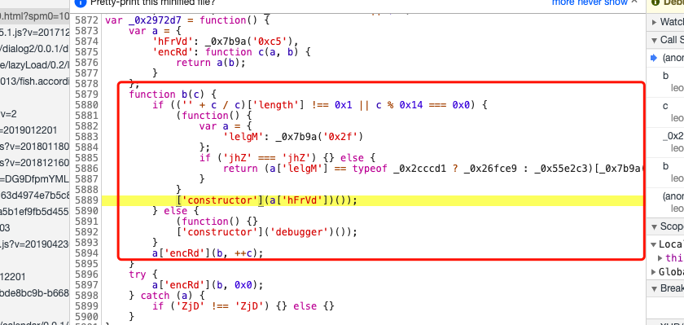
```javascript
function b(c) {
        if (('' + c / c)['length'] !== 0x1 || c % 0x14 === 0x0) {
            (function() {
                var a = {
                    'lelgM': _0x7b9a('0x2f')
                };
                if ('jhZ' === 'jhZ') {} else {
                    return (a['lelgM'] == typeof _0x2cccd1 ? _0x26fce9 : _0x55e2c3)[_0x7b9a('0x8e')](_0x7b69de, _0x1dda55, _0x2119dd, _0x491d7e);
                }
            }
            ['constructor'](a['hFrVd'])());
        } else {
            (function() {}
            ['constructor']('debugger')());
        }
        a['encRd'](b, ++c);
    }
```
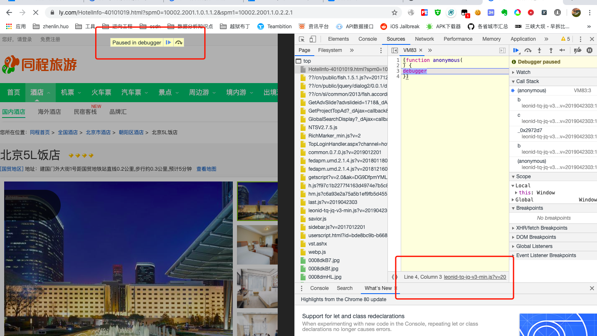
分析源码，我们可以知道，它确实是在监听控制台的变化，打开则debugger。既然我们想自己去调试这网站，那么，我们就得去掉这段
代码，该怎么做呢？  
方案一：抓包工具替换源码  
如果你是使用charles抓包工具，那么你肯定认识tools->rewriter的功能选项，它就是替换请求/响应用的。
好，上面我们知道debugger的调用函数名叫<b>_0x2972d7</b>, 接下来，我们将这个函数体内代码全部清空，复制至charles规则里面。  
```javascript
var _0xb9a7=['YXBwZW5k','c3Jj','MTAwJQ==','WlZFSW0=','cmVtb3Zl','elhUZWk=','U2hHcFk=','QmFP','R3hE','c2ppVGU=','emtBd0s=','SU1teVU=','c2VyaWFsaXplVG9TdHJpbmc=','d1JY','SGZjdkk=','a2hhYlU=','YWpheA==','X19hamF4','ZXJyb3I=','TkRWYXQ=','dExMeHc=','aGdmV0I=','PGRpdiBjbGFzcz0ibGVvbmlkLXRxLWNvbnRhaW5lciI+PC9kaXY+','WW5yc0o=','WE5zUW8=','dEZublQ=','V01QbGF5ZXIuT0NY','Y29sb3I=','SHFv','QWRvZGIuU3RyZWFt','UVBvaXI=','TXN4bWwyLkRPTURvY3VtZW50','TXN4bWwyLlhNTEhUVFA=','UERGLlBkZkN0cmw=','QkNlWXA=','UmVhbFZpZGVvLlJlYWxWaWRlbyh0bSkgQWN0aXZlWCBDb250cm9sICgzMi1iaXQp','U1dDdGwuU1dDdGw=','cXNiSFM=','cm1vY3guUmVhbFBsYXllciBHMiBDb250cm9sLjE=','ZmluZA==','TVNKQUo=','X2YyZWIwY2FkMGRjMDA4YjY0OGUzNDE3MGIyYTBhMzY3','QUxr','dGxadEI=','VEJhRVY=','VUVlTEw=','WWtKang=','bW9FdnQ=','YWpheENhbGxCYWNr','Qlht','aFFmT1o=','aFV6R1U=','c2NyZWVu','c2Nyb2xsSGVpZ2h0','R2loQ0Q=','ZXhlYw==','bXNpZQ==','b3BlcmE=','eVpt','c3dP','bXNEb05vdFRyYWNr','d1NDUUw=','eFF2aHk=','b0lkVmg=','ZGVRYms=','Z3d2SFg=','bmV0c2NhcGU=','Tll3RWo=','cXlkUXM=','ZklEdFk=','Z2V0QWRCbG9jaw==','Y29sb3JfZGVwdGgmQA==','d2ViZ2wmQA==','bHpp','Q1RlVEw=','VmZX','cmVzb2x1dGlvbg==','aWVfcGx1Z2lucw==','RVV6dGs=','eFpjUE4=','Um9veHg=','WnFtRFE=','bVBmS08=','SW9EVUo=','ZEhx','a1VFclI=','SEln','eGlVZGk=','ZGlkPQ==','UGtxSnc=','b0NHaEs=','T1ZIeVU=','ZGF0YQ==','cmVzdWx0','VXBE','VldkUG8=','V3hyQ0E=','aGFzX2xpZWRfYnJvd3Nlcg==','alRR','NHwwfDF8NXw2fDJ8Mw==','VHFNZGQ=','Z0VzcHg=','U0diUGQ=','Z2V0VGltZQ==','Z1RLV0w=','dHlwPTAmcmR5dD0=','ZGZQcVM=','Z2tUblI=','dEFkQ3A=','VWtFYW0=','WGZQ','Y29tcG9uZW50cw==','alF1ZXJ5','aW5pdA==','cHJvdG90eXBl','bWl4SW4=','Z0JqQVU=','JHN1cGVy','ZXh0ZW5k','YXBwbHk=','Smxi','RVhUX3RleHR1cmVfZmlsdGVyX2FuaXNvdHJvcGlj','V0VCS0lUX0VYVF90ZXh0dXJlX2ZpbHRlcl9hbmlzb3Ryb3BpYw==','S2pDTm8=','Z2V0RXh0ZW5zaW9u','VmxZV0s=','Z2V0UGFyYW1ldGVy','d29yZHM=','c2lnQnl0ZXM=','TUVz','b3B0aW9ucw==','ZXhjbHVkZVdlYkdM','aXNXZWJHbFN1cHBvcnRlZA==','cHVzaA==','d2ViZ2w=','c3BsaXQ=','Y2xhbXA=','eENLUm0=','cWNudXI=','YXVrTFQ=','bGVuZ3Ro','ZW5jcnlwdA==','aEZCYmk=','aW1QSmg=','cmFuZG9t','SGV4','Y29taFI=','aGtEa0w=','c3Vic3Ry','TGF0aW4x','cEFwRWY=','ZnJvbUNoYXJDb2Rl','QXNjTkw=','TVpt','Y2hhckNvZGVBdA==','UUxvaXI=','c3RyaW5naWZ5','S1NaWlM=','VGxrc2Q=','dnRnY24=','c3RyaW5n','QkN2VEY=','ZnlCVEM=','bG9jYWxTdG9yYWdl','SmVjQkk=','cFFF','YmxvY2tTaXpl','U1RYWE4=','WEJnckI=','Y2VpbA==','WG9J','ZXhjbHVkZVRvdWNoU3VwcG9ydA==','dG91Y2hfc3VwcG9ydA==','X2RvUHJvY2Vzc0Jsb2Nr','c3BsaWNl','cWxiYkQ=','ckJF','Y2FsbA==','aW5kZXhPZg==','QW9LRmw=','Y2hhckF0','QXVheEQ=','RnhranA=','YlJHc2E=','R2Zu','dnJO','VURnRUE=','bWtnSWo=','aHJlZg==','X2FwcGVuZA==','TXBl','VldET24=','SE1BQw==','ZmluYWxpemU=','ZW5j','X21hcA==','eFd6RGw=','dHd3VFk=','ZUtHeWI=','bWFOVFg=','am9pbg==','cXRKUEY=','clVjTWQ=','VnZqeGc=','UXRLVHo=','ZEhIZm0=','aWtEckY=','ekNxQ3Y=','V29yZEFycmF5','SGFzaGVy','YWxnbw==','YWJz','TUQ1','X2hhc2g=','dFVyem0=','bE5SelU=','YnVmV1I=','aGhEVUk=','b1hGRUQ=','Y21pcmQ=','UXV2Q3Q=','Uk51VFE=','aGNZdVE=','TmdXem4=','c3lkRHg=','cU1Ka2s=','bG9n','bHZjd2Y=','X25EYXRhQnl0ZXM=','amRrZ0Y=','ekZCWHo=','bmZnSlI=','ZUJnVlc=','Y01RWkI=','X2NyZWF0ZUhlbHBlcg==','Y3JlYXRl','a2V5U2l6ZQ==','cmVzZXQ=','Y29uY2F0','RXZwS0RG','Y29tcHV0ZQ==','bGli','QmFzZQ==','QnVmZmVyZWRCbG9ja0FsZ29yaXRobQ==','QmFzZTY0','Y2xYRXg=','WHRu','aVpy','X0RFQ19YRk9STV9NT0RF','Y2Zn','X3hmb3JtTW9kZQ==','WUFZ','Vnp4U2M=','aHZH','TUxZ','ZGVjcnlwdA==','U3RyZWFtQ2lwaGVy','X2l2','X3ByZXZCbG9jaw==','SkdxVWk=','RGVjcnlwdG9y','X2NpcGhlcg==','RW5jcnlwdG9y','c0h3','aHFu','aGtkcks=','dVV6UVM=','dW5kZWZpbmVk','dmFsdWU=','UW1KRFk=','U1hu','RkRrQ2Q=','YnBHZXo=','ZGV0ZWN0U2NyZWVuT3JpZW50YXRpb24=','aGVpZ2h0','c2xpY2U=','ZGVjcnlwdEJsb2Nr','aGtK','QktTQVk=','WFBneEg=','UE9mWkM=','QmxvY2tDaXBoZXI=','X0VOQ19YRk9STV9NT0RF','Y3JlYXRlRGVjcnlwdG9y','X21pbkJ1ZmZlclNpemU=','cHJvY2Vzc0Jsb2Nr','cGFkZGluZw==','X3Byb2Nlc3M=','Q2lwaGVyUGFyYW1z','Zm9ybWF0','T3BlblNTTA==','Y2lwaGVydGV4dA==','c2FsdA==','RWh3Vk0=','a05Wc3k=','aGFzX2xpZWRfbGFuZ3VhZ2Vz','MXw0fDJ8MHwz','bW9kZQ==','RUpV','aHBUc2Y=','ZXhjbHVkZVNjcmVlblJlc29sdXRpb24=','Z2V0U2NyZWVuUmVzb2x1dGlvbg==','X3BhcnNl','cGFyc2U=','ekZy','b3VDQkk=','dXNlckFnZW50','UGFzc3dvcmRCYXNlZENpcGhlcg==','a2Rm','Y29uc3RydWN0b3I=','ZGVidWdnZXI=','a2V5','ZXhlY3V0ZQ==','UFdQR1I=','aXBXVU8=','RnJrSnY=','Vm5EcEc=','QUVT','X25Sb3VuZHM=','X2tleVNjaGVkdWxl','R1JqeEY=','ZVNYWVU=','Y1ZxZWg=','R1Jnb3Q=','cURDRHE=','dVh1S0I=','VE1nd0c=','VUlw','Q1RiSVc=','ZHpY','Qmp5UUY=','X2RvQ3J5cHRCbG9jaw==','Y3NWUW8=','UHROR3c=','RlVDTXg=','dmxldkQ=','UHJMUU8=','TUlRTGw=','RGNxRFI=','YkdEbmY=','ZlNhVFc=','dW9GWms=','TllGbHA=','ZUJ3ZHY=','dmd6bmc=','TGZSbmk=','b3JKVHI=','eExCcXM=','RExYTUk=','b2hrUkU=','Z09iYmc=','enp4','Z2V0','c3FydA==','a0FsTkc=','UktQb00=','TUx5Wkg=','cG93','U0hBMjU2','a0R1','T0RURVQ=','eVhpVWg=','Y1JzRVo=','RVRJdmM=','RnJneW0=','dGJJY04=','SFJDTGY=','WHp2dlE=','SEpzaXc=','clhYYmI=','ZXhjbHVkZUhhcmR3YXJlQ29uY3VycmVuY3k=','aGFyZHdhcmVfY29uY3VycmVuY3k=','Z2V0SGFyZHdhcmVDb25jdXJyZW5jeQ==','bERranc=','dElTS2g=','X2RhdGE=','Zmxvb3I=','S2R1RlQ=','Y2xvbmU=','T3Z6ZU8=','ZXhwb3J0cw==','bGFuZ3VhZ2U=','cGl4ZWxfcmF0aW8=','QXJpYWwgSGVicmV3','QXJpYWwgUm91bmRlZCBNVCBCb2xk','Q2FtYnJpYQ==','Q29uc29sYXM=','R2FyYW1vbmQ=','SW1wYWN0','THVjaWRhIEJyaWdodA==','THVjaWRhIEZheA==','THVjaWRhIFNhbnM=','TVMgU2FucyBTZXJpZg==','TVlSSUFEIFBSTw==','VHJlYnVjaGV0IE1T','VmVyZGFuYQ==','QWJhZGkgTVQgQ29uZGVuc2VkIExpZ2h0','QWxiZXJ0dXMgRXh0cmEgQm9sZA==','QXBhcmFqaXRh','QXZhbnRHYXJkZSBNZCBCVA==','QVZFTklS','QmFua0dvdGhpYyBNZCBCVA==','Qm9kb25pIE1UIEJsYWNr','Q2FuZGFyYQ==','Q2VudGF1cg==','Q2hlbHRobUlUQyBCayBCVA==','Q29sb25uYSBNVA==','Q29uc3RhbnRpYQ==','Q29yZGlhVVBD','Q29yb25ldA==','Q3Vja29v','RGF1blBlbmg=','RGF1cGhpbg==','RWR3YXJkaWFuIFNjcmlwdCBJVEM=','RXJhcyBCb2xkIElUQw==','RmVsaXggVGl0bGluZw==','Rml4ZWRzeXM=','R2VlemEgUHJv','R2VvbWV0cjIzMSBMdCBCVA==','R2lzaGE=','R3VsaW1DaGU=','R3VuZ3N1aENoZQ==','SGFycmluZ3Rvbg==','SG9lZmxlciBUZXh0','SHVtYW5zdDUyMSBCVA==','SW5jaXNlZDkwMSBCZCBCVA==','S2F1Zm1hbm4gQmQgQlQ=','S2htZXIgVUk=','S29raWxh','S3Vuc3RsZXIgU2NyaXB0','TGlseVVQQw==','TWFnbmV0bw==','TWVpcnlv','TWljcm9zb2Z0IEpoZW5nSGVp','TWljcm9zb2Z0IFBoYWdzUGE=','TXJzIEVhdmVz','TVMgTWluY2hv','TVMgUE1pbmNobw==','TVYgQm9saQ==','TnlhbGE=','T255eA==','T1BUSU1B','UGFydHkgTEVU','UGlja3dpY2s=','UE1pbmdMaVUtRXh0Qg==','UmFhdmk=','Um9tYW4=','U2FudGEgRmUgTEVU','U2VyaWZhIEJU','U2hlbGxleVZvbGFudGUgQlQ=','U2ltSGVp','U2tpYQ==','U3RhY2NhdG8yMjIgQlQ=','U3Vid2F5','U3dpc3M5MTEgWENtIEJU','VGFtaWwgU2FuZ2FtIE1O','VHJhZGl0aW9uYWwgQXJhYmlj','VHJhamFu','VHVidWxhcg==','VHcgQ2VuIE1UIENvbmRlbnNlZA==','VXRzYWFo','VmlqYXlh','VmluZXIgSGFuZCBJVEM=','V2VzdG1pbnN0ZXI=','WmFwZkh1bW5zdCBCVA==','WldBZG9iZUY=','QWN0aXZlWE9iamVjdA==','UmVhbFBsYXllcg==','dW5rbm93bg==','TU9aX0VYVF90ZXh0dXJlX2ZpbHRlcl9hbmlzb3Ryb3BpYw==','YWRzYm94','YW5kcm9pZA==','bGludXg=','aXBob25l','V2luZG93cyBQaG9uZQ==','MDAwMDAwMDA=','emJi','aWZmdXI=','dXVLQk8=','bmF0aXZlRm9yRWFjaA==','Zm9yRWFjaA==','cGl4ZWxSYXRpb0tleQ==','bG9jYWxTdG9yYWdlS2V5','aW5kZXhlZERiS2V5','YWRkQmVoYXZpb3JLZXk=','b3BlbkRhdGFiYXNlS2V5','ZG9Ob3RUcmFja0tleQ==','d2ViZ2xLZXk=','aGFzTGllZE9zS2V5','aGFzTGllZEJyb3dzZXJLZXk=','b2li','ZWFjaA==','TEd1','YnZmTWE=','dUxWcXU=','YXBwZW5kQ2hpbGQ=','eVRxd1o=','aklVYks=','ZnVuY3Rpb24=','SWpY','ZFVQdU0=','Z2V0VXNlckFnZW50','ZURF','dGQgYWxyZWFkeSBpbml0','c3lzdGVtTGFuZ3VhZ2U=','Y29sb3JfZGVwdGg=','Z2V0UGl4ZWxSYXRpbw==','ZmsgbWUh','ZGV2aWNlUGl4ZWxSYXRpbw==','V0dmSmo=','TGZI','dFhlQXA=','Q0NkT1k=','YW1k','bFlwT0Q=','d2lkdGg=','ZFJzbG8=','S3BhVnM=','ZXhjbHVkZUF2YWlsYWJsZVNjcmVlblJlc29sdXRpb24=','SENz','Qk9TS1Y=','YXZhaWxXaWR0aA==','YXZhaWxIZWlnaHQ=','UXdUV2o=','aktoVXI=','V2N4','aGFzU2Vzc2lvblN0b3JhZ2U=','c2Vzc2lvbl9zdG9yYWdl','bG9jYWxfc3RvcmFnZQ==','SWVq','Q1pHZWQ=','eHpGcWo=','dGNwVFE=','WlBETFI=','SENYbHI=','QUJOUEc=','YlZubVQ=','bkJmSlk=','ZkxyeWU=','VHdmZ1E=','aW5kZXhlZF9kYg==','Ym9keQ==','YWRkQmVoYXZpb3I=','Ukt0YVo=','b3Blbl9kYXRhYmFzZQ==','aWl2VFU=','Z2V0Q29udGV4dA==','akVk','Y3B1X2NsYXNz','a0RzSGw=','cmVsb2Fk','WmV4ZGQ=','cXRz','Z2V0TmF2aWdhdG9yUGxhdGZvcm0=','ZXhwaXJlcw==','dG9VVENTdHJpbmc=','cGF0aA==','OyBwYXRoPQ==','ZXhjbHVkZURvTm90VHJhY2s=','T3V4UXg=','QnJnZkI=','TXVGbk0=','ZXhjbHVkZUNhbnZhcw==','Z2V0Q2FudmFzRnA=','YWRibG9jaw==','ZXJy','ZXhjbHVkZUhhc0xpZWRMYW5ndWFnZXM=','Z2V0SGFzTGllZExhbmd1YWdlcw==','Z2V0SGFzTGllZFJlc29sdXRpb24=','c0pV','ZXhjbHVkZUhhc0xpZWRPcw==','dmNwdHc=','Z2V0SGFzTGllZE9z','eEZC','dHlwMT00JnR5cDI9','ZlpvRXY=','ZFNtWnA=','ZXhjbHVkZUhhc0xpZWRCcm93c2Vy','dndlWVk=','RlVJSWM=','S3FuYVk=','ZXhjbHVkZUpzRm9udHM=','bG9hZFN3ZkFuZERldGVjdEZvbnRz','ZkRaaUQ=','QUJDREVGR0hJSktMTU5PUFFSU1RVVldYWVphYmNkZWZnaGlqa2xtbm9wcXJzdHV2d3h5ejAxMjM0NTY3ODkrLz0=','QW5kYWxlIE1vbm8=','bGdnU0E=','QXJpYWwgVW5pY29kZSBNUw==','aXBWWkw=','Q2VudHVyeSBHb3RoaWM=','Q2VudHVyeSBTY2hvb2xib29r','blRBUVk=','Q1h5YkE=','Q291cmllciBOZXc=','cndBQ3E=','ekdQQks=','THdtck8=','RGlEcnk=','Qk1SQVo=','THVjaWRhIFNhbnMgVW5pY29kZQ==','SWtVWmc=','TVMgU2VyaWY=','TVlSSUFE','QkF5bFM=','U2Vnb2UgU2NyaXB0','ekdTV2U=','Um12cGs=','VXV4aFI=','dEdGVEs=','V2luZ2RpbmdzIDI=','V2luZ2RpbmdzIDM=','ZWx0b2Q=','QWNhZGVteSBFbmdyYXZlZCBMRVQ=','QURPQkUgQ0FTTE9OIFBSTw==','QXF1a3g=','QWxiZXJ0dXMgTWVkaXVt','cFpEY0g=','QW5nc2FuYVVQQw==','QXBwbGUgQ29sb3IgRW1vamk=','QXJhYmljIFR5cGVzZXR0aW5n','UkxRUkY=','ZlhSeFk=','aVFxVEI=','SWtuZWs=','QmFuZHk=','QmFuayBHb3RoaWM=','QmFza2VydmlsbGUgT2xkIEZhY2U=','QmF0YW5nQ2hl','QmVsbCBNVA==','QmVtYm8=','QmVuZ3VpYXQgQmsgQlQ=','Qm9kb25pIE1UIENvbmRlbnNlZA==','Qm9kb25pIE1UIFBvc3RlciBDb21wcmVzc2Vk','QnJhZGxleSBIYW5k','WlNnelc=','QnJpdGFubmljIEJvbGQ=','QnJvYWR3YXk=','QnJvd2FsbGlhVVBD','UW9qbWw=','bExsTXU=','TVhXYlI=','Q2V6YW5uZQ==','Q0cgT21lZ2E=','Y2VNVGM=','Q2hhbGtib2FyZCBTRQ==','WXZHYUQ=','SHhmaWY=','YlB2Wlk=','T0hxR0o=','U0l3aUk=','Q29wcGVycGxhdGUgR290aGlj','alVteHA=','Q29yYmVs','Q29yZGlhIE5ldw==','TFV3akE=','aFRMeGc=','Q3VybHogTVQ=','Z1h1YW0=','S1hJeEY=','REZLYWktU0I=','ZE1Eakc=','RGlsbGVuaWFVUEM=','RElO','V0VYY0M=','c2FCd1o=','RW5ncmF2ZXJzIE1U','RXJhcyBEZW1pIElUQw==','RXJhcyBMaWdodCBJVEM=','RXhvdGMzNTAgQmQgQlQ=','RmFuZ1Nvbmc=','d2RqWHU=','RXNMQnE=','Rm9ydGU=','RnJlZXN0eWxlIFNjcmlwdA==','RnV0dXJhIE1kIEJU','RnV0dXJhIFpCbGsgQlQ=','UkJUZEI=','WlFIQ2M=','U0FYS0Q=','dVNUclE=','R2VvU2xhYiA3MDMgWEJkIEJU','dWlCU3I=','R2lsbCBTYW5zIE1U','R2lsbCBTYW5zIE1UIENvbmRlbnNlZA==','WVRhSno=','YkJlT3Y=','RHdvWkk=','R291ZHkgT2xkIFN0eWxl','TllaZWs=','ZUFaU0c=','WUd1cU4=','d0NCb1I=','R3VybXVraGkgTU4=','SGFldHRlbnNjaHdlaWxlcg==','eVdPakk=','S3BScEg=','SGVpdGkgVEM=','UnlLZmw=','SGlyYWdpbm8gTWluY2hvIFByb04=','SHVtYW5zdCA1MjEgQ24gQlQ=','bHFZQ0c=','SHVtYW5zdDUyMSBMdCBCVA==','bGZhSmk=','TFJMUlU=','SW5mb3JtYWwwMTEgQlQ=','SXJpc1VQQw==','eVdlTVE=','UHB1ckY=','S2FiZWwgVWx0IEJU','WmNTT2U=','S2FydGlrYQ==','blhDSUk=','UG9BckU=','RHh1cGo=','S3J1bmd0aGVw','Z1ZoZkQ=','ZFRJb1M=','TGl0aG9ncmFwaA==','RWVYdEM=','TWFsZ3VuIEdvdGhpYw==','TWFuZ2Fs','cUhuQlg=','TWF0dXJhIE1UIFNjcmlwdCBDYXBpdGFscw==','TWVpcnlvIFVJ','dUxDeW4=','YWdNRkE=','TWljcm9zb2Z0IFlpIEJhaXRp','Uk5IZ1k=','TWluZ0xpVV9IS1NDUw==','ZmZodGY=','b2VyZXc=','TW9uYSBMaXNhIFNvbGlkIElUQyBUVA==','TU9OTw==','S2hPRk8=','U21Ua3k=','TVMgTGluZURyYXc=','YlB3TWQ=','c05uemI=','TVMgUmVmZXJlbmNlIFNwZWNpYWx0eQ==','TVMgVUkgR290aGlj','TVQgRXh0cmE=','bXlmWHE=','TmFya2lzaW0=','TmV3cyBHb3RoaWM=','TmlhZ2FyYSBFbmdyYXZlZA==','U3hhSVY=','YUhuUnk=','bEtIY1Y=','T3JpeWEgU2FuZ2FtIE1O','VHhkT0M=','VUFSTXQ=','UGFyY2htZW50','UGVnYXN1cw==','UGVycGV0dWE=','dG5VR2c=','UGxhbnRhZ2VuZXQgQ2hlcm9rZWU=','UGxheWJpbGw=','UE1pbmdMaVU=','Ukpqc1k=','UG9zdGVy','UFRCYXJudW0gQlQ=','YXhOSmM=','U1BlT3k=','Um9ja3dlbGwgRXh0cmEgQm9sZA==','U2Fra2FsIE1hamFsbGE=','U2NlcHRyZQ==','U2NyaXB0','U2VyaWZh','ZXZ2ZHg=','U2hvbmFyIEJhbmdsYQ==','UVVNSkQ=','U2ltcGxpZmllZCBBcmFiaWMgRml4ZWQ=','U25hcCBJVEM=','U29ja2V0','U3RlYW1lcg==','RFhFTVA=','U3R5bGxv','Y3ZUdlk=','U3luY2hybyBMRVQ=','UmNva1k=','VGVsdWd1IFNhbmdhbSBNTg==','VGVtcHVzIFNhbnMgSVRD','aE1zb0c=','VFJBSkFOIFBSTw==','VHJpc3Rhbg==','S2pJR3A=','VHcgQ2VuIE1U','VHlwb1VwcmlnaHQgQlQ=','VW5pdmVycw==','WVlEVnk=','VmFuaQ==','UVVwcVo=','V2lkZSBMYXRpbg==','VGd5VGY=','WmFwZmlubw==','TGVTZGE=','ZXh0ZW5kZWRKc0ZvbnRz','dXNlckRlZmluZWRGb250cw==','NzJweA==','Z2V0RWxlbWVudHNCeVRhZ05hbWU=','dm1XRnM=','Y3JlYXRlRWxlbWVudA==','c3R5bGU=','Ump5Qmo=','Zm9udFNpemU=','aW5uZXJIVE1M','WHJyRG4=','Zm9udEZhbWlseQ==','RGRXamQ=','aktQQ08=','b2xi','QklBZ0k=','ZGxMdEE=','R0ZXVlU=','elNKRkg=','ZFpQUEE=','ZlR2QlU=','WUZzWHI=','aE9acm0=','dUtRR0w=','alp3b2w=','b2Zmc2V0SGVpZ2h0','b2Zmc2V0V2lkdGg=','U05USlQ=','anNfZm9udHM=','ZXhjbHVkZVBsdWdpbnM=','cmVndWxhcl9wbHVnaW5z','cGx1Z2luc1Nob3VsZEJlU29ydGVk','bmFtZQ==','bWFw','Z2V0T3duUHJvcGVydHlEZXNjcmlwdG9y','RWZFbnM=','c0FDR1g=','QWdDb250cm9sLkFnQ29udHJvbA==','RGV2YWxWUlhDdHJsLkRldmFsVlJYQ3RybC4x','V1pkbEc=','UmVhbFBsYXllci5SZWFsUGxheWVyKHRtKSBBY3RpdmVYIENvbnRyb2wgKDMyLWJpdCk=','QWpwS2Y=','U2hvY2t3YXZlRmxhc2guU2hvY2t3YXZlRmxhc2g=','U2t5cGUuRGV0ZWN0aW9u','VERDQ3RsLlREQ0N0bA==','bW1G','Xzk5OGI5MDIyOGQ3M2FiMjgwNTc1MmE5Njk3MzcxZmZiXw==','aXNJbml0aW5n','cGx1Z2lucw==','Z2V0UmVndWxhclBsdWdpbnM=','Y2FudmFz','Yll2d1Q=','WVZrYnk=','VmpSRU4=','U1Bt','Z2V0VG91Y2hTdXBwb3J0','TWZZUWE=','dmxD','YVpu','Z1pG','VU16','cG9D','c1V5dnA=','VU1hVWo=','cEloT0k=','RlBWeUo=','ZnlqeEw=','Q1FodHI=','eUJad2U=','VmNk','aUdu','b2xlYmY=','aGFyZHdhcmVDb25jdXJyZW5jeQ==','Y3B1Q2xhc3M=','ZXJvZmk=','ZG9Ob3RUcmFjaw==','TXpzU1E=','bXNNYXhUb3VjaFBvaW50cw==','VG91Y2hFdmVudA==','PGkgY2xhc3M9Ig==','PGxhYmVsPjwvbGFiZWw+','eXJH','ZFZkZ3o=','WEFBT1o=','a3VraWU=','SU11eHU=','am9reFA=','cklKUVU=','YWRk','cHJlcGVuZA==','TUZnWFo=','YUdX','ZXZlbm9kZA==','Q3dtIGZqb3JkYmFuayBnbHlwaHMgdmV4dCBxdWl6LCDwn5iD','cmdiYSgxMDIsIDIwNCwgMCwgMC4yKQ==','aXNQb2ludEluUGF0aA==','clJGeEg=','YWxwaGFiZXRpYw==','ZmlsbFN0eWxl','IzA2OQ==','ZmlsbFRleHQ=','MThwdCBBcmlhbA==','Y2xvc2VQYXRo','YXJj','YmVnaW5QYXRo','dURmVko=','ZmlsbA==','Z2xybHM=','d2ViZ2wgdmVydGV4IHNoYWRlciBoaWdoIGZsb2F0IHByZWNpc2lvbjo=','d2ViZ2wgdmVydGV4IHNoYWRlciBoaWdoIGZsb2F0IHByZWNpc2lvbiByYW5nZU1pbjo=','d2ViZ2wgdmVydGV4IHNoYWRlciBsb3cgZmxvYXQgcHJlY2lzaW9uOg==','d2ViZ2wgdmVydGV4IHNoYWRlciBoaWdoIGludCBwcmVjaXNpb246','d2ViZ2wgdmVydGV4IHNoYWRlciBtZWRpdW0gaW50IHByZWNpc2lvbiByYW5nZU1pbjo=','d2ViZ2wgZnJhZ21lbnQgc2hhZGVyIGxvdyBpbnQgcHJlY2lzaW9uOg==','QVJSQVlfQlVGRkVS','bnVtSXRlbXM=','Y3JlYXRlUHJvZ3JhbQ==','ZXhwZXJpbWVudGFsLXdlYmds','VU5NQVNLRURfVkVORE9SX1dFQkdM','VnJBdmE=','anNXcWI=','RlJBR01FTlRfU0hBREVS','c2hhZGVyU291cmNl','Y29tcGlsZVNoYWRlcg==','YXR0YWNoU2hhZGVy','dXNlUHJvZ3JhbQ==','Z2V0QXR0cmliTG9jYXRpb24=','YXR0clZlcnRleA==','dmVydGV4UG9zQXJyYXk=','dmVydGV4QXR0cmliUG9pbnRlcg==','YlFjVVE=','Z2V0U3VwcG9ydGVkRXh0ZW5zaW9ucw==','QUxJQVNFRF9QT0lOVF9TSVpFX1JBTkdF','QUxQSEFfQklUUw==','QkxVRV9CSVRT','TUFYX0NPTUJJTkVEX1RFWFRVUkVfSU1BR0VfVU5JVFM=','d2ViZ2wgbWF4IGN1YmUgbWFwIHRleHR1cmUgc2l6ZTo=','d2ViZ2wgbWF4IGZyYWdtZW50IHVuaWZvcm0gdmVjdG9yczo=','d2ViZ2wgbWF4IHJlbmRlciBidWZmZXIgc2l6ZTo=','d2ViZ2wgbWF4IHRleHR1cmUgaW1hZ2UgdW5pdHM6','TUFYX1RFWFRVUkVfSU1BR0VfVU5JVFM=','TUFYX1RFWFRVUkVfU0laRQ==','d2ViZ2wgbWF4IHZhcnlpbmcgdmVjdG9yczo=','TUFYX1ZFUlRFWF9BVFRSSUJT','TUFYX1ZJRVdQT1JUX0RJTVM=','UlJia3k=','VkVSU0lPTg==','cWRCeUs=','X19fZnBfc3dmX2xvYWRlZA==','T0xYUm8=','YWx3YXlz','ZmFsc2U=','ZW1iZWRTV0Y=','Y2xlYXJDb2xvcg==','ZW5hYmxl','TEVRVUFM','U2dNeGY=','cHJlY2lzaW9uIG1lZGl1bXAgZmxvYXQ7dmFyeWluZyB2ZWMyIHZhcnlpblRleENvb3JkaW5hdGU7dm9pZCBtYWluKCkge2dsX0ZyYWdDb2xvcj12ZWM0KHZhcnlpblRleENvb3JkaW5hdGUsMCwxKTt9','UERYaks=','SElHSF9GTE9BVA==','cHJlY2lzaW9u','QWpFUW4=','Z2V0U2hhZGVyUHJlY2lzaW9uRm9ybWF0','VkVSVEVYX1NIQURFUg==','cmFuZ2VNaW4=','cmFuZ2VNYXg=','T3N5YUo=','SlBqUm0=','d2ViZ2wgdmVydGV4IHNoYWRlciBsb3cgZmxvYXQgcHJlY2lzaW9uIHJhbmdlTWluOg==','TE9XX0ZMT0FU','d2ViZ2wgZnJhZ21lbnQgc2hhZGVyIGhpZ2ggZmxvYXQgcHJlY2lzaW9uOg==','TUVESVVNX0ZMT0FU','d2ViZ2wgZnJhZ21lbnQgc2hhZGVyIG1lZGl1bSBmbG9hdCBwcmVjaXNpb24gcmFuZ2VNYXg6','d3Jwb1o=','d2ViZ2wgZnJhZ21lbnQgc2hhZGVyIGxvdyBmbG9hdCBwcmVjaXNpb24gcmFuZ2VNaW46','VUNjano=','SElHSF9JTlQ=','d2ViZ2wgdmVydGV4IHNoYWRlciBoaWdoIGludCBwcmVjaXNpb24gcmFuZ2VNYXg6','d2ViZ2wgdmVydGV4IHNoYWRlciBtZWRpdW0gaW50IHByZWNpc2lvbjo=','a0JpRGw=','TUVESVVNX0lOVA==','T2JGd1Y=','d2ViZ2wgdmVydGV4IHNoYWRlciBsb3cgaW50IHByZWNpc2lvbiByYW5nZU1pbjo=','TE9XX0lOVA==','d2ViZ2wgdmVydGV4IHNoYWRlciBsb3cgaW50IHByZWNpc2lvbiByYW5nZU1heDo=','Z1ZnQ3Q=','bU5mYVM=','RU5kZWM=','d2ViZ2wgZnJhZ21lbnQgc2hhZGVyIGxvdyBpbnQgcHJlY2lzaW9uIHJhbmdlTWluOg==','d2ViZ2wgZnJhZ21lbnQgc2hhZGVyIGxvdyBpbnQgcHJlY2lzaW9uIHJhbmdlTWF4Og==','Y2xhc3NOYW1l','UUpsd2Y=','c3J6WGs=','R3dO','Z3RD','RXVpb2Q=','bkNsUkw=','ZW5jcnlwdEJsb2Nr','eE5ZR1c=','THlLbUg=','d2luZG93cyBwaG9uZQ==','d2lu','QW5kcm9pZA==','TGludXg=','aXBhZA==','V1ZzZHg=','T054Ylk=','VkxpZkY=','UFVhemo=','V3lRa04=','T29NZ0k=','VFhPTHo=','cGlrZQ==','UmpMa0c=','VnpNdlo=','TWFj','b3By','Q2hyb21l','c2FmYXJp','aGhh','Rlp6','dG9Mb3dlckNhc2U=','QnRSTFY=','YWVTZFg=','Tk1FTVE=','b1RQQ3Y=','S0JaQWw=','dVRtckw=','dG9TdHJpbmc=','RmlyZWZveA==','c1lTaWI=','SW50ZXJuZXQgRXhwbG9yZXI=','cFlST3I=','T3RoZXI=','dG9Tb3VyY2U=','T1Z6R3c=','U0VPc0o=','V1J5amY=','TFBu','dXdt','aXNDYW52YXNTdXBwb3J0ZWQ=','d21tVEY=','R1Bz','d1VKRnk=','V2ViR0xSZW5kZXJpbmdDb250ZXh0','RW1RcFc=','TWljcm9zb2Z0IEludGVybmV0IEV4cGxvcmVy','TmV0c2NhcGU=','cGFk','eUpaTlM=','dERX','UHBo','cUtrYWI=','ZWFJ','UlF3TEY=','WllZ','dHlwPTMmcmR5dD0=','VUhD','bXJQcU4=','bmF0aXZlTWFw','bE50','UWhCQnY=','WlRt','YXZMZG4=','ZWlra20=','Sk5pZ2g=','ZU9Od3I=','UHRQTmk=','YnFCVHM=','RWlzbkU=','SXBIYkU=','SFZvUGI=','b1JGT1A=','dFRScUg=','WVFER00=','eWJDdmI=','RWNBS24=','d3VVcnI=','aUpMRWk=','eEd0bHM=','U2lxRUk=','aEFXRUc=','Wldyb3M=','ZnFtQ0E=','b0FZb1Q=','eDY0TXVsdGlwbHk=','eDY0Um90bA==','eDY0QWRk','eDY0TGVmdFNoaWZ0','QUhEc1Y=','eDY0WG9y','Z29rd0k=','cEVKSUE=','eDY0Rm1peA==','dXNoVm0=','X2xlb25pZF9fX2NhcHVybF9f','SU9r','PHN0eWxlPi5sZW9uaWQtdHEtY29udGFpbmVye3Bvc2l0aW9uOmZpeGVkO2xlZnQ6LTEwMCU7d2lkdGg6MDtoZWlnaHQ6MDt2aXNpYmlsaXR5OmhpZGRlbjt6LWluZGV4Oi0xMH0ubGVvbmlkLXRxLWNhbGNjYyBwe2NvbG9yOmJsdWV9Lmxlb25pZC10cS1jYWxjY2MgcCBlbXtjb2xvcjpibHVlfS5sZW9uaWQtdHEtY2FsY2NjIC5vKy5vKy5vKyorKisqKy5vKy5jKy5vKyorKisqKy5vKy5vKy5vIH4gcHtjb2xvcjpyZWR9Lmxlb25pZC10cS1jYWxjY2MgLm8rLm8rLm8rKisqKyorLm8rLmMrLm8rKisqKyorLm8rLmMrLm8rKisqKyorLm8rLm8rLm8gfiBwe2NvbG9yOnJlZH0ubGVvbmlkLXRxLWNhbGNjYyAubysubysubysqKyorKisubysuYysubysqKyorKisubysuYysubysqKyorKisubysuYysubysqKyorKisubysubysubyB+IHB7Y29sb3I6cmVkfS5sZW9uaWQtdHEtY2FsY2NjIC5vKy5vKy5vKy5vKyorKisubysuYysuYysubysqKyorLm8rLm8rLm8rLm8gfiBwe2NvbG9yOnJlZH0ubGVvbmlkLXRxLWNhbGNjYyAubysubysubysubysqKyorLm8rLmMrLmMrLm8rKisqKy5vKy5jKy5jKy5vKyorKisubysubysubysubyB+IHB7Y29sb3I6cmVkfS5sZW9uaWQtdHEtY2FsY2NjIC5vKy5vKy5vKy5vKyorKisubysuYysuYysubysqKyorLm8rLmMrLmMrLm8rKisqKy5vKy5jKy5jKy5vKyorKisubysubysubysubyB+IHB7Y29sb3I6cmVkfS5sZW9uaWQtdHEtY2FsY2NjIC5vKy5vKy5vKy5vKy5vKyorLm8rLmMrLmMrLmMrLm8rKisubysubysubysubysubyB+IHB7Y29sb3I6cmVkfS5sZW9uaWQtdHEtY2FsY2NjIC5vKy5vKy5vKy5vKy5vKyorLm8rLmMrLmMrLmMrLm8rKisubysuYysuYysuYysubysqKy5vKy5vKy5vKy5vKy5vIH4gcHtjb2xvcjpyZWR9Lmxlb25pZC10cS1jYWxjY2MgLm8rLm8rLm8rLm8rLm8rKisubysuYysuYysuYysubysqKy5vKy5jKy5jKy5jKy5vKyorLm8rLmMrLmMrLmMrLm8rKisubysubysubysubysubyB+IHB7Y29sb3I6cmVkfTwvc3R5bGU+','aGVhZA==','dHlwMT00JnR5cDI9MQ==','ZGl2','d2Via2l0','emJu','eU1q','anNvbg==','R0x2WU0=','WExW','Qmdw','dHlwPTkmcmR5dD0=','cmVwbGFjZQ==','aGFP','dlBoekQ=','cmF3','Y29va2ll','OyBleHBpcmVzPQ==','dF9x','aHVTVXA=','dW9yc2Q=','bGhabUE=','c1B6Zlc=','elRTekE=','eUN5SGw=','R0ZReFM=','bmtQWXA=','eU9nQ3I=','cFNxcFo=','UGRsV24=','UnRXc3k=','cElGdnM=','ZGVmYXVsdHM=','TG1ibG8=','RndhdHM=','c2V0TWlsbGlzZWNvbmRz','Z2V0TWlsbGlzZWNvbmRz','Tlp5eUU=','OyBkb21haW49','ZG9tYWlu','c2VjdXJl','VGhrZkc=','V0Zmc2s=','cmVtb3ZlQ29va2ll','Q3l0d0I=','bm93','dmVyc2lvbg==','R2FsaVc=','eyJfbGVvbmlkX19fY2FwdXJsX18iOg==','aWRTVGI=','c0p0','X2xlb25pZF9fX2lzaWZyYW1lX19f','cWN5VXA=','R3hBUGg=','elFISFc=','dHlwPTUmcmR5dD0=','RmpJck8=','YWxwaGEob3BhY2l0eT0xNSk=','OTk5OTk5OQ==','Zmsgb2ZmIQ==','MHw0fDJ8MXwz','aGRHZm0=','Y292ZXIgb3IgZGlhbG9nIGFsZWFkeSBydW5uaW5n','aW52YWxpZCBzcmM=','MzUw','YXR0cg==','Zml4ZWQ=','OTk5OTk5','TWFmTFQ=','Y3Nz','NTAl','ZnhWY0c=','em5Wc3Q='];(function(a,d){var b=function(b){while(--b){a['push'](a['shift']());}};var c=function(){var a={'data':{'key':'cookie','value':'timeout'},'setCookie':function(b,h,i,e){e=e||{};var c=h+'='+i;var a=0x0;for(var a=0x0,f=b['length'];a<f;a++){var g=b[a];c+=';\x20'+g;var d=b[g];b['push'](d);f=b['length'];if(d!==!![]){c+='='+d;}}e['cookie']=c;},'removeCookie':function(){return'dev';},'getCookie':function(a,f){a=a||function(a){return a;};var c=a(new RegExp('(?:^|;\x20)'+f['replace'](/([.$?*|{}()[]\/+^])/g,'$1')+'=([^;]*)'));var e=function(a,b){a(++b);};e(b,d);return c?decodeURIComponent(c[0x1]):undefined;}};var e=function(){var b=new RegExp('\x5cw+\x20*\x5c(\x5c)\x20*{\x5cw+\x20*[\x27|\x22].+[\x27|\x22];?\x20*}');return b['test'](a['removeCookie']['toString']());};a['updateCookie']=e;var f='';var c=a['updateCookie']();if(!c){a['setCookie'](['*'],'counter',0x1);}else if(c){f=a['getCookie'](null,'counter');}else{a['removeCookie']();}};c();}(_0xb9a7,0x71));var _0x7b9a=function(b,e){b=b-0x0;var a=_0xb9a7[b];if(_0x7b9a['initialized']===undefined){(function(){var a;try{var b=Function('return\x20(function()\x20'+'{}.constructor(\x22return\x20this\x22)(\x20)'+');');a=b();}catch(b){a=window;}var c='ABCDEFGHIJKLMNOPQRSTUVWXYZabcdefghijklmnopqrstuvwxyz0123456789+/=';a['atob']||(a['atob']=function(h){var f=String(h)['replace'](/=+$/,'');for(var b=0x0,d,a,g=0x0,e='';a=f['charAt'](g++);~a&&(d=b%0x4?d*0x40+a:a,b++%0x4)?e+=String['fromCharCode'](0xff&d>>(-0x2*b&0x6)):0x0){a=c['indexOf'](a);}return e;});}());_0x7b9a['base64DecodeUnicode']=function(e){var b=atob(e);var c=[];for(var a=0x0,d=b['length'];a<d;a++){c+='%'+('00'+b['charCodeAt'](a)['toString'](0x10))['slice'](-0x2);}return decodeURIComponent(c);};_0x7b9a['data']={};_0x7b9a['initialized']=!![];}var d=_0x7b9a['data'][b];if(d===undefined){var c=function(a){this['rc4Bytes']=a;this['states']=[0x1,0x0,0x0];this['newState']=function(){return'newState';};this['firstState']='\x5cw+\x20*\x5c(\x5c)\x20*{\x5cw+\x20*';this['secondState']='[\x27|\x22].+[\x27|\x22];?\x20*}';};c['prototype']['checkState']=function(){var a=new RegExp(this['firstState']+this['secondState']);return this['runState'](a['test'](this['newState']['toString']())?--this['states'][0x1]:--this['states'][0x0]);};c['prototype']['runState']=function(a){if(!Boolean(~a)){return a;}return this['getState'](this['rc4Bytes']);};c['prototype']['getState']=function(c){for(var a=0x0,b=this['states']['length'];a<b;a++){this['states']['push'](Math['round'](Math['random']()));b=this['states']['length'];}return c(this['states'][0x0]);};new c(_0x7b9a)['checkState']();a=_0x7b9a['base64DecodeUnicode'](a);_0x7b9a['data'][b]=a;}else{a=d;}return a;};var CryptoJS=CryptoJS||function(g,r){var o=function(){var a=!![];return function(d,b){var c=a?function(){if(b){var a=b['apply'](d,arguments);b=null;return a;}}:function(){};a=![];return c;};}();var m=o(this,function(){var b=function(){return'\x64\x65\x76';},c=function(){return'\x77\x69\x6e\x64\x6f\x77';};var d=function(){var a=new RegExp('\x5c\x77\x2b\x20\x2a\x5c\x28\x5c\x29\x20\x2a\x7b\x5c\x77\x2b\x20\x2a\x5b\x27\x7c\x22\x5d\x2e\x2b\x5b\x27\x7c\x22\x5d\x3b\x3f\x20\x2a\x7d');return!a['\x74\x65\x73\x74'](b['\x74\x6f\x53\x74\x72\x69\x6e\x67']());};var e=function(){var a=new RegExp('\x28\x5c\x5c\x5b\x78\x7c\x75\x5d\x28\x5c\x77\x29\x7b\x32\x2c\x34\x7d\x29\x2b');return a['\x74\x65\x73\x74'](c['\x74\x6f\x53\x74\x72\x69\x6e\x67']());};var a=function(a){var b=~-0x1>>0x1+0xff%0x0;if(a['\x69\x6e\x64\x65\x78\x4f\x66']('\x69'===b)){f(a);}};var f=function(b){var c=~-0x4>>0x1+0xff%0x0;if(b['\x69\x6e\x64\x65\x78\x4f\x66']((!![]+'')[0x3])!==c){a(b);}};if(!d()){if(!e()){a('\x69\x6e\x64\u0435\x78\x4f\x66');}else{a('\x69\x6e\x64\x65\x78\x4f\x66');}}else{a('\x69\x6e\x64\u0435\x78\x4f\x66');}});m();var a={'gBjAU':_0x7b9a('0x0'),'hcQXG':function s(a,b){return a<b;},'JMZQZ':function t(a,b){return a>>>b;},'QHrqD':function u(a,b){return a-b;},'BlnOi':function v(a,b){return a>>>b;},'comhR':function w(a,b){return a>>>b;},'hkDkL':function x(a,b,c){return a(b,c);},'LmYDL':function y(a,b){return a/b;},'QLoir':function z(a,b){return a(b);},'KSZZS':function A(a,b){return a(b);},'Tlksd':'Malformed\x20UTF-8\x20data','vtgcn':function B(a,b){return a(b);}};var b={},h=b['lib']={},f=function(){},c=h['Base']={'extend':function(c){f[_0x7b9a('0x1')]=this;var b=new f();c&&b[_0x7b9a('0x2')](c);b['hasOwnProperty'](a[_0x7b9a('0x3')])||(b[_0x7b9a('0x0')]=function(){b[_0x7b9a('0x4')]['init']['apply'](this,arguments);});b[_0x7b9a('0x0')][_0x7b9a('0x1')]=b;b[_0x7b9a('0x4')]=this;return b;},'create':function(){var a=this[_0x7b9a('0x5')]();a[_0x7b9a('0x0')][_0x7b9a('0x6')](a,arguments);return a;},'init':function(){},'mixIn':function(b){var a={'eAAMW':function f(a,b){return a===b;},'wlMdZ':_0x7b9a('0x7'),'gEWGa':'toString','KjCNo':_0x7b9a('0x8'),'qVBBv':_0x7b9a('0x9'),'VlYWK':'MOZ_EXT_texture_filter_anisotropic'};if(a['eAAMW'](_0x7b9a('0x7'),a['wlMdZ'])){for(var c in b)b['hasOwnProperty'](c)&&(this[c]=b[c]);b['hasOwnProperty'](a['gEWGa'])&&(this['toString']=b['toString']);}else{var g,d=e['getExtension'](a[_0x7b9a('0xa')])||e[_0x7b9a('0xb')](a['qVBBv'])||e[_0x7b9a('0xb')](a[_0x7b9a('0xc')]);return _0x47ed8c?(_0x242b0c=e[_0x7b9a('0xd')](i['MAX_TEXTURE_MAX_ANISOTROPY_EXT']),0x0===_0x512320&&(_0x488c76=0x2),_0x4512a0):null;}},'clone':function(){return this[_0x7b9a('0x0')]['prototype']['extend'](this);}},d=h['WordArray']=c['extend']({'init':function(a,b){a=this[_0x7b9a('0xe')]=a||[];this[_0x7b9a('0xf')]=b!=r?b:0x4*a['length'];},'toString':function(b){var a={'MttxD':function c(a,b){return a!==b;}};if(a['MttxD'](_0x7b9a('0x10'),'XGP')){return(b||n)['stringify'](this);}else{return this[_0x7b9a('0x11')][_0x7b9a('0x12')]?_0x284c41:this[_0x7b9a('0x13')]()?(e[_0x7b9a('0x14')]({'_0x4444d8':_0x7b9a('0x15'),'_0x54548e':this['getWebglFp']()}),_0x126b90):_0x12d7b9;}},'concat':function(c){var b={'PZWQf':function k(a,b){return a>>>b;},'xCKRm':function l(a,b){return a>>>b;},'qcnur':function m(a,b){return a>>>b;},'vRVhx':function n(a,b){return a-b;},'aukLT':function o(a,b){return a*b;},'NXGxs':function i(a,b){return a%b;},'GJdER':function j(a,b){return a<b;}};var g='5|0|2|4|1|3'[_0x7b9a('0x16')]('|'),h=0x0;while(!![]){switch(g[h++]){case'0':c=c['sigBytes'];continue;case'1':this[_0x7b9a('0xf')]+=c;continue;case'2':this[_0x7b9a('0x17')]();continue;case'3':return this;continue;case'4':if(d%0x4)for(var a=0x0;a<c;a++)e[b['PZWQf'](d+a,0x2)]|=(b[_0x7b9a('0x18')](f[b[_0x7b9a('0x19')](a,0x2)],b['vRVhx'](0x18,b['aukLT'](0x8,a%0x4)))&0xff)<<0x18-b[_0x7b9a('0x1a')](0x8,b['NXGxs'](d+a,0x4));else if(0xffff<f[_0x7b9a('0x1b')])for(a=0x0;b['GJdER'](a,c);a+=0x4)e[d+a>>>0x2]=f[a>>>0x2];else e['push'][_0x7b9a('0x6')](e,f);continue;case'5':var e=this['words'],f=c['words'],d=this['sigBytes'];continue;}break;}},'clamp':function(){var a={'KevIH':function d(a,b){return a==b;},'Rznbf':'string','DuINe':function e(a,b){return a>>>b;},'VmhMu':function f(a,b){return a<<b;},'hFBbi':function h(a,b){return a-b;},'EvmOV':function i(a,b){return a*b;},'KEfMk':function j(a,b){return a%b;}};if('XFY'==='xVO'){return(a['KevIH'](a['Rznbf'],typeof _0x538e9e)?_0x28016d:_0x1b721d)[_0x7b9a('0x1c')](_0x3f7ce9,_0x3d1c81,_0xfd305b,_0x1a0c9f);}else{var c=this[_0x7b9a('0xe')],b=this[_0x7b9a('0xf')];c[a['DuINe'](b,0x2)]&=a['VmhMu'](0xffffffff,a[_0x7b9a('0x1d')](0x20,a['EvmOV'](0x8,a['KEfMk'](b,0x4))));c[_0x7b9a('0x1b')]=g['ceil'](b/0x4);}},'clone':function(){var b={'imPJh':'Xle'};if(b[_0x7b9a('0x1e')]==='Bps'){}else{var a=c['clone']['call'](this);a[_0x7b9a('0xe')]=this[_0x7b9a('0xe')]['slice'](0x0);return a;}},'random':function(e){for(var b=[],c=0x0;a['hcQXG'](c,e);c+=0x4)b['push'](0x100000000*g[_0x7b9a('0x1f')]()|0x0);return new d[(_0x7b9a('0x0'))](b,e);}}),j=b['enc']={},n=j[_0x7b9a('0x20')]={'stringify':function(c){var f=c['words'];c=c['sigBytes'];for(var d=[],b=0x0;a['hcQXG'](b,c);b++){var e=a['JMZQZ'](f[a['JMZQZ'](b,0x2)],a['QHrqD'](0x18,0x8*(b%0x4)))&0xff;d['push'](a['BlnOi'](e,0x4)['toString'](0x10));d[_0x7b9a('0x14')]((e&0xf)['toString'](0x10));}return d['join']('');},'parse':function(f){for(var c=f['length'],e=[],b=0x0;b<c;b+=0x2)e[a[_0x7b9a('0x21')](b,0x3)]|=a[_0x7b9a('0x22')](parseInt,f[_0x7b9a('0x23')](b,0x2),0x10)<<0x18-0x4*(b%0x8);return new d['init'](e,a['LmYDL'](c,0x2));}},k=j[_0x7b9a('0x24')]={'stringify':function(b){var c={'pApEf':function f(a,b){return a===b;},'AscNL':function g(a,b){return a%b;}};if(c[_0x7b9a('0x25')]('NxN','NxN')){var e=b['words'];b=b[_0x7b9a('0xf')];for(var d=[],a=0x0;a<b;a++)d[_0x7b9a('0x14')](String[_0x7b9a('0x26')](e[a>>>0x2]>>>0x18-0x8*c[_0x7b9a('0x27')](a,0x4)&0xff));return d['join']('');}else{_0x8788c6=_0x1a688e;}},'parse':function(f){var b={'rNNQN':function h(a,b){return a>>>b;},'uRUja':function i(a,b){return a-b;},'eKHvv':function j(a,b){return a!==b;}};if(_0x7b9a('0x28')===_0x7b9a('0x28')){for(var c=f['length'],e=[],a=0x0;a<c;a++)e[b['rNNQN'](a,0x2)]|=(f[_0x7b9a('0x29')](a)&0xff)<<b['uRUja'](0x18,0x8*(a%0x4));return new d['init'](e,c);}else{var g=navigator['languages'][0x0]['substr'](0x0,0x2);if(b['eKHvv'](_0x218241,navigator['language']['substr'](0x0,0x2)))return!0x0;}}},p=j['Utf8']={'stringify':function(b){try{return a[_0x7b9a('0x2a')](decodeURIComponent,a['QLoir'](escape,k[_0x7b9a('0x2b')](b)));}catch(b){throw a[_0x7b9a('0x2c')](Error,a[_0x7b9a('0x2d')]);}},'parse':function(b){return k['parse'](a['vtgcn'](unescape,a[_0x7b9a('0x2e')](encodeURIComponent,b)));}},l=h['BufferedBlockAlgorithm']=c[_0x7b9a('0x5')]({'reset':function(){var a={'RUPYg':'session_storage'};if('ueY'!=='cGW'){this['_data']=new d[(_0x7b9a('0x0'))]();this['_nDataBytes']=0x0;}else{return!this['options']['excludeSessionStorage']&&this['hasSessionStorage']()&&e['push']({'_0x27a9b6':a['RUPYg'],'_0x1b687f':0x1}),_0x44e083;}},'_append':function(a){var b={'BCvTF':function c(a,b){return a===b;},'fyBTC':'UXZ','RgOUk':_0x7b9a('0x2f')};if(b[_0x7b9a('0x30')](b[_0x7b9a('0x31')],'UXZ')){b['RgOUk']==typeof a&&(a=p['parse'](a));this['_data']['concat'](a);this['_nDataBytes']+=a[_0x7b9a('0xf')];}else{if(!win[_0x7b9a('0x32')]){_0x581034++;errorType[_0x7b9a('0x14')](0x6);return;}try{document['createElement']('canvas')['getContext']('2d');}catch(a){errorType['push'](0x6);_0x43a25e++;}}},'_process':function(b){var f={'JecBI':function n(a,b){return a===b;},'STXXN':function k(a,b){return a/b;},'XBgrB':function l(a,b){return a*b;},'fbsnb':function m(a,b){return a-b;}};if(f[_0x7b9a('0x33')](_0x7b9a('0x34'),_0x7b9a('0x34'))){var h=this['_data'],i=h[_0x7b9a('0xe')],c=h[_0x7b9a('0xf')],j=this[_0x7b9a('0x35')],e=f[_0x7b9a('0x36')](c,f[_0x7b9a('0x37')](0x4,j)),e=b?g[_0x7b9a('0x38')](e):g['max'](f['fbsnb'](e|0x0,this['_minBufferSize']),0x0);b=e*j;c=g['min'](0x4*b,c);if(b){if(_0x7b9a('0x39')!==_0x7b9a('0x39')){return this[_0x7b9a('0x11')][_0x7b9a('0x3a')]||i[_0x7b9a('0x14')]({'_0x290a18':_0x7b9a('0x3b'),'_0x47d007':this['getTouchSupport']()}),_0x5f49fe;}else{for(var a=0x0;a<b;a+=j)this[_0x7b9a('0x3c')](i,a);a=i[_0x7b9a('0x3d')](0x0,b);h[_0x7b9a('0xf')]-=c;}}return new d[(_0x7b9a('0x0'))](a,c);}else{}},'clone':function(){var a={'qlbbD':'RJq','AoKFl':function h(a,b){return a>>>b;},'QwOvM':function i(a,b){return a-b;},'AuaxD':function j(a,b){return a*b;},'RWRtR':function k(a,b){return a<<b;},'Fxkjp':function l(a,b){return a*b;}};if(a[_0x7b9a('0x3e')]!==_0x7b9a('0x3f')){var d=c['clone'][_0x7b9a('0x40')](this);d['_data']=this['_data']['clone']();return d;}else{var e=f[_0x7b9a('0x41')](b['charAt'](_0x588c48-0x1))<<0x2*(_0x39a5a9%0x4),g=a[_0x7b9a('0x42')](f['indexOf'](b[_0x7b9a('0x43')](_0x3e65fa)),a['QwOvM'](0x6,a[_0x7b9a('0x44')](0x2,_0x58aed7%0x4)));c[a['AoKFl'](_0x993048,0x2)]|=a['RWRtR'](_0x59a64d|_0x1eacbc,0x18-a[_0x7b9a('0x45')](0x8,_0x517e93%0x4));_0x744887++;}},'_minBufferSize':0x0});h['Hasher']=l['extend']({'cfg':c[_0x7b9a('0x5')](),'init':function(b){var a={'bRGsa':function c(a,b){return a===b;}};if(a[_0x7b9a('0x46')]('dDO',_0x7b9a('0x47'))){}else{this['cfg']=this['cfg'][_0x7b9a('0x5')](b);this['reset']();}},'reset':function(){var a={'gRNpw':function b(a,b){return a(b);},'UDgEA':function c(a,b){return a!==b;},'mkgIj':_0x7b9a('0x48')};if(a[_0x7b9a('0x49')](a[_0x7b9a('0x4a')],'jYp')){l['reset']['call'](this);this['_doReset']();}else{_0x12f3d8(function(){if(_0x294c9d){return a['gRNpw'](_0x313bcc,_0x716703);}else{return location[_0x7b9a('0x4b')]=_0x12dadf;}},0x1f4);}},'update':function(a){this[_0x7b9a('0x4c')](a);this['_process']();return this;},'finalize':function(a){var b={'VWDOn':'unknown'};if('Mpe'!==_0x7b9a('0x4d')){return navigator['hardwareConcurrency']?navigator['hardwareConcurrency']:b[_0x7b9a('0x4e')];}else{a&&this[_0x7b9a('0x4c')](a);return this['_doFinalize']();}},'blockSize':0x10,'_createHelper':function(a){return function(b,c){return new a['init'](c)['finalize'](b);};},'_createHmacHelper':function(a){return function(b,c){return new q[(_0x7b9a('0x4f'))][(_0x7b9a('0x0'))](a,c)[_0x7b9a('0x50')](b);};}});var q=b['algo']={};return b;}(Math);(function(){var a={'wKnYs':function d(a,b){return a<b;},'cKGMK':function e(a,b){return a%b;},'IFEsl':function f(a,b){return a-b;},'ZWVdi':function g(a,b){return a%b;},'udXbr':function h(a,b){return a*b;},'qtJPF':function i(a,b){return a|b;},'rUcMd':'ABCDEFGHIJKLMNOPQRSTUVWXYZabcdefghijklmnopqrstuvwxyz0123456789+/='};var b=CryptoJS,c=b['lib']['WordArray'];b[_0x7b9a('0x51')]['Base64']={'stringify':function(c){var b={'oBAHN':function k(a,b){return a&b;},'mIzKS':function l(a,b){return a-b;},'xWzDl':function m(a,b){return a*b;},'twwTY':function n(a,b){return a>>>b;},'BJJbC':function o(a,b){return a>>>b;},'eKGyb':function i(a,b){return a+b;},'maNTX':function j(a,b){return a+b;}};if('UhV'!=='UhV'){}else{var d=c[_0x7b9a('0xe')],f=c[_0x7b9a('0xf')],g=this[_0x7b9a('0x52')];c['clamp']();c=[];for(var a=0x0;a<f;a+=0x3)for(var h=(d[a>>>0x2]>>>0x18-0x8*(a%0x4)&0xff)<<0x10|b['oBAHN'](d[a+0x1>>>0x2]>>>b['mIzKS'](0x18,b[_0x7b9a('0x53')](0x8,(a+0x1)%0x4)),0xff)<<0x8|b[_0x7b9a('0x54')](d[b['BJJbC'](a+0x2,0x2)],0x18-0x8*(b[_0x7b9a('0x55')](a,0x2)%0x4))&0xff,e=0x0;0x4>e&&b[_0x7b9a('0x56')](a,0.75*e)<f;e++)c[_0x7b9a('0x14')](g['charAt'](b['oBAHN'](h>>>0x6*(0x3-e),0x3f)));if(d=g[_0x7b9a('0x43')](0x40))for(;c['length']%0x4;)c[_0x7b9a('0x14')](d);return c[_0x7b9a('0x57')]('');}},'parse':function(f){var h=f['length'],g=this[_0x7b9a('0x52')],b=g[_0x7b9a('0x43')](0x40);b&&(b=f['indexOf'](b),-0x1!=b&&(h=b));for(var b=[],e=0x0,d=0x0;a['wKnYs'](d,h);d++)if(a['cKGMK'](d,0x4)){var i=g[_0x7b9a('0x41')](f['charAt'](a['IFEsl'](d,0x1)))<<0x2*a['ZWVdi'](d,0x4),j=g['indexOf'](f[_0x7b9a('0x43')](d))>>>0x6-a['udXbr'](0x2,d%0x4);b[e>>>0x2]|=a[_0x7b9a('0x58')](i,j)<<0x18-0x8*a['ZWVdi'](e,0x4);e++;}return c['create'](b,e);},'_map':a[_0x7b9a('0x59')]};}());(function(k){var b={'Vvjxg':function r(a,b){return a|b;},'aAvub':function s(a,b){return a&b;},'vrvMZ':function t(a,b){return a+b;},'QtKTz':function u(a,b){return a<<b;},'KgFFu':function v(a,b){return a+b;},'dHHfm':function w(a,b){return a+b;},'ikDrF':function x(a,b){return a|b;},'jHTCt':function y(a,b){return a&b;},'eqOoz':function z(a,b){return a>>>b;},'qSLdl':function m(a,b){return a^b;},'BXYpz':function n(a,b){return a+b;},'TDaDL':function o(a,b){return a|b;},'zCqCv':function p(a,b){return a-b;},'RKHkH':function q(a,b){return a>b;}};function d(a,c,e,f,g,d,h){a=a+b[_0x7b9a('0x5a')](b['aAvub'](c,e),b['aAvub'](~c,f))+g+h;return b['vrvMZ'](b[_0x7b9a('0x5b')](a,d)|a>>>0x20-d,c);}function e(a,c,f,d,g,e,h){a=b['KgFFu'](b[_0x7b9a('0x5c')](a,b[_0x7b9a('0x5d')](b['jHTCt'](c,d),f&~d))+g,h);return(a<<e|b['eqOoz'](a,0x20-e))+c;}function f(a,c,e,f,g,d,h){a=a+b['qSLdl'](c^e,f)+g+h;return(a<<d|a>>>0x20-d)+c;}function c(a,c,e,f,g,d,h){a=b[_0x7b9a('0x5c')](b['BXYpz'](a+(e^b['TDaDL'](c,~f)),g),h);return(b[_0x7b9a('0x5b')](a,d)|b['eqOoz'](a,b[_0x7b9a('0x5e')](0x20,d)))+c;}for(var h=CryptoJS,g=h['lib'],l=g[_0x7b9a('0x5f')],i=g[_0x7b9a('0x60')],g=h[_0x7b9a('0x61')],a=[],j=0x0;b['RKHkH'](0x40,j);j++)a[j]=0x100000000*k[_0x7b9a('0x62')](k['sin'](b['BXYpz'](j,0x1)))|0x0;g=g[_0x7b9a('0x63')]=i['extend']({'_doReset':function(){this[_0x7b9a('0x64')]=new l['init']([0x67452301,0xefcdab89,0x98badcfe,0x10325476]);},'_doProcessBlock':function(l,m){var j={'tUrzm':function D(a,b){return a<<b;},'KaWFf':function E(a,b){return a&b;},'lNRzU':function F(a,b){return a|b;},'bufWR':function G(a,b){return a<<b;},'hhDUI':function H(a,b){return a+b;},'TodNO':function I(a,b){return a+b;},'oXFED':function J(a,b){return a+b;},'cmird':function K(a,b,c,d,e,f,g,h){return a(b,c,d,e,f,g,h);},'YtVzC':function L(a,b,c,d,e,f,g,h){return a(b,c,d,e,f,g,h);},'nvMAJ':function M(a,b,c,d,e,f,g,h){return a(b,c,d,e,f,g,h);},'lTCVP':function N(a,b,c,d,e,f,g,h){return a(b,c,d,e,f,g,h);},'QuvCt':function O(a,b,c,d,e,f,g,h){return a(b,c,d,e,f,g,h);},'zcSqi':function P(a,b,c,d,e,f,g,h){return a(b,c,d,e,f,g,h);},'RNuTQ':function Q(a,b,c,d,e,f,g,h){return a(b,c,d,e,f,g,h);},'hcYuQ':function R(a,b,c,d,e,f,g,h){return a(b,c,d,e,f,g,h);},'dEkkw':function S(a,b,c,d,e,f,g,h){return a(b,c,d,e,f,g,h);},'NgWzn':function T(a,b,c,d,e,f,g,h){return a(b,c,d,e,f,g,h);},'sydDx':function U(a,b,c,d,e,f,g,h){return a(b,c,d,e,f,g,h);},'GXpnv':function V(a,b,c,d,e,f,g,h){return a(b,c,d,e,f,g,h);},'qMJkk':function W(a,b){return a+b;},'lvcwf':'invalid\x20src'};if('jmb'==='jmb'){for(var k=0x0;0x10>k;k++){var o=m+k,n=l[o];l[o]=(j[_0x7b9a('0x65')](n,0x8)|n>>>0x18)&0xff00ff|j['KaWFf'](j[_0x7b9a('0x66')](j[_0x7b9a('0x67')](n,0x18),n>>>0x8),0xff00ff00);}var k=this['_hash'][_0x7b9a('0xe')],o=l[j[_0x7b9a('0x68')](m,0x0)],n=l[j[_0x7b9a('0x68')](m,0x1)],t=l[m+0x2],A=l[j['TodNO'](m,0x3)],B=l[m+0x4],p=l[j[_0x7b9a('0x69')](m,0x5)],q=l[m+0x6],r=l[m+0x7],s=l[m+0x8],C=l[m+0x9],u=l[m+0xa],v=l[m+0xb],w=l[m+0xc],x=l[m+0xd],y=l[m+0xe],z=l[m+0xf],i=k[0x0],h=k[0x1],g=k[0x2],b=k[0x3],i=d(i,h,g,b,o,0x7,a[0x0]),b=d(b,i,h,g,n,0xc,a[0x1]),g=d(g,b,i,h,t,0x11,a[0x2]),h=j['cmird'](d,h,g,b,i,A,0x16,a[0x3]),i=d(i,h,g,b,B,0x7,a[0x4]),b=d(b,i,h,g,p,0xc,a[0x5]),g=j[_0x7b9a('0x6a')](d,g,b,i,h,q,0x11,a[0x6]),h=j['cmird'](d,h,g,b,i,r,0x16,a[0x7]),i=d(i,h,g,b,s,0x7,a[0x8]),b=d(b,i,h,g,C,0xc,a[0x9]),g=d(g,b,i,h,u,0x11,a[0xa]),h=j['cmird'](d,h,g,b,i,v,0x16,a[0xb]),i=j[_0x7b9a('0x6a')](d,i,h,g,b,w,0x7,a[0xc]),b=j['YtVzC'](d,b,i,h,g,x,0xc,a[0xd]),g=d(g,b,i,h,y,0x11,a[0xe]),h=j['nvMAJ'](d,h,g,b,i,z,0x16,a[0xf]),i=j['nvMAJ'](e,i,h,g,b,n,0x5,a[0x10]),b=j['lTCVP'](e,b,i,h,g,q,0x9,a[0x11]),g=e(g,b,i,h,v,0xe,a[0x12]),h=e(h,g,b,i,o,0x14,a[0x13]),i=e(i,h,g,b,p,0x5,a[0x14]),b=j[_0x7b9a('0x6b')](e,b,i,h,g,u,0x9,a[0x15]),g=j[_0x7b9a('0x6b')](e,g,b,i,h,z,0xe,a[0x16]),h=j['zcSqi'](e,h,g,b,i,B,0x14,a[0x17]),i=e(i,h,g,b,C,0x5,a[0x18]),b=e(b,i,h,g,y,0x9,a[0x19]),g=j[_0x7b9a('0x6c')](e,g,b,i,h,A,0xe,a[0x1a]),h=e(h,g,b,i,s,0x14,a[0x1b]),i=e(i,h,g,b,x,0x5,a[0x1c]),b=e(b,i,h,g,t,0x9,a[0x1d]),g=j['hcYuQ'](e,g,b,i,h,r,0xe,a[0x1e]),h=j[_0x7b9a('0x6d')](e,h,g,b,i,w,0x14,a[0x1f]),i=j['hcYuQ'](f,i,h,g,b,p,0x4,a[0x20]),b=j['hcYuQ'](f,b,i,h,g,s,0xb,a[0x21]),g=f(g,b,i,h,v,0x10,a[0x22]),h=f(h,g,b,i,y,0x17,a[0x23]),i=f(i,h,g,b,n,0x4,a[0x24]),b=f(b,i,h,g,B,0xb,a[0x25]),g=f(g,b,i,h,r,0x10,a[0x26]),h=j['dEkkw'](f,h,g,b,i,u,0x17,a[0x27]),i=f(i,h,g,b,x,0x4,a[0x28]),b=j['dEkkw'](f,b,i,h,g,o,0xb,a[0x29]),g=f(g,b,i,h,A,0x10,a[0x2a]),h=f(h,g,b,i,q,0x17,a[0x2b]),i=f(i,h,g,b,C,0x4,a[0x2c]),b=f(b,i,h,g,w,0xb,a[0x2d]),g=f(g,b,i,h,z,0x10,a[0x2e]),h=j['dEkkw'](f,h,g,b,i,t,0x17,a[0x2f]),i=c(i,h,g,b,o,0x6,a[0x30]),b=c(b,i,h,g,r,0xa,a[0x31]),g=c(g,b,i,h,y,0xf,a[0x32]),h=c(h,g,b,i,p,0x15,a[0x33]),i=j['dEkkw'](c,i,h,g,b,w,0x6,a[0x34]),b=c(b,i,h,g,A,0xa,a[0x35]),g=c(g,b,i,h,u,0xf,a[0x36]),h=j['dEkkw'](c,h,g,b,i,n,0x15,a[0x37]),i=j[_0x7b9a('0x6e')](c,i,h,g,b,s,0x6,a[0x38]),b=c(b,i,h,g,z,0xa,a[0x39]),g=j[_0x7b9a('0x6f')](c,g,b,i,h,q,0xf,a[0x3a]),h=c(h,g,b,i,x,0x15,a[0x3b]),i=c(i,h,g,b,B,0x6,a[0x3c]),b=j['sydDx'](c,b,i,h,g,v,0xa,a[0x3d]),g=c(g,b,i,h,t,0xf,a[0x3e]),h=j['GXpnv'](c,h,g,b,i,C,0x15,a[0x3f]);k[0x0]=k[0x0]+i|0x0;k[0x1]=j[_0x7b9a('0x69')](k[0x1],h)|0x0;k[0x2]=j[_0x7b9a('0x70')](k[0x2],g)|0x0;k[0x3]=k[0x3]+b|0x0;}else{console[_0x7b9a('0x71')](j[_0x7b9a('0x72')]);return;}},'_doFinalize':function(){var a={'CHhHv':function p(a,b){return a>b;},'SfSXL':function q(a,b){return a<<b;},'jdkgF':function r(a,b){return a|b;},'zFBXz':function s(a,b){return a>>>b;},'nfgJR':function t(a,b){return a*b;},'TPpvO':function u(a,b){return a+b;},'eBgVW':function i(a,b){return a>>>b;},'jfeej':function j(a,b){return a|b;},'cMQZB':function l(a,b){return a&b;},'uNbuQ':function m(a,b){return a<<b;},'rEaJb':function n(a,b){return a&b;},'xUbPH':function o(a,b){return a>>>b;}};var g='0|1|9|4|10|3|5|6|7|2|8'['split']('|'),h=0x0;while(!![]){switch(g[h++]){case'0':var e=this['_data'],d=e[_0x7b9a('0xe')],b=0x8*this[_0x7b9a('0x73')],c=0x8*e['sigBytes'];continue;case'1':d[c>>>0x5]|=0x80<<0x18-c%0x20;continue;case'2':for(b=0x0;a['CHhHv'](0x4,b);b++)c=d[b],d[b]=(a['SfSXL'](c,0x8)|c>>>0x18)&0xff00ff|a[_0x7b9a('0x74')](c<<0x18,a[_0x7b9a('0x75')](c,0x8))&0xff00ff00;continue;case'3':e['sigBytes']=a[_0x7b9a('0x76')](0x4,a['TPpvO'](d['length'],0x1));continue;case'4':d[(a['eBgVW'](a['TPpvO'](c,0x40),0x9)<<0x4)+0xf]=a['jfeej']((f<<0x8|a['eBgVW'](f,0x18))&0xff00ff,(f<<0x18|a[_0x7b9a('0x77')](f,0x8))&0xff00ff00);continue;case'5':this['_process']();continue;case'6':e=this['_hash'];continue;case'7':d=e[_0x7b9a('0xe')];continue;case'8':return e;continue;case'9':var f=k['floor'](b/0x100000000);continue;case'10':d[a['SfSXL'](c+0x40>>>0x9,0x4)+0xe]=a[_0x7b9a('0x78')](a['uNbuQ'](b,0x8)|b>>>0x18,0xff00ff)|a['rEaJb'](a['jfeej'](a['uNbuQ'](b,0x18),a['xUbPH'](b,0x8)),0xff00ff00);continue;}break;}},'clone':function(){var a=i['clone']['call'](this);a['_hash']=this[_0x7b9a('0x64')]['clone']();return a;}});h['MD5']=i[_0x7b9a('0x79')](g);h['HmacMD5']=i['_createHmacHelper'](g);}(Math));(function(){var b={'BVTYE':function g(a,b){return a<b;},'cFciL':'pZC','lKgmv':'3|0|2|1|4'};var c=CryptoJS,a=c['lib'],d=a['Base'],e=a[_0x7b9a('0x5f')],a=c['algo'],f=a['EvpKDF']=d['extend']({'cfg':d['extend']({'keySize':0x4,'hasher':a['MD5'],'iterations':0x1}),'init':function(a){this['cfg']=this['cfg']['extend'](a);},'compute':function(l,m){for(var a=this['cfg'],d=a['hasher']['create'](),f=e[_0x7b9a('0x7a')](),j=f['words'],h=a[_0x7b9a('0x7b')],a=a['iterations'];b['BVTYE'](j['length'],h);){if('tna'===b['cFciL']){data['fp']='d9bd0413a7c9f907b91c1ffcd309627abdfb097fe0348f3c8aa523c12026dac5';}else{var k=b['lKgmv'][_0x7b9a('0x16')]('|'),i=0x0;while(!![]){switch(k[i++]){case'0':var c=d['update'](l)[_0x7b9a('0x50')](m);continue;case'1':for(var g=0x1;b['BVTYE'](g,a);g++)c=d[_0x7b9a('0x50')](c),d['reset']();continue;case'2':d[_0x7b9a('0x7c')]();continue;case'3':c&&d['update'](c);continue;case'4':f[_0x7b9a('0x7d')](c);continue;}break;}}}f['sigBytes']=0x4*h;return f;}});c[_0x7b9a('0x7e')]=function(a,b,c){return f[_0x7b9a('0x7a')](c)[_0x7b9a('0x7f')](a,b);};}());CryptoJS['lib']['Cipher']||function(r){var g={'XPgxH':function v(a,b){return a>>>b;},'POfZC':function u(a,b){return a-b;},'EhwVM':function t(a,b){return a==b;},'zxKCI':function s(a,b){return a==b;},'wywLa':'string'};var a=CryptoJS,b=a[_0x7b9a('0x80')],j=b[_0x7b9a('0x81')],h=b[_0x7b9a('0x5f')],m=b[_0x7b9a('0x82')],o=a['enc'][_0x7b9a('0x83')],q=a['algo'][_0x7b9a('0x7e')],k=b['Cipher']=m['extend']({'cfg':j[_0x7b9a('0x5')](),'createEncryptor':function(b,c){var a={'clXEx':function d(a,b){return a!==b;}};if(a[_0x7b9a('0x84')](_0x7b9a('0x85'),_0x7b9a('0x86'))){return this['create'](this['_ENC_XFORM_MODE'],b,c);}else{return new _0x198b77()['getTime']();}},'createDecryptor':function(a,b){return this['create'](this[_0x7b9a('0x87')],a,b);},'init':function(a,b,c){this[_0x7b9a('0x88')]=this[_0x7b9a('0x88')][_0x7b9a('0x5')](c);this[_0x7b9a('0x89')]=a;this['_key']=b;this['reset']();},'reset':function(){m[_0x7b9a('0x7c')][_0x7b9a('0x40')](this);this['_doReset']();},'process':function(b){var a={'AWxUl':function c(a,b){return a!==b;},'VzxSc':_0x7b9a('0x8a')};if(a['AWxUl'](a[_0x7b9a('0x8b')],'YAY')){}else{this['_append'](b);return this['_process']();}},'finalize':function(a){if('XcB'===_0x7b9a('0x8c')){_0x1a8251&&this[_0x7b9a('0x4c')](_0x1b155c);return this['_doFinalize']();}else{a&&this['_append'](a);return this['_doFinalize']();}},'keySize':0x4,'ivSize':0x4,'_ENC_XFORM_MODE':0x1,'_DEC_XFORM_MODE':0x2,'_createHelper':function(b){var a={'SlzWV':function e(a,b){return a==b;},'rusnk':'string','GUwyJ':_0x7b9a('0x8d')};if(a['GUwyJ']!=='rtb'){return{'encrypt':function(e,c,f){return(a['SlzWV'](a['rusnk'],typeof c)?n:d)['encrypt'](b,e,c,f);},'decrypt':function(e,c,f){return(a['rusnk']==typeof c?n:d)[_0x7b9a('0x8e')](b,e,c,f);}};}else{c[_0x7b9a('0x7c')]['call'](this);this['_doReset']();}}});b[_0x7b9a('0x8f')]=k[_0x7b9a('0x5')]({'_doFinalize':function(){return this['_process'](!0x0);},'blockSize':0x1});var f=a['mode']={},p=function(d,e,f){var a={'EwyuE':function g(a,b){return a===b;},'eHWOY':'gwo','DZMZS':'kWx','JGqUi':function h(a,b){return a+b;}};if(a['EwyuE'](a['eHWOY'],a['DZMZS'])){return this['Encryptor'][_0x7b9a('0x7a')](_0x2176a3,_0x2d223d);}else{var c=this['_iv'];c?this[_0x7b9a('0x90')]=r:c=this[_0x7b9a('0x91')];for(var b=0x0;b<f;b++)d[a[_0x7b9a('0x92')](e,b)]^=c[b];}},c=(b['BlockCipherMode']=j[_0x7b9a('0x5')]({'createEncryptor':function(a,b){if('JMH'!=='QcL'){return this['Encryptor'][_0x7b9a('0x7a')](a,b);}else{_0x2f4bf7=!0x1;}},'createDecryptor':function(a,b){return this[_0x7b9a('0x93')]['create'](a,b);},'init':function(a,b){this[_0x7b9a('0x94')]=a;this[_0x7b9a('0x90')]=b;}}))['extend']();c[_0x7b9a('0x95')]=c['extend']({'processBlock':function(a,b){var c={'uUzQS':function h(a,b){return a!=b;},'NNydX':_0x7b9a('0x96'),'hkdrK':_0x7b9a('0x97'),'LUIkf':'~~~','QmJDY':function j(a,b,c){return a(b,c);}};if(c['NNydX']===c[_0x7b9a('0x98')]){var f=[];i['each'](_0x177aa6,function(e){var d=a['value'];c[_0x7b9a('0x99')](_0x7b9a('0x9a'),typeof a[_0x7b9a('0x9b')]['join'])&&(_0x5b18ac=a[_0x7b9a('0x9b')]['join'](';')),b[_0x7b9a('0x14')](_0x2ee058);});var g=i['x64hash128'](b['join'](c['LUIkf']),0x1f);return c[_0x7b9a('0x9c')](_0x22d005,_0x62017c,_0x3fab6d);}else{var d=this[_0x7b9a('0x94')],e=d['blockSize'];p['call'](this,a,b,e);d['encryptBlock'](a,b);this['_prevBlock']=a['slice'](b,b+e);}}});c[_0x7b9a('0x93')]=c[_0x7b9a('0x5')]({'processBlock':function(a,b){var c={'FDkCd':function g(a,b){return a!==b;},'bpGez':_0x7b9a('0x9d')};if(c[_0x7b9a('0x9e')](c[_0x7b9a('0x9f')],c[_0x7b9a('0x9f')])){var h;return _0x1070ea=this['options'][_0x7b9a('0xa0')]&&screen['height']>screen['width']?[screen[_0x7b9a('0xa1')],screen['width']]:[screen['width'],screen[_0x7b9a('0xa1')]],_0x7b9a('0x9a')!=typeof _0x1ab1c8&&a['push']({'_0x349db1':'resolution','_0x1cc54e':_0x1755f9}),_0x7a6e71;}else{var d=this[_0x7b9a('0x94')],e=d['blockSize'],f=a[_0x7b9a('0xa2')](b,b+e);d[_0x7b9a('0xa3')](a,b);p[_0x7b9a('0x40')](this,a,b,e);this['_prevBlock']=f;}}});f=f['CBC']=c;c=(a['pad']={})['Pkcs7']={'pad':function(e,g){var b={'YvXgM':function j(a,b){return a===b;},'wXmzh':function k(a,b){return a|b;},'BKSAY':function l(a,b){return a|b;},'dvgdr':function i(a,b){return a(b);}};if(b['YvXgM']('hkJ',_0x7b9a('0xa4'))){for(var a=0x4*g,a=a-e['sigBytes']%a,f=b['wXmzh'](b[_0x7b9a('0xa5')](a<<0x18|a<<0x10,a<<0x8),a),d=[],c=0x0;c<a;c+=0x4)d['push'](f);a=h['create'](d,a);e[_0x7b9a('0x7d')](a);}else{return b['dvgdr'](_0x3ea657,_0x5d3c8d);}},'unpad':function(a){a[_0x7b9a('0xf')]-=a['words'][g[_0x7b9a('0xa6')](g[_0x7b9a('0xa7')](a['sigBytes'],0x1),0x2)]&0xff;}};b[_0x7b9a('0xa8')]=k[_0x7b9a('0x5')]({'cfg':k['cfg'][_0x7b9a('0x5')]({'mode':f,'padding':c}),'reset':function(){k['reset']['call'](this);var a=this['cfg'],b=a['iv'],a=a['mode'];if(this[_0x7b9a('0x89')]==this[_0x7b9a('0xa9')])var c=a['createEncryptor'];else c=a[_0x7b9a('0xaa')],this[_0x7b9a('0xab')]=0x1;this['_mode']=c['call'](a,this,b&&b[_0x7b9a('0xe')]);},'_doProcessBlock':function(a,b){this['_mode'][_0x7b9a('0xac')](a,b);},'_doFinalize':function(){var b=this['cfg'][_0x7b9a('0xad')];if(this['_xformMode']==this[_0x7b9a('0xa9')]){b['pad'](this['_data'],this['blockSize']);var a=this[_0x7b9a('0xae')](!0x0);}else a=this[_0x7b9a('0xae')](!0x0),b['unpad'](a);return a;},'blockSize':0x4});var l=b[_0x7b9a('0xaf')]=j[_0x7b9a('0x5')]({'init':function(a){this['mixIn'](a);},'toString':function(a){if('pZc'==='pZc'){return(a||this['formatter'])[_0x7b9a('0x2b')](this);}else{for(var b=0x0,c=e['length'];_0x1b848b<_0xb7ac15;_0x4d6b48++)if(m['call'](_0x3de018,e[a],_0x6f6548,_0x16bf0f)==={})return;}}}),f=(a[_0x7b9a('0xb0')]={})[_0x7b9a('0xb1')]={'stringify':function(a){var b=a[_0x7b9a('0xb2')];a=a[_0x7b9a('0xb3')];return(a?h['create']([0x53616c74,0x65645f5f])['concat'](a)['concat'](b):b)['toString'](o);},'parse':function(a){a=o['parse'](a);var b=a['words'];if(g[_0x7b9a('0xb4')](0x53616c74,b[0x0])&&g['zxKCI'](0x65645f5f,b[0x1])){var c=h[_0x7b9a('0x7a')](b['slice'](0x2,0x4));b['splice'](0x0,0x4);a[_0x7b9a('0xf')]-=0x10;}return l[_0x7b9a('0x7a')]({'ciphertext':a,'salt':c});}},d=b['SerializableCipher']=j['extend']({'cfg':j[_0x7b9a('0x5')]({'format':f}),'encrypt':function(c,d,f,b){var g={'kNVsy':function j(a,b){return a!==b;}};if(g[_0x7b9a('0xb5')]('Wjc','Wjc')){return this[_0x7b9a('0x11')]['excludeHasLiedLanguages']||e['push']({'_0x175cf0':_0x7b9a('0xb6'),'_0x863317':this['getHasLiedLanguages']()}),_0x5990a8;}else{var h=_0x7b9a('0xb7')['split']('|'),i=0x0;while(!![]){switch(h[i++]){case'0':a=a['cfg'];continue;case'1':b=this['cfg']['extend'](b);continue;case'2':d=a[_0x7b9a('0x50')](d);continue;case'3':return l['create']({'ciphertext':d,'key':f,'iv':a['iv'],'algorithm':c,'mode':a[_0x7b9a('0xb8')],'padding':a['padding'],'blockSize':c[_0x7b9a('0x35')],'formatter':b['format']});continue;case'4':var a=c['createEncryptor'](f,b);continue;}break;}}},'decrypt':function(d,b,e,a){var c={'hpTsf':_0x7b9a('0xb9')};if(c[_0x7b9a('0xba')]!==_0x7b9a('0xb9')){return this[_0x7b9a('0x11')][_0x7b9a('0xbb')]?_0x50b2b8:this[_0x7b9a('0xbc')](_0x1ad491);}else{a=this['cfg']['extend'](a);b=this[_0x7b9a('0xbd')](b,a['format']);return d['createDecryptor'](e,a)['finalize'](b['ciphertext']);}},'_parse':function(a,b){return g['wywLa']==typeof a?b[_0x7b9a('0xbe')](a,this):a;}}),a=(a['kdf']={})['OpenSSL']={'execute':function(a,d,b,c){var e={'ssfaO':function f(a,b){return a*b;},'ouCBI':function g(a,b){return a*b;}};if('zFr'===_0x7b9a('0xbf')){c||(c=h['random'](0x8));a=q['create']({'keySize':d+b})[_0x7b9a('0x7f')](a,c);b=h['create'](a['words'][_0x7b9a('0xa2')](d),e['ssfaO'](0x4,b));a[_0x7b9a('0xf')]=e[_0x7b9a('0xc0')](0x4,d);return l[_0x7b9a('0x7a')]({'key':a,'iv':b,'salt':c});}else{return navigator[_0x7b9a('0xc1')];}}},n=b[_0x7b9a('0xc2')]=d['extend']({'cfg':d[_0x7b9a('0x88')]['extend']({'kdf':a}),'encrypt':function(a,h,b,c){var e={'oKFAL':'5|3|2|0|4|1'};var f=e['oKFAL']['split']('|'),g=0x0;while(!![]){switch(f[g++]){case'0':a=d['encrypt'][_0x7b9a('0x40')](this,a,h,b['key'],c);continue;case'1':return a;continue;case'2':c['iv']=b['iv'];continue;case'3':b=c[_0x7b9a('0xc3')]['execute'](b,a[_0x7b9a('0x7b')],a['ivSize']);continue;case'4':a['mixIn'](b);continue;case'5':c=this['cfg']['extend'](c);continue;}break;}},'decrypt':function(e,b,c,a){var f={'xrgwO':'gsi'};if(f['xrgwO']==='RxJ'){(function(){}[_0x7b9a('0xc4')](_0x7b9a('0xc5'))());}else{var g='3|1|2|4|0'[_0x7b9a('0x16')]('|'),h=0x0;while(!![]){switch(g[h++]){case'0':return d['decrypt']['call'](this,e,b,c[_0x7b9a('0xc6')],a);continue;case'1':b=this['_parse'](b,a['format']);continue;case'2':c=a['kdf'][_0x7b9a('0xc7')](c,e['keySize'],e['ivSize'],b[_0x7b9a('0xb3')]);continue;case'3':a=this[_0x7b9a('0x88')][_0x7b9a('0x5')](a);continue;case'4':a['iv']=c['iv'];continue;}break;}}}});}();setInterval(function(){var a={'MuwYj':function b(a){return a();}};a['MuwYj'](_0x2972d7);},0xfa0);(function(){var a={'LhVIt':function _(a,b){return a/b;},'LeROk':function $(a,b){return a+b;},'GRjxF':function a0(a,b){return a<b;},'yaITW':function a1(a,b){return a%b;},'YGHIM':function a2(a,b){return a<<b;},'AIqaO':function a3(a,b){return a>>>b;},'cVqeh':function a4(a,b){return a&b;},'GRgot':function a5(a,b){return a<<b;},'eSXYU':function a6(a,b){return a>>>b;},'qDCDq':function a7(a,b){return a&b;},'NYFlp':function a8(a,b){return a|b;},'ODLus':function a9(a,b){return a/b;},'uXuKB':function aa(a,b){return a%b;},'TMgwG':function ab(a,b){return a>b;},'GitYk':function ac(a,b){return a^b;},'FUCMx':function ad(a,b){return a>>>b;},'csVQo':function ae(a,b){return a^b;},'PtNGw':function af(a,b){return a<b;},'vlevD':function ag(a,b){return a^b;},'PrLQO':function ah(a,b){return a^b;},'MIQLl':function ai(a,b){return a&b;},'DcqDR':function aj(a,b){return a^b;},'MvXEt':function y(a,b){return a&b;},'FKOBZ':function z(a,b){return a>>>b;},'bGDnf':function A(a,b){return a&b;},'kmKgl':function B(a,b){return a>>>b;},'fSaTW':function C(a,b){return a>>>b;},'uoFZk':function D(a,b){return a&b;},'eBwdv':function E(a,b){return a|b;},'QRNWy':function F(a,b){return a|b;},'vgzng':function G(a,b){return a<<b;},'orJTr':function H(a,b){return a>>>b;},'LfRni':function I(a,b){return a<<b;},'KYTPU':function J(a,b){return a^b;},'xLBqs':function K(a,b){return a|b;},'lQEko':function L(a,b){return a>>>b;},'DLXMI':function M(a,b){return a&b;},'ohkRE':function N(a,b){return a+b;},'gObbg':function O(a,b){return a+b;},'AshVx':function P(a,b){return a^b;},'BKjOI':function Q(a,b){return a<<b;},'nRiLY':function R(a,b){return a<<b;},'PWPGR':function S(a,b){return a<<b;},'ipWUO':function T(a,b){return a>>>b;},'bPkHA':function U(a,b){return a|b;},'BZFqS':function V(a,b){return a>>>b;},'WAlGU':function W(a,b){return a*b;},'FrkJv':function X(a,b){return a|b;},'DLZiV':function Y(a,b){return a<<b;},'VnDpG':function Z(a,b){return a^b;}};for(var p=CryptoJS,u=p[_0x7b9a('0x80')]['BlockCipher'],j=p['algo'],c=[],t=[],k=[],s=[],r=[],q=[],l=[],m=[],n=[],o=[],g=[],f=0x0;0x100>f;f++)g[f]=0x80>f?a['LfRni'](f,0x1):a['AshVx'](f<<0x1,0x11b);for(var e=0x0,h=0x0,f=0x0;0x100>f;f++){var d=a['AshVx'](h,h<<0x1)^a['BKjOI'](h,0x2)^a['BKjOI'](h,0x3)^a['nRiLY'](h,0x4),d=d>>>0x8^d&0xff^0x63;c[e]=d;t[d]=e;var i=g[e],v=g[i],w=g[v],b=0x101*g[d]^0x1010100*d;k[e]=a['PWPGR'](b,0x18)|b>>>0x8;s[e]=a[_0x7b9a('0xc8')](b,0x10)|a[_0x7b9a('0xc9')](b,0x10);r[e]=a['bPkHA'](b<<0x8,a['BZFqS'](b,0x18));q[e]=b;b=a['AshVx'](0x1010101*w^0x10001*v,a['WAlGU'](0x101,i))^0x1010100*e;l[d]=a['FrkJv'](b<<0x18,a['BZFqS'](b,0x8));m[d]=b<<0x10|b>>>0x10;n[d]=a[_0x7b9a('0xca')](a['DLZiV'](b,0x8),b>>>0x18);o[d]=b;e?(e=a[_0x7b9a('0xcb')](i,g[g[g[w^i]]]),h^=g[g[h]]):e=h=0x1;}var x=[0x0,0x1,0x2,0x4,0x8,0x10,0x20,0x40,0x80,0x1b,0x36],j=j[_0x7b9a('0xcc')]=u[_0x7b9a('0x5')]({'_doReset':function(){for(var f=this['_key'],h=f['words'],e=a['LhVIt'](f[_0x7b9a('0xf')],0x4),f=0x4*((this[_0x7b9a('0xcd')]=a['LeROk'](e,0x6))+0x1),g=this[_0x7b9a('0xce')]=[],d=0x0;d<f;d++)if(a[_0x7b9a('0xcf')](d,e))g[d]=h[d];else{var b=g[d-0x1];a['yaITW'](d,e)?0x6<e&&0x4==d%e&&(b=a['YGHIM'](c[b>>>0x18],0x18)|c[b>>>0x10&0xff]<<0x10|c[a['AIqaO'](b,0x8)&0xff]<<0x8|c[a['cVqeh'](b,0xff)]):(b=a['GRgot'](b,0x8)|a[_0x7b9a('0xd0')](b,0x18),b=c[b>>>0x18]<<0x18|a['GRgot'](c[a[_0x7b9a('0xd1')](b>>>0x10,0xff)],0x10)|a[_0x7b9a('0xd2')](c[a[_0x7b9a('0xd3')](b>>>0x8,0xff)],0x8)|c[b&0xff],b^=x[a['NYFlp'](a['ODLus'](d,e),0x0)]<<0x18);g[d]=g[d-e]^b;}h=this['_invKeySchedule']=[];for(e=0x0;e<f;e++)d=f-e,b=a[_0x7b9a('0xd4')](e,0x4)?g[d]:g[d-0x4],h[e]=a[_0x7b9a('0xd5')](0x4,e)||0x4>=d?b:a['GitYk'](l[c[b>>>0x18]]^m[c[a[_0x7b9a('0xd0')](b,0x10)&0xff]]^n[c[a[_0x7b9a('0xd3')](a['FUCMx'](b,0x8),0xff)]],o[c[a[_0x7b9a('0xd3')](b,0xff)]]);},'encryptBlock':function(b,d){var a={'CTbIW':function e(a,b){return a!==b;},'BjyQF':_0x7b9a('0xd6')};if(a[_0x7b9a('0xd7')](_0x7b9a('0xd8'),a[_0x7b9a('0xd9')])){this[_0x7b9a('0xda')](b,d,this[_0x7b9a('0xce')],k,s,r,q,c);}else{k[_0x7b9a('0x7c')]['call'](this);this['_doReset']();}},'decryptBlock':function(a,b){var d={'CzXYv':'1|4|6|5|0|3|2','zQZqm':function g(a,b){return a+b;}};var e=d['CzXYv'][_0x7b9a('0x16')]('|'),f=0x0;while(!![]){switch(e[f++]){case'0':c=a[b+0x1];continue;case'1':var c=a[b+0x1];continue;case'2':a[b+0x3]=c;continue;case'3':a[b+0x1]=a[b+0x3];continue;case'4':a[b+0x1]=a[b+0x3];continue;case'5':this['_doCryptBlock'](a,b,this['_invKeySchedule'],l,m,n,o,t);continue;case'6':a[d['zQZqm'](b,0x3)]=c;continue;}break;}},'_doCryptBlock':function(i,j,d,o,k,l,m,b){for(var s=this[_0x7b9a('0xcd')],e=a['csVQo'](i[j],d[0x0]),f=i[j+0x1]^d[0x1],g=a[_0x7b9a('0xdb')](i[j+0x2],d[0x2]),c=i[a['LeROk'](j,0x3)]^d[0x3],h=0x4,r=0x1;a[_0x7b9a('0xdc')](r,s);r++)var p=a['csVQo'](o[a[_0x7b9a('0xdd')](e,0x18)]^k[f>>>0x10&0xff]^l[g>>>0x8&0xff]^m[c&0xff],d[h++]),q=a[_0x7b9a('0xde')](a[_0x7b9a('0xdf')](o[f>>>0x18]^k[g>>>0x10&0xff]^l[c>>>0x8&0xff],m[a[_0x7b9a('0xe0')](e,0xff)]),d[h++]),n=a['PrLQO'](o[a[_0x7b9a('0xdd')](g,0x18)]^k[a['MIQLl'](a[_0x7b9a('0xdd')](c,0x10),0xff)]^l[e>>>0x8&0xff]^m[f&0xff],d[h++]),c=a[_0x7b9a('0xe1')](o[c>>>0x18]^k[a['MvXEt'](a['FKOBZ'](e,0x10),0xff)],l[a[_0x7b9a('0xe2')](f>>>0x8,0xff)])^m[a[_0x7b9a('0xe2')](g,0xff)]^d[h++],e=p,f=q,g=n;p=a['DcqDR'](a['GRgot'](b[a['kmKgl'](e,0x18)],0x18)|b[a['bGDnf'](a[_0x7b9a('0xe3')](f,0x10),0xff)]<<0x10|b[g>>>0x8&0xff]<<0x8|b[a[_0x7b9a('0xe4')](c,0xff)],d[h++]);q=a[_0x7b9a('0xe5')](a['eBwdv'](a['GRgot'](b[f>>>0x18],0x18),a['GRgot'](b[g>>>0x10&0xff],0x10))|b[c>>>0x8&0xff]<<0x8,b[e&0xff])^d[h++];n=a[_0x7b9a('0xe6')](a['QRNWy'](a[_0x7b9a('0xe7')](b[a['orJTr'](g,0x18)],0x18)|a[_0x7b9a('0xe8')](b[a[_0x7b9a('0xe9')](c,0x10)&0xff],0x10),a[_0x7b9a('0xe8')](b[e>>>0x8&0xff],0x8)),b[a[_0x7b9a('0xe4')](f,0xff)])^d[h++];c=a['KYTPU'](a[_0x7b9a('0xea')](a[_0x7b9a('0xe8')](b[c>>>0x18],0x18)|b[a['lQEko'](e,0x10)&0xff]<<0x10|b[f>>>0x8&0xff]<<0x8,b[a[_0x7b9a('0xeb')](g,0xff)]),d[h++]);i[j]=p;i[j+0x1]=q;i[a[_0x7b9a('0xec')](j,0x2)]=n;i[a[_0x7b9a('0xed')](j,0x3)]=c;},'keySize':0x8});p[_0x7b9a('0xcc')]=u['_createHelper'](j);}());!function(c){var a={'MLyZH':function C(a,b){return a>b;},'MZgeD':'aqf','OEzqx':function D(a,b){return a>b;},'LNRvf':function E(a,b){return a+b;},'XFnIu':function F(a,b){return a!==b;},'MOMgW':_0x7b9a('0xee'),'LxREm':function G(a,b){return a|b;},'yXiUh':function H(a,b){return a<<b;},'cRsEZ':function I(a,b){return a&b;},'ETIvc':function J(a,b){return a>>>b;},'Frgym':function l(a,b){return a|b;},'tbIcN':function m(a,b){return a+b;},'HRCLf':function n(a,b){return a-b;},'XWxdu':function o(a,b){return a^b;},'JtvcI':function p(a,b){return a<<b;},'XzvvQ':function r(a,b){return a>>>b;},'UoCZs':function s(a,b){return a^b;},'KrPYX':function t(a,b){return a^b;},'HJsiw':function u(a,b){return a|b;},'fYjBe':function v(a,b){return a>>>b;},'rXXbb':function w(a,b){return a|b;},'BKCnE':function x(a,b){return a+b;},'lDkjw':function y(a,b){return a|b;},'tISKh':function z(a,b){return a+b;},'EYXIR':function A(a,b){return a|b;},'BZCKS':function B(a,b){return a/b;}};var d=CryptoJS,g=d['lib'],k=g[_0x7b9a('0x5f')],e=g[_0x7b9a('0x60')],j=d['algo'],i=[],h=[];!function(){var e={'RKPoM':function j(a,b){return a*b;}};function g(d){var b={'RQZCY':'sKe','kAlNG':function f(a,b){return a%b;}};if('sKe'!==b['RQZCY']){objFp2[_0x7b9a('0xef')](_0x4587c0);}else{for(var e=c[_0x7b9a('0xf0')](d),a=0x2;e>=a;a++)if(!b[_0x7b9a('0xf1')](d,a))return!0x1;return!0x0;}}function f(a){return e[_0x7b9a('0xf2')](0x100000000,a-(0x0|a))|0x0;}for(var d=0x2,b=0x0;a[_0x7b9a('0xf3')](0x40,b);)g(d)&&(a['MLyZH'](0x8,b)&&(i[b]=f(c['pow'](d,0.5))),h[b]=f(c[_0x7b9a('0xf4')](d,0x1/0x3)),b++),d++;}();var b=[],f=j[_0x7b9a('0xf5')]=e[_0x7b9a('0x5')]({'_doReset':function(){var a={'ODTET':_0x7b9a('0xf6'),'BiZmm':function e(a,b){return a>=b;}};if(_0x7b9a('0xf6')!==a[_0x7b9a('0xf7')]){for(var b=c[_0x7b9a('0xf0')](_0x2651c0),d=0x2;a['BiZmm'](_0x55fe7c,_0x37b148);_0x17ce8d++)if(!(_0x2c2450%_0x22457d))return!0x1;return!0x0;}else{this['_hash']=new k['init'](i['slice'](0x0));}},'_doProcessBlock':function(A,B){for(var c=this[_0x7b9a('0x64')]['words'],f=c[0x0],g=c[0x1],i=c[0x2],o=c[0x3],d=c[0x4],l=c[0x5],m=c[0x6],n=c[0x7],e=0x0;0x40>e;e++){if('aqf'===a['MZgeD']){if(a['OEzqx'](0x10,e))b[e]=0x0|A[a['LNRvf'](B,e)];else{if(a['XFnIu'](a['MOMgW'],a['MOMgW'])){var z=_0x5e0ea2+_0x585073,y=q[d];q[d]=a['LxREm'](a[_0x7b9a('0xf8')](_0x271d28,0x8),_0xdf58d5>>>0x18)&0xff00ff|a[_0x7b9a('0xf9')](a['LxREm'](_0x459594<<0x18,_0x28b17b>>>0x8),0xff00ff00);}else{var j=b[e-0xf],u=(j<<0x19|j>>>0x7)^(j<<0xe|a[_0x7b9a('0xfa')](j,0x12))^j>>>0x3,k=b[e-0x2],w=a[_0x7b9a('0xfb')](a[_0x7b9a('0xf8')](k,0xf),a['ETIvc'](k,0x11))^(k<<0xd|k>>>0x13)^k>>>0xa;b[e]=a['LNRvf'](a[_0x7b9a('0xfc')](u,b[e-0x7]),w)+b[a[_0x7b9a('0xfd')](e,0x10)];}}var x=d&l^~d&m,s=f&g^f&i^g&i,r=a['XWxdu']((a['JtvcI'](f,0x1e)|a[_0x7b9a('0xfa')](f,0x2))^a['Frgym'](f<<0x13,f>>>0xd),a['Frgym'](f<<0xa,a[_0x7b9a('0xfe')](f,0x16))),v=a['UoCZs'](a['KrPYX'](a['HJsiw'](d<<0x1a,a['fYjBe'](d,0x6)),a[_0x7b9a('0xff')](d<<0x15,d>>>0xb)),a[_0x7b9a('0x100')](d<<0x7,d>>>0x19)),p=a['tbIcN'](n+v+x,h[e])+b[e],t=a['BKCnE'](r,s);n=m,m=l,l=d,d=a['lDkjw'](o+p,0x0),o=i,i=g,g=f,f=p+t|0x0;}else{return this[_0x7b9a('0x11')][_0x7b9a('0x101')]||c['push']({'_0xa7c8de':_0x7b9a('0x102'),'_0x597d23':this[_0x7b9a('0x103')]()}),_0x434089;}}c[0x0]=c[0x0]+f|0x0,c[0x1]=a[_0x7b9a('0x104')](c[0x1]+g,0x0),c[0x2]=c[0x2]+i|0x0,c[0x3]=c[0x3]+o|0x0,c[0x4]=a[_0x7b9a('0x105')](c[0x4],d)|0x0,c[0x5]=a['lDkjw'](c[0x5]+l,0x0),c[0x6]=a[_0x7b9a('0x105')](c[0x6],m)|0x0,c[0x7]=a['EYXIR'](c[0x7]+n,0x0);},'_doFinalize':function(){var e=this[_0x7b9a('0x106')],b=e['words'],f=0x8*this[_0x7b9a('0x73')],d=0x8*e['sigBytes'];return b[d>>>0x5]|=a['JtvcI'](0x80,0x18-d%0x20),b[a['tISKh'](d+0x40>>>0x9<<0x4,0xe)]=c[_0x7b9a('0x107')](a['BZCKS'](f,0x100000000)),b[(d+0x40>>>0x9<<0x4)+0xf]=f,e['sigBytes']=0x4*b['length'],this[_0x7b9a('0xae')](),this['_hash'];},'clone':function(){var a={'KduFT':function c(a,b){return a===b;},'iqIrJ':'cWQ'};if(a[_0x7b9a('0x108')]('use',a['iqIrJ'])){console[_0x7b9a('0x71')]('cover\x20or\x20dialog\x20aleady\x20running');return;}else{var b=e['clone'][_0x7b9a('0x40')](this);return b[_0x7b9a('0x64')]=this[_0x7b9a('0x64')][_0x7b9a('0x109')](),b;}}});d['SHA256']=e['_createHelper'](f),d['HmacSHA256']=e['_createHmacHelper'](f);}(Math);!function(d,c,b){var a={'nCEAn':function e(a,b){return a(b);},'OvzeO':function f(a,b){return a!=b;},'mkXHb':function g(a){return a();}};'use strict';'function'==typeof define&&define['amd']?a['nCEAn'](define,b):a[_0x7b9a('0x10a')]('undefined',typeof module)&&module['exports']?module['exports']=a['mkXHb'](b):c[_0x7b9a('0x10b')]?c['exports']=a['mkXHb'](b):c[d]=b();}('Fingerprint2',this,function(){var e={'jIUbK':function h(a,b){return a==b;},'wjkEr':_0x7b9a('0x10c'),'qGQef':_0x7b9a('0x10d'),'dRslo':function k(a,b){return a!=b;},'MzsSQ':'undefined','KpaVs':'resolution','OuxQx':'do_not_track','kZjyG':function m(a,b){return a(b);},'fDZiD':function p(a){return a();},'Ffdmq':'sans-serif','OgTNC':_0x7b9a('0x10e'),'DKEBH':'Arial\x20MT','lggSA':_0x7b9a('0x10f'),'zVJVC':'Book\x20Antiqua','zZvji':'Calibri','ipVZL':_0x7b9a('0x110'),'OQVBF':'Century','nTAQY':_0x7b9a('0x111'),'CXybA':'Courier','XPIZm':_0x7b9a('0x112'),'rwACq':'Helvetica\x20Neue','zGPBK':_0x7b9a('0x113'),'LwmrO':_0x7b9a('0x114'),'DiDry':'Lucida\x20Console','BMRAZ':_0x7b9a('0x115'),'hiYcK':_0x7b9a('0x116'),'hsrqO':'Lucida\x20Sans\x20Typewriter','NMxMJ':'Microsoft\x20Sans\x20Serif','ovZmu':'Monotype\x20Corsiva','IkUZg':'MS\x20Outlook','ahkDz':_0x7b9a('0x117'),'AmKJC':_0x7b9a('0x118'),'BAylS':'Palatino','zGSWe':'Segoe\x20UI\x20Light','Rmvpk':'Segoe\x20UI\x20Semibold','SJpDj':'Segoe\x20UI\x20Symbol','Btkpu':'Tahoma','UuxhR':_0x7b9a('0x119'),'aONfb':_0x7b9a('0x11a'),'tGFTK':'Wingdings','eltod':_0x7b9a('0x11b'),'OMMlx':'ADOBE\x20GARAMOND\x20PRO','CfoQR':'Agency\x20FB','FqCNS':'Aharoni','Aqukx':_0x7b9a('0x11c'),'tIfmJ':'Amazone\x20BT','pZDcH':'Andalus','dxCLE':_0x7b9a('0x11d'),'RLQRF':'ARCHER','fXRxY':'ARNO\x20PRO','iQqTB':'Aurora\x20Cn\x20BT','fCXys':_0x7b9a('0x11e'),'Iknek':_0x7b9a('0x11f'),'sYCoX':_0x7b9a('0x120'),'kPdVi':'Baskerville','Cdkhm':'Berlin\x20Sans\x20FB\x20Demi','kNiPi':'Bernard\x20MT\x20Condensed','KDUxx':'BernhardFashion\x20BT','DJWHo':'Big\x20Caslon','TjJsf':_0x7b9a('0x121'),'ZSgzW':'Bremen\x20Bd\x20BT','CzTAX':'Calisto\x20MT','Qojml':'Calligrapher','lLlMu':_0x7b9a('0x122'),'njuGF':'CaslonOpnface\x20BT','MXWbR':_0x7b9a('0x123'),'syXwu':'CG\x20Times','ceMTc':'Chalkboard','aUYSe':'Charter\x20Bd\x20BT','YvGaD':'Charter\x20BT','Hxfif':_0x7b9a('0x124'),'bPvZY':'Chiller','bPMhk':'Clarendon','OHqGJ':'Clarendon\x20Condensed','ZSrqt':_0x7b9a('0x125'),'dLJhF':_0x7b9a('0x126'),'SIwiI':'Copperplate','jUmxp':'Copperplate\x20Gothic\x20Light','IqOUu':_0x7b9a('0x127'),'LUwjA':_0x7b9a('0x128'),'hTLxg':_0x7b9a('0x129'),'yQstP':_0x7b9a('0x12a'),'gXuam':_0x7b9a('0x12b'),'mOpka':'DELICIOUS','KXIxF':'Denmark','dMDjG':'Didot','rUkjg':'DokChampa','WEXcC':'Dotum','FPdKH':_0x7b9a('0x12c'),'saBwZ':'Elephant','vhara':_0x7b9a('0x12d'),'xiZCD':'Euphemia','KLiQu':'EUROSTILE','AzATE':_0x7b9a('0x12e'),'wdjXu':_0x7b9a('0x12f'),'EsLBq':'FONTIN','ApqrO':'FRUTIGER','iKdnD':'Futura\x20Bk\x20BT','RBTdB':'FuturaBlack\x20BT','ZQHCc':'Galliard\x20BT','RTVxC':_0x7b9a('0x130'),'SAXKD':_0x7b9a('0x131'),'uSTrQ':'GeoSlab\x20703\x20Lt\x20BT','uiBSr':'Gill\x20Sans','YTaJz':_0x7b9a('0x132'),'bBeOv':'Gloucester\x20MT\x20Extra\x20Condensed','DwoZI':'GOTHAM\x20BOLD','NYZek':'GoudyHandtooled\x20BT','eAZSG':'Gujarati\x20Sangam\x20MN','rXCNJ':_0x7b9a('0x133'),'YGuqN':'Gungsuh','wCBoR':_0x7b9a('0x134'),'yWOjI':'Harlow\x20Solid\x20Italic','AjBkK':_0x7b9a('0x135'),'KpRpH':'Heather','SqFvY':'Heiti\x20SC','SOPHx':'HELV','RyKfl':'Herald','EykMw':_0x7b9a('0x136'),'lqYCG':_0x7b9a('0x137'),'lfaJi':'Imprint\x20MT\x20Shadow','dcbrb':_0x7b9a('0x138'),'LRLRU':'Incised901\x20Lt\x20BT','yWeMQ':'Jazz\x20LET','iqJIe':'Jester','PpurF':'Juice\x20ITC','cogKp':'Kabel\x20Bk\x20BT','ZcSOe':'KaiTi','FKdaf':'Kannada\x20Sangam\x20MN','nXCII':_0x7b9a('0x139'),'hRZto':'Kaufmann\x20BT','PoArE':_0x7b9a('0x13a'),'aDWot':_0x7b9a('0x13b'),'XTQKZ':'Korinna\x20BT','Dxupj':'Kristen\x20ITC','gVhfD':_0x7b9a('0x13c'),'AJGbH':'Lao\x20UI','iMPug':'Letter\x20Gothic','dTIoS':_0x7b9a('0x13d'),'pjRQk':'Long\x20Island','EeXtC':_0x7b9a('0x13e'),'tuEKk':'Malayalam\x20Sangam\x20MN','qHnBX':'Marlett','TshmT':'Matisse\x20ITC','nuwEq':_0x7b9a('0x13f'),'uLCyn':_0x7b9a('0x140'),'VeKEK':_0x7b9a('0x141'),'agMFA':'Microsoft\x20Uighur','RNHgY':'MingLiU','ffhtf':'MingLiU-ExtB','ERaYt':'Minion','oerew':'Minion\x20Pro','uUizl':'Miriam\x20Fixed','FFTdp':'Modern','KhOFO':'MoolBoran','SmTky':_0x7b9a('0x142'),'bPwMd':_0x7b9a('0x143'),'sNnzb':_0x7b9a('0x144'),'NXrsV':'MUSEO','myfXq':_0x7b9a('0x145'),'kxVAK':'NEVIS','SxaIV':_0x7b9a('0x146'),'aHnRy':_0x7b9a('0x147'),'lKHcV':_0x7b9a('0x148'),'TxdOC':'OzHandicraft\x20BT','pBCVL':'Palace\x20Script\x20MT','UARMt':'Papyrus','SOVgu':_0x7b9a('0x149'),'tnUGg':'PetitaBold','TGNyU':_0x7b9a('0x14a'),'RJjsY':_0x7b9a('0x14b'),'jkJIJ':'PRINCETOWN\x20LET','urCyK':'Pristina','axNJc':_0x7b9a('0x14c'),'SPeOy':'Ravie','gNgUV':'Rod','OlmYN':_0x7b9a('0x14d'),'Ynyjk':_0x7b9a('0x14e'),'CikZS':'Script\x20MT\x20Bold','KvxUu':_0x7b9a('0x14f'),'evvdx':_0x7b9a('0x150'),'BbFqg':'Sherwood','QUMJD':'SILKSCREEN','bjsDK':_0x7b9a('0x151'),'NkZfA':'SimSun-ExtB','uMdhQ':_0x7b9a('0x152'),'ljBwX':_0x7b9a('0x153'),'DXEMP':'Storybook','jVSAH':_0x7b9a('0x154'),'cvTvY':_0x7b9a('0x155'),'hXaVk':'Sylfaen','RcokY':_0x7b9a('0x156'),'wpKMc':'Thonburi','hMsoG':_0x7b9a('0x157'),'zxEyx':_0x7b9a('0x158'),'VRGtX':_0x7b9a('0x159'),'KjIGp':'Tunga','FlCaa':_0x7b9a('0x15a'),'RsfLB':'Univers\x20Condensed','YYDVy':_0x7b9a('0x15b'),'tHTwu':_0x7b9a('0x15c'),'okKeO':_0x7b9a('0x15d'),'Opeoe':'VisualUI','QUpqZ':'Vrinda','IOuUS':_0x7b9a('0x15e'),'TgyTf':'ZapfEllipt\x20BT','wzURT':_0x7b9a('0x15f'),'tUXvy':'ZapfHumnst\x20Dm\x20BT','meAeP':'Zurich\x20Ex\x20BT','LeSda':_0x7b9a('0x160'),'vmWFs':'body','yJZNS':'div','pKgBT':function q(a,b){return a<b;},'SNTJT':function r(a,b){return a<b;},'ZXpAj':function w(a,b,c){return a(b,c);},'JRNDQ':function y(a,b){return a<b;},'EfEns':_0x7b9a('0x161'),'sACGX':function z(a,b){return a in b;},'AFsGd':'AcroPDF.PDF','pPupb':'Msxml2.XMLHTTP','ZipTs':'QuickTime.QuickTime','oaoMU':'QuickTimeCheckObject.QuickTimeCheck.1','WZdlG':_0x7b9a('0x162'),'AjpKf':'Scripting.Dictionary','DTHXC':'SWCtl.SWCtl','OCNLf':'rmocx.RealPlayer\x20G2\x20Control','MfYQa':function A(a,b){return a!==b;},'erofi':_0x7b9a('0x163'),'hCEdj':'\x22></i>','dVdgz':'cec','XAAOZ':'<div\x20class=\x22leonid-tq-calccc\x22><p>C<em>O</em></p></div>','WVsdx':function B(a,b){return a in b;},'MFgXZ':'ontouchstart','SgMxf':_0x7b9a('0x164'),'pvLxq':'&nbsp;','QJlwf':function C(a,b){return a===b;},'srzXk':_0x7b9a('0x165'),'LyKmH':function D(a,b){return a>=b;},'TXOLz':_0x7b9a('0x166'),'ukmzW':_0x7b9a('0x167'),'itwSp':_0x7b9a('0x168'),'PUazj':function E(a,b){return a>=b;},'qExXJ':'mac','fKmVe':'Other','dXWnF':function F(a,b){return a>b;},'ONxbY':function G(a,b){return a>b;},'uaQNu':_0x7b9a('0x169'),'VLifF':'iOS','fdWVJ':'Linux','WyQkN':'other','OoMgI':function I(a,b){return a>=b;},'WdmwE':function J(a,b){return a!==b;},'RjLkG':function K(a,b){return a>=b;},'VzMvZ':'ipod','HoksF':function L(a,b){return a!==b;},'mrPqN':'UHC','YPTWe':function M(a,b){return a<b;},'wXuNC':function N(a,b){return a&b;},'wuUrr':function O(a,b){return a&b;},'JNigh':function P(a,b){return a>>>b;},'WGlOI':function Q(a,b){return a>>>b;},'eONwr':function R(a,b){return a*b;},'PtPNi':function S(a,b){return a*b;},'clUnK':function T(a,b){return a*b;},'bqBTs':function U(a,b){return a<<b;},'EMalI':function V(a,b){return a|b;},'EisnE':function W(a,b){return a===b;},'SprbY':function X(a,b){return a<b;},'XdJjx':function Y(a,b){return a>>>b;},'IpHbE':function Z(a,b){return a-b;},'TIqPe':function _(a,b){return a<<b;},'pRhRO':function a0(a,b){return a|b;},'HVoPb':function a1(a,b){return a<<b;},'oRFOP':function a2(a,b){return a>>>b;},'tTRqH':function a3(a,b){return a-b;},'rVtTU':function a4(a,b){return a<<b;},'YQDGM':function a5(a,b){return a>>>b;},'ybCvb':function a6(a,b){return a||b;},'EcAKn':function a7(a,b){return a-b;},'Lbzje':function a8(a,b){return a<b;},'rkOeX':function a9(a,b){return a+b;},'AKRSf':function aa(a,b){return a|b;},'rNjYs':function ab(a,b){return a<<b;},'iJLEi':function ac(a,b){return a&b;},'xGtls':function ad(a,b){return a<<b;},'SiqEI':function ae(a,b){return a+b;},'MJphm':function af(a,b){return a|b;},'hAWEG':function ag(a,b){return a+b;},'ZWros':function ah(a,b){return a+b;},'fqmCA':function ai(a,b){return a|b;},'bDiNP':function aj(a,b){return a+b;},'oAYoT':function ak(a,b){return a+b;},'AHDsV':function al(a,b){return a+b;},'gokwI':function am(a,b){return a+b;},'sUwqr':function an(a,b){return a+b;},'pEJIA':function ao(a,b){return a+b;},'ushVm':_0x7b9a('0x16a'),'TzcQh':function ap(a,b){return a>>>b;},'fNffe':function aq(a,b){return a>>>b;},'lVQoj':'use\x20strict'};e.lVQoj;var g=function(c){var a={'iffur':'zbb','uuKBO':'flash/compiled/FontList.swf'};if(_0x7b9a('0x16b')===a[_0x7b9a('0x16c')]){if(!(this instanceof g))return new g(c);var d={'swfContainerId':'fingerprintjs2','swfPath':a[_0x7b9a('0x16d')],'detectScreenOrientation':!0x0,'sortPluginsFor':[/palemoon/i],'userDefinedFonts':[]};this[_0x7b9a('0x11')]=this['extend'](c,d),this[_0x7b9a('0x16e')]=Array['prototype'][_0x7b9a('0x16f')],this['nativeMap']=Array[_0x7b9a('0x1')]['map'];}else{var e=v['clone']['call'](this);b[_0x7b9a('0x64')]=this['_hash']['clone']();return _0x5df597;}};return g[_0x7b9a('0x1')]={'extend':function(b,c){if(e['jIUbK'](null,b))return c;for(var a in b)null!=b[a]&&c[a]!==b[a]&&(c[a]=b[a]);return c;},'get':function(c){var a=[];a=this['userAgentKey'](a),a=this['languageKey'](a),a=this['colorDepthKey'](a),a=this[_0x7b9a('0x170')](a),a=this['hardwareConcurrencyKey'](a),a=this['screenResolutionKey'](a),a=this['availableScreenResolutionKey'](a),a=this['timezoneOffsetKey'](a),a=this['sessionStorageKey'](a),a=this[_0x7b9a('0x171')](a),a=this[_0x7b9a('0x172')](a),a=this[_0x7b9a('0x173')](a),a=this[_0x7b9a('0x174')](a),a=this['cpuClassKey'](a),a=this['platformKey'](a),a=this[_0x7b9a('0x175')](a),a=this['pluginsKey'](a),a=this['canvasKey'](a),a=this[_0x7b9a('0x176')](a),a=this['adBlockKey'](a),a=this['hasLiedLanguagesKey'](a),a=this['hasLiedResolutionKey'](a),a=this[_0x7b9a('0x177')](a),a=this[_0x7b9a('0x178')](a),a=this['touchSupportKey'](a),a=this['customEntropyFunction'](a);var b=this;this['fontsKey'](a,function(f){var a={'jVFnm':function g(a,b){return a===b;},'bwFfG':function h(a,b){return a!=b;},'bvfMa':function i(a,b){return a<b;},'uLVqu':function j(a,b){return a<b;},'bZgwm':function k(a,b){return a===b;},'yTqwZ':'~~~'};if(a['bZgwm']('EjP',_0x7b9a('0x179'))){return[$['map'](n['split']('')[_0x7b9a('0xa2')](0x0,0x19),function(a){return _0xc47216%0x2;})];}else{var d=[];b[_0x7b9a('0x17a')](f,function(c){if(a['jVFnm']('LGu',_0x7b9a('0x17b'))){var b=c['value'];a['bwFfG']('undefined',typeof c[_0x7b9a('0x9b')][_0x7b9a('0x57')])&&(b=c[_0x7b9a('0x9b')][_0x7b9a('0x57')](';')),d['push'](b);}else{for(var f={},g=0x0,h=e['length'];a[_0x7b9a('0x17c')](_0xb6aee9,_0xb69f13);_0x252384++){for(var i=[],j=0x0,k=d['length'];a[_0x7b9a('0x17d')](_0x8972a6,_0x10d95c);_0xc3a788++){var l=_0x4a1469(e[b],d[o]);u[_0x7b9a('0x17e')](_0x28cf2f),n[_0x7b9a('0x14')](_0x183b05);}c[e[b]]=_0x17fc76;}return _0x13c06f;}});var e=b['x64hash128'](d[_0x7b9a('0x57')](a[_0x7b9a('0x17f')]),0x1f);return c(e,f);}});},'customEntropyFunction':function(a){return e[_0x7b9a('0x180')](_0x7b9a('0x181'),typeof this['options']['customFunction'])&&a[_0x7b9a('0x14')]({'key':'custom','value':this['options']['customFunction']()}),a;},'userAgentKey':function(a){var b={'dUPuM':_0x7b9a('0x182')};if(_0x7b9a('0x182')!==b[_0x7b9a('0x183')]){this['mixIn'](_0x8270df);}else{return this[_0x7b9a('0x11')]['excludeUserAgent']||a['push']({'key':'user_agent','value':this[_0x7b9a('0x184')]()}),a;}},'getUserAgent':function(){var a={'cCLFT':function b(a,b){return a!==b;},'cvjBK':_0x7b9a('0x185')};if(a['cCLFT'](a['cvjBK'],_0x7b9a('0x185'))){console['log'](_0x7b9a('0x186'));return;}else{return navigator['userAgent'];}},'languageKey':function(a){return this['options']['excludeLanguage']||a[_0x7b9a('0x14')]({'key':e['wjkEr'],'value':navigator['language']||navigator['userLanguage']||navigator['browserLanguage']||navigator[_0x7b9a('0x187')]||''}),a;},'colorDepthKey':function(a){return this[_0x7b9a('0x11')]['excludeColorDepth']||a['push']({'key':_0x7b9a('0x188'),'value':screen['colorDepth']||-0x1}),a;},'pixelRatioKey':function(a){return this['options']['excludePixelRatio']||a['push']({'key':e['qGQef'],'value':this[_0x7b9a('0x189')]()}),a;},'getPixelRatio':function(){var a={'kEdbv':'lyk'};if('Pzp'===a['kEdbv']){_998b90228d73ab2805752a9697371ffb_['push'](_0x7b9a('0x18a'));bodyObj[emptyFunc]();return{};}else{return window[_0x7b9a('0x18b')]||'';}},'screenResolutionKey':function(b){var a={'WGfJj':'LfH','tXeAp':function c(a,b){return a==b;},'CCdOY':'function','fxoTi':function d(a,b){return a!=b;},'lYpOD':function e(a){return a();}};if(a[_0x7b9a('0x18c')]!==_0x7b9a('0x18d')){'use strict';a[_0x7b9a('0x18e')](a[_0x7b9a('0x18f')],typeof _0x2732d0)&&define[_0x7b9a('0x190')]?_0xae2144(_0x1e6147):a['fxoTi'](_0x7b9a('0x9a'),typeof _0x43f687)&&module[_0x7b9a('0x10b')]?module['exports']=_0x41e348():t[_0x7b9a('0x10b')]?t[_0x7b9a('0x10b')]=a[_0x7b9a('0x191')](_0x456f35):t[b]=_0x328d53();}else{return this['options']['excludeScreenResolution']?b:this[_0x7b9a('0xbc')](b);}},'getScreenResolution':function(b){var a;return a=this['options'][_0x7b9a('0xa0')]&&screen['height']>screen['width']?[screen['height'],screen[_0x7b9a('0x192')]]:[screen['width'],screen[_0x7b9a('0xa1')]],e[_0x7b9a('0x193')](e['MzsSQ'],typeof a)&&b['push']({'key':e[_0x7b9a('0x194')],'value':a}),b;},'availableScreenResolutionKey':function(a){return this['options'][_0x7b9a('0x195')]?a:this['getAvailableScreenResolution'](a);},'getAvailableScreenResolution':function(g){var e={'ZQqzZ':function h(a,b){return a!==b;},'BOSKV':_0x7b9a('0x196'),'jnHna':'cug','RIPMG':function i(a,b){return a>b;},'QwTWj':function j(a,b){return a!=b;},'jKhUr':'undefined','tqMtH':'available_resolution'};if(e['ZQqzZ'](e[_0x7b9a('0x197')],e['jnHna'])){var f;return screen[_0x7b9a('0x198')]&&screen['availHeight']&&(f=this['options'][_0x7b9a('0xa0')]?e['RIPMG'](screen[_0x7b9a('0x199')],screen['availWidth'])?[screen['availHeight'],screen[_0x7b9a('0x198')]]:[screen[_0x7b9a('0x198')],screen['availHeight']]:[screen['availHeight'],screen['availWidth']]),e[_0x7b9a('0x19a')](e[_0x7b9a('0x19b')],typeof f)&&g[_0x7b9a('0x14')]({'key':e['tqMtH'],'value':f}),g;}else{_0x4024c7=this['cfg']['extend'](_0x5a7a9f);_0x3deff9=this['_parse'](_0x576aec,l[_0x7b9a('0xb0')]);_0x5f19f3=l['kdf'][_0x7b9a('0xc7')](_0x4219da,b[_0x7b9a('0x7b')],b['ivSize'],c['salt']);l['iv']=d['iv'];return a['decrypt'][_0x7b9a('0x40')](this,_0x33feaa,_0x305dfc,d['key'],_0x1e7a73);}},'timezoneOffsetKey':function(b){var a={'NMfPb':function c(a,b){return a!=b;},'csSDa':'undefined'};if('vfN'===_0x7b9a('0x19c')){return a['NMfPb'](a['csSDa'],typeof window['swfobject']);}else{return this['options']['excludeTimezoneOffset']||b['push']({'key':'timezone_offset','value':new Date()['getTimezoneOffset']()}),b;}},'sessionStorageKey':function(a){return!this['options']['excludeSessionStorage']&&this[_0x7b9a('0x19d')]()&&a['push']({'key':_0x7b9a('0x19e'),'value':0x1}),a;},'localStorageKey':function(a){return!this[_0x7b9a('0x11')]['excludeSessionStorage']&&this['hasLocalStorage']()&&a['push']({'key':_0x7b9a('0x19f'),'value':0x1}),a;},'indexedDbKey':function(b){var a={'CZGed':_0x7b9a('0x1a0'),'xzFqj':function d(a,b){return a-b;},'lymSa':function e(a,b){return a%b;},'tcpTQ':function f(a,b){return a|b;},'fWjJr':function g(a,b){return a|b;},'HCXlr':function h(a,b){return a>>>b;},'ZPDLR':function i(a,b){return a&b;},'gpqhW':function k(a,b){return a<<b;},'ABNPG':function m(a,b){return a|b;},'bVnmT':function n(a,b){return a|b;},'xztpX':function o(a,b){return a|b;},'TwfgQ':function p(a,b){return a>>>b;},'nBfJY':function q(a,b){return a<<b;},'fLrye':function r(a,b){return a&b;}};if(a[_0x7b9a('0x1a1')]!==a['CZGed']){var c=b[a[_0x7b9a('0x1a2')](_0x13593d,0x1)];a['lymSa'](_0x5e3599,_0x5af253)?0x6<_0x5b85c1&&0x4==_0x28dabf%_0x26e922&&(_0x40a295=a[_0x7b9a('0x1a3')](a['fWjJr'](l[a['HCXlr'](_0x32d890,0x18)]<<0x18,l[a['ZPDLR'](_0x50b587>>>0x10,0xff)]<<0x10)|a['gpqhW'](l[a[_0x7b9a('0x1a4')](_0x4b05aa>>>0x8,0xff)],0x8),l[_0x2db6cd&0xff])):(_0x1e998b=a['gpqhW'](_0x107cd9,0x8)|a[_0x7b9a('0x1a5')](_0x450666,0x18),_0x37fcdd=a[_0x7b9a('0x1a6')](a[_0x7b9a('0x1a7')](a['xztpX'](l[a['TwfgQ'](_0x35e3c2,0x18)]<<0x18,a[_0x7b9a('0x1a8')](l[a[_0x7b9a('0x1a9')](a['TwfgQ'](_0x3f4830,0x10),0xff)],0x10)),l[a[_0x7b9a('0x1aa')](_0x48cadd,0x8)&0xff]<<0x8),l[_0x99d2d9&0xff]),_0x526b42^=H[a['xztpX'](_0x18d02b/_0x4aa385,0x0)]<<0x18);b[j]=b[_0x56d82a-_0x20f632]^_0x49bb5c;}else{return!this['options']['excludeIndexedDB']&&this['hasIndexedDB']()&&b[_0x7b9a('0x14')]({'key':_0x7b9a('0x1ab'),'value':0x1}),b;}},'addBehaviorKey':function(a){return document[_0x7b9a('0x1ac')]&&!this[_0x7b9a('0x11')]['excludeAddBehavior']&&document[_0x7b9a('0x1ac')][_0x7b9a('0x1ad')]&&a['push']({'key':'add_behavior','value':0x1}),a;},'openDatabaseKey':function(a){var b={'RKtaZ':'wFe','iivTU':'canvas'};if('ebL'!==b[_0x7b9a('0x1ae')]){return!this[_0x7b9a('0x11')]['excludeOpenDatabase']&&window['openDatabase']&&a['push']({'key':_0x7b9a('0x1af'),'value':0x1}),a;}else{var c=document['createElement'](b[_0x7b9a('0x1b0')]);return!(!a['getContext']||!a[_0x7b9a('0x1b1')]('2d'));}},'cpuClassKey':function(b){var a={'kDsHl':_0x7b9a('0x1b2'),'Zexdd':_0x7b9a('0x1b3')};if('PIX'===a[_0x7b9a('0x1b4')]){if(_0x1a4bd2){console[_0x7b9a('0x71')](_0x1b2ef5);}location[_0x7b9a('0x1b5')]();}else{return this['options']['excludeCpuClass']||b[_0x7b9a('0x14')]({'key':a[_0x7b9a('0x1b6')],'value':this['getNavigatorCpuClass']()}),b;}},'platformKey':function(c){var b={'bkLXG':function m(a,b){return a!==b;},'PKzdt':'navigator_platform','PqdjV':function g(a,b){return a==b;},'wUZWd':function h(a,b){return a*b;},'MGLKo':function i(a,b){return a+b;},'xIBhw':function j(a,b){return a+b;},'tvvmH':function k(a,b){return a+b;},'GwNxo':function l(a,b){return a+b;}};if(b['bkLXG']('GOk',_0x7b9a('0x1b7'))){return this['options']['excludePlatform']||c[_0x7b9a('0x14')]({'key':b['PKzdt'],'value':this[_0x7b9a('0x1b8')]()}),c;}else{if(_0x55c294=c['extend']({},s['defaults'],_0x6e2c03),b['PqdjV']('number',typeof a[_0x7b9a('0x1b9')])){var e=a[_0x7b9a('0x1b9')],d=a['expires']=new _0xc03dd9();f['setMilliseconds'](f['getMilliseconds']()+b['wUZWd'](0x5265c00,_0x3cdfd9));}return document['cookie']=b['MGLKo'](b['MGLKo'](b['xIBhw'](b['tvvmH'](_0x35d4c5(_0x361523)+'=',_0x24886c(_0xc11bd5)),a['expires']?';\x20expires='+a['expires'][_0x7b9a('0x1ba')]():'')+(a[_0x7b9a('0x1bb')]?b['GwNxo'](_0x7b9a('0x1bc'),a[_0x7b9a('0x1bb')]):''),a['domain']?';\x20domain='+a['domain']:''),a['secure']?';\x20secure':'');}},'doNotTrackKey':function(a){return this[_0x7b9a('0x11')][_0x7b9a('0x1bd')]||a[_0x7b9a('0x14')]({'key':e[_0x7b9a('0x1be')],'value':this['getDoNotTrack']()}),a;},'canvasKey':function(b){var a={'YnRBT':function c(a,b){return a!==b;},'BrgfB':'iIt','MuFnM':'erq'};if(a['YnRBT'](a[_0x7b9a('0x1bf')],a[_0x7b9a('0x1c0')])){return!this[_0x7b9a('0x11')][_0x7b9a('0x1c1')]&&this['isCanvasSupported']()&&b[_0x7b9a('0x14')]({'key':'canvas','value':this[_0x7b9a('0x1c2')]()}),b;}else{if(_0x5852f9){return _0xcd0c4c(_0xb12437);}else{return location[_0x7b9a('0x4b')]=_0x681010;}}},'webglKey':function(a){return this[_0x7b9a('0x11')]['excludeWebGL']?a:this['isWebGlSupported']()?(a[_0x7b9a('0x14')]({'key':_0x7b9a('0x15'),'value':this['getWebglFp']()}),a):a;},'adBlockKey':function(a){return this['options']['excludeAdBlock']||a[_0x7b9a('0x14')]({'key':_0x7b9a('0x1c3'),'value':this['getAdBlock']()}),a;},'hasLiedLanguagesKey':function(a){var b={'JiKep':'Soq'};if(b['JiKep']==='EPs'){_0x2da060(_0x7b9a('0x1c4'));}else{return this[_0x7b9a('0x11')][_0x7b9a('0x1c5')]||a['push']({'key':'has_lied_languages','value':this[_0x7b9a('0x1c6')]()}),a;}},'hasLiedResolutionKey':function(a){return this[_0x7b9a('0x11')]['excludeHasLiedResolution']||a[_0x7b9a('0x14')]({'key':'has_lied_resolution','value':this[_0x7b9a('0x1c7')]()}),a;},'hasLiedOsKey':function(a){var b={'vcptw':'has_lied_os'};if('sJU'===_0x7b9a('0x1c8')){return this[_0x7b9a('0x11')][_0x7b9a('0x1c9')]||a[_0x7b9a('0x14')]({'key':b[_0x7b9a('0x1ca')],'value':this[_0x7b9a('0x1cb')]()}),a;}else{}},'hasLiedBrowserKey':function(b){var a={'mcCju':function d(a,b){return a!==b;},'fZoEv':_0x7b9a('0x1cc'),'dSmZp':'iMO','UQjsz':function e(a,b){return a+b;},'hKgrP':_0x7b9a('0x1cd')};if(a['mcCju'](a[_0x7b9a('0x1ce')],a[_0x7b9a('0x1cf')])){return this[_0x7b9a('0x11')][_0x7b9a('0x1d0')]||b[_0x7b9a('0x14')]({'key':'has_lied_browser','value':this['getHasLiedBrowser']()}),b;}else{var c=errorType[_0x7b9a('0x57')](',');_0x5261fd=_0x2b3b48?_0x23ae2d:0x0;_0x49a66a(a['UQjsz'](a['hKgrP'],_0x260ec4));return;}},'fontsKey':function(a,c){var b={'vweYY':'yAO','FUIIc':function d(a,b){return a<<b;},'bAVQA':function e(a,b){return a-b;},'KqnaY':function f(a,b){return a>>>b;}};if('yAO'!==b[_0x7b9a('0x1d1')]){return _0x4374e5%=0x40,0x20===_0x2d44dd?[a[0x1],a[0x0]]:_0x5523ed<0x20?[b[_0x7b9a('0x1d2')](a[0x0],_0x428840)|a[0x1]>>>b['bAVQA'](0x20,_0x16dc79),a[0x1]<<_0x1bfb4b|a[0x0]>>>0x20-_0xc717ea]:(_0x56cbc1-=0x20,[a[0x1]<<_0x21e12e|b['KqnaY'](a[0x0],0x20-_0x4e68d9),a[0x0]<<_0x720daf|b[_0x7b9a('0x1d3')](a[0x1],b['bAVQA'](0x20,_0x76dc0b))]);}else{return this['options'][_0x7b9a('0x1d4')]?this['flashFontsKey'](a,c):this['jsFontsKey'](a,c);}},'flashFontsKey':function(a,b){var c={'SWDAN':function d(a,b){return a(b);}};return this[_0x7b9a('0x11')]['excludeFlashFonts']?b(a):this['hasSwfObjectLoaded']()&&this['hasMinFlashInstalled']()?_0x7b9a('0x9a')==typeof this['options']['swfPath']?e['kZjyG'](b,a):void this[_0x7b9a('0x1d5')](function(d){a['push']({'key':'swf_fonts','value':d['join'](';')}),c['SWDAN'](b,a);}):b(a);},'jsFontsKey':function(c,d){var a={'RjyBj':'absolute','gcbYm':'-9999px','jrDZc':function f(a,b){return a<b;},'YdOuQ':function g(a,b,c){return a(b,c);}};var b=this;return e['ZXpAj'](setTimeout,function(){var i={'XrrDn':function H(a){return e[_0x7b9a('0x1d6')](a);},'DdWjd':function G(a,b){return a+b;},'LLEeX':function F(a,b){return a+b;},'jKPCO':function E(a,b){return a+b;},'mmfmQ':function D(a,b){return a>>>b;},'KcXzS':function C(a,b){return a!==b;},'ZmCVP':_0x7b9a('0x1d7')};var g=['monospace',e['Ffdmq'],'serif'],h=[_0x7b9a('0x1d8'),'Arial','Arial\x20Black',e['OgTNC'],e['DKEBH'],'Arial\x20Narrow',e[_0x7b9a('0x1d9')],_0x7b9a('0x1da'),'Bitstream\x20Vera\x20Sans\x20Mono',e['zVJVC'],'Bookman\x20Old\x20Style',e['zZvji'],e[_0x7b9a('0x1db')],'Cambria\x20Math',e['OQVBF'],_0x7b9a('0x1dc'),_0x7b9a('0x1dd'),'Comic\x20Sans','Comic\x20Sans\x20MS',e[_0x7b9a('0x1de')],e[_0x7b9a('0x1df')],_0x7b9a('0x1e0'),e['XPIZm'],'Geneva','Georgia','Helvetica',e[_0x7b9a('0x1e1')],e[_0x7b9a('0x1e2')],e[_0x7b9a('0x1e3')],'Lucida\x20Calligraphy',e[_0x7b9a('0x1e4')],e[_0x7b9a('0x1e5')],'LUCIDA\x20GRANDE','Lucida\x20Handwriting',e['hiYcK'],e['hsrqO'],_0x7b9a('0x1e6'),e['NMxMJ'],'Monaco',e['ovZmu'],'MS\x20Gothic',e[_0x7b9a('0x1e7')],'MS\x20PGothic','MS\x20Reference\x20Sans\x20Serif',e['ahkDz'],_0x7b9a('0x1e8'),_0x7b9a('0x1e9'),e['AmKJC'],e[_0x7b9a('0x1ea')],'Palatino\x20Linotype','Segoe\x20Print',_0x7b9a('0x1eb'),'Segoe\x20UI',e[_0x7b9a('0x1ec')],e[_0x7b9a('0x1ed')],e['SJpDj'],e['Btkpu'],'Times','Times\x20New\x20Roman','Times\x20New\x20Roman\x20PS',e[_0x7b9a('0x1ee')],e['aONfb'],e[_0x7b9a('0x1ef')],_0x7b9a('0x1f0'),_0x7b9a('0x1f1')],u=[e[_0x7b9a('0x1f2')],_0x7b9a('0x1f3'),_0x7b9a('0x1f4'),'Adobe\x20Garamond',e['OMMlx'],e['CfoQR'],e['FqCNS'],e[_0x7b9a('0x1f5')],_0x7b9a('0x1f6'),'Algerian',e['tIfmJ'],'American\x20Typewriter','American\x20Typewriter\x20Condensed','AmerType\x20Md\x20BT',e[_0x7b9a('0x1f7')],'Angsana\x20New',_0x7b9a('0x1f8'),'Antique\x20Olive',e['dxCLE'],'Apple\x20Chancery',_0x7b9a('0x1f9'),'Apple\x20SD\x20Gothic\x20Neo',_0x7b9a('0x1fa'),e[_0x7b9a('0x1fb')],e[_0x7b9a('0x1fc')],'Arrus\x20BT',e[_0x7b9a('0x1fd')],'AvantGarde\x20Bk\x20BT',e['fCXys'],e[_0x7b9a('0x1fe')],'Ayuthaya',_0x7b9a('0x1ff'),'Bangla\x20Sangam\x20MN',_0x7b9a('0x200'),e['sYCoX'],e['kPdVi'],_0x7b9a('0x201'),'Batang',_0x7b9a('0x202'),'Bauer\x20Bodoni','Bauhaus\x2093','Bazooka',_0x7b9a('0x203'),_0x7b9a('0x204'),_0x7b9a('0x205'),'Berlin\x20Sans\x20FB',e['Cdkhm'],e['kNiPi'],e['KDUxx'],'BernhardMod\x20BT',e['DJWHo'],'BinnerD','Blackadder\x20ITC','BlairMdITC\x20TT','Bodoni\x2072','Bodoni\x2072\x20Oldstyle','Bodoni\x2072\x20Smallcaps','Bodoni\x20MT',e['TjJsf'],_0x7b9a('0x206'),_0x7b9a('0x207'),'Bookshelf\x20Symbol\x207','Boulder',_0x7b9a('0x208'),'Bradley\x20Hand\x20ITC',e[_0x7b9a('0x209')],_0x7b9a('0x20a'),_0x7b9a('0x20b'),'Browallia\x20New',_0x7b9a('0x20c'),'Brush\x20Script\x20MT','Californian\x20FB',e['CzTAX'],e[_0x7b9a('0x20d')],e[_0x7b9a('0x20e')],e['njuGF'],'Castellar',e[_0x7b9a('0x20f')],_0x7b9a('0x210'),_0x7b9a('0x211'),e['syXwu'],e[_0x7b9a('0x212')],_0x7b9a('0x213'),'Chalkduster','Charlesworth',e['aUYSe'],e[_0x7b9a('0x214')],'Chaucer',e[_0x7b9a('0x215')],e[_0x7b9a('0x216')],e['bPMhk'],e[_0x7b9a('0x217')],'CloisterBlack\x20BT','Cochin',e['ZSrqt'],e['dLJhF'],'Cooper\x20Black',e[_0x7b9a('0x218')],_0x7b9a('0x219'),'Copperplate\x20Gothic\x20Bold',e[_0x7b9a('0x21a')],'CopperplGoth\x20Bd\x20BT',_0x7b9a('0x21b'),_0x7b9a('0x21c'),e['IqOUu'],'Cornerstone',e[_0x7b9a('0x21d')],e[_0x7b9a('0x21e')],_0x7b9a('0x21f'),e['yQstP'],e[_0x7b9a('0x220')],'David','DB\x20LCD\x20Temp',e['mOpka'],e[_0x7b9a('0x221')],_0x7b9a('0x222'),e[_0x7b9a('0x223')],_0x7b9a('0x224'),_0x7b9a('0x225'),e['rUkjg'],e[_0x7b9a('0x226')],'DotumChe','Ebrima',e['FPdKH'],e[_0x7b9a('0x227')],'English\x20111\x20Vivace\x20BT',_0x7b9a('0x228'),'EngraversGothic\x20BT',e['vhara'],_0x7b9a('0x229'),_0x7b9a('0x22a'),'Eras\x20Medium\x20ITC','EucrosiaUPC',e['xiZCD'],'Euphemia\x20UCAS',e['KLiQu'],_0x7b9a('0x22b'),_0x7b9a('0x22c'),e['AzATE'],e[_0x7b9a('0x22d')],e[_0x7b9a('0x22e')],'Footlight\x20MT\x20Light',_0x7b9a('0x22f'),'FrankRuehl','Fransiscan','Freefrm721\x20Blk\x20BT','FreesiaUPC',_0x7b9a('0x230'),'French\x20Script\x20MT','FrnkGothITC\x20Bk\x20BT','Fruitger',e['ApqrO'],'Futura',e['iKdnD'],'Futura\x20Lt\x20BT',_0x7b9a('0x231'),_0x7b9a('0x232'),e[_0x7b9a('0x233')],'Gabriola',e[_0x7b9a('0x234')],'Gautami',e['RTVxC'],'Geometr231\x20BT','Geometr231\x20Hv\x20BT',e[_0x7b9a('0x235')],e[_0x7b9a('0x236')],_0x7b9a('0x237'),'Gigi',e[_0x7b9a('0x238')],_0x7b9a('0x239'),_0x7b9a('0x23a'),'Gill\x20Sans\x20MT\x20Ext\x20Condensed\x20Bold','Gill\x20Sans\x20Ultra\x20Bold','Gill\x20Sans\x20Ultra\x20Bold\x20Condensed',e[_0x7b9a('0x23b')],e[_0x7b9a('0x23c')],'GOTHAM',e[_0x7b9a('0x23d')],_0x7b9a('0x23e'),'Goudy\x20Stout',e[_0x7b9a('0x23f')],'GoudyOLSt\x20BT',e[_0x7b9a('0x240')],'Gulim',e['rXCNJ'],e[_0x7b9a('0x241')],e[_0x7b9a('0x242')],_0x7b9a('0x243'),_0x7b9a('0x244'),e[_0x7b9a('0x245')],e['AjBkK'],e[_0x7b9a('0x246')],e['SqFvY'],_0x7b9a('0x247'),e['SOPHx'],e[_0x7b9a('0x248')],'High\x20Tower\x20Text','Hiragino\x20Kaku\x20Gothic\x20ProN',_0x7b9a('0x249'),e['EykMw'],_0x7b9a('0x24a'),e[_0x7b9a('0x24b')],_0x7b9a('0x24c'),e[_0x7b9a('0x24d')],e['dcbrb'],'Incised901\x20BT',e[_0x7b9a('0x24e')],'INCONSOLATA','Informal\x20Roman',_0x7b9a('0x24f'),'INTERSTATE',_0x7b9a('0x250'),'Iskoola\x20Pota','JasmineUPC',e[_0x7b9a('0x251')],'Jenson',e['iqJIe'],'Jokerman',e[_0x7b9a('0x252')],e['cogKp'],_0x7b9a('0x253'),'Kailasa',e[_0x7b9a('0x254')],'Kalinga',e['FKdaf'],_0x7b9a('0x255'),e[_0x7b9a('0x256')],e['hRZto'],e[_0x7b9a('0x257')],'KodchiangUPC',e['aDWot'],e['XTQKZ'],e[_0x7b9a('0x258')],_0x7b9a('0x259'),e[_0x7b9a('0x25a')],e['AJGbH'],'Latha','Leelawadee',e['iMPug'],'Levenim\x20MT',e[_0x7b9a('0x25b')],_0x7b9a('0x25c'),'Lithograph\x20Light',e['pjRQk'],'Lydian\x20BT',e[_0x7b9a('0x25d')],'Maiandra\x20GD',e['tuEKk'],_0x7b9a('0x25e'),_0x7b9a('0x25f'),'Marigold','Marion','Marker\x20Felt','Market',e[_0x7b9a('0x260')],e['TshmT'],_0x7b9a('0x261'),e['nuwEq'],_0x7b9a('0x262'),'Microsoft\x20Himalaya',e[_0x7b9a('0x263')],'Microsoft\x20New\x20Tai\x20Lue',e['VeKEK'],'Microsoft\x20Tai\x20Le',e[_0x7b9a('0x264')],'Microsoft\x20YaHei',_0x7b9a('0x265'),e[_0x7b9a('0x266')],_0x7b9a('0x267'),'MingLiU_HKSCS-ExtB',e[_0x7b9a('0x268')],e['ERaYt'],e[_0x7b9a('0x269')],'Miriam',e['uUizl'],'Mistral',e['FFTdp'],'Modern\x20No.\x2020',_0x7b9a('0x26a'),'Mongolian\x20Baiti',_0x7b9a('0x26b'),e[_0x7b9a('0x26c')],e[_0x7b9a('0x26d')],_0x7b9a('0x26e'),e[_0x7b9a('0x26f')],e[_0x7b9a('0x270')],_0x7b9a('0x271'),_0x7b9a('0x272'),_0x7b9a('0x273'),e['NXrsV'],e[_0x7b9a('0x274')],'Nadeem',_0x7b9a('0x275'),e['kxVAK'],_0x7b9a('0x276'),'News\x20GothicMT','NewsGoth\x20BT',_0x7b9a('0x277'),'Niagara\x20Solid','Noteworthy','NSimSun',e[_0x7b9a('0x278')],'OCR\x20A\x20Extended','Old\x20Century','Old\x20English\x20Text\x20MT',e[_0x7b9a('0x279')],'Onyx\x20BT',e[_0x7b9a('0x27a')],_0x7b9a('0x27b'),'OSAKA',e[_0x7b9a('0x27c')],e['pBCVL'],e[_0x7b9a('0x27d')],_0x7b9a('0x27e'),e['SOVgu'],_0x7b9a('0x27f'),_0x7b9a('0x280'),'Perpetua\x20Titling\x20MT',e[_0x7b9a('0x281')],e['TGNyU'],_0x7b9a('0x282'),_0x7b9a('0x283'),_0x7b9a('0x284'),e[_0x7b9a('0x285')],'Poor\x20Richard',_0x7b9a('0x286'),'PosterBodoni\x20BT',e['jkJIJ'],e['urCyK'],_0x7b9a('0x287'),'Pythagoras',e[_0x7b9a('0x288')],'Rage\x20Italic',e[_0x7b9a('0x289')],'Ribbon131\x20Bd\x20BT','Rockwell','Rockwell\x20Condensed',_0x7b9a('0x28a'),e['gNgUV'],e['OlmYN'],_0x7b9a('0x28b'),e['Ynyjk'],'Savoye\x20LET',_0x7b9a('0x28c'),_0x7b9a('0x28d'),e['CikZS'],'SCRIPTINA',_0x7b9a('0x28e'),e['KvxUu'],'Serifa\x20Th\x20BT',e[_0x7b9a('0x28f')],e['BbFqg'],_0x7b9a('0x290'),'Showcard\x20Gothic','Shruti','Signboard',e[_0x7b9a('0x291')],e['bjsDK'],'Simplified\x20Arabic',_0x7b9a('0x292'),'SimSun',e['NkZfA'],'Sinhala\x20Sangam\x20MN','Sketch\x20Rockwell',e['uMdhQ'],'Small\x20Fonts',_0x7b9a('0x293'),'Snell\x20Roundhand',_0x7b9a('0x294'),'Souvenir\x20Lt\x20BT',e['ljBwX'],_0x7b9a('0x295'),'Stencil',e[_0x7b9a('0x296')],_0x7b9a('0x297'),e['jVSAH'],'Swis721\x20BlkEx\x20BT',e[_0x7b9a('0x298')],e['hXaVk'],_0x7b9a('0x299'),'System',e[_0x7b9a('0x29a')],'Technical','Teletype',_0x7b9a('0x29b'),_0x7b9a('0x29c'),'Terminal',e['wpKMc'],e[_0x7b9a('0x29d')],e['zxEyx'],_0x7b9a('0x29e'),_0x7b9a('0x29f'),e['VRGtX'],e[_0x7b9a('0x2a0')],_0x7b9a('0x2a1'),e['FlCaa'],'Tw\x20Cen\x20MT\x20Condensed\x20Extra\x20Bold',_0x7b9a('0x2a2'),'Unicorn',_0x7b9a('0x2a3'),'Univers\x20CE\x2055\x20Medium',e['RsfLB'],e[_0x7b9a('0x2a4')],'Vagabond',_0x7b9a('0x2a5'),e['tHTwu'],e['okKeO'],e['Opeoe'],'Vivaldi','Vladimir\x20Script',e[_0x7b9a('0x2a6')],e['IOuUS'],'WHITNEY',_0x7b9a('0x2a7'),e[_0x7b9a('0x2a8')],e['wzURT'],e['tUXvy'],_0x7b9a('0x2a9'),'Zurich\x20BlkEx\x20BT',e['meAeP'],e[_0x7b9a('0x2aa')]];b['options'][_0x7b9a('0x2ab')]&&(h=h[_0x7b9a('0x7d')](u)),h=h['concat'](b[_0x7b9a('0x11')][_0x7b9a('0x2ac')]);var v='mmmmmmmmmmlli',n=_0x7b9a('0x2ad'),j=document[_0x7b9a('0x2ae')](e[_0x7b9a('0x2af')])[0x0],o=document[_0x7b9a('0x2b0')](e['yJZNS']),l=document[_0x7b9a('0x2b0')](e['yJZNS']),q={},f={},s=function(){var b=document['createElement']('span');return b[_0x7b9a('0x2b1')]['position']=a[_0x7b9a('0x2b2')],b['style']['left']=a['gcbYm'],b['style'][_0x7b9a('0x2b3')]=n,b['style']['lineHeight']='normal',b[_0x7b9a('0x2b4')]=v,b;},t=function(b,c){var a=i[_0x7b9a('0x2b5')](s);return a[_0x7b9a('0x2b1')][_0x7b9a('0x2b6')]=i[_0x7b9a('0x2b7')](i['LLEeX'](i[_0x7b9a('0x2b8')]('\x27',b),'\x27,'),c),a;},z=function(){for(var d=[],b=0x0,e=g[_0x7b9a('0x1b')];b<e;b++){var a={'YFsXr':function v(a,b){return a<b;},'hOZrm':function w(a,b){return a%b;},'RrpQS':function m(a,b){return a<<b;},'TZOyr':function p(a,b){return a-b;},'uKQGL':function q(a,b){return i['mmfmQ'](a,b);},'JaVsq':function r(a,b){return a<<b;},'jZwol':function u(a,b){return a*b;}};if(i['KcXzS'](_0x7b9a('0x2b9'),'olb')){var h=_0x573f50,k=l['lib']['WordArray'];l[_0x7b9a('0x51')]['Base64']={'_0x18fffc':function(p){var a={'BQSPf':'1|3|4|0|5|2','ebWjF':function v(a,b){return a<b;},'BIAgI':function w(a,b){return a|b;},'dlLtA':function x(a,b){return a>>>b;},'cWhGB':function y(a,b){return a-b;},'GFWVU':function z(a,b){return a*b;},'vOPot':function A(a,b){return a<<b;},'zSJFH':function m(a,b){return a>>>b;},'dZPPA':function n(a,b){return a*b;},'SoXAD':function o(a,b){return a%b;},'GPhVL':function u(a,b){return a+b;},'ybeHW':function q(a,b){return a%b;},'hNUwf':function r(a,b){return a>b;},'RSwQY':function s(a,b){return a<b;},'fTvBU':function t(a,b){return a-b;}};var c=a['BQSPf'][_0x7b9a('0x16')]('|'),d=0x0;while(!![]){switch(c[d++]){case'0':for(var g=0x0;a['ebWjF'](_0x25722b,_0x8ad948);_0x550120+=0x3)for(var h=a[_0x7b9a('0x2ba')]((a[_0x7b9a('0x2bb')](j[a[_0x7b9a('0x2bb')](_0x512b0b,0x2)],a['cWhGB'](0x18,a[_0x7b9a('0x2bc')](0x8,_0x323842%0x4)))&0xff)<<0x10|a['vOPot'](a['zSJFH'](j[a[_0x7b9a('0x2bd')](_0x1bcea6+0x1,0x2)],a['cWhGB'](0x18,a['dZPPA'](0x8,a['SoXAD'](a['GPhVL'](_0x370153,0x1),0x4))))&0xff,0x8),j[_0x3636b4+0x2>>>0x2]>>>0x18-0x8*a['ybeHW'](_0x31beb4+0x2,0x4)&0xff),i=0x0;a['hNUwf'](0x4,_0x576328)&&a['RSwQY'](_0x48fe6f+0.75*_0x3ac157,_0x18eefa);_0x4a92cc++)f['push'](b['charAt'](_0x1f0b08>>>a[_0x7b9a('0x2be')](0x6,a[_0x7b9a('0x2bf')](0x3,_0x5d0732))&0x3f));continue;case'1':var k=f['words'],l=f['sigBytes'],e=this['_map'];continue;case'2':return f['join']('');continue;case'3':f[_0x7b9a('0x17')]();continue;case'4':_0x5ce349=[];continue;case'5':if(_0x1705fe=b['charAt'](0x40))for(;f['length']%0x4;)f['push'](_0x3986f9);continue;}break;}},'_0x1eff2a':function(l){var c=f['length'],d=this['_map'],e=n['charAt'](0x40);_0x48c0b7&&(_0x239be7=f['indexOf'](_0xa23481),-0x1!=_0x489570&&(_0xe727b0=_0x21a6b9));for(var g=[],h=0x0,i=0x0;a[_0x7b9a('0x2c0')](_0xb4bd0a,_0x586362);_0x255682++)if(a['hOZrm'](_0x227d2f,0x4)){var j=a['RrpQS'](n['indexOf'](f['charAt'](a['TZOyr'](_0xee3358,0x1))),0x2*a[_0x7b9a('0x2c1')](_0x178018,0x4)),k=n['indexOf'](f['charAt'](_0x309566))>>>0x6-0x2*(_0x5044fa%0x4);b[a[_0x7b9a('0x2c2')](_0xa420e4,0x2)]|=a['JaVsq'](_0x3659df|_0x5d7ad1,0x18-a[_0x7b9a('0x2c3')](0x8,_0x24b5c4%0x4));_0x4a19bc++;}return t[_0x7b9a('0x7a')](_0x563857,_0x5f1a52);},'_0x4278a1':i['ZmCVP']};}else{var c=s();c[_0x7b9a('0x2b1')][_0x7b9a('0x2b6')]=g[b],o[_0x7b9a('0x17e')](c),d[_0x7b9a('0x14')](c);}}return d;},A=function(){for(var d={},b=0x0,i=h['length'];a['jrDZc'](b,i);b++){for(var e=[],c=0x0,j=g[_0x7b9a('0x1b')];c<j;c++){var f=a['YdOuQ'](t,h[b],g[c]);l[_0x7b9a('0x17e')](f),e[_0x7b9a('0x14')](f);}d[h[b]]=e;}return d;},B=function(c){for(var b=!0x1,a=0x0;a<g['length'];a++)if(b=i['KcXzS'](c[a]['offsetWidth'],q[g[a]])||c[a][_0x7b9a('0x2c4')]!==f[g[a]])return b;return b;},p=z();j[_0x7b9a('0x17e')](o);for(var k=0x0,x=g['length'];e['pKgBT'](k,x);k++)q[g[k]]=p[k][_0x7b9a('0x2c5')],f[g[k]]=p[k]['offsetHeight'];var w=A();j['appendChild'](l);for(var r=[],m=0x0,y=h['length'];e[_0x7b9a('0x2c6')](m,y);m++)B(w[h[m]])&&r['push'](h[m]);j['removeChild'](l),j['removeChild'](o),c[_0x7b9a('0x14')]({'key':_0x7b9a('0x2c7'),'value':r}),d(c);},0x1);},'pluginsKey':function(a){return this['options'][_0x7b9a('0x2c8')]||(this['isIE']()?this['options']['excludeIEPlugins']||a[_0x7b9a('0x14')]({'key':'ie_plugins','value':this['getIEPlugins']()}):a['push']({'key':_0x7b9a('0x2c9'),'value':this['getRegularPlugins']()})),a;},'getRegularPlugins':function(){for(var a=[],b=0x0,c=navigator['plugins']['length'];b<c;b++)a['push'](navigator['plugins'][b]);return this[_0x7b9a('0x2ca')]()&&(a=a['sort'](function(a,b){return a[_0x7b9a('0x2cb')]>b['name']?0x1:e['JRNDQ'](a[_0x7b9a('0x2cb')],b['name'])?-0x1:0x0;})),this[_0x7b9a('0x2cc')](a,function(a){var b=this[_0x7b9a('0x2cc')](a,function(a){return[a['type'],a['suffixes']][_0x7b9a('0x57')]('~');})['join'](',');return[a['name'],a['description'],b][_0x7b9a('0x57')]('::');},this);},'getIEPlugins':function(){var a=[];if(Object[_0x7b9a('0x2cd')]&&Object[_0x7b9a('0x2cd')](window,e[_0x7b9a('0x2ce')])||e[_0x7b9a('0x2cf')]('ActiveXObject',window)){var b=[e['AFsGd'],'Adodb.Stream',_0x7b9a('0x2d0'),_0x7b9a('0x2d1'),'MacromediaFlashPaper.MacromediaFlashPaper','Msxml2.DOMDocument',e['pPupb'],'PDF.PdfCtrl',e['ZipTs'],e['oaoMU'],e[_0x7b9a('0x2d2')],_0x7b9a('0x2d3'),'RealVideo.RealVideo(tm)\x20ActiveX\x20Control\x20(32-bit)',e[_0x7b9a('0x2d4')],e['DTHXC'],'Shell.UIHelper',_0x7b9a('0x2d5'),_0x7b9a('0x2d6'),_0x7b9a('0x2d7'),'WMPlayer.OCX',e['OCNLf'],'rmocx.RealPlayer\x20G2\x20Control.1'];a=this['map'](b,function(a){var b={'CyTPi':_0x7b9a('0x2d8')};if(b['CyTPi']==='AEn'){window[_0x7b9a('0x2d9')][_0x7b9a('0x2da')]=![];}else{try{return new ActiveXObject(a),a;}catch(a){return null;}}});}return navigator[_0x7b9a('0x2db')]&&(a=a['concat'](this[_0x7b9a('0x2dc')]())),a;},'pluginsShouldBeSorted':function(){var a={'bYvwT':'Ygi','YVkby':_0x7b9a('0x2dd'),'VjREN':'Zpm'};if(a['bYvwT']!==a[_0x7b9a('0x2de')]){return!this['options']['excludeCanvas']&&this['isCanvasSupported']()&&b['push']({'_0x32fc43':a[_0x7b9a('0x2df')],'_0x39af19':this[_0x7b9a('0x1c2')]()}),_0x36024b;}else{for(var b=!0x1,c=0x0,f=this[_0x7b9a('0x11')]['sortPluginsFor']['length'];c<f;c++){var e=this['options']['sortPluginsFor'][c];if(navigator[_0x7b9a('0xc1')]['match'](e)){if(a['VjREN']!==a[_0x7b9a('0x2e0')]){_0x1354eb=this[_0x7b9a('0x88')][_0x7b9a('0x5')](_0x7f8f7a);var g=e['createEncryptor'](_0x43c6c1,_0x360f2e);_0x569483=l['finalize'](_0x4b7a98);_0x180ac0=l['cfg'];return n['create']({'_0x45e8f0':_0x19dac6,'_0x44c2ab':_0x55d3f7,'_0x24e960':l['iv'],'_0x2e8975':_0x14c033,'_0xeb037b':l['mode'],'_0x2370ab':l[_0x7b9a('0xad')],'_0x3a1469':e['blockSize'],'_0x1f90ca':d['format']});}else{b=!0x0;break;}}}return b;}},'touchSupportKey':function(a){var b={'eSEBo':'FxG'};if(b['eSEBo']!==_0x7b9a('0x2e1')){return this['options'][_0x7b9a('0x3a')]||a['push']({'key':'touch_support','value':this[_0x7b9a('0x2e2')]()}),a;}else{return(_0x2f12be||_0x47b325)['stringify'](this);}},'hardwareConcurrencyKey':function(a){return this[_0x7b9a('0x11')][_0x7b9a('0x101')]||a[_0x7b9a('0x14')]({'key':'hardware_concurrency','value':this['getHardwareConcurrency']()}),a;},'hasSessionStorage':function(){try{return!!window['sessionStorage'];}catch(a){if(e[_0x7b9a('0x2e3')](_0x7b9a('0x2e4'),_0x7b9a('0x2e5'))){return!0x0;}else{return _0x14629a()||_dobyClass[_0x7b9a('0x6')](this,_0x510f36);}}},'hasLocalStorage':function(){try{return!!window[_0x7b9a('0x32')];}catch(a){return!0x0;}},'hasIndexedDB':function(){var b={'FPVyJ':function p(a,b){return a!==b;},'sUyvp':function q(a,b){return a===b;},'UMaUj':_0x7b9a('0x2e6'),'pIhOI':function r(a,b){return a<b;},'ddFbf':function s(a,b){return a%b;},'fyjxL':function t(a,b){return a<b;},'fmgEZ':function u(a,b){return a*b;},'CQhtr':function v(a,b){return a<b;},'yBZwe':function o(a,b){return a>>>b;}};if(b['FPVyJ'](_0x7b9a('0x2e7'),_0x7b9a('0x2e8'))){try{return!!window['indexedDB'];}catch(e){if(b[_0x7b9a('0x2e9')](_0x7b9a('0x2e6'),b[_0x7b9a('0x2ea')])){return!0x0;}else{for(var j=!0x1,k=0x0;b[_0x7b9a('0x2eb')](_0x33885a,a['length']);_0x12ba98++)if(_0xa9461d=b[_0x7b9a('0x2ec')](e[i][_0x7b9a('0x2c5')],c[a[i]])||e[i]['offsetHeight']!==d[a[i]])return _0x3effa8;return _0x23e5dd;}}}else{var e='3|1|5|4|0|2'[_0x7b9a('0x16')]('|'),f=0x0;while(!![]){switch(e[f++]){case'0':this[_0x7b9a('0xf')]+=_0xe29932;continue;case'1':_0x5ad2f7=a[_0x7b9a('0xf')];continue;case'2':return this;continue;case'3':var l=this['words'],m=a['words'],n=this['sigBytes'];continue;case'4':if(b['ddFbf'](_0x2629a8,0x4))for(var h=0x0;b[_0x7b9a('0x2ed')](_0x4174b0,_0x5d9d3d);_0x42b377++)c[_0x4d923c+_0x1ca542>>>0x2]|=(g[_0x4ded6b>>>0x2]>>>0x18-b['fmgEZ'](0x8,_0xdf418d%0x4)&0xff)<<0x18-b['fmgEZ'](0x8,b['ddFbf'](_0x228871+_0x1a2511,0x4));else if(0xffff<g['length'])for(_0x3db96d=0x0;b[_0x7b9a('0x2ee')](_0x38322c,_0x8b9e8a);_0x25bbf6+=0x4)c[_0x3bf8ff+_0x1689c7>>>0x2]=g[b[_0x7b9a('0x2ef')](_0x17a6d8,0x2)];else c[_0x7b9a('0x14')]['apply'](_0x5a21aa,_0x1c41f8);continue;case'5':this[_0x7b9a('0x17')]();continue;}break;}}},'getHardwareConcurrency':function(){var a={'ehKai':_0x7b9a('0x2f0'),'olebf':_0x7b9a('0x2f1'),'mvpHS':function b(a,b){return a>b;},'aeTUH':function c(a,b){return a!=b;},'PAaeM':'unknown'};if(a['ehKai']===a[_0x7b9a('0x2f2')]){var d;return screen['availWidth']&&screen[_0x7b9a('0x199')]&&(_0x5e573b=this[_0x7b9a('0x11')][_0x7b9a('0xa0')]?a['mvpHS'](screen[_0x7b9a('0x199')],screen[_0x7b9a('0x198')])?[screen['availHeight'],screen['availWidth']]:[screen[_0x7b9a('0x198')],screen['availHeight']]:[screen[_0x7b9a('0x199')],screen['availWidth']]),a['aeTUH'](_0x7b9a('0x9a'),typeof _0x56bf77)&&g[_0x7b9a('0x14')]({'_0x7dea09':'available_resolution','_0x12a794':_0x5da8da}),_0x94d67c;}else{return navigator['hardwareConcurrency']?navigator[_0x7b9a('0x2f3')]:a['PAaeM'];}},'getNavigatorCpuClass':function(){return navigator[_0x7b9a('0x2f4')]?navigator[_0x7b9a('0x2f4')]:e[_0x7b9a('0x2f5')];},'getNavigatorPlatform':function(){return navigator['platform']?navigator['platform']:'unknown';},'getDoNotTrack':function(){return navigator[_0x7b9a('0x2f6')]?navigator[_0x7b9a('0x2f6')]:navigator['msDoNotTrack']?navigator['msDoNotTrack']:window['doNotTrack']?window['doNotTrack']:'unknown';},'getTouchSupport':function(){var b=0x0,c=!0x1;e['MzsSQ']!=typeof navigator['maxTouchPoints']?b=navigator['maxTouchPoints']:e[_0x7b9a('0x2f7')]!=typeof navigator[_0x7b9a('0x2f8')]&&(b=navigator['msMaxTouchPoints']);try{document['createEvent'](_0x7b9a('0x2f9')),c=!0x0;}catch(b){var a={'kukie':function c(a,b){return a+b;},'IMuxu':_0x7b9a('0x2fa'),'jokxP':e['hCEdj'],'rIJQU':_0x7b9a('0x2fb')};if(_0x7b9a('0x2fc')!==e[_0x7b9a('0x2fd')]){}else{var f=e['kZjyG'](_0x4bdfdf,e[_0x7b9a('0x2fe')]);var g='';$['each'](_0xf1b560,function(b,c){_0x123856+=a[_0x7b9a('0x2ff')](a[_0x7b9a('0x300')],['c','o'][n])+a[_0x7b9a('0x301')];if(_0x285efa%0x5===0x4){_0x1d38ea+=a[_0x7b9a('0x302')];}});_0x2973da=$wrapper[_0x7b9a('0x303')]($calccc[_0x7b9a('0x304')](_0x27e154));}}var d=e['WVsdx'](e[_0x7b9a('0x305')],window);return[b,c,d];},'getCanvasFp':function(){var b={'yUtdS':_0x7b9a('0x306'),'GETVe':'canvas','HFWVL':'canvas\x20winding:','rRFxH':_0x7b9a('0x307'),'idyaU':'yes','YFdrG':'#f60','CWJrs':_0x7b9a('0x308'),'oUFAc':_0x7b9a('0x309'),'glrls':'rgb(255,0,255)','IJcRL':function e(a,b){return a*b;},'uDfVJ':function f(a,b){return a*b;},'zmZTp':function g(a,b){return a+b;}};if(_0x7b9a('0x306')!==b['yUtdS']){return!!window[_0x7b9a('0x32')];}else{var d=[],c=document['createElement'](b['GETVe']);c[_0x7b9a('0x192')]=0x7d0,c[_0x7b9a('0xa1')]=0xc8,c['style']['display']='inline';var a=c['getContext']('2d');return a['rect'](0x0,0x0,0xa,0xa),a['rect'](0x2,0x2,0x6,0x6),d['push'](b['HFWVL']+(a[_0x7b9a('0x30a')](0x5,0x5,b[_0x7b9a('0x30b')])===!0x1?b['idyaU']:'no')),a['textBaseline']=_0x7b9a('0x30c'),a[_0x7b9a('0x30d')]=b['YFdrG'],a['fillRect'](0x7d,0x1,0x3e,0x14),a[_0x7b9a('0x30d')]=_0x7b9a('0x30e'),this[_0x7b9a('0x11')]['dontUseFakeFontInCanvas']?a['font']='11pt\x20Arial':a['font']='11pt\x20no-real-font-123',a[_0x7b9a('0x30f')](b['CWJrs'],0x2,0xf),a[_0x7b9a('0x30d')]=b['oUFAc'],a['font']=_0x7b9a('0x310'),a['fillText'](b['CWJrs'],0x4,0x2d),a['globalCompositeOperation']='multiply',a['fillStyle']=b['glrls'],a['beginPath'](),a['arc'](0x32,0x32,0x32,0x0,b['IJcRL'](0x2,Math['PI']),!0x0),a[_0x7b9a('0x311')](),a['fill'](),a['fillStyle']='rgb(0,255,255)',a['beginPath'](),a[_0x7b9a('0x312')](0x64,0x32,0x32,0x0,0x2*Math['PI'],!0x0),a['closePath'](),a['fill'](),a[_0x7b9a('0x30d')]='rgb(255,255,0)',a[_0x7b9a('0x313')](),a['arc'](0x4b,0x64,0x32,0x0,b[_0x7b9a('0x314')](0x2,Math['PI']),!0x0),a[_0x7b9a('0x311')](),a[_0x7b9a('0x315')](),a['fillStyle']=b[_0x7b9a('0x316')],a['arc'](0x4b,0x4b,0x4b,0x0,0x2*Math['PI'],!0x0),a['arc'](0x4b,0x4b,0x19,0x0,0x2*Math['PI'],!0x0),a[_0x7b9a('0x315')](_0x7b9a('0x307')),d[_0x7b9a('0x14')](b['zmZTp']('canvas\x20fp:',c['toDataURL']())),d[_0x7b9a('0x57')]('~');}},'getWebglFp':function(){var d={'nEwNC':'NFY','VrAva':'iqZ','jsWqb':'ptU','bQcUQ':function C(a,b){return a+b;},'KeTtY':'webgl\x20alpha\x20bits:','sOYLn':'webgl\x20antialiasing:','KBdle':'webgl\x20blue\x20bits:','YcYYt':function B(a,b){return a+b;},'WLkTj':function A(a,b){return a+b;},'NrhiD':function z(a,b){return a(b);},'fRcji':function y(a,b){return a+b;},'rkfRX':'webgl\x20red\x20bits:','RRbky':'webgl\x20renderer:','omUlZ':'webgl\x20vendor:','Gctec':'webgl\x20version:','VIILE':'attribute\x20vec2\x20attrVertex;varying\x20vec2\x20varyinTexCoordinate;uniform\x20vec2\x20uniformOffset;void\x20main(){varyinTexCoordinate=attrVertex+uniformOffset;gl_Position=vec4(attrVertex,0,1);}','JPjRm':function r(a,b){return a+b;},'PDXjK':_0x7b9a('0x317'),'AjEQn':_0x7b9a('0x318'),'VXPpR':'webgl\x20vertex\x20shader\x20high\x20float\x20precision\x20rangeMax:','OsyaJ':'webgl\x20vertex\x20shader\x20medium\x20float\x20precision\x20rangeMax:','rDLRh':_0x7b9a('0x319'),'tommH':'webgl\x20fragment\x20shader\x20high\x20float\x20precision\x20rangeMax:','wrpoZ':function w(a,b){return a+b;},'DYLOo':function v(a,b){return a+b;},'UCcjz':_0x7b9a('0x31a'),'iREca':function u(a,b){return a+b;},'BrLom':'webgl\x20vertex\x20shader\x20high\x20int\x20precision\x20rangeMin:','kBiDl':_0x7b9a('0x31b'),'FeLfX':'webgl\x20vertex\x20shader\x20medium\x20int\x20precision\x20rangeMax:','ObFwV':'webgl\x20vertex\x20shader\x20low\x20int\x20precision:','gVgCt':'webgl\x20fragment\x20shader\x20high\x20int\x20precision:','pXIoK':'webgl\x20fragment\x20shader\x20high\x20int\x20precision\x20rangeMin:','cPTdX':function t(a,b){return a+b;},'mNfaS':function x(a,b){return a+b;},'EIFAN':'webgl\x20fragment\x20shader\x20medium\x20int\x20precision\x20rangeMin:','JLvCF':'webgl\x20fragment\x20shader\x20medium\x20int\x20precision\x20rangeMax:','ENdec':_0x7b9a('0x31c'),'uGUKq':function s(a,b){return a+b;}};var l='7|11|8|4|10|0|1|6|3|5|2|9'[_0x7b9a('0x16')]('|'),p=0x0;while(!![]){switch(l[p++]){case'0':a['bufferData'](a[_0x7b9a('0x31d')],q,a['STATIC_DRAW']),g['itemSize']=0x3,g[_0x7b9a('0x31e')]=0x3;continue;case'1':var f=a[_0x7b9a('0x31f')](),k=a['createShader'](a['VERTEX_SHADER']);continue;case'2':try{if('XLK'===d['nEwNC']){_0xf2e546=a[_0x7b9a('0x1b1')]('webgl')||a[_0x7b9a('0x1b1')](_0x7b9a('0x320'));}else{var j=a[_0x7b9a('0xb')]('WEBGL_debug_renderer_info');j&&(c['push']('webgl\x20unmasked\x20vendor:'+a['getParameter'](j[_0x7b9a('0x321')])),c['push']('webgl\x20unmasked\x20renderer:'+a[_0x7b9a('0xd')](j['UNMASKED_RENDERER_WEBGL'])));}}catch(a){if(d[_0x7b9a('0x322')]!==d[_0x7b9a('0x323')]){}else{return b[_0x7b9a('0xbe')](_0x958d80(_0x268345(_0x2017ac)));}}continue;case'3':var i=a['createShader'](a[_0x7b9a('0x324')]);continue;case'4':a['bindBuffer'](a['ARRAY_BUFFER'],g);continue;case'5':a[_0x7b9a('0x325')](i,n),a[_0x7b9a('0x326')](i),a['attachShader'](f,k),a[_0x7b9a('0x327')](f,i),a['linkProgram'](f),a[_0x7b9a('0x328')](f),f['vertexPosAttrib']=a[_0x7b9a('0x329')](f,_0x7b9a('0x32a')),f['offsetUniform']=a['getUniformLocation'](f,'uniformOffset'),a['enableVertexAttribArray'](f[_0x7b9a('0x32b')]),a[_0x7b9a('0x32c')](f['vertexPosAttrib'],g['itemSize'],a['FLOAT'],!0x1,0x0,0x0),a['uniform2f'](f['offsetUniform'],0x1,0x1),a['drawArrays'](a['TRIANGLE_STRIP'],0x0,g['numItems']),null!=a['canvas']&&c['push'](a['canvas']['toDataURL']()),c['push'](d[_0x7b9a('0x32d')]('extensions:',a[_0x7b9a('0x32e')]()['join'](';'))),c['push']('webgl\x20aliased\x20line\x20width\x20range:'+h(a[_0x7b9a('0xd')](a['ALIASED_LINE_WIDTH_RANGE']))),c['push'](d[_0x7b9a('0x32d')]('webgl\x20aliased\x20point\x20size\x20range:',h(a['getParameter'](a[_0x7b9a('0x32f')])))),c['push'](d['KeTtY']+a['getParameter'](a[_0x7b9a('0x330')])),c['push'](d[_0x7b9a('0x32d')](d['sOYLn'],a['getContextAttributes']()['antialias']?'yes':'no')),c['push'](d['KBdle']+a['getParameter'](a[_0x7b9a('0x331')])),c[_0x7b9a('0x14')]('webgl\x20depth\x20bits:'+a['getParameter'](a['DEPTH_BITS'])),c[_0x7b9a('0x14')]('webgl\x20green\x20bits:'+a['getParameter'](a['GREEN_BITS'])),c['push'](d['bQcUQ']('webgl\x20max\x20anisotropy:',m(a))),c['push'](d['bQcUQ']('webgl\x20max\x20combined\x20texture\x20image\x20units:',a[_0x7b9a('0xd')](a[_0x7b9a('0x332')]))),c['push'](_0x7b9a('0x333')+a['getParameter'](a['MAX_CUBE_MAP_TEXTURE_SIZE'])),c['push'](_0x7b9a('0x334')+a['getParameter'](a['MAX_FRAGMENT_UNIFORM_VECTORS'])),c['push'](_0x7b9a('0x335')+a['getParameter'](a['MAX_RENDERBUFFER_SIZE'])),c['push'](d['YcYYt'](_0x7b9a('0x336'),a[_0x7b9a('0xd')](a[_0x7b9a('0x337')]))),c[_0x7b9a('0x14')]('webgl\x20max\x20texture\x20size:'+a[_0x7b9a('0xd')](a[_0x7b9a('0x338')])),c['push'](d['YcYYt'](_0x7b9a('0x339'),a[_0x7b9a('0xd')](a['MAX_VARYING_VECTORS']))),c['push'](d['WLkTj']('webgl\x20max\x20vertex\x20attribs:',a['getParameter'](a[_0x7b9a('0x33a')]))),c[_0x7b9a('0x14')]('webgl\x20max\x20vertex\x20texture\x20image\x20units:'+a['getParameter'](a['MAX_VERTEX_TEXTURE_IMAGE_UNITS'])),c[_0x7b9a('0x14')]('webgl\x20max\x20vertex\x20uniform\x20vectors:'+a[_0x7b9a('0xd')](a['MAX_VERTEX_UNIFORM_VECTORS'])),c['push'](d['WLkTj']('webgl\x20max\x20viewport\x20dims:',d['NrhiD'](h,a['getParameter'](a[_0x7b9a('0x33b')])))),c[_0x7b9a('0x14')](d['fRcji'](d['rkfRX'],a[_0x7b9a('0xd')](a['RED_BITS']))),c['push'](d[_0x7b9a('0x33c')]+a['getParameter'](a['RENDERER'])),c['push']('webgl\x20shading\x20language\x20version:'+a['getParameter'](a['SHADING_LANGUAGE_VERSION'])),c[_0x7b9a('0x14')]('webgl\x20stencil\x20bits:'+a['getParameter'](a['STENCIL_BITS'])),c['push'](d['omUlZ']+a[_0x7b9a('0xd')](a['VENDOR'])),c[_0x7b9a('0x14')](d['Gctec']+a['getParameter'](a[_0x7b9a('0x33d')]));continue;case'6':a['shaderSource'](k,o),a['compileShader'](k);continue;case'7':var a,h=function(c){var b={'OLXRo':function h(a,b){return a(b);},'qdByK':'xie','oMqKR':'ULO','daXSf':function i(a,b){return a+b;},'NPvaI':function j(a,b){return a+b;}};if(b[_0x7b9a('0x33e')]===b['oMqKR']){var d=_0x7b9a('0x33f');window[c]=function(a){b[_0x7b9a('0x340')](_0x1b9d4f,_0x10fe55);};var e=this['options']['swfContainerId'];this['addFlashDivNode']();var f={'_0x401147':_0x1e07a8},g={'_0x374290':_0x7b9a('0x341'),'_0x290a59':_0x7b9a('0x342')};swfobject[_0x7b9a('0x343')](this['options']['swfPath'],_0x56684f,'1','1','9.0.0',!0x1,_0x2cf1b0,_0x2c3e2b,{});}else{return a[_0x7b9a('0x344')](0x0,0x0,0x0,0x1),a[_0x7b9a('0x345')](a['DEPTH_TEST']),a['depthFunc'](a[_0x7b9a('0x346')]),a['clear'](a['COLOR_BUFFER_BIT']|a['DEPTH_BUFFER_BIT']),b['daXSf'](b['daXSf'](b['NPvaI']('[',c[0x0]),',\x20'),c[0x1])+']';}},m=function(a){var b,c=a[_0x7b9a('0xb')]('EXT_texture_filter_anisotropic')||a[_0x7b9a('0xb')](_0x7b9a('0x9'))||a['getExtension'](e[_0x7b9a('0x347')]);return c?(b=a['getParameter'](c['MAX_TEXTURE_MAX_ANISOTROPY_EXT']),0x0===b&&(b=0x2),b):null;};continue;case'8':var c=[],o=d['VIILE'],n=_0x7b9a('0x348'),g=a['createBuffer']();continue;case'9':return a['getShaderPrecisionFormat']?(c[_0x7b9a('0x14')](d['JPjRm'](d[_0x7b9a('0x349')],a['getShaderPrecisionFormat'](a['VERTEX_SHADER'],a[_0x7b9a('0x34a')])[_0x7b9a('0x34b')])),c['push'](d[_0x7b9a('0x34c')]+a[_0x7b9a('0x34d')](a[_0x7b9a('0x34e')],a['HIGH_FLOAT'])[_0x7b9a('0x34f')]),c[_0x7b9a('0x14')](d['VXPpR']+a[_0x7b9a('0x34d')](a['VERTEX_SHADER'],a['HIGH_FLOAT'])[_0x7b9a('0x350')]),c[_0x7b9a('0x14')]('webgl\x20vertex\x20shader\x20medium\x20float\x20precision:'+a['getShaderPrecisionFormat'](a[_0x7b9a('0x34e')],a['MEDIUM_FLOAT'])[_0x7b9a('0x34b')]),c[_0x7b9a('0x14')]('webgl\x20vertex\x20shader\x20medium\x20float\x20precision\x20rangeMin:'+a[_0x7b9a('0x34d')](a['VERTEX_SHADER'],a['MEDIUM_FLOAT'])['rangeMin']),c['push'](d[_0x7b9a('0x351')]+a[_0x7b9a('0x34d')](a['VERTEX_SHADER'],a['MEDIUM_FLOAT'])[_0x7b9a('0x350')]),c['push'](d['rDLRh']+a[_0x7b9a('0x34d')](a['VERTEX_SHADER'],a['LOW_FLOAT'])['precision']),c['push'](d[_0x7b9a('0x352')](_0x7b9a('0x353'),a[_0x7b9a('0x34d')](a['VERTEX_SHADER'],a[_0x7b9a('0x354')])['rangeMin'])),c['push']('webgl\x20vertex\x20shader\x20low\x20float\x20precision\x20rangeMax:'+a['getShaderPrecisionFormat'](a['VERTEX_SHADER'],a['LOW_FLOAT'])['rangeMax']),c[_0x7b9a('0x14')](_0x7b9a('0x355')+a[_0x7b9a('0x34d')](a[_0x7b9a('0x324')],a[_0x7b9a('0x34a')])['precision']),c['push']('webgl\x20fragment\x20shader\x20high\x20float\x20precision\x20rangeMin:'+a[_0x7b9a('0x34d')](a[_0x7b9a('0x324')],a[_0x7b9a('0x34a')])[_0x7b9a('0x34f')]),c['push'](d['tommH']+a['getShaderPrecisionFormat'](a[_0x7b9a('0x324')],a['HIGH_FLOAT'])['rangeMax']),c['push'](d['JPjRm']('webgl\x20fragment\x20shader\x20medium\x20float\x20precision:',a[_0x7b9a('0x34d')](a[_0x7b9a('0x324')],a[_0x7b9a('0x356')])[_0x7b9a('0x34b')])),c['push'](d['wrpoZ']('webgl\x20fragment\x20shader\x20medium\x20float\x20precision\x20rangeMin:',a['getShaderPrecisionFormat'](a['FRAGMENT_SHADER'],a['MEDIUM_FLOAT'])[_0x7b9a('0x34f')])),c[_0x7b9a('0x14')](d['wrpoZ'](_0x7b9a('0x357'),a[_0x7b9a('0x34d')](a[_0x7b9a('0x324')],a[_0x7b9a('0x356')])[_0x7b9a('0x350')])),c['push']('webgl\x20fragment\x20shader\x20low\x20float\x20precision:'+a['getShaderPrecisionFormat'](a['FRAGMENT_SHADER'],a['LOW_FLOAT'])['precision']),c['push'](d[_0x7b9a('0x358')](_0x7b9a('0x359'),a[_0x7b9a('0x34d')](a[_0x7b9a('0x324')],a['LOW_FLOAT'])['rangeMin'])),c['push'](d['DYLOo']('webgl\x20fragment\x20shader\x20low\x20float\x20precision\x20rangeMax:',a['getShaderPrecisionFormat'](a['FRAGMENT_SHADER'],a['LOW_FLOAT'])['rangeMax'])),c[_0x7b9a('0x14')](d[_0x7b9a('0x35a')]+a['getShaderPrecisionFormat'](a['VERTEX_SHADER'],a[_0x7b9a('0x35b')])[_0x7b9a('0x34b')]),c[_0x7b9a('0x14')](d['iREca'](d['BrLom'],a[_0x7b9a('0x34d')](a['VERTEX_SHADER'],a['HIGH_INT'])['rangeMin'])),c['push'](_0x7b9a('0x35c')+a['getShaderPrecisionFormat'](a['VERTEX_SHADER'],a['HIGH_INT'])['rangeMax']),c[_0x7b9a('0x14')](_0x7b9a('0x35d')+a['getShaderPrecisionFormat'](a['VERTEX_SHADER'],a['MEDIUM_INT'])['precision']),c['push'](d[_0x7b9a('0x35e')]+a[_0x7b9a('0x34d')](a['VERTEX_SHADER'],a['MEDIUM_INT'])[_0x7b9a('0x34f')]),c[_0x7b9a('0x14')](d['iREca'](d['FeLfX'],a[_0x7b9a('0x34d')](a['VERTEX_SHADER'],a[_0x7b9a('0x35f')])[_0x7b9a('0x350')])),c['push'](d[_0x7b9a('0x360')]+a['getShaderPrecisionFormat'](a['VERTEX_SHADER'],a['LOW_INT'])[_0x7b9a('0x34b')]),c['push'](d['iREca'](_0x7b9a('0x361'),a['getShaderPrecisionFormat'](a['VERTEX_SHADER'],a[_0x7b9a('0x362')])[_0x7b9a('0x34f')])),c[_0x7b9a('0x14')](_0x7b9a('0x363')+a['getShaderPrecisionFormat'](a['VERTEX_SHADER'],a[_0x7b9a('0x362')])['rangeMax']),c['push'](d['iREca'](d[_0x7b9a('0x364')],a['getShaderPrecisionFormat'](a[_0x7b9a('0x324')],a[_0x7b9a('0x35b')])[_0x7b9a('0x34b')])),c[_0x7b9a('0x14')](d['pXIoK']+a['getShaderPrecisionFormat'](a['FRAGMENT_SHADER'],a['HIGH_INT'])[_0x7b9a('0x34f')]),c['push']('webgl\x20fragment\x20shader\x20high\x20int\x20precision\x20rangeMax:'+a['getShaderPrecisionFormat'](a[_0x7b9a('0x324')],a[_0x7b9a('0x35b')])['rangeMax']),c['push'](d['cPTdX']('webgl\x20fragment\x20shader\x20medium\x20int\x20precision:',a[_0x7b9a('0x34d')](a[_0x7b9a('0x324')],a['MEDIUM_INT'])['precision'])),c['push'](d[_0x7b9a('0x365')](d['EIFAN'],a['getShaderPrecisionFormat'](a[_0x7b9a('0x324')],a['MEDIUM_INT'])[_0x7b9a('0x34f')])),c['push'](d['JLvCF']+a['getShaderPrecisionFormat'](a[_0x7b9a('0x324')],a['MEDIUM_INT'])['rangeMax']),c['push'](d[_0x7b9a('0x366')]+a['getShaderPrecisionFormat'](a[_0x7b9a('0x324')],a['LOW_INT'])['precision']),c['push'](d['uGUKq'](_0x7b9a('0x367'),a[_0x7b9a('0x34d')](a[_0x7b9a('0x324')],a[_0x7b9a('0x362')])['rangeMin'])),c['push'](_0x7b9a('0x368')+a[_0x7b9a('0x34d')](a[_0x7b9a('0x324')],a[_0x7b9a('0x362')])['rangeMax']),c['join']('~')):c['join']('~');continue;case'10':var q=new Float32Array([-0.2,-0.9,0x0,0.4,-0.26,0x0,0x0,0.732134444,0x0]);continue;case'11':if(a=this['getWebglCanvas'](),!a)return null;continue;}break;}},'getAdBlock':function(){var a=document[_0x7b9a('0x2b0')]('div');a['innerHTML']=e['pvLxq'],a[_0x7b9a('0x369')]=_0x7b9a('0x165');var b=!0x1;try{document['body']['appendChild'](a),b=e[_0x7b9a('0x36a')](0x0,document['getElementsByClassName'](e[_0x7b9a('0x36b')])[0x0]['offsetHeight']),document['body']['removeChild'](a);}catch(a){b=!0x1;}return b;},'getHasLiedLanguages':function(){var c={'Ainky':function n(a,b){return a!==b;},'MxEPZ':_0x7b9a('0x36c'),'myjnY':_0x7b9a('0x36d'),'etnVb':function o(a,b){return a-b;},'TgwkX':function p(a,b){return a|b;},'Euiod':function q(a,b){return a<<b;},'dHoxj':function r(a,b){return a<<b;},'bBUdO':function t(a,b){return a<<b;},'GDYPZ':function u(a,b){return a!==b;},'nClRL':'jlt','xNYGW':function m(a,b){return a+b;}};if(c['Ainky'](c['MxEPZ'],'GwN')){}else{if('undefined'!=typeof navigator['languages'])try{if('xnN'===c['myjnY']){for(var f=0x4*_0x3d2089,g=c['etnVb'](_0x7af4a8,a['sigBytes']%_0x36b4ba),h=c['TgwkX'](c[_0x7b9a('0x36e')](_0xd3b520,0x18)|c['dHoxj'](_0x19bafb,0x10)|c['bBUdO'](_0x34b507,0x8),_0x4f42ed),i=[],j=0x0;_0x1ff51a<_0x4b450b;_0x264e0e+=0x4)l['push'](_0x308716);_0x3617f4=s[_0x7b9a('0x7a')](_0xcf685f,_0xcae626);a['concat'](_0x229c53);}else{var d=navigator['languages'][0x0]['substr'](0x0,0x2);if(c['GDYPZ'](d,navigator['language']['substr'](0x0,0x2)))return!0x0;}}catch(a){if('jlt'===c[_0x7b9a('0x36f')]){return!0x0;}else{var k=this[_0x7b9a('0x94')],e=b['blockSize'];x['call'](this,_0x3c2b21,_0x5c11a7,_0x51039a);b[_0x7b9a('0x370')](_0x442c6d,_0xb0d949);this['_prevBlock']=d['slice'](_0x25abba,c[_0x7b9a('0x371')](_0xd89f8b,_0x668865));}}return!0x1;}},'getHasLiedResolution':function(){return screen['width']<screen[_0x7b9a('0x198')]||screen['height']<screen['availHeight'];},'getHasLiedOs':function(){var a,d=navigator['userAgent']['toLowerCase'](),c=navigator['oscpu'],b=navigator['platform']['toLowerCase']();a=e[_0x7b9a('0x372')](d['indexOf'](_0x7b9a('0x373')),0x0)?'Windows\x20Phone':e['LyKmH'](d['indexOf'](_0x7b9a('0x374')),0x0)?'Windows':d['indexOf'](e['TXOLz'])>=0x0?_0x7b9a('0x375'):d['indexOf'](e['ukmzW'])>=0x0?_0x7b9a('0x376'):d['indexOf'](e['itwSp'])>=0x0||d['indexOf'](_0x7b9a('0x377'))>=0x0?'iOS':e['PUazj'](d[_0x7b9a('0x41')](e['qExXJ']),0x0)?'Mac':e['fKmVe'];var f;if(f=e[_0x7b9a('0x378')](e['MFgXZ'],window)||e['dXWnF'](navigator['maxTouchPoints'],0x0)||e[_0x7b9a('0x379')](navigator['msMaxTouchPoints'],0x0),f&&e['uaQNu']!==a&&_0x7b9a('0x375')!==a&&e[_0x7b9a('0x37a')]!==a&&e['MfYQa']('Other',a))return!0x0;if('undefined'!=typeof c){if(c=c['toLowerCase'](),c[_0x7b9a('0x41')]('win')>=0x0&&'Windows'!==a&&e['uaQNu']!==a)return!0x0;if(e[_0x7b9a('0x37b')](c['indexOf'](_0x7b9a('0x167')),0x0)&&e['fdWVJ']!==a&&_0x7b9a('0x375')!==a)return!0x0;if(c[_0x7b9a('0x41')]('mac')>=0x0&&'Mac'!==a&&e['VLifF']!==a)return!0x0;if(0x0===c[_0x7b9a('0x41')](_0x7b9a('0x374'))&&e['QJlwf'](0x0,c[_0x7b9a('0x41')]('linux'))&&c['indexOf']('mac')>=0x0&&e[_0x7b9a('0x37c')]!==a)return!0x0;}return b['indexOf'](_0x7b9a('0x374'))>=0x0&&e['MfYQa']('Windows',a)&&'Windows\x20Phone'!==a||((e[_0x7b9a('0x37d')](b['indexOf']('linux'),0x0)||b['indexOf'](e[_0x7b9a('0x37e')])>=0x0||b['indexOf'](_0x7b9a('0x37f'))>=0x0)&&e['WdmwE']('Linux',a)&&e['WdmwE']('Android',a)||((e['RjLkG'](b['indexOf']('mac'),0x0)||e[_0x7b9a('0x380')](b[_0x7b9a('0x41')](_0x7b9a('0x377')),0x0)||b['indexOf'](e[_0x7b9a('0x381')])>=0x0||e[_0x7b9a('0x380')](b[_0x7b9a('0x41')]('iphone'),0x0))&&_0x7b9a('0x382')!==a&&e['HoksF']('iOS',a)||(e['QJlwf'](0x0,b['indexOf']('win'))&&0x0===b['indexOf']('linux')&&e[_0x7b9a('0x380')](b[_0x7b9a('0x41')]('mac'),0x0)&&'other'!==a||e['MzsSQ']==typeof navigator[_0x7b9a('0x2db')]&&'Windows'!==a&&'Windows\x20Phone'!==a)));},'getHasLiedBrowser':function(){var a={'zClum':function l(a,b){return a===b;},'svNee':function m(a,b){return a+b;},'BtRLV':function n(a,b){return a>=b;},'SZEda':'firefox','nmEMp':'opera','aeSdX':_0x7b9a('0x383'),'BBWTG':function o(a,b){return a>=b;},'NMEMQ':'chrome','oTPCv':_0x7b9a('0x384'),'echAm':_0x7b9a('0x385'),'MLRTQ':function p(a,b){return a>=b;},'KBZAl':'Internet\x20Explorer','wkIRk':'Other','uTmrL':'20030107','sYSib':function q(a,b){return a===b;},'sIbwA':function r(a,b){return a!==b;},'pYROr':function k(a,b){return a===b;},'WHMgR':'Opera','dWCyV':_0x7b9a('0x386')};if(a['zClum'](_0x7b9a('0x387'),'IjP')){var h=this[_0x7b9a('0x94')],i=b[_0x7b9a('0x35')],j=c['slice'](_0x28bd8e,a['svNee'](_0x4348ca,_0x572aa8));b[_0x7b9a('0xa3')](_0x2db7a5,_0x771af4);x[_0x7b9a('0x40')](this,_0x2d62c9,_0x4eb411,_0x3d6fbc);this[_0x7b9a('0x91')]=_0x42dc06;}else{var c,d=navigator['userAgent'][_0x7b9a('0x388')](),g=navigator['productSub'];if(c=a['BtRLV'](d[_0x7b9a('0x41')](a['SZEda']),0x0)?'Firefox':d[_0x7b9a('0x41')](a['nmEMp'])>=0x0||a[_0x7b9a('0x389')](d['indexOf'](a[_0x7b9a('0x38a')]),0x0)?'Opera':a['BBWTG'](d[_0x7b9a('0x41')](a[_0x7b9a('0x38b')]),0x0)?a[_0x7b9a('0x38c')]:d[_0x7b9a('0x41')](a['echAm'])>=0x0?'Safari':a['MLRTQ'](d['indexOf']('trident'),0x0)?a[_0x7b9a('0x38d')]:a['wkIRk'],(a[_0x7b9a('0x38c')]===c||'Safari'===c||'Opera'===c)&&a[_0x7b9a('0x38e')]!==g)return!0x0;var e=eval[_0x7b9a('0x38f')]()['length'];if(0x25===e&&'Safari'!==c&&_0x7b9a('0x390')!==c&&'Other'!==c)return!0x0;if(a[_0x7b9a('0x391')](0x27,e)&&a['sIbwA'](_0x7b9a('0x392'),c)&&'Other'!==c)return!0x0;if(a[_0x7b9a('0x393')](0x21,e)&&'Chrome'!==c&&a['sIbwA'](a['WHMgR'],c)&&_0x7b9a('0x394')!==c)return!0x0;var f;try{if(a[_0x7b9a('0x393')](a['dWCyV'],a['dWCyV'])){throw'a';}else{return s[_0x7b9a('0x7a')](_0x3486b7)['compute'](_0x9f2017,_0x44d894);}}catch(a){try{a[_0x7b9a('0x395')](),f=!0x0;}catch(a){f=!0x1;}}return!(!f||_0x7b9a('0x390')===c||'Other'===c);}},'isCanvasSupported':function(){var b={'OVzGw':'canvas','SEOsJ':function e(a,b){return a%b;},'WRyjf':function f(a,b){return a>>>b;}};if('PDJ'==='PDJ'){var a=document['createElement'](b[_0x7b9a('0x396')]);return!(!a[_0x7b9a('0x1b1')]||!a['getContext']('2d'));}else{var d=c[_0x7605c4>>>0x2]>>>0x18-0x8*b[_0x7b9a('0x397')](_0x1e4fdd,0x4)&0xff;a['push'](b[_0x7b9a('0x398')](_0x422b1e,0x4)['toString'](0x10));a['push']((_0x3dda3f&0xf)['toString'](0x10));}},'isWebGlSupported':function(){var b={'zyWlA':_0x7b9a('0x399'),'wmmTF':_0x7b9a('0x2dd'),'XygGg':function k(a,b){return a!==b;},'wCEpA':function l(a,b){return a<b;},'gbHYF':function m(a,b){return a>>>b;},'hryze':function n(a,b){return a-b;},'wUJFy':_0x7b9a('0x39a'),'CRnNe':'JHl','Ozipt':function i(a,b){return a>=b;},'EmQpW':function j(a,b){return a(b);}};if('Xqm'!==b['zyWlA']){if(!this[_0x7b9a('0x39b')]())return!0x1;var d,e=document['createElement'](b[_0x7b9a('0x39c')]);try{if(b['XygGg'](_0x7b9a('0x39d'),'mDj')){d=e[_0x7b9a('0x1b1')]&&(e[_0x7b9a('0x1b1')]('webgl')||e[_0x7b9a('0x1b1')](_0x7b9a('0x320')));}else{var g=a[_0x7b9a('0xe')];_0x16165b=a['sigBytes'];for(var h=[],f=0x0;b['wCEpA'](_0x48cbd3,_0x1cc654);_0x2f1d3c++)d['push'](String['fromCharCode'](c[b['gbHYF'](_0x555883,0x2)]>>>b['hryze'](0x18,0x8*(_0x4a5540%0x4))&0xff));return d['join']('');}}catch(a){if(b[_0x7b9a('0x39e')]===b['CRnNe']){return this[_0x7b9a('0x7a')](this[_0x7b9a('0xa9')],_0x5a0f11,_0x2d0e15);}else{d=!0x1;}}return!!window[_0x7b9a('0x39f')]&&!!d;}else{if(b['Ozipt'](_0x44fca9,0x2)){b[_0x7b9a('0x3a0')](_0x57c857,_0x5d73c6);}else{_0x465b6a(_0x51d4e6,++_0x3ee662);}}},'isIE':function(){var b={'iYFik':_0x7b9a('0x3a1')};if('wHp'==='wHp'){return b['iYFik']===navigator['appName']||!(_0x7b9a('0x3a2')!==navigator['appName']||!/Trident/['test'](navigator['userAgent']));}else{a[_0x7b9a('0x3a3')](this['_data'],this[_0x7b9a('0x35')]);var c=this['_process'](!0x0);}},'hasSwfObjectLoaded':function(){return e['MzsSQ']!=typeof window['swfobject'];},'hasMinFlashInstalled':function(){return swfobject['hasFlashPlayerVersion']('9.0.0');},'addFlashDivNode':function(){var a=document[_0x7b9a('0x2b0')](e[_0x7b9a('0x3a4')]);a['setAttribute']('id',this[_0x7b9a('0x11')]['swfContainerId']),document[_0x7b9a('0x1ac')]['appendChild'](a);},'loadSwfAndDetectFonts':function(f){var a={'qKkab':_0x7b9a('0xc5'),'Uamud':_0x7b9a('0x3a5'),'JKOzY':'false'};if(a['Uamud']!==_0x7b9a('0x3a5')){_0x422a80();}else{var b='___fp_swf_loaded';window[b]=function(b){if(_0x7b9a('0x3a6')==='Pph'){f(b);}else{(function(){}['constructor'](a[_0x7b9a('0x3a7')])());}};var c=this[_0x7b9a('0x11')]['swfContainerId'];this['addFlashDivNode']();var d={'onReady':b},e={'allowScriptAccess':_0x7b9a('0x341'),'menu':a['JKOzY']};swfobject[_0x7b9a('0x343')](this[_0x7b9a('0x11')]['swfPath'],c,'1','1','9.0.0',!0x1,d,e,{});}},'getWebglCanvas':function(){var b={'rWKRQ':function d(a,b){return a===b;},'IpKrr':'canvas','RQwLF':'experimental-webgl'};if(b['rWKRQ'](_0x7b9a('0x3a8'),_0x7b9a('0x3a8'))){var c=document[_0x7b9a('0x2b0')](b['IpKrr']),a=null;try{a=c[_0x7b9a('0x1b1')]('webgl')||c['getContext'](b[_0x7b9a('0x3a9')]);}catch(a){if('ZYY'===_0x7b9a('0x3aa')){}else{return;}}return a||(a=null),a;}else{_0x31870f(_0x7b9a('0x3ab')+_0x15cf26);}},'each':function(a,d,f){if(null!==a)if(this['nativeForEach']&&a['forEach']===this['nativeForEach'])a['forEach'](d,f);else if(a[_0x7b9a('0x1b')]===+a['length']){if(_0x7b9a('0x3ac')===e[_0x7b9a('0x3ad')]){for(var b=0x0,g=a['length'];e['YPTWe'](b,g);b++)if(d[_0x7b9a('0x40')](f,a[b],b,a)==={})return;}else{return 0x100000000*(_0x4cc157-(0x0|_0x9b7bfa))|0x0;}}else for(var c in a)if(a['hasOwnProperty'](c)&&d['call'](f,a[c],c,a)==={})return;},'map':function(b,c,d){var a=[];return null==b?a:this['nativeMap']&&b[_0x7b9a('0x2cc')]===this[_0x7b9a('0x3ae')]?b[_0x7b9a('0x2cc')](c,d):(this['each'](b,function(e,f,g){var b={'QhBBv':_0x7b9a('0x3af')};if('Vmx'===b[_0x7b9a('0x3b0')]){return!0x0;}else{a[a['length']]=c['call'](d,e,f,g);}}),a);},'x64Add':function(b,c){var d={'avLdn':function e(a,b){return a&b;},'XAfDc':function f(a,b){return a+b;},'AbnxP':function g(a,b){return a>>>b;},'eikkm':function h(a,b){return a<<b;},'WviNJ':function i(a,b){return a(b);}};if('ZTm'===_0x7b9a('0x3b1')){b=[b[0x0]>>>0x10,d[_0x7b9a('0x3b2')](0xffff,b[0x0]),b[0x1]>>>0x10,0xffff&b[0x1]],c=[c[0x0]>>>0x10,0xffff&c[0x0],c[0x1]>>>0x10,d['avLdn'](0xffff,c[0x1])];var a=[0x0,0x0,0x0,0x0];return a[0x3]+=b[0x3]+c[0x3],a[0x2]+=a[0x3]>>>0x10,a[0x3]&=0xffff,a[0x2]+=d['XAfDc'](b[0x2],c[0x2]),a[0x1]+=d['AbnxP'](a[0x2],0x10),a[0x2]&=0xffff,a[0x1]+=b[0x1]+c[0x1],a[0x0]+=a[0x1]>>>0x10,a[0x1]&=0xffff,a[0x0]+=b[0x0]+c[0x0],a[0x0]&=0xffff,[d[_0x7b9a('0x3b3')](a[0x0],0x10)|a[0x1],a[0x2]<<0x10|a[0x3]];}else{if(_0x16de93>=0x2){d['WviNJ'](_0x2d26f9,'err');}else{_0x223c36(_0x2d4ce8,++_0x4a76cf);}}},'x64Multiply':function(b,c){b=[b[0x0]>>>0x10,e['wXuNC'](0xffff,b[0x0]),b[0x1]>>>0x10,e['wuUrr'](0xffff,b[0x1])],c=[e[_0x7b9a('0x3b4')](c[0x0],0x10),0xffff&c[0x0],c[0x1]>>>0x10,0xffff&c[0x1]];var a=[0x0,0x0,0x0,0x0];return a[0x3]+=b[0x3]*c[0x3],a[0x2]+=e['WGlOI'](a[0x3],0x10),a[0x3]&=0xffff,a[0x2]+=b[0x2]*c[0x3],a[0x1]+=a[0x2]>>>0x10,a[0x2]&=0xffff,a[0x2]+=b[0x3]*c[0x2],a[0x1]+=a[0x2]>>>0x10,a[0x2]&=0xffff,a[0x1]+=e[_0x7b9a('0x3b5')](b[0x1],c[0x3]),a[0x0]+=a[0x1]>>>0x10,a[0x1]&=0xffff,a[0x1]+=b[0x2]*c[0x2],a[0x0]+=a[0x1]>>>0x10,a[0x1]&=0xffff,a[0x1]+=e['PtPNi'](b[0x3],c[0x1]),a[0x0]+=a[0x1]>>>0x10,a[0x1]&=0xffff,a[0x0]+=e[_0x7b9a('0x3b6')](b[0x0],c[0x3])+e['clUnK'](b[0x1],c[0x2])+b[0x2]*c[0x1]+e['clUnK'](b[0x3],c[0x0]),a[0x0]&=0xffff,[e[_0x7b9a('0x3b7')](a[0x0],0x10)|a[0x1],e['EMalI'](a[0x2]<<0x10,a[0x3])];},'x64Rotl':function(b,a){return a%=0x40,e[_0x7b9a('0x3b8')](0x20,a)?[b[0x1],b[0x0]]:e['SprbY'](a,0x20)?[e['bqBTs'](b[0x0],a)|e['XdJjx'](b[0x1],e[_0x7b9a('0x3b9')](0x20,a)),e['TIqPe'](b[0x1],a)|b[0x0]>>>0x20-a]:(a-=0x20,[e['pRhRO'](e[_0x7b9a('0x3ba')](b[0x1],a),e[_0x7b9a('0x3bb')](b[0x0],0x20-a)),b[0x0]<<a|b[0x1]>>>0x20-a]);},'x64LeftShift':function(b,a){return a%=0x40,0x0===a?b:a<0x20?[e['HVoPb'](b[0x0],a)|b[0x1]>>>e[_0x7b9a('0x3bc')](0x20,a),e['rVtTU'](b[0x1],a)]:[b[0x1]<<a-0x20,0x0];},'x64Xor':function(a,b){return[a[0x0]^b[0x0],a[0x1]^b[0x1]];},'x64Fmix':function(a){return a=this['x64Xor'](a,[0x0,e['YQDGM'](a[0x0],0x1)]),a=this['x64Multiply'](a,[0xff51afd7,0xed558ccd]),a=this['x64Xor'](a,[0x0,e[_0x7b9a('0x3bd')](a[0x0],0x1)]),a=this['x64Multiply'](a,[0xc4ceb9fe,0x1a85ec53]),a=this['x64Xor'](a,[0x0,e[_0x7b9a('0x3bd')](a[0x0],0x1)]);},'x64hash128':function(a,j){a=e[_0x7b9a('0x3be')](a,''),j=j||0x0;for(var k=a[_0x7b9a('0x1b')]%0x10,l=e[_0x7b9a('0x3bf')](a[_0x7b9a('0x1b')],k),g=[0x0,j],f=[0x0,j],c=[0x0,0x0],d=[0x0,0x0],h=[0x87c37b91,0x114253d5],i=[0x4cf5ad43,0x2745937f],b=0x0;e['Lbzje'](b,l);b+=0x10)c=[0xff&a[_0x7b9a('0x29')](b+0x4)|(0xff&a['charCodeAt'](e['rkOeX'](b,0x5)))<<0x8|e[_0x7b9a('0x3c0')](0xff,a['charCodeAt'](b+0x6))<<0x10|e['wuUrr'](0xff,a['charCodeAt'](b+0x7))<<0x18,e['AKRSf'](0xff&a[_0x7b9a('0x29')](b)|(0xff&a[_0x7b9a('0x29')](b+0x1))<<0x8,e['rNjYs'](e[_0x7b9a('0x3c1')](0xff,a['charCodeAt'](b+0x2)),0x10))|e[_0x7b9a('0x3c2')](0xff&a['charCodeAt'](e[_0x7b9a('0x3c3')](b,0x3)),0x18)],d=[e['MJphm'](0xff&a[_0x7b9a('0x29')](b+0xc)|e['iJLEi'](0xff,a['charCodeAt'](e[_0x7b9a('0x3c4')](b,0xd)))<<0x8,e['xGtls'](e['iJLEi'](0xff,a[_0x7b9a('0x29')](b+0xe)),0x10))|e['iJLEi'](0xff,a['charCodeAt'](e[_0x7b9a('0x3c5')](b,0xf)))<<0x18,e[_0x7b9a('0x3c6')](e['fqmCA'](e['iJLEi'](0xff,a[_0x7b9a('0x29')](e['ZWros'](b,0x8)))|e['iJLEi'](0xff,a[_0x7b9a('0x29')](e['bDiNP'](b,0x9)))<<0x8,(0xff&a['charCodeAt'](e[_0x7b9a('0x3c7')](b,0xa)))<<0x10),(0xff&a[_0x7b9a('0x29')](b+0xb))<<0x18)],c=this[_0x7b9a('0x3c8')](c,h),c=this['x64Rotl'](c,0x1f),c=this[_0x7b9a('0x3c8')](c,i),g=this['x64Xor'](g,c),g=this[_0x7b9a('0x3c9')](g,0x1b),g=this['x64Add'](g,f),g=this['x64Add'](this['x64Multiply'](g,[0x0,0x5]),[0x0,0x52dce729]),d=this['x64Multiply'](d,i),d=this[_0x7b9a('0x3c9')](d,0x21),d=this['x64Multiply'](d,h),f=this['x64Xor'](f,d),f=this[_0x7b9a('0x3c9')](f,0x1f),f=this['x64Add'](f,g),f=this[_0x7b9a('0x3ca')](this['x64Multiply'](f,[0x0,0x5]),[0x0,0x38495ab5]);switch(c=[0x0,0x0],d=[0x0,0x0],k){case 0xf:d=this['x64Xor'](d,this['x64LeftShift']([0x0,a[_0x7b9a('0x29')](b+0xe)],0x30));case 0xe:d=this['x64Xor'](d,this[_0x7b9a('0x3cb')]([0x0,a['charCodeAt'](b+0xd)],0x28));case 0xd:d=this['x64Xor'](d,this[_0x7b9a('0x3cb')]([0x0,a['charCodeAt'](e[_0x7b9a('0x3cc')](b,0xc))],0x20));case 0xc:d=this['x64Xor'](d,this['x64LeftShift']([0x0,a[_0x7b9a('0x29')](e[_0x7b9a('0x3cc')](b,0xb))],0x18));case 0xb:d=this['x64Xor'](d,this[_0x7b9a('0x3cb')]([0x0,a['charCodeAt'](b+0xa)],0x10));case 0xa:d=this[_0x7b9a('0x3cd')](d,this[_0x7b9a('0x3cb')]([0x0,a['charCodeAt'](e[_0x7b9a('0x3cc')](b,0x9))],0x8));case 0x9:d=this['x64Xor'](d,[0x0,a['charCodeAt'](e[_0x7b9a('0x3ce')](b,0x8))]),d=this['x64Multiply'](d,i),d=this['x64Rotl'](d,0x21),d=this['x64Multiply'](d,h),f=this['x64Xor'](f,d);case 0x8:c=this['x64Xor'](c,this[_0x7b9a('0x3cb')]([0x0,a['charCodeAt'](e['sUwqr'](b,0x7))],0x38));case 0x7:c=this['x64Xor'](c,this['x64LeftShift']([0x0,a['charCodeAt'](e[_0x7b9a('0x3cf')](b,0x6))],0x30));case 0x6:c=this[_0x7b9a('0x3cd')](c,this[_0x7b9a('0x3cb')]([0x0,a[_0x7b9a('0x29')](b+0x5)],0x28));case 0x5:c=this['x64Xor'](c,this['x64LeftShift']([0x0,a['charCodeAt'](b+0x4)],0x20));case 0x4:c=this[_0x7b9a('0x3cd')](c,this['x64LeftShift']([0x0,a['charCodeAt'](e[_0x7b9a('0x3cf')](b,0x3))],0x18));case 0x3:c=this[_0x7b9a('0x3cd')](c,this['x64LeftShift']([0x0,a['charCodeAt'](b+0x2)],0x10));case 0x2:c=this['x64Xor'](c,this[_0x7b9a('0x3cb')]([0x0,a['charCodeAt'](e['pEJIA'](b,0x1))],0x8));case 0x1:c=this['x64Xor'](c,[0x0,a['charCodeAt'](b)]),c=this['x64Multiply'](c,h),c=this['x64Rotl'](c,0x1f),c=this['x64Multiply'](c,i),g=this['x64Xor'](g,c);}return g=this['x64Xor'](g,[0x0,a[_0x7b9a('0x1b')]]),f=this['x64Xor'](f,[0x0,a[_0x7b9a('0x1b')]]),g=this[_0x7b9a('0x3ca')](g,f),f=this['x64Add'](f,g),g=this['x64Fmix'](g),f=this[_0x7b9a('0x3d0')](f),g=this['x64Add'](g,f),f=this['x64Add'](f,g),(e['ushVm']+e['TzcQh'](g[0x0],0x0)[_0x7b9a('0x38f')](0x10))['slice'](-0x8)+e['pEJIA'](e[_0x7b9a('0x3d1')],e['fNffe'](g[0x1],0x0)['toString'](0x10))['slice'](-0x8)+('00000000'+(f[0x0]>>>0x0)[_0x7b9a('0x38f')](0x10))[_0x7b9a('0xa2')](-0x8)+e['pEJIA'](e['ushVm'],(f[0x1]>>>0x0)[_0x7b9a('0x38f')](0x10))['slice'](-0x8);}},g['VERSION']='1.5.1',g;});;(function(A,l,g){var f={'khabU':function al(a,b){return a(b);},'CytwB':function ak(a,b){return a===b;},'utegW':_0x7b9a('0x3d2'),'GaliW':'_leonid___isiframe___','PjWbG':'string','idSTb':_0x7b9a('0x3d3'),'XVvDB':'adsbox','qcyUp':function aj(a,b,c){return a(b,c);},'GxAPh':function ai(a,b){return a!==b;},'zQHHW':'AUR','DkmLW':function ah(a,b){return a+b;},'sjiTe':function ag(a){return a();},'cTvhG':function af(a){return a();},'YnrsJ':function ae(a){return a();},'rFLwo':function ad(a,b){return a!==b;},'hgfWB':_0x7b9a('0x3d4'),'ikeCA':_0x7b9a('0x3d5'),'OymUU':function a2(a,b){return a>=b;},'SReUF':_0x7b9a('0x3d6'),'vwvac':function ab(a,b){return a<=b;},'GihCD':_0x7b9a('0x3d7'),'jskoO':'moz','JjNpw':function aa(a,b){return a===b;},'wSCQL':'Tjo','xQvhy':'<label></label>','BaTup':function a9(a,b){return a==b;},'qvpHk':function a8(a,b){return a>b;},'Kqnax':function a7(a,b){return a==b;},'oIdVh':_0x7b9a('0x3d8'),'deQbk':function a6(a,b){return a>b;},'gwvHX':function a5(a,b){return a>b;},'NYwEj':'pru','qydQs':function a4(a,b){return a>=b;},'MBEXh':function ac(a,b){return a===b;},'fIDtY':'bGQ','wvZep':_0x7b9a('0x3d9'),'DhuFd':function a3(a,b,c){return a(b,c);}};!function(c){function h(a){return d['raw']?a:f['khabU'](encodeURIComponent,a);}function l(a){if('pXI'==='UYG'){return window['_998b90228d73ab2805752a9697371ffb_'][_0x7b9a('0x2da')];}else{return d['raw']?a:decodeURIComponent(a);}}function i(b){var c={'kivhM':_0x7b9a('0x3da'),'GLvYM':function g(a,b){return a+b;}};if('tmW'!==c['kivhM']){return h(d[_0x7b9a('0x3db')]?JSON['stringify'](b):c[_0x7b9a('0x3dc')](b,''));}else{var f=b['getExtension']('WEBGL_debug_renderer_info');_0x265732&&(a['push']('webgl\x20unmasked\x20vendor:'+b['getParameter'](e['UNMASKED_VENDOR_WEBGL'])),a['push'](c['GLvYM']('webgl\x20unmasked\x20renderer:',b['getParameter'](e['UNMASKED_RENDERER_WEBGL']))));}}function m(a){var b={'IjsHs':_0x7b9a('0x3dd'),'hCYwh':_0x7b9a('0x3de'),'ObhDm':'Bfa','rAnfQ':function c(a,b){return a(b);},'vPhzD':_0x7b9a('0x3df')};if(b['IjsHs']!==b['hCYwh']){0x0===a['indexOf']('\x22')&&(a=a[_0x7b9a('0xa2')](0x1,-0x1)[_0x7b9a('0x3e0')](/\\"/g,'\x22')[_0x7b9a('0x3e0')](/\\\\/g,'\x5c'));try{if(b['ObhDm']!==_0x7b9a('0x3e1')){return a=b['rAnfQ'](decodeURIComponent,a[_0x7b9a('0x3e0')](e,'\x20')),d['json']?JSON[_0x7b9a('0xbe')](a):a;}else{_0x3cf85d();return _0x5db006(b[_0x7b9a('0x3e2')]+_0x4437da);}}catch(a){}}else{this[_0x7b9a('0x106')]=new i[(_0x7b9a('0x0'))]();this['_nDataBytes']=0x0;}}function k(b,e){var a=d[_0x7b9a('0x3e3')]?b:m(b);return c['isFunction'](e)?e(a):a;}var e=/\+/g,d=c[_0x7b9a('0x3e4')]=function(q,m,e){var a={'yxFQM':function V(a,b){return a===b;},'wtuEJ':function W(a,b){return a(b);},'UwSAr':'iCJ','huSUp':function X(a,b){return a^b;},'pIFvs':function Y(a,b){return a+b;},'rIAPc':function Z(a,b){return a<b;},'uorsd':function _(a,b){return a^b;},'lhZmA':function $(a,b){return a>>>b;},'RlOid':function a0(a,b){return a&b;},'BFjPO':function a1(a,b){return a>>>b;},'sPzfW':function a2(a,b){return a^b;},'zTSzA':function a3(a,b){return a&b;},'yCyHl':function a4(a,b){return a>>>b;},'lksin':function a5(a,b){return a&b;},'GFQxS':function a6(a,b){return a&b;},'pSqpZ':function a7(a,b){return a>>>b;},'nkPYp':function a8(a,b){return a<<b;},'yOgCr':function a9(a,b){return a&b;},'DKAPy':function aa(a,b){return a<<b;},'qZvVC':function ab(a,b){return a<<b;},'hcfga':function ac(a,b){return a&b;},'PdlWn':function ad(a,b){return a&b;},'VSsLA':function ae(a,b){return a|b;},'dJiSU':function K(a,b){return a<<b;},'RtWsy':function L(a,b){return a|b;},'FoySi':function M(a,b){return a>>>b;},'CyUGO':function N(a,b){return a<<b;},'LkhPa':function af(a,b){return a>>>b;},'Lmblo':'number','Fwats':function O(a,b){return a!==b;},'zMabq':function P(a,b){return a*b;},'qDccH':function Q(a,b){return a+b;},'NZyyE':_0x7b9a('0x3e5'),'ThkfG':';\x20secure','XgSag':function R(a,b){return a>b;},'xtYuW':'yrS','WFfsk':function S(a,b){return a===b;},'zxcPa':function T(a,b,c){return a(b,c);},'dCDzh':function U(a,b){return a(b);},'OYGUX':_0x7b9a('0x3e6')};if(a['yxFQM']('Jdq','mrz')){a['wtuEJ'](_0x323dc7,_0x327dab);}else{if(arguments[_0x7b9a('0x1b')]>0x1&&!c['isFunction'](m)){if('iCJ'!==a['UwSAr']){for(var I=this[_0x7b9a('0xcd')],G=e[b]^m[0x0],F=e[_0x4c4aa7+0x1]^m[0x1],E=e[_0x3f8c12+0x2]^m[0x2],D=a[_0x7b9a('0x3e7')](e[a['pIFvs'](_0x4cf0db,0x3)],m[0x3]),w=0x4,H=0x1;a['rIAPc'](_0x5b661f,_0x48bd37);_0x47ff55++)var C=a[_0x7b9a('0x3e8')](o[a['lhZmA'](_0x1ec2dc,0x18)],c[a['RlOid'](a[_0x7b9a('0x3e9')](_0x14e2ab,0x10),0xff)])^j[a['BFjPO'](_0x481af9,0x8)&0xff]^n[a['RlOid'](_0x3f3552,0xff)]^m[_0xa6cdfe++],J=a[_0x7b9a('0x3ea')](a['sPzfW'](o[a['BFjPO'](_0x51c89a,0x18)],c[a['BFjPO'](_0x2703d0,0x10)&0xff]),j[a[_0x7b9a('0x3eb')](a['yCyHl'](_0x5b862a,0x8),0xff)])^n[_0x2065ca&0xff]^m[_0x373d43++],x=a[_0x7b9a('0x3ea')](o[_0x2254cc>>>0x18]^c[_0x49ab70>>>0x10&0xff],j[a['zTSzA'](_0x15684e>>>0x8,0xff)])^n[a['lksin'](_0x3ba6f8,0xff)]^m[_0xb382eb++],y=o[a[_0x7b9a('0x3ec')](_0x48ef08,0x18)]^c[a[_0x7b9a('0x3ed')](a['pSqpZ'](_0x3894e8,0x10),0xff)]^j[a['pSqpZ'](_0x2db5e3,0x8)&0xff]^n[_0x419607&0xff]^m[_0x5c894a++],z=_0xab46bb,A=_0x38b95f,B=_0x414cdf;_0x3d14a4=(a['nkPYp'](f[a['pSqpZ'](_0x3e79a6,0x18)],0x18)|a[_0x7b9a('0x3ee')](f[_0x1337a0>>>0x10&0xff],0x10)|a['nkPYp'](f[a['pSqpZ'](_0x42d82b,0x8)&0xff],0x8)|f[a[_0x7b9a('0x3ef')](_0x2790d6,0xff)])^m[_0xd3a9e6++];_0x3b6861=(f[a[_0x7b9a('0x3f0')](_0x52f13b,0x18)]<<0x18|a['DKAPy'](f[a['pSqpZ'](_0x771dd4,0x10)&0xff],0x10)|a['qZvVC'](f[a['hcfga'](_0x2f9b20>>>0x8,0xff)],0x8)|f[a['PdlWn'](_0x201058,0xff)])^m[_0x1eec79++];_0x373d4b=a['VSsLA'](a['VSsLA'](f[a[_0x7b9a('0x3f0')](_0x80cfc6,0x18)]<<0x18|a['dJiSU'](f[a['pSqpZ'](_0x4aa356,0x10)&0xff],0x10),f[a['PdlWn'](a['pSqpZ'](_0x423864,0x8),0xff)]<<0x8),f[a[_0x7b9a('0x3f1')](_0x3455d1,0xff)])^m[_0x5058e6++];_0x422059=(a[_0x7b9a('0x3f2')](f[a['FoySi'](_0x403383,0x18)]<<0x18,f[_0x371b2d>>>0x10&0xff]<<0x10)|a['CyUGO'](f[a['LkhPa'](_0x533411,0x8)&0xff],0x8)|f[a['PdlWn'](_0x49e662,0xff)])^m[_0x23528a++];e[b]=_0x1b4550;e[a[_0x7b9a('0x3f3')](_0x273c6c,0x1)]=_0x2d1a31;e[_0x53076a+0x2]=_0x28f4d2;e[_0x1fecbe+0x3]=_0xe7ad66;}else{if(e=c['extend']({},d[_0x7b9a('0x3f4')],e),a[_0x7b9a('0x3f5')]==typeof e['expires']){if(a[_0x7b9a('0x3f6')]('TkQ','GWO')){var u=e['expires'],f=e['expires']=new Date();f[_0x7b9a('0x3f7')](f[_0x7b9a('0x3f8')]()+a['zMabq'](0x5265c00,u));}else{return this['init']['prototype'][_0x7b9a('0x5')](this);}}return document['cookie']=a[_0x7b9a('0x3f3')](a['qDccH'](h(q)+'='+i(m)+(e['expires']?a['qDccH'](a[_0x7b9a('0x3f9')],e[_0x7b9a('0x1b9')][_0x7b9a('0x1ba')]()):''),e['path']?';\x20path='+e[_0x7b9a('0x1bb')]:'')+(e['domain']?a['qDccH'](_0x7b9a('0x3fa'),e[_0x7b9a('0x3fb')]):''),e[_0x7b9a('0x3fc')]?a[_0x7b9a('0x3fd')]:'');}}for(var o=q?void 0x0:{},t=document[_0x7b9a('0x3e4')]?document['cookie']['split'](';\x20'):[],n=0x0,v=t['length'];a['XgSag'](v,n);n++){if('ENl'!==a['xtYuW']){var r=t[n][_0x7b9a('0x16')]('='),s=l(r['shift']()),p=r['join']('=');if(a[_0x7b9a('0x3fe')](q,s)){o=a['zxcPa'](k,p,m);break;}q||a['WFfsk'](void 0x0,p=a['dCDzh'](k,p))||(o[s]=p);}else{_0x386894();g['removeCookie']('t_q',{'_0x523001':'/'});g[_0x7b9a('0x3ff')](a['OYGUX']);return _0x204e1d(_0x1c64cf);}}return o;}};d['defaults']={},c[_0x7b9a('0x3ff')]=function(a,b){return c['cookie'](a,'',c[_0x7b9a('0x5')]({},b,{'expires':-0x1})),!c['cookie'](a);};}(g);;Date['now']=f[_0x7b9a('0x400')](_0x7b9a('0x181'),typeof Date[_0x7b9a('0x401')])?Date[_0x7b9a('0x401')]:function(){return new Date()['getTime']();};window[_0x7b9a('0x2d9')]=[];window['_998b90228d73ab2805752a9697371ffb_'][_0x7b9a('0x402')]='2017120601';function D(b,l,m){var i={'FjIrO':function k(a,b){return a(b);}};var c,e,h;if(b&&f[_0x7b9a('0x400')](typeof b,'object')&&b['_leonid___capurl__']){c=b[f['utegW']];e=b[f[_0x7b9a('0x403')]];}else if(b&&typeof b===f['PjWbG']&&b['indexOf'](_0x7b9a('0x404'))===0x0){try{if(f[_0x7b9a('0x405')]==='lKn'){document['body']['appendChild'](_0x425020),_0x282bb0=f[_0x7b9a('0x400')](0x0,document['getElementsByClassName'](f['XVvDB'])[0x0][_0x7b9a('0x2c4')]),document['body']['removeChild'](_0x4df38b);}else{h=JSON['parse'](b);}}catch(b){if(_0x7b9a('0x406')!=='sJt'){var j=a['ciphertext'];_0x769ff4=a[_0x7b9a('0xb3')];return(_0x3ba460?s[_0x7b9a('0x7a')]([0x53616c74,0x65645f5f])['concat'](_0x7fa58c)['concat'](_0x421ce8):_0x329fc8)['toString'](_0x22ce05);}else{c=undefined;}}c=h[_0x7b9a('0x3d2')];e=h[_0x7b9a('0x407')];}if(c){var d=Date['now']()-f[_0x7b9a('0x408')](parseInt,g[_0x7b9a('0x3e4')]('t_q'),0xa);if(isNaN(d)||d>0xdbba0){if(f[_0x7b9a('0x409')](f[_0x7b9a('0x40a')],'AUR')){_0x23cb45();return _0x45dbcd(_0x7b9a('0x40b')+_0x4257d5);}else{g[_0x7b9a('0x3ff')](_0x7b9a('0x3e6'),{'path':'/'});location[_0x7b9a('0x1b5')]();}}else{setTimeout(function(){if(e){return i[_0x7b9a('0x40c')](O,c);}else{return location['href']=c;}},0x1f4);}return![];}else{return!![];}};var C=String[_0x7b9a('0x26')](0x5f,0x39,0x39,0x38,0x62,0x39,0x30,0x32,0x32,0x38,0x64,0x37,0x33,0x61,0x62,0x32,0x38,0x30,0x35,0x37,0x35,0x32,0x61,0x39,0x36,0x39,0x37,0x33,0x37,0x31,0x66,0x66,0x62,0x5f,0x63,0x6f,0x76,0x65,0x72,0x69,0x64);var B=String['fromCharCode'](0x5f,0x39,0x39,0x38,0x62,0x39,0x30,0x32,0x32,0x38,0x64,0x37,0x33,0x61,0x62,0x32,0x38,0x30,0x35,0x37,0x35,0x32,0x61,0x39,0x36,0x39,0x37,0x33,0x37,0x31,0x66,0x66,0x62,0x5f,0x64,0x69,0x61,0x6c,0x6f,0x67,0x69,0x64);var O=function(e,b,c){var a={'QmSwi':'VJx','MaVyV':function o(a,b){return a===b;},'jiUlu':function h(a,b){return a>b;},'jDYvP':function i(a,b){return a(b);},'hdGfm':function j(a,b){return a+b;},'ZVEIm':function k(a,b){return a||b;},'fFfGy':function l(a,b){return a(b);},'mlMwD':'<div/>','MafLT':_0x7b9a('0x40d'),'KUJPA':'50%','gibBI':_0x7b9a('0x40e'),'fxVcG':'1px\x20solid\x20#dddee1','znVst':function m(a,b){return a+b;},'WMwMT':function n(a,b){return a/b;},'SyPMg':'<iframe/>','zcnXE':'400'};if(a['QmSwi']!=='VJx'){if(a['MaVyV'](_0x297674,_0x2e50e4)){_998b90228d73ab2805752a9697371ffb_['push'](_0x7b9a('0x40f'));return'';}return _xmlSerial[_0x7b9a('0x6')](this,[_0x5db83d]);}else{var f=_0x7b9a('0x410')['split']('|'),d=0x0;while(!![]){switch(f[d++]){case'0':if(a['jiUlu'](a['jDYvP'](g,a[_0x7b9a('0x411')]('#',C))['length'],0x0)||a['jiUlu'](g(a['hdGfm']('#',B))['length'],0x0)){console['log'](_0x7b9a('0x412'));return;}continue;case'1':if(!e){console[_0x7b9a('0x71')](_0x7b9a('0x413'));return;}continue;case'2':c=a['ZVEIm'](c,_0x7b9a('0x414'));continue;case'3':a['jDYvP'](g,'body')['append'](a['fFfGy'](g,a['mlMwD'])[_0x7b9a('0x415')]('id',C)['css']({'position':_0x7b9a('0x416'),'background':'#000','top':'0','z-index':_0x7b9a('0x417'),'bottom':'0','left':'0','right':'0','opacity':'0.15','filter':a[_0x7b9a('0x418')]}))['append'](g('<div/>')[_0x7b9a('0x415')]('id',B)[_0x7b9a('0x419')]({'position':_0x7b9a('0x416'),'top':_0x7b9a('0x41a'),'left':a['KUJPA'],'z-index':a['gibBI'],'border':a[_0x7b9a('0x41b')],'box-shadow':'0\x200\x20\x2010px\x20#ddd','width':a[_0x7b9a('0x41c')](b,'px'),'height':a['znVst'](c,'px'),'margin-top':a['WMwMT'](-c,0x2)+'px','margin-left':a[_0x7b9a('0x41c')](-b/0x2,'px')})[_0x7b9a('0x41d')](g(a['SyPMg'])['attr'](_0x7b9a('0x41e'),e)['css']({'width':'100%','height':_0x7b9a('0x41f'),'border':'2px\x20solid\x20#21b93c'})));continue;case'4':b=a[_0x7b9a('0x420')](b,a['zcnXE']);continue;}break;}}};dialogClose=function(){g(f['DkmLW']('#',C))['remove']();g('#'+B)[_0x7b9a('0x421')]();};var G=function(){return![];}();var G=function(){var h={'zXTei':function K(a,b){return a!==b;},'LzoEn':function J(a,b){return a===b;},'XFNUb':'fIP','lMEtF':function I(a,b){return a(b);},'HfcvI':'body'};var B='9|12|6|3|8|1|11|7|0|10|5|2|4'[_0x7b9a('0x16')]('|'),D=0x0;while(!![]){switch(B[D++]){case'0':var E=String['fromCharCode'](0x24,0x63,0x64,0x63,0x5f,0x61,0x73,0x64,0x6a,0x66,0x6c,0x61,0x73,0x75,0x74,0x6f,0x70,0x66,0x68,0x76,0x63,0x5a,0x4c,0x6d,0x63,0x66,0x6c,0x5f);continue;case'1':var j=String['fromCharCode'](0x67,0x65,0x74,0x45,0x6c,0x65,0x6d,0x65,0x6e,0x74,0x73,0x42,0x79,0x54,0x61,0x67,0x4e,0x61,0x6d,0x65);continue;case'2':if(h[_0x7b9a('0x422')](typeof Document,l)&&typeof Element!==l&&Document[b]&&Element[b]){var o=Document[b][n];var p=Document[b][k];var q=Document[b][m];var s=Document[b][j];var v=Document[b][i];var w=Element[b][k];var F=Element[b][j];var y=Element[b][i];var d=function(){var a={'ShGpY':function b(a,b){return a+b;},'LDZMh':function c(a,b){return a>>>b;}};if('PGL'==='NCE'){_0x89951b=_0x5e504f+(_0x34eebe^_0x2a6ed6^_0x399da7)+_0x1bc1f0+_0x5af103;return a[_0x7b9a('0x423')](_0x44e18e<<_0xf86939|a['LDZMh'](_0x38ca0a,0x20-_0x33fbe1),_0x4ae486);}else{if(document[E]){_998b90228d73ab2805752a9697371ffb_[_0x7b9a('0x14')](_0x7b9a('0x18a'));z[G]();return{};}return![];}};Document[b][n]=function(){var a={'bUPPo':function f(a,b){return a|b;}};if(_0x7b9a('0x424')!==_0x7b9a('0x425')){return d()||o['apply'](this,arguments);}else{for(var b=[],e=0x0;_0x3c824f<_0x2d2ff2;_0x3802c7+=0x4)c[_0x7b9a('0x14')](a['bUPPo'](0x100000000*u['random'](),0x0));return new r[(_0x7b9a('0x0'))](_0x21979f,_0x31ce6a);}};Document[b][k]=function(){return f['sjiTe'](d)||p[_0x7b9a('0x6')](this,arguments);};Document[b][m]=function(){return f[_0x7b9a('0x426')](d)||q['apply'](this,arguments);};Document[b][j]=function(){return f['cTvhG'](d)||s['apply'](this,arguments);};Document[b][i]=function(){return d()||v[_0x7b9a('0x6')](this,arguments);};Element[b][k]=function(){return f['YnrsJ'](d)||w['apply'](this,arguments);};Element[b][j]=function(){return d()||F['apply'](this,arguments);};Element[b][i]=function(){var b={'zkAwK':function f(a,b){return a!==b;},'IMmyU':'rcB'};if(b[_0x7b9a('0x427')](b['IMmyU'],b[_0x7b9a('0x428')])){var c=e[_0x7b9a('0x9b')];'undefined'!=typeof e['value']['join']&&(_0x14b9c5=e['value']['join'](';')),a[_0x7b9a('0x14')](_0x575d86);}else{return d()||y['apply'](this,arguments);}};if(h['zXTei'](typeof XMLSerializer,l)){var A={'sFiwd':function H(a,b){return h['LzoEn'](a,b);}};if(h['XFNUb']!==h['XFNUb']){a[a[_0x7b9a('0x1b')]]=t['call'](_0x5d2967,_0x20c0d2,_0x1adfc7,_0x276090);}else{var C=XMLSerializer['prototype'][_0x7b9a('0x429')];XMLSerializer[b][x]=function(a){if(a===document){if(A['sFiwd'](_0x7b9a('0x42a'),'wRX')){_998b90228d73ab2805752a9697371ffb_['push'](_0x7b9a('0x40f'));return'';}else{window['_998b90228d73ab2805752a9697371ffb_']['isIniting']=!![];}}return C['apply'](this,[a]);};}}}continue;case'3':var k=String['fromCharCode'](0x67,0x65,0x74,0x45,0x6c,0x65,0x6d,0x65,0x6e,0x74,0x73,0x42,0x79,0x43,0x6c,0x61,0x73,0x73,0x4e,0x61,0x6d,0x65);continue;case'4':return![];continue;case'5':var l=String['fromCharCode'](0x75,0x6e,0x64,0x65,0x66,0x69,0x6e,0x65,0x64);continue;case'6':var n=String['fromCharCode'](0x67,0x65,0x74,0x45,0x6c,0x65,0x6d,0x65,0x6e,0x74,0x42,0x79,0x49,0x64);continue;case'7':var G=String[_0x7b9a('0x26')](0x65,0x6d,0x70,0x74,0x79);continue;case'8':var m=String[_0x7b9a('0x26')](0x67,0x65,0x74,0x45,0x6c,0x65,0x6d,0x65,0x6e,0x74,0x73,0x42,0x79,0x4e,0x61,0x6d,0x65);continue;case'9':var z=h['lMEtF'](g,h[_0x7b9a('0x42b')]);continue;case'10':var x=String['fromCharCode'](0x73,0x65,0x72,0x69,0x61,0x6c,0x69,0x7a,0x65,0x54,0x6f,0x53,0x74,0x72,0x69,0x6e,0x67);continue;case'11':var i=String['fromCharCode'](0x67,0x65,0x74,0x45,0x6c,0x65,0x6d,0x65,0x6e,0x74,0x73,0x42,0x79,0x54,0x61,0x67,0x4e,0x61,0x6d,0x65,0x4e,0x53);continue;case'12':var b=String['fromCharCode'](0x70,0x72,0x6f,0x74,0x6f,0x74,0x79,0x70,0x65);continue;}break;}}();var H=![],a1=String['fromCharCode'](0x68,0x74,0x74,0x70,0x3a,0x2f,0x2f,0x69,0x72,0x6f,0x6e,0x64,0x6f,0x6d,0x65,0x2e,0x6c,0x79,0x2e,0x63,0x6f,0x6d,0x2f,0x61,0x6e,0x69,0x74,0x73,0x65,0x72,0x76,0x69,0x63,0x65,0x2f,0x41,0x6e,0x74,0x69,0x53,0x74,0x61,0x74,0x75,0x73,0x2e,0x61,0x73,0x68,0x78),S=String['fromCharCode'](0x2f,0x74,0x64,0x2f,0x63,0x61,0x70,0x2f,0x76,0x61,0x6c,0x69,0x64,0x2f,0x66,0x70);getKeyUrl=String[_0x7b9a('0x26')](0x2f,0x74,0x64,0x2f,0x6b,0x65,0x79),cookieUrl=String[_0x7b9a('0x26')](0x2f,0x74,0x64,0x2f,0x63,0x6f,0x6f,0x6b,0x69,0x65),fns=[],errorType=[],fp2={};var J=new Fingerprint2();var a0=![];var U=function(a){f[_0x7b9a('0x42c')](a,![]);};g['__ajax']=g[_0x7b9a('0x42d')];g['ajax']=function(a){if(f['rFLwo'](typeof a,'object')){return g[_0x7b9a('0x42e')](a);}var b=a['success']||function(){};var c=a[_0x7b9a('0x42f')]||function(){var a={'NDVat':function b(a,b){return a===b;},'qdDOL':function c(a){return a();}};if(a[_0x7b9a('0x430')]('jHX','jHX')){}else{return a['qdDOL'](_0x31258a)||_elbyClass['apply'](this,_0x6c85c6);}};a['error']=function(a){return function(f,d,e){var c={'gZrdI':function k(a,b,c,d){return a(b,c,d);},'kLSBT':function l(a,b){return a>b;},'qDZnu':'t_q','PxsGs':function m(a,b,c,d){return a(b,c,d);}};var h='4|0|1|2|3|5'[_0x7b9a('0x16')]('|'),i=0x0;while(!![]){switch(h[i++]){case'0':b=parseInt(b,0xa);continue;case'1':if(!b)return c['gZrdI'](a,f,d,e);continue;case'2':var j=new Date()['getTime']();continue;case'3':if(c['kLSBT'](j-b,0x1b7740)){g[_0x7b9a('0x3ff')]('t_q',{'path':'/'});return location[_0x7b9a('0x1b5')]();}continue;case'4':var b=g['cookie'](c['qDZnu']);continue;case'5':c['PxsGs'](a,f,d,e);continue;}break;}};}(c);a['success']=function(b){var a={'jsjlk':function c(a,b,c,d){return a(b,c,d);},'tLLxw':_0x7b9a('0x181')};return function(c,d,e){if(a['jsjlk'](D,c,d,e)&&typeof b===a[_0x7b9a('0x431')]){b(c,d,e);}};}(b);return g['__ajax'](a);};var V=function(i){var d=g(f[_0x7b9a('0x432')])['appendTo'](g(f['ikeCA']));var e=g['map'](i['split'](','),function(a){return[g[_0x7b9a('0x2cc')](a['split']('')['slice'](0x0,0x19),function(a){return a%0x2;})];});var c=g(_0x7b9a('0x433'));var a=f[_0x7b9a('0x434')](g);g['each'](e,function(k,j){var d={'XNsQo':'1|2|4|3|0','JktKp':function l(a,b){return a(b);}};var f=d[_0x7b9a('0x435')][_0x7b9a('0x16')]('|'),i=0x0;while(!![]){switch(f[i++]){case'0':a=a[_0x7b9a('0x303')](h[_0x7b9a('0x304')](c));continue;case'1':var e={'fzFTE':'<label></label>','tFnnT':function m(a,b){return d['JktKp'](a,b);}};continue;case'2':var h=g('<div\x20class=\x22leonid-tq-calccc\x22><p>C<em>O</em></p></div>');continue;case'3':g['each'](j,function(a,d){c+='<i\x20class=\x22'+['c','o'][d]+'\x22></i>';if(a%0x5===0x4){if('oUT'==='oUT'){c+=e['fzFTE'];}else{return _0x21d13c(e[_0x7b9a('0x436')](_0x29c606,b['stringify'](_0x11bb5f)));}}});continue;case'4':var c='';continue;}break;}});f['khabU'](g,_0x7b9a('0x1ac'))['append'](c['append'](a));var h=g['map'](a,function(b){var a={'DjRPg':function d(a,b){return a===b;},'QPoir':'AgControl.AgControl','jyOrK':'QuickTime.QuickTime','gPLzt':'QuickTimeCheckObject.QuickTimeCheck.1','BCeYp':_0x7b9a('0x162'),'qsbHS':'Shell.UIHelper','IaMgI':_0x7b9a('0x437'),'mXjzb':function e(a,b){return a===b;},'xvbto':_0x7b9a('0x438'),'MSJAJ':function f(a,b){return a(b);},'qLdfm':'p\x20em'};if(a['DjRPg'](_0x7b9a('0x439'),'HHu')){var c=['AcroPDF.PDF',_0x7b9a('0x43a'),a[_0x7b9a('0x43b')],_0x7b9a('0x2d1'),'MacromediaFlashPaper.MacromediaFlashPaper',_0x7b9a('0x43c'),_0x7b9a('0x43d'),_0x7b9a('0x43e'),a['jyOrK'],a['gPLzt'],a[_0x7b9a('0x43f')],'RealPlayer.RealPlayer(tm)\x20ActiveX\x20Control\x20(32-bit)',_0x7b9a('0x440'),'Scripting.Dictionary',_0x7b9a('0x441'),a[_0x7b9a('0x442')],'ShockwaveFlash.ShockwaveFlash','Skype.Detection','TDCCtl.TDCCtl',a['IaMgI'],'rmocx.RealPlayer\x20G2\x20Control',_0x7b9a('0x443')];_0x365e2d=this['map'](_0x2ec3b2,function(a){try{return new _0x220321(_0x4bd3b3),_0x227c62;}catch(a){return null;}});}else{return a['mXjzb'](g(b)[_0x7b9a('0x444')]('p')['css'](a['xvbto']),a[_0x7b9a('0x445')](g,b)['find'](a['qLdfm'])['css'](a['xvbto']))?0x0:0x1;}})[_0x7b9a('0x57')]('');c['remove']();d['remove']();return h;};window[_0x7b9a('0x446')]=function(c){var b={'tlZtB':'t_q','TBaEV':function e(a,b){return a(b);}};if(_0x7b9a('0x447')!=='ALk'){var d=_0x2361f0(r[t],a[o]);u['appendChild'](_0x4c1dd8),n[_0x7b9a('0x14')](_0x5ae703);}else{dialogClose();g[_0x7b9a('0x3ff')](b[_0x7b9a('0x448')],{'path':'/'});g['removeCookie'](b[_0x7b9a('0x448')]);return b[_0x7b9a('0x449')](K,c);}};var K=function(a){if(a){console['log'](a);}location[_0x7b9a('0x1b5')]();};g['td']=function(d,f,h,c){var a={'UEeLL':'_leonid___isiframe___','ftaKf':function l(a,b){return a||b;},'sVGCk':function i(a,b){return a===b;},'YkJjx':function j(a,b,c){return a(b,c);},'moEvt':function k(a){return a();},'eCytS':_0x7b9a('0x186')};if('xqJ'!=='xqJ'){try{_0x587ea7=JSON['parse'](_0x413aac);}catch(a){_0x31edb7=_0xaff6a3;}_0x3419c7=dataJson[_0x7b9a('0x3d2')];_0x2c3325=dataJson[a[_0x7b9a('0x44a')]];}else{getKeyUrl=a['ftaKf'](f,getKeyUrl);cookieUrl=h||cookieUrl;if(a['sVGCk'](typeof c,'function')){K=c;}var e=a[_0x7b9a('0x44b')](parseInt,g['cookie'](_0x7b9a('0x3e6')),0xa);if(H&&!isNaN(e)){return d();}else{fns[_0x7b9a('0x14')](d);}var b=a[_0x7b9a('0x44c')](X);if(b){console['log'](a['eCytS']);return;}_();}};g['td'][_0x7b9a('0x44d')]=D;window['leonidTqAjaxCallback']=D;function v(f){var a={'NTVuX':_0x7b9a('0x44e'),'hQfOZ':function h(a,b,c,d){return a(b,c,d);},'pWiuh':function i(a,b,c){return a(b,c);},'hUzGU':function j(a,b){return a>b;}};if(_0x7b9a('0x44e')===a['NTVuX']){return;}else{var b='2|4|1|0|5|3'[_0x7b9a('0x16')]('|'),c=0x0;while(!![]){switch(b[c++]){case'0':var d=new _0x46e3b5()['getTime']();continue;case'1':if(!_0x584f45)return a[_0x7b9a('0x44f')](_0x5abff5,_0x5f511f,_0x479b95,_0x320141);continue;case'2':var e=g['cookie']('t_q');continue;case'3':a[_0x7b9a('0x44f')](_0x2a3641,_0xd600d0,_0x55877d,_0x749a02);continue;case'4':_0x145caa=a['pWiuh'](_0x4d655c,_0x3cf507,0xa);continue;case'5':if(a[_0x7b9a('0x450')](_0x4db7bb-_0xa2cd5b,0x1b7740)){g[_0x7b9a('0x3ff')]('t_q',{'_0x15fe5d':'/'});return location['reload']();}continue;}break;}}}function Y(){for(var a=0x0,b=fns['length'];a<b;a++){fns[a]();}H=!![];fns=[];}if(A===undefined||l===undefined){return;}if(l[_0x7b9a('0x3e4')]===undefined){errorType['push'](0x1);v(f['SReUF']);return;}var k=0x0,x=A[_0x7b9a('0x451')];if(!x||f['vwvac'](x[_0x7b9a('0x192')],0x0)||x['height']<=0x0||x['width']>=0x2710||x['height']>=0x2710){errorType['push'](0x2);k++;}if(l[_0x7b9a('0x1ac')]){if(f[_0x7b9a('0x400')](l['body']['scrollHeight'],0x0)){k++;errorType['push'](0x3);}}else if(l['documentElement']){if(f[_0x7b9a('0x400')](l['documentElement'][_0x7b9a('0x452')],0x0)){k++;errorType['push'](0x3);}}else{k++;errorType['push'](0x3);}try{var W='2|0|4|1|3'['split']('|'),T=0x0;while(!![]){switch(W[T++]){case'0':l['body']['appendChild'](z);continue;case'1':l[_0x7b9a('0x1ac')]['removeChild'](z);continue;case'2':var z=l[_0x7b9a('0x2b0')](f[_0x7b9a('0x453')]);continue;case'3':z=null;continue;case'4':z['style']['display']='none';continue;}break;}}catch(a){k++;errorType[_0x7b9a('0x14')](0x4);}var q=navigator['userAgent']['toLowerCase']();var P=/(webkit)[ \/]([\w.]+)/,N=/(opera)(?:.*version)?[ \/]([\w.]+)/,M=/(msie) ([\w.]+)/,L=/(mozilla)(?:.*? rv:([\w.]+))?/;var p=P[_0x7b9a('0x454')](q)||N[_0x7b9a('0x454')](q)||M['exec'](q)||q['indexOf']('compatible')<0x0&&L[_0x7b9a('0x454')](q)||[];p[0x1]=p[0x1][_0x7b9a('0x3e0')](_0x7b9a('0x455'),'ms')['replace']('mozilla',f['jskoO'])[_0x7b9a('0x3e0')](_0x7b9a('0x456'),'o');p[0x2]=parseFloat(p[0x2],0xa);var m={'name':p[0x1]||'','version':p[0x2]&&parseFloat(p[0x2])||0x0,'boxModel':![]};if(q['match']('msie')&&![]){if(_0x7b9a('0x457')!=='YkC'){if(A[_0x7b9a('0x161')]){try{var R=new ActiveXObject('Microsoft.XMLHTTP');if(!R){if(f['JjNpw'](_0x7b9a('0x458'),_0x7b9a('0x458'))){k++;errorType['push'](0x5);}else{return navigator[_0x7b9a('0x2f6')]?navigator['doNotTrack']:navigator['msDoNotTrack']?navigator[_0x7b9a('0x459')]:window[_0x7b9a('0x2f6')]?window['doNotTrack']:'unknown';}}}catch(a){k++;errorType[_0x7b9a('0x14')](0x5);}}else{if('Tjo'!==f[_0x7b9a('0x45a')]){_0x8c6ec1+=f[_0x7b9a('0x45b')];}else{k++;errorType['push'](0x5);}}}else{this['_mode'][_0x7b9a('0xac')](_0x29f365,_0x48ae44);}}if(![]&&(f['BaTup'](m['name'],'msie')&&f['qvpHk'](m['version'],0x8))||m[_0x7b9a('0x2cb')]==f['jskoO']&&m[_0x7b9a('0x402')]>0x8||f['Kqnax'](m[_0x7b9a('0x2cb')],f[_0x7b9a('0x45c')])&&f[_0x7b9a('0x45d')](m['version'],0xf)||m[_0x7b9a('0x2cb')]=='o'&&f[_0x7b9a('0x45e')](m['version'],11.5)){if(navigator['appName'][_0x7b9a('0x388')]()===_0x7b9a('0x45f')){if(f[_0x7b9a('0x460')]==='ToV'){_0xb49cd5(_0x49b963,_0x21edc4,_0x30d690);}else{if(!A['localStorage']){k++;errorType[_0x7b9a('0x14')](0x6);return;}try{document['createElement'](_0x7b9a('0x2dd'))[_0x7b9a('0x1b1')]('2d');}catch(a){errorType[_0x7b9a('0x14')](0x6);k++;}}}}if(f[_0x7b9a('0x461')](k,0x3)&&![]){if(f['MBEXh'](f[_0x7b9a('0x462')],f['wvZep'])){var $=[];return null==_0x3f3d52?_0x36fecc:this['nativeMap']&&e['map']===this['nativeMap']?e[_0x7b9a('0x2cc')](_0xad1159,_0x11d076):(this[_0x7b9a('0x17a')](_0x2553f3,function(b,c,d){a[a[_0x7b9a('0x1b')]]=t['call'](_0x284e4e,_0x5bc797,_0x534a03,_0x1a1681);}),_0x4b7c74);}else{var y=errorType['join'](',');y=y?y:0x0;f[_0x7b9a('0x42c')](v,f['DkmLW']('typ1=4&typ2=',y));return;}}var Q=function(a){J['get'](a);};var E=function(a,b){var a=a||function(){};var b=b||0x0;g['__ajax']({'url':S,'dataType':'jsonp','timeout':0x2710,'error':function(c){if(f['OymUU'](b,0x2)){a(c);}else{f['qcyUp'](E,a,++b);}},'success':function(b){a(null,b['data']['result']);}},0x1);};var I=function(a,b){var a=a||function(){var a={'ihnNQ':'kjQ'};if(a['ihnNQ']===a['ihnNQ']){}else{return this[_0x7b9a('0x11')]['excludeAdBlock']||e[_0x7b9a('0x14')]({'_0x166b69':_0x7b9a('0x1c3'),'_0x3b0a80':this[_0x7b9a('0x463')]()}),_0xca373a;}};var b=b||0x0;U(function(c){E(function(h,f){var d={'vTOpC':function k(a,b){return a>=b;},'kUErR':_0x7b9a('0x1c4'),'ZDcrk':function l(a,b,c){return a(b,c);},'LRQEt':function m(a,b,c){return a(b,c);},'CTeTL':function n(a,b){return a===b;},'nzaZB':function j(a,b){return a/b;},'EUztk':function p(a,b){return a+b;},'xZcPN':function q(a,b){return a+b;},'Rooxx':_0x7b9a('0x464'),'ZqmDQ':'resolution&@','eTfsY':_0x7b9a('0x465'),'joIjl':function r(a,b){return a+b;},'JgbDm':function t(a,b){return a+b;},'mPfKO':function u(a,b){return a+b;},'IoDUJ':function v(a,b){return a!==b;},'xQWjM':'d9bd0413a7c9f907b91c1ffcd309627abdfb097fe0348f3c8aa523c12026dac5','uTSLX':'jsonp','DlOVk':_0x7b9a('0x466'),'TMHrk':function o(a,b){return a(b);}};if('lzi'!==d['DlOVk']){return _0x186ca6=d['TMHrk'](_0x47bdbb,e['replace'](_0xebaed4,'\x20')),s['json']?JSON['parse'](_0x5be9e1):_0x222d13;}else{if(h){return;}d['TMHrk'](Q,function(o,m){var l={'SekZM':function p(a,b,c){return d['LRQEt'](a,b,c);}};if(d[_0x7b9a('0x467')]('HsO',_0x7b9a('0x468'))){_0x26c55f(![]);}else{var h={};g[_0x7b9a('0x17a')](m,function(b,a){h[a[_0x7b9a('0xc6')]]=a['value']?a[_0x7b9a('0x9b')]['toString']():'';});var e=[h[_0x7b9a('0x188')],h[_0x7b9a('0x469')],CryptoJS['MD5'](h[_0x7b9a('0x2dd')])['toString'](),CryptoJS['MD5'](h['webgl'])['toString'](),CryptoJS['MD5'](h[_0x7b9a('0x46a')])[_0x7b9a('0x38f')](),parseInt(d['nzaZB'](Date['now'](),0x3e8))];var j=CryptoJS['MD5'](d[_0x7b9a('0x46b')](d[_0x7b9a('0x46c')](d['xZcPN'](d['xZcPN'](window[_0x7b9a('0x2d9')][0x0]||'',d[_0x7b9a('0x46d')])+e[0x0]+d[_0x7b9a('0x46e')]+e[0x1],'canvas&@'),e[0x2])+d['eTfsY']+e[0x3]+'ie_plugins&@',e[0x4]));var k={'s1':f['split'](';')[0x1],'s2':CryptoJS['SHA256'](d['joIjl'](d['JgbDm'](d[_0x7b9a('0x46f')](j,'&@'),V(f[_0x7b9a('0x16')](';')[0x0]))+'&@',e[0x5]))['toString'](),'fp':j[_0x7b9a('0x38f')](),'t':e[0x5],'color_depth':e[0x0],'resolution':e[0x1],'canvas':e[0x2],'webgl':e[0x3],'ie_plugins':e[0x4]};if(c){if(d[_0x7b9a('0x470')](_0x7b9a('0x471'),'dHq')){var n=_0x595063();return i['style']['fontFamily']=d['mPfKO']('\x27'+_0x150296+'\x27,',_0x549acb),_0x30b316;}else{k['fp']=d['xQWjM'];}}g[_0x7b9a('0x42e')]({'url':getKeyUrl,'data':k,'dataType':d['uTSLX'],'timeout':0x2710,'error':function(){if(d['vTOpC'](b,0x2)){a(d[_0x7b9a('0x472')]);}else{d['ZDcrk'](I,a,++b);}},'success':function(b){l['SekZM'](a,null,b);}},0x1);}});}});});};var F=function(d,b,c){var a={'oCGhK':function f(a,b){return a>=b;},'XChJJ':_0x7b9a('0x473'),'OVHyU':function h(a,b,c){return a(b,c);},'VWdPo':function i(a,b,c,d){return a(b,c,d);},'WxrCA':function j(a,b){return a(b);},'xiUdi':'RwJ','PkqJw':'jsonp'};if(a[_0x7b9a('0x474')]==='RwJ'){var b=b||function(){};var c=c||0x0;g[_0x7b9a('0x42e')]({'url':cookieUrl,'data':_0x7b9a('0x475')+encodeURIComponent(d['toString']()),'dataType':a[_0x7b9a('0x476')],'timeout':0x2710,'success':function(){b();},'error':function(){if(a[_0x7b9a('0x477')](c,0x2)){if('juA'!==a['XChJJ']){b(_0x7b9a('0x1c4'));}else{a[_0x7b9a('0x478')](_0x393532,null,data[_0x7b9a('0x479')][_0x7b9a('0x47a')]);}}else{if(_0x7b9a('0x47b')==='UpD'){a[_0x7b9a('0x47c')](F,d,b,++c);}else{var f=s[_0x7b9a('0x3e3')]?_0x54e943:a[_0x7b9a('0x47d')](_0x16420b,_0x49a963);return e['isFunction'](_0x547e90)?_0x170ce9(_0x3b9a27):_0x1ba30b;}}}},0x1);}else{return this['options'][_0x7b9a('0x1d0')]||e['push']({'_0x57149d':_0x7b9a('0x47e'),'_0x189618':this['getHasLiedBrowser']()}),_0x36fd52;}};var X=function(){return window['_998b90228d73ab2805752a9697371ffb_'][_0x7b9a('0x2da')];};var Z=function(){var a={'BIThQ':function g(a,b){return a<b;}};if(_0x7b9a('0x47f')===_0x7b9a('0x47f')){window['_998b90228d73ab2805752a9697371ffb_']['isIniting']=!![];}else{var b=this[_0x7b9a('0x90')];_0x4f3d0d?this['_iv']=_0x440712:_0x3892da=this['_prevBlock'];for(var f=0x0;a['BIThQ'](_0x141b45,_0x15624d);_0x106656++)e[_0x464931+_0x126534]^=c[d];}};var w=function(){window[_0x7b9a('0x2d9')]['isIniting']=![];};var _=function a(){var c={'fNTFU':_0x7b9a('0x480'),'uxQQN':function n(a){return a();},'gkTnR':function m(a,b){return a-b;},'tAdCp':function l(a,b){return a+b;},'NXvBU':function p(a,b){return a(b);},'UkEam':function k(a,b){return a<b;}};var i=c['fNTFU'][_0x7b9a('0x16')]('|'),h=0x0;while(!![]){switch(i[h++]){case'0':c['uxQQN'](Z);continue;case'1':var d=g[_0x7b9a('0x3e4')]('t_q');continue;case'2':var e=new Date()['getTime']();continue;case'3':I(function(k,i){var a={'OoBDg':function l(a,c){return b['HzXOA'](a,c);},'iEcCP':'typ=9&rdyt=','gTKWL':function m(a,b){return a(b);},'haMDu':function n(a,b){return a+b;},'dfPqS':_0x7b9a('0x3e6'),'DcKuA':function o(a){return a();}};var f=b[_0x7b9a('0x481')](new Date()['getTime'](),e);if(k){w();return v(b['JPjNg']('typ=2&rdyt=',f));}var c=i[0x0],d=i[0x1],j=i[0x2];if(c===''||b['MmQKc'](d,'')||j===''){b['gEspx'](v,'typ=3&rdyt='+f);}try{c=CryptoJS['MD5'](c);d=CryptoJS['MD5'](d);encrypted=CryptoJS[_0x7b9a('0xcc')]['encrypt'](j,c,{'iv':d});}catch(a){var h={'bgzWg':function c(a,b){return a==b;},'SGbPd':'string'};if('DFu'!=='UWw'){w();return b[_0x7b9a('0x482')](v,b['JPjNg'](_0x7b9a('0x40b'),f));}else{return{'_0x18b836':function(a,b,c){return(h['bgzWg'](h[_0x7b9a('0x483')],typeof _0x56fe61)?_0x5bb68e:_0x270306)[_0x7b9a('0x1c')](_0x2339a1,_0x5ced1b,_0x39b9b7,_0xda0dbf);},'_0x1eb8b6':function(a,b,c){return('string'==typeof _0x214505?_0x21e3da:_0x1c95df)['decrypt'](_0x406f3c,_0x29718c,_0x47231e,_0xdb01f0);}};}}b['niOVu'](F,encrypted,function(c){var b=new Date()[_0x7b9a('0x484')]()-e;if(c){w();return v(a['OoBDg'](a['iEcCP'],b));}a[_0x7b9a('0x485')](v,a['haMDu'](_0x7b9a('0x486'),b));g['cookie'](a[_0x7b9a('0x487')],new Date()[_0x7b9a('0x484')]()['toString'](),{'path':'/'});a['DcKuA'](w);Y();});});continue;case'4':var b={'HzXOA':function o(a,b){return a+b;},'TqMdd':function j(a,b){return c[_0x7b9a('0x488')](a,b);},'JPjNg':function q(a,b){return c[_0x7b9a('0x489')](a,b);},'MmQKc':function r(a,b){return a===b;},'gEspx':function s(a,b){return c['NXvBU'](a,b);},'niOVu':function t(a,b,c){return a(b,c);}};continue;case'5':d=parseInt(d,0xa);continue;case'6':if(d){var f=new Date()['getTime']();if(c[_0x7b9a('0x48a')](f-d,0x1b7740)){w();c['uxQQN'](Y);return;}}continue;}break;}};f['DhuFd'](setTimeout,function(){J[_0x7b9a('0xef')](function(b,c){if(_0x7b9a('0x48b')==='XfP'){fp2['result']=b;fp2[_0x7b9a('0x48c')]=c;}else{var d=_0x10d1f2();r['style']['fontFamily']=a[t],h[_0x7b9a('0x17e')](_0xa6a789),e[_0x7b9a('0x14')](_0x2e77f7);}});},0x64);}(window,document,window[_0x7b9a('0x48d')]||$));var _0x2972d7=function(){};_0x2972d7();
```
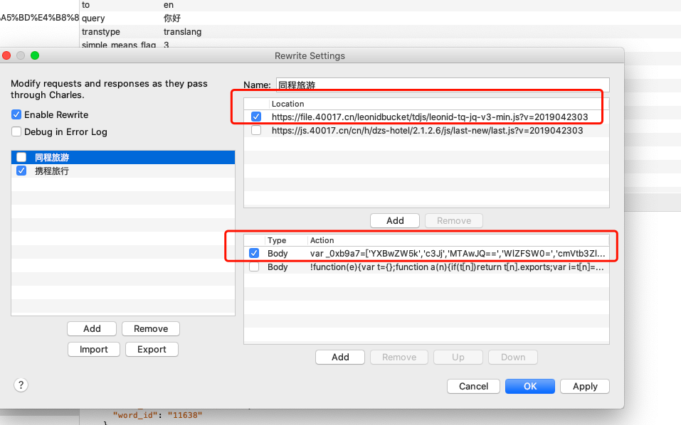  
> 注意，我们修改js文件的时候，不要重新排版。  

刷新网页，如图，debugger消失  
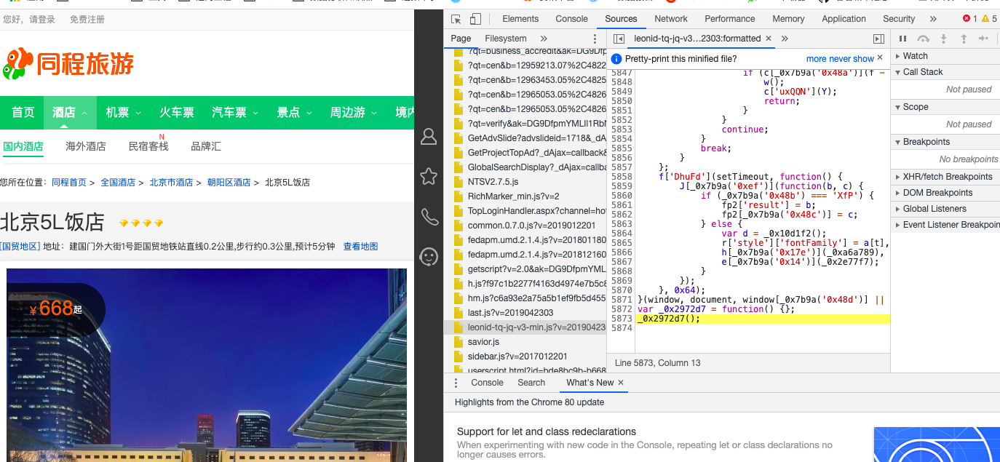  

# 步入正题，破解房间价格api中的antitoken参数  
房价的API请求的body有个antitoken的加密参数。
```text
HotelId: 40101019
ComeDate: 2020-04-15
LeaveDate: 2020-04-16
antitoken: 80202fd467c628ef4ebfe956ae9b3b9f
ptUse: 1
sug_act_info: 
trace_token: 
search_entrance_id: tpc_home
```
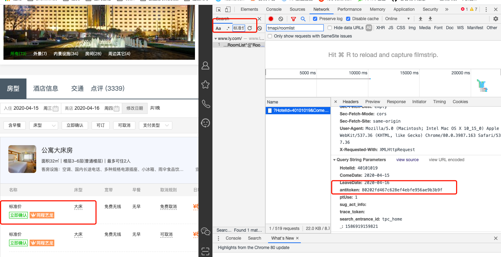  

通过关键字搜索函数位置   

  
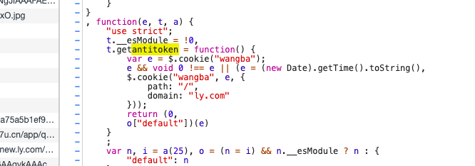  
```javascript
t.getantitoken = function() {
        var e = $.cookie("wangba");
        e && void 0 !== e || (e = (new Date).getTime().toString(),
        $.cookie("wangba", e, {
            path: "/",
            domain: "ly.com"
        }));
        return (0,
        o["default"])(e)
    }
```  
分析以上函数，我们得知e是从cookie 中取的。迷惑参数之what is wangba？王八or网吧  
e不存在时，赋值为 (new Date).getTime().toString()也就是当前时间戳  
接下来，我们就在e这里打个断点，追踪函数一步步运行的位置。
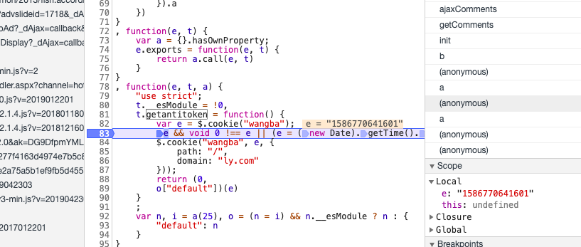  

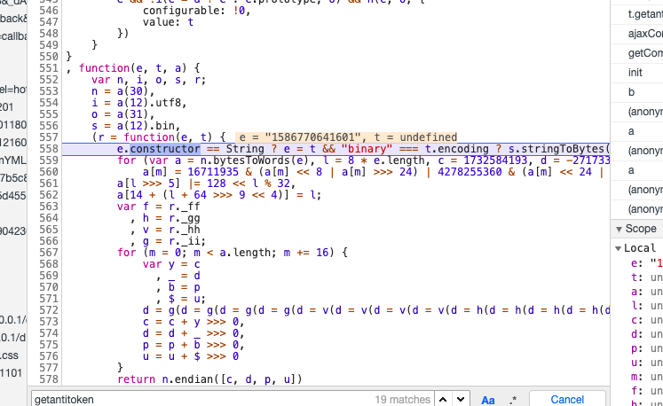
通过分析，我们来到了真正的实现函数了  
```javascript
function(e, t, a) {
    var n, i, o, s, r;
    n = a(30),
    i = a(12).utf8,
    o = a(31),
    s = a(12).bin,
    (r = function(e, t) {
        e.constructor == String ? e = t && "binary" === t.encoding ? s.stringToBytes(e) : i.stringToBytes(e) : o(e) ? e = Array.prototype.slice.call(e, 0) : Array.isArray(e) || (e = e.toString());
        for (var a = n.bytesToWords(e), l = 8 * e.length, c = 1732584193, d = -271733879, p = -1732584194, u = 271733878, m = 0; m < a.length; m++)
            a[m] = 16711935 & (a[m] << 8 | a[m] >>> 24) | 4278255360 & (a[m] << 24 | a[m] >>> 8);
        a[l >>> 5] |= 128 << l % 32,
        a[14 + (l + 64 >>> 9 << 4)] = l;
        var f = r._ff
          , h = r._gg
          , v = r._hh
          , g = r._ii;
        for (m = 0; m < a.length; m += 16) {
            var y = c
              , _ = d
              , b = p
              , $ = u;
            d = g(d = g(d = g(d = g(d = v(d = v(d = v(d = v(d = h(d = h(d = h(d = h(d = f(d = f(d = f(d = f(d, p = f(p, u = f(u, c = f(c, d, p, u, a[m + 0], 7, -680876936), d, p, a[m + 1], 12, -389564586), c, d, a[m + 2], 17, 606105819), u, c, a[m + 3], 22, -1044525330), p = f(p, u = f(u, c = f(c, d, p, u, a[m + 4], 7, -176418897), d, p, a[m + 5], 12, 1200080426), c, d, a[m + 6], 17, -1473231341), u, c, a[m + 7], 22, -45705983), p = f(p, u = f(u, c = f(c, d, p, u, a[m + 8], 7, 1770035416), d, p, a[m + 9], 12, -1958414417), c, d, a[m + 10], 17, -42063), u, c, a[m + 11], 22, -1990404162), p = f(p, u = f(u, c = f(c, d, p, u, a[m + 12], 7, 1804603682), d, p, a[m + 13], 12, -40341101), c, d, a[m + 14], 17, -1502002290), u, c, a[m + 15], 22, 1236535329), p = h(p, u = h(u, c = h(c, d, p, u, a[m + 1], 5, -165796510), d, p, a[m + 6], 9, -1069501632), c, d, a[m + 11], 14, 643717713), u, c, a[m + 0], 20, -373897302), p = h(p, u = h(u, c = h(c, d, p, u, a[m + 5], 5, -701558691), d, p, a[m + 10], 9, 38016083), c, d, a[m + 15], 14, -660478335), u, c, a[m + 4], 20, -405537848), p = h(p, u = h(u, c = h(c, d, p, u, a[m + 9], 5, 568446438), d, p, a[m + 14], 9, -1019803690), c, d, a[m + 3], 14, -187363961), u, c, a[m + 8], 20, 1163531501), p = h(p, u = h(u, c = h(c, d, p, u, a[m + 13], 5, -1444681467), d, p, a[m + 2], 9, -51403784), c, d, a[m + 7], 14, 1735328473), u, c, a[m + 12], 20, -1926607734), p = v(p, u = v(u, c = v(c, d, p, u, a[m + 5], 4, -378558), d, p, a[m + 8], 11, -2022574463), c, d, a[m + 11], 16, 1839030562), u, c, a[m + 14], 23, -35309556), p = v(p, u = v(u, c = v(c, d, p, u, a[m + 1], 4, -1530992060), d, p, a[m + 4], 11, 1272893353), c, d, a[m + 7], 16, -155497632), u, c, a[m + 10], 23, -1094730640), p = v(p, u = v(u, c = v(c, d, p, u, a[m + 13], 4, 681279174), d, p, a[m + 0], 11, -358537222), c, d, a[m + 3], 16, -722521979), u, c, a[m + 6], 23, 76029189), p = v(p, u = v(u, c = v(c, d, p, u, a[m + 9], 4, -640364487), d, p, a[m + 12], 11, -421815835), c, d, a[m + 15], 16, 530742520), u, c, a[m + 2], 23, -995338651), p = g(p, u = g(u, c = g(c, d, p, u, a[m + 0], 6, -198630844), d, p, a[m + 7], 10, 1126891415), c, d, a[m + 14], 15, -1416354905), u, c, a[m + 5], 21, -57434055), p = g(p, u = g(u, c = g(c, d, p, u, a[m + 12], 6, 1700485571), d, p, a[m + 3], 10, -1894986606), c, d, a[m + 10], 15, -1051523), u, c, a[m + 1], 21, -2054922799), p = g(p, u = g(u, c = g(c, d, p, u, a[m + 8], 6, 1873313359), d, p, a[m + 15], 10, -30611744), c, d, a[m + 6], 15, -1560198380), u, c, a[m + 13], 21, 1309151649), p = g(p, u = g(u, c = g(c, d, p, u, a[m + 4], 6, -145523070), d, p, a[m + 11], 10, -1120210379), c, d, a[m + 2], 15, 718787259), u, c, a[m + 9], 21, -343485551),
            c = c + y >>> 0,
            d = d + _ >>> 0,
            p = p + b >>> 0,
            u = u + $ >>> 0
        }
        return n.endian([c, d, p, u])
    }
    )._ff = function(e, t, a, n, i, o, s) {
        var r = e + (t & a | ~t & n) + (i >>> 0) + s;
        return (r << o | r >>> 32 - o) + t
    }
    ,
    r._gg = function(e, t, a, n, i, o, s) {
        var r = e + (t & n | a & ~n) + (i >>> 0) + s;
        return (r << o | r >>> 32 - o) + t
    }
    ,
    r._hh = function(e, t, a, n, i, o, s) {
        var r = e + (t ^ a ^ n) + (i >>> 0) + s;
        return (r << o | r >>> 32 - o) + t
    }
    ,
    r._ii = function(e, t, a, n, i, o, s) {
        var r = e + (a ^ (t | ~n)) + (i >>> 0) + s;
        return (r << o | r >>> 32 - o) + t
    }
    ,
    r._blocksize = 16,
    r._digestsize = 16,
    e.exports = function(e, t) {
        if (e === undefined || null === e)
            throw new Error("Illegal argument " + e);
        var a = n.wordsToBytes(r(e, t));
        return t && t.asBytes ? a : t && t.asString ? s.bytesToString(a) : n.bytesToHex(a)
    }
}
```  
观察上面函数，我们发现
n = a(30), 这个a(30)是什么东西呢?我们在此处打个断点,在控制台打印看一下  
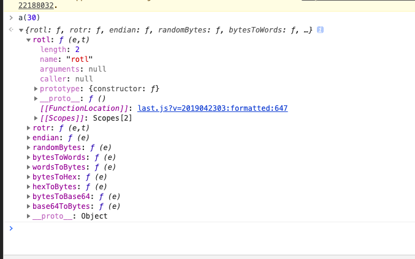  
```javascript
a(30) = {
        rotl: function(e, t) {
            return e << t | e >>> 32 - t
        },
        rotr: function(e, t) {
            return e << 32 - t | e >>> t
        },
        endian: function(e) {
            if (e.constructor == Number)
                return 16711935 & n.rotl(e, 8) | 4278255360 & n.rotl(e, 24);
            for (var t = 0; t < e.length; t++)
                e[t] = n.endian(e[t]);
            return e
        },
        randomBytes: function(e) {
            for (var t = []; e > 0; e--)
                t.push(Math.floor(256 * Math.random()));
            return t
        },
        bytesToWords: function(e) {
            for (var t = [], a = 0, n = 0; a < e.length; a++,
            n += 8)
                t[n >>> 5] |= e[a] << 24 - n % 32;
            return t
        },
        wordsToBytes: function(e) {
            for (var t = [], a = 0; a < 32 * e.length; a += 8)
                t.push(e[a >>> 5] >>> 24 - a % 32 & 255);
            return t
        },
        bytesToHex: function(e) {
            for (var t = [], a = 0; a < e.length; a++)
                t.push((e[a] >>> 4).toString(16)),
                t.push((15 & e[a]).toString(16));
            return t.join("")
        },
        hexToBytes: function(e) {
            for (var t = [], a = 0; a < e.length; a += 2)
                t.push(parseInt(e.substr(a, 2), 16));
            return t
        },
        bytesToBase64: function(e) {
            for (var t = [], n = 0; n < e.length; n += 3)
                for (var i = e[n] << 16 | e[n + 1] << 8 | e[n + 2], o = 0; o < 4; o++)
                    8 * n + 6 * o <= 8 * e.length ? t.push(a.charAt(i >>> 6 * (3 - o) & 63)) : t.push("=");
            return t.join("")
        },
        base64ToBytes: function(e) {
            e = e.replace(/[^A-Z0-9+\/]/gi, "");
            for (var t = [], n = 0, i = 0; n < e.length; i = ++n % 4)
                0 != i && t.push((a.indexOf(e.charAt(n - 1)) & Math.pow(2, -2 * i + 8) - 1) << 2 * i | a.indexOf(e.charAt(n)) >>> 6 - 2 * i);
            return t
        }
    }
```   
接下来，我们看a(12),和上面一样，打断点  
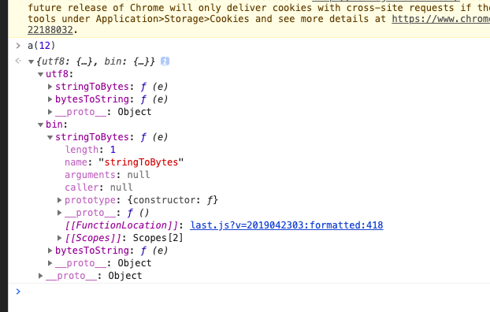  
```javascript
a(12) = {
        utf8: {
            stringToBytes: function(e) {
                return a.bin.stringToBytes(unescape(encodeURIComponent(e)))
            },
            bytesToString: function(e) {
                return decodeURIComponent(escape(a.bin.bytesToString(e)))
            }
        },
        bin: {
            stringToBytes: function(e) {
                for (var t = [], a = 0; a < e.length; a++)
                    t.push(255 & e.charCodeAt(a));
                return t
            },
            bytesToString: function(e) {
                for (var t = [], a = 0; a < e.length; a++)
                    t.push(String.fromCharCode(e[a]));
                return t.join("")
            }
        }
    };
```  
接下来，我们看a(31)  
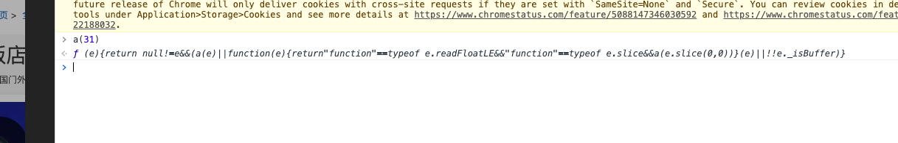  
```javascript
return null != e && (a(e) || function(e) {
            return "function" == typeof e.readFloatLE && "function" == typeof e.slice && a(e.slice(0, 0))
        }(e) || !!e._isBuffer)  
```
我们可以直接简写a(31) = null  
最后，我们发现还有个t变量，我们接着调试一下  
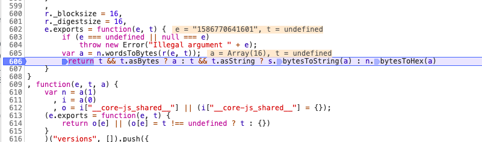  

我们可以看到,t是undefined  

这几个变量我们都拿到了，接下来，我们重写下实现函数  
```javascript
var e = (new Date).getTime().toString();
function getAntitoken(e) {
    var n, i, o, s, r;
    var t = undefined;
    var a12 = {
        utf8: {
            stringToBytes: function (e) {
                return a12.bin.stringToBytes(unescape(encodeURIComponent(e)))
            },
            bytesToString: function (e) {
                return decodeURIComponent(escape(a12.bin.bytesToString(e)))
            }
        },
        bin: {
            stringToBytes: function (e) {
                for (var t = [], a = 0; a < e.length; a++)
                    t.push(255 & e.charCodeAt(a));
                return t
            },
            bytesToString: function (e) {
                for (var t = [], a = 0; a < e.length; a++)
                    t.push(String.fromCharCode(e[a]));
                return t.join("")
            }
        }
    };

    i = a12.utf8;
    s = a12.bin;
    o = null;
    n = {
        rotl: function (e, t) {
            return e << t | e >>> 32 - t
        },
        rotr: function (e, t) {
            return e << 32 - t | e >>> t
        },
        endian: function (e) {
            if (e.constructor == Number)
                return 16711935 & n.rotl(e, 8) | 4278255360 & n.rotl(e, 24);
            for (var t = 0; t < e.length; t++)
                e[t] = n.endian(e[t]);
            return e
        },
        randomBytes: function (e) {
            for (var t = []; e > 0; e--)
                t.push(Math.floor(256 * Math.random()));
            return t
        },
        bytesToWords: function (e) {
            for (var t = [], a = 0, n = 0; a < e.length; a++,
                n += 8)
                t[n >>> 5] |= e[a] << 24 - n % 32;
            return t
        },
        wordsToBytes: function (e) {
            for (var t = [], a = 0; a < 32 * e.length; a += 8)
                t.push(e[a >>> 5] >>> 24 - a % 32 & 255);
            return t
        },
        bytesToHex: function (e) {
            for (var t = [], a = 0; a < e.length; a++)
                t.push((e[a] >>> 4).toString(16)),
                    t.push((15 & e[a]).toString(16));
            return t.join("")
        },
        hexToBytes: function (e) {
            for (var t = [], a = 0; a < e.length; a += 2)
                t.push(parseInt(e.substr(a, 2), 16));
            return t
        },
        bytesToBase64: function (e) {
            for (var t = [], n = 0; n < e.length; n += 3)
                for (var i = e[n] << 16 | e[n + 1] << 8 | e[n + 2], o = 0; o < 4; o++)
                    8 * n + 6 * o <= 8 * e.length ? t.push(a.charAt(i >>> 6 * (3 - o) & 63)) : t.push("=");
            return t.join("")
        },
        base64ToBytes: function (e) {
            e = e.replace(/[^A-Z0-9+\/]/gi, "");
            for (var t = [], n = 0, i = 0; n < e.length; i = ++n % 4)
                0 != i && t.push((a.indexOf(e.charAt(n - 1)) & Math.pow(2, -2 * i + 8) - 1) << 2 * i | a.indexOf(e.charAt(n)) >>> 6 - 2 * i);
            return t
        }
    };
    (r = function (e, t) {
            e.constructor == String ? e = t && "binary" === t.encoding ? s.stringToBytes(e) : i.stringToBytes(e) : o(e) ? e = Array.prototype.slice.call(e, 0) : Array.isArray(e) || (e = e.toString());
            for (var a = n.bytesToWords(e), l = 8 * e.length, c = 1732584193, d = -271733879, p = -1732584194, u = 271733878, m = 0; m < a.length; m++)
                a[m] = 16711935 & (a[m] << 8 | a[m] >>> 24) | 4278255360 & (a[m] << 24 | a[m] >>> 8);
            a[l >>> 5] |= 128 << l % 32,
                a[14 + (l + 64 >>> 9 << 4)] = l;
            var f = r._ff
                , h = r._gg
                , v = r._hh
                , g = r._ii;
            for (m = 0; m < a.length; m += 16) {
                var y = c
                    , _ = d
                    , b = p
                    , $ = u;
                d = g(d = g(d = g(d = g(d = v(d = v(d = v(d = v(d = h(d = h(d = h(d = h(d = f(d = f(d = f(d = f(d, p = f(p, u = f(u, c = f(c, d, p, u, a[m + 0], 7, -680876936), d, p, a[m + 1], 12, -389564586), c, d, a[m + 2], 17, 606105819), u, c, a[m + 3], 22, -1044525330), p = f(p, u = f(u, c = f(c, d, p, u, a[m + 4], 7, -176418897), d, p, a[m + 5], 12, 1200080426), c, d, a[m + 6], 17, -1473231341), u, c, a[m + 7], 22, -45705983), p = f(p, u = f(u, c = f(c, d, p, u, a[m + 8], 7, 1770035416), d, p, a[m + 9], 12, -1958414417), c, d, a[m + 10], 17, -42063), u, c, a[m + 11], 22, -1990404162), p = f(p, u = f(u, c = f(c, d, p, u, a[m + 12], 7, 1804603682), d, p, a[m + 13], 12, -40341101), c, d, a[m + 14], 17, -1502002290), u, c, a[m + 15], 22, 1236535329), p = h(p, u = h(u, c = h(c, d, p, u, a[m + 1], 5, -165796510), d, p, a[m + 6], 9, -1069501632), c, d, a[m + 11], 14, 643717713), u, c, a[m + 0], 20, -373897302), p = h(p, u = h(u, c = h(c, d, p, u, a[m + 5], 5, -701558691), d, p, a[m + 10], 9, 38016083), c, d, a[m + 15], 14, -660478335), u, c, a[m + 4], 20, -405537848), p = h(p, u = h(u, c = h(c, d, p, u, a[m + 9], 5, 568446438), d, p, a[m + 14], 9, -1019803690), c, d, a[m + 3], 14, -187363961), u, c, a[m + 8], 20, 1163531501), p = h(p, u = h(u, c = h(c, d, p, u, a[m + 13], 5, -1444681467), d, p, a[m + 2], 9, -51403784), c, d, a[m + 7], 14, 1735328473), u, c, a[m + 12], 20, -1926607734), p = v(p, u = v(u, c = v(c, d, p, u, a[m + 5], 4, -378558), d, p, a[m + 8], 11, -2022574463), c, d, a[m + 11], 16, 1839030562), u, c, a[m + 14], 23, -35309556), p = v(p, u = v(u, c = v(c, d, p, u, a[m + 1], 4, -1530992060), d, p, a[m + 4], 11, 1272893353), c, d, a[m + 7], 16, -155497632), u, c, a[m + 10], 23, -1094730640), p = v(p, u = v(u, c = v(c, d, p, u, a[m + 13], 4, 681279174), d, p, a[m + 0], 11, -358537222), c, d, a[m + 3], 16, -722521979), u, c, a[m + 6], 23, 76029189), p = v(p, u = v(u, c = v(c, d, p, u, a[m + 9], 4, -640364487), d, p, a[m + 12], 11, -421815835), c, d, a[m + 15], 16, 530742520), u, c, a[m + 2], 23, -995338651), p = g(p, u = g(u, c = g(c, d, p, u, a[m + 0], 6, -198630844), d, p, a[m + 7], 10, 1126891415), c, d, a[m + 14], 15, -1416354905), u, c, a[m + 5], 21, -57434055), p = g(p, u = g(u, c = g(c, d, p, u, a[m + 12], 6, 1700485571), d, p, a[m + 3], 10, -1894986606), c, d, a[m + 10], 15, -1051523), u, c, a[m + 1], 21, -2054922799), p = g(p, u = g(u, c = g(c, d, p, u, a[m + 8], 6, 1873313359), d, p, a[m + 15], 10, -30611744), c, d, a[m + 6], 15, -1560198380), u, c, a[m + 13], 21, 1309151649), p = g(p, u = g(u, c = g(c, d, p, u, a[m + 4], 6, -145523070), d, p, a[m + 11], 10, -1120210379), c, d, a[m + 2], 15, 718787259), u, c, a[m + 9], 21, -343485551),
                    c = c + y >>> 0,
                    d = d + _ >>> 0,
                    p = p + b >>> 0,
                    u = u + $ >>> 0
            }
            return n.endian([c, d, p, u])
        }
    )._ff = function (e, t, a, n, i, o, s) {
        var r = e + (t & a | ~t & n) + (i >>> 0) + s;
        return (r << o | r >>> 32 - o) + t
    }
        ,
        r._gg = function (e, t, a, n, i, o, s) {
            var r = e + (t & n | a & ~n) + (i >>> 0) + s;
            return (r << o | r >>> 32 - o) + t
        }
        ,
        r._hh = function (e, t, a, n, i, o, s) {
            var r = e + (t ^ a ^ n) + (i >>> 0) + s;
            return (r << o | r >>> 32 - o) + t
        }
        ,
        r._ii = function (e, t, a, n, i, o, s) {
            var r = e + (a ^ (t | ~n)) + (i >>> 0) + s;
            return (r << o | r >>> 32 - o) + t
        }
        ,
        r._blocksize = 16,
        r._digestsize = 16;

        var a = n.wordsToBytes(r(e, t));
        return t && t.asBytes ? a : t && t.asString ? s.bytesToString(a) : n.bytesToHex(a)

}
```  
接下来， 我们运行一下验证准确性  
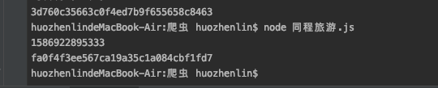  
  
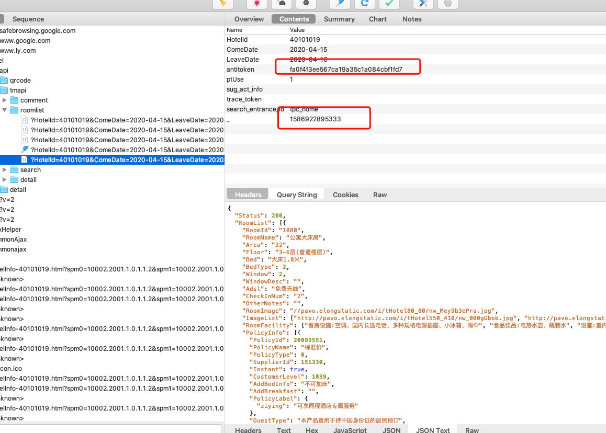  

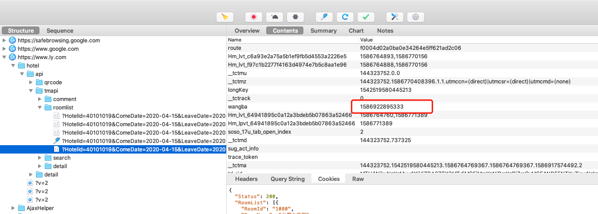

