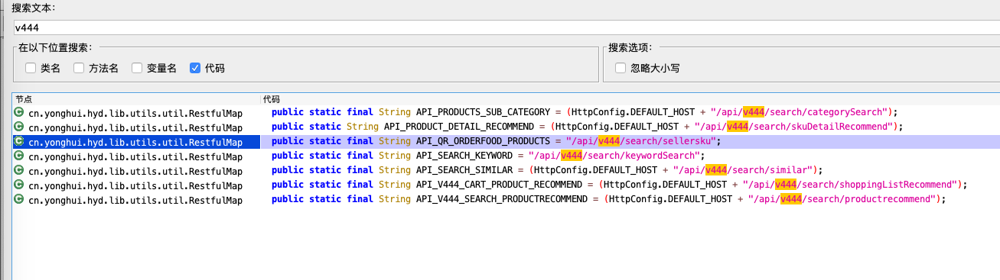

# 前言  
前言经过一系列对安卓apk的反编译，我们已经熟悉了对java层方法的追踪及hook，下面，我们开始学习native层方法的hook  

# 关键方法定位及分析  
通过抓包发现，我们发现永辉生活的商品请求是通过这个api获取数据的。其中，包含了一个加密参数sign  
通过关键字sign的跟踪，我们来到了signParams方法，发现它是通过调用一个名为signParamsNative的native函数来生成加密参数sign的。
    

   

  

    

# hook加密函数  
首先，这个函数是这样子的.该方法接收一个string类型的参数，这时候，我们静态分析不知道它的值究竟是什么样子的，所以，我们可以选择smali动态
调试或者frida进行hook。我使用的是frida
```javascript
 public static String signParams(String str) {
        return signParamsNative(str.getBytes());
    }
```  

  
```text
传入参数：
abdata{"rank":"6|-1|1|-1|-1|2"}aggregation1categoryid10006440categorylevel1channelofficialcityid13deviceid3befbf41-efae-430a-a617-176e1b197a3fdistinctId388e815581f99642lat22.539744lng113.948386order1ordertype0page0pickself0platformAndroidsellerid6shopid9I17timestamp1591066297151v5.35.0.35
输出结果：
bc022b5e7a763eb95457c5aff6113057  
```
观察输出结果，我们发现它是一个32位长度的字符串，既然是32位的，那么，我们猜想signParmsNative函数内部是不是
只对它进行了md5处理呢？  

为了验证我们的猜想，我们打开ida 对加载的so库进行反编译看下  

在ida导出函数窗体中，我们发现，它导出了md5的一些方法还有一个signParamsNative函数


我们双击signParamsNative函数,并且f5之后看看它的c伪代码。  

  

观察以上方法实现过程，我们发现，它确实就是用了md5对传入的参数进行了单向加密，只不过，
在加密之前，用了YONGHUI601933在头部进行了拼接。  

# 总结  
永辉生活v5.35.0.35.0这个版本安全性不高，其sign参数仅仅通过md5进行了单向加密，未用自写算法，对于逆向人员来讲，大大减少了逆向周期。
同时，为了提升软件的安全性，市面上绝大部分软件都会一些敏感的加密算法写在了native方法中，这样子做，增加了一个逆向的难度，要学逆向，
首先得学汇编，让许多人望而却步，正因为如此，逆向工作也越来越有挑战性。  

   


