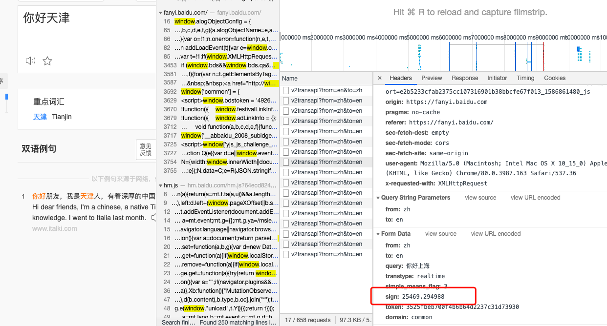
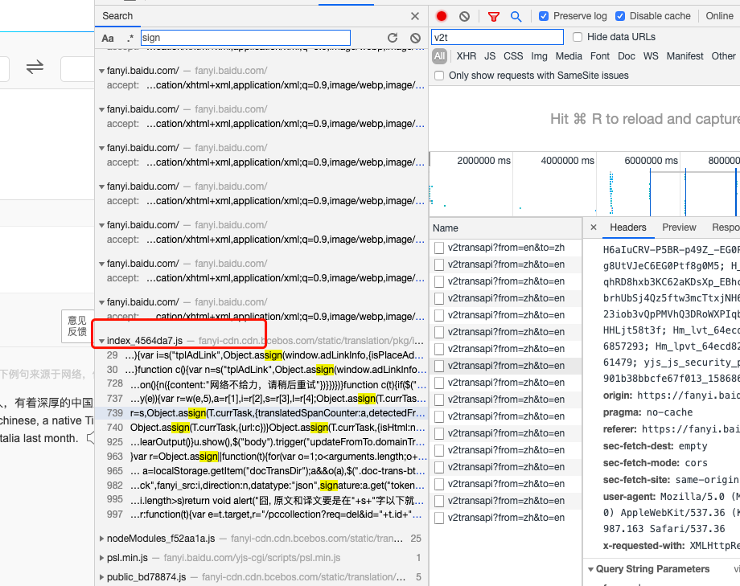
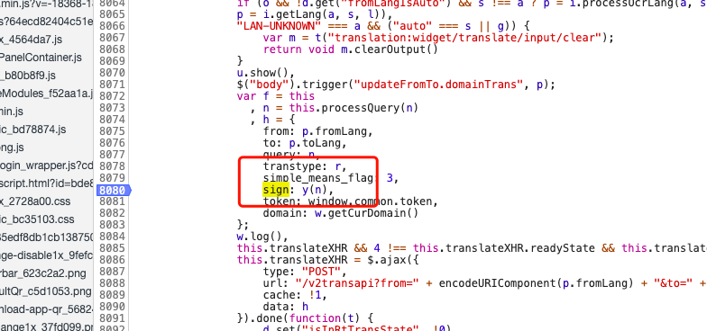
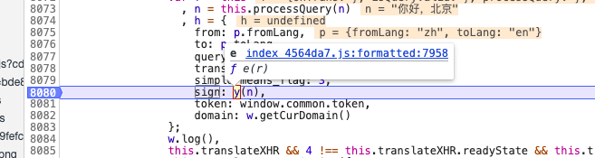
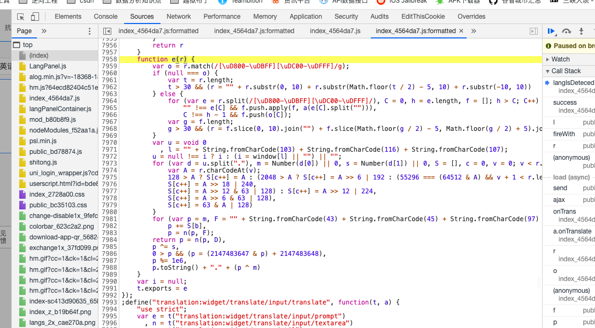
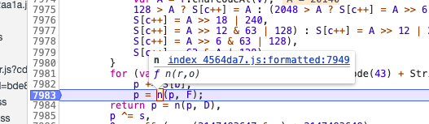
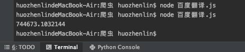
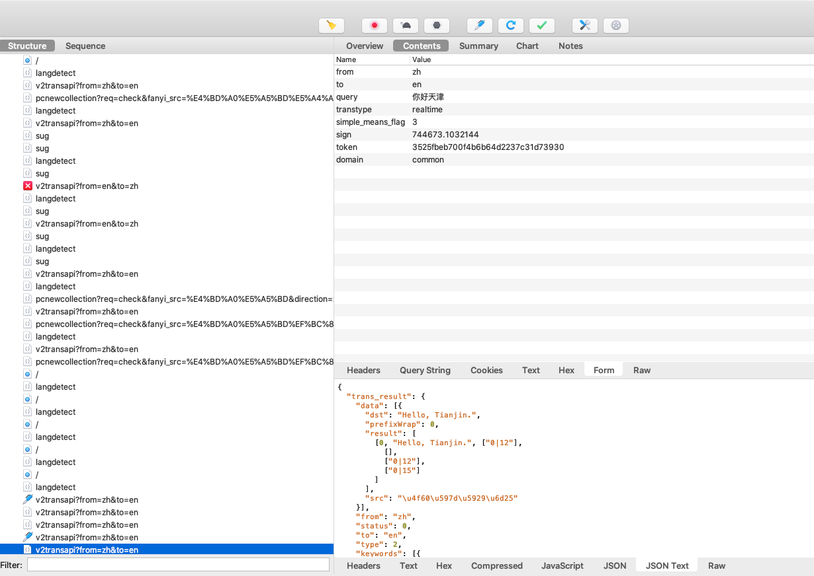

对于断点调试，前面的文章我们已经拿同程旅行练习过了，可以查看文章[同城旅游](同程旅游.md)。
接下来，为了巩固基础，我们再去找一个带token或者sign的网站锻炼一下。  
* 目标网站:[百度翻译](www.fanyi.baidu.com)  
* 目标参数: sign  

  

通过关键字查找，我们大概定位了sign函数生成的js位置  
    
  
可见，sign = y(n), 看函数，我们知道，n就是我们输入的字符, 那么，y(n)是什么东西呢，
断点，查看y(n)的实现过程  
  

  

目前，我们拿到y(n)的函数了,如下

```javascript
function e(r) {
        var o = r.match(/[\uD800-\uDBFF][\uDC00-\uDFFF]/g);
        if (null === o) {
            var t = r.length;
            t > 30 && (r = "" + r.substr(0, 10) + r.substr(Math.floor(t / 2) - 5, 10) + r.substr(-10, 10))
        } else {
            for (var e = r.split(/[\uD800-\uDBFF][\uDC00-\uDFFF]/), C = 0, h = e.length, f = []; h > C; C++)
                "" !== e[C] && f.push.apply(f, a(e[C].split(""))),
                C !== h - 1 && f.push(o[C]);
            var g = f.length;
            g > 30 && (r = f.slice(0, 10).join("") + f.slice(Math.floor(g / 2) - 5, Math.floor(g / 2) + 5).join("") + f.slice(-10).join(""))
        }
        var u = void 0
          , l = "" + String.fromCharCode(103) + String.fromCharCode(116) + String.fromCharCode(107);
        u = null !== i ? i : (i = window[l] || "") || "";
        for (var d = u.split("."), m = Number(d[0]) || 0, s = Number(d[1]) || 0, S = [], c = 0, v = 0; v < r.length; v++) {
            var A = r.charCodeAt(v);
            128 > A ? S[c++] = A : (2048 > A ? S[c++] = A >> 6 | 192 : (55296 === (64512 & A) && v + 1 < r.length && 56320 === (64512 & r.charCodeAt(v + 1)) ? (A = 65536 + ((1023 & A) << 10) + (1023 & r.charCodeAt(++v)),
            S[c++] = A >> 18 | 240,
            S[c++] = A >> 12 & 63 | 128) : S[c++] = A >> 12 | 224,
            S[c++] = A >> 6 & 63 | 128),
            S[c++] = 63 & A | 128)
        }
        for (var p = m, F = "" + String.fromCharCode(43) + String.fromCharCode(45) + String.fromCharCode(97) + ("" + String.fromCharCode(94) + String.fromCharCode(43) + String.fromCharCode(54)), D = "" + String.fromCharCode(43) + String.fromCharCode(45) + String.fromCharCode(51) + ("" + String.fromCharCode(94) + String.fromCharCode(43) + String.fromCharCode(98)) + ("" + String.fromCharCode(43) + String.fromCharCode(45) + String.fromCharCode(102)), b = 0; b < S.length; b++)
            p += S[b],
            p = n(p, F);
        return p = n(p, D),
        p ^= s,
        0 > p && (p = (2147483647 & p) + 2147483648),
        p %= 1e6,
        p.toString() + "." + (p ^ m)
    }
```    
分析函数，我们发现里面有个未知变量<b>n</b>  
```javascript
return p = n(p, D)
```  
接下来，我们继续在n这里断点  
  

  

```javascript
function n(r, o) {
        for (var t = 0; t < o.length - 2; t += 3) {
            var a = o.charAt(t + 2);
            a = a >= "a" ? a.charCodeAt(0) - 87 : Number(a),
            a = "+" === o.charAt(t + 1) ? r >>> a : r << a,
            r = "+" === o.charAt(t) ? r + a & 4294967295 : r ^ a
        }
        return r
    }
```    
分析上面这个n函数，我们发现里面无未知变量，好，接下来，我们依靠现有的已知变量，尝试
还原下y(n)这个函数  
```javascript
function n(r, o) {
        for (var t = 0; t < o.length - 2; t += 3) {
            var a = o.charAt(t + 2);
            a = a >= "a" ? a.charCodeAt(0) - 87 : Number(a),
            a = "+" === o.charAt(t + 1) ? r >>> a : r << a,
            r = "+" === o.charAt(t) ? r + a & 4294967295 : r ^ a
        }
        return r
    }
    
function a(r){
    var i = "320305.131321201"
    var o = r.match(/[\uD800-\uDBFF][\uDC00-\uDFFF]/g);
        if (null === o) {
            var t = r.length;
            t > 30 && (r = "" + r.substr(0, 10) + r.substr(Math.floor(t / 2) - 5, 10) + r.substr(-10, 10))
        } else {
            for (var e = r.split(/[\uD800-\uDBFF][\uDC00-\uDFFF]/), C = 0, h = e.length, f = []; h > C; C++)
                "" !== e[C] && f.push.apply(f, a(e[C].split(""))),
                C !== h - 1 && f.push(o[C]);
            var g = f.length;
            g > 30 && (r = f.slice(0, 10).join("") + f.slice(Math.floor(g / 2) - 5, Math.floor(g / 2) + 5).join("") + f.slice(-10).join(""))
        }
        var u = void 0
          , l = "" + String.fromCharCode(103) + String.fromCharCode(116) + String.fromCharCode(107);
        u = null !== i ? i : (i = window[l] || "") || "";
        for (var d = u.split("."), m = Number(d[0]) || 0, s = Number(d[1]) || 0, S = [], c = 0, v = 0; v < r.length; v++) {
            var A = r.charCodeAt(v);
            128 > A ? S[c++] = A : (2048 > A ? S[c++] = A >> 6 | 192 : (55296 === (64512 & A) && v + 1 < r.length && 56320 === (64512 & r.charCodeAt(v + 1)) ? (A = 65536 + ((1023 & A) << 10) + (1023 & r.charCodeAt(++v)),
            S[c++] = A >> 18 | 240,
            S[c++] = A >> 12 & 63 | 128) : S[c++] = A >> 12 | 224,
            S[c++] = A >> 6 & 63 | 128),
            S[c++] = 63 & A | 128)
        }
        for (var p = m, F = "" + String.fromCharCode(43) + String.fromCharCode(45) + String.fromCharCode(97) + ("" + String.fromCharCode(94) + String.fromCharCode(43) + String.fromCharCode(54)), D = "" + String.fromCharCode(43) + String.fromCharCode(45) + String.fromCharCode(51) + ("" + String.fromCharCode(94) + String.fromCharCode(43) + String.fromCharCode(98)) + ("" + String.fromCharCode(43) + String.fromCharCode(45) + String.fromCharCode(102)), b = 0; b < S.length; b++)
            p += S[b],
            p = n(p, F);
        return p = n(p, D),
        p ^= s,
        0 > p && (p = (2147483647 & p) + 2147483648),
        p %= 1e6,
        p.toString() + "." + (p ^ m)
}
console.log(a('你好天津'))
```  
# 测试结果  
我们将此函数放置console控制台或者用nodejs 运行一下，拿输出结果去请求，看下是否
能够正常请求。
   
  
  

测试结束，我们发现方法正常运行。  


