华为花粉俱乐部默认是不允许抓包的，设置代理后app将无法联网。好，我们反编译看下。  
# 反编译  
这里我们使用的工具叫jadx。将apk拖进软件即可完成反编译  
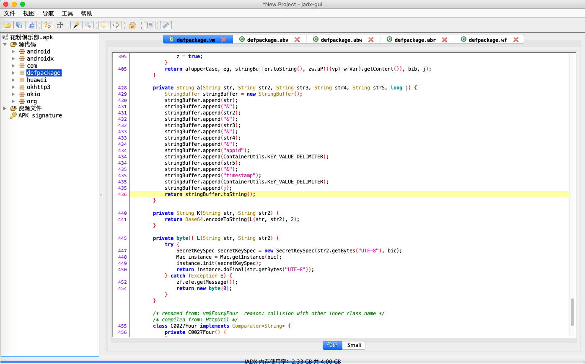  

一般情况，不允许抓包，都是证书校验，我们尝试搜索关键字trusted，ssl
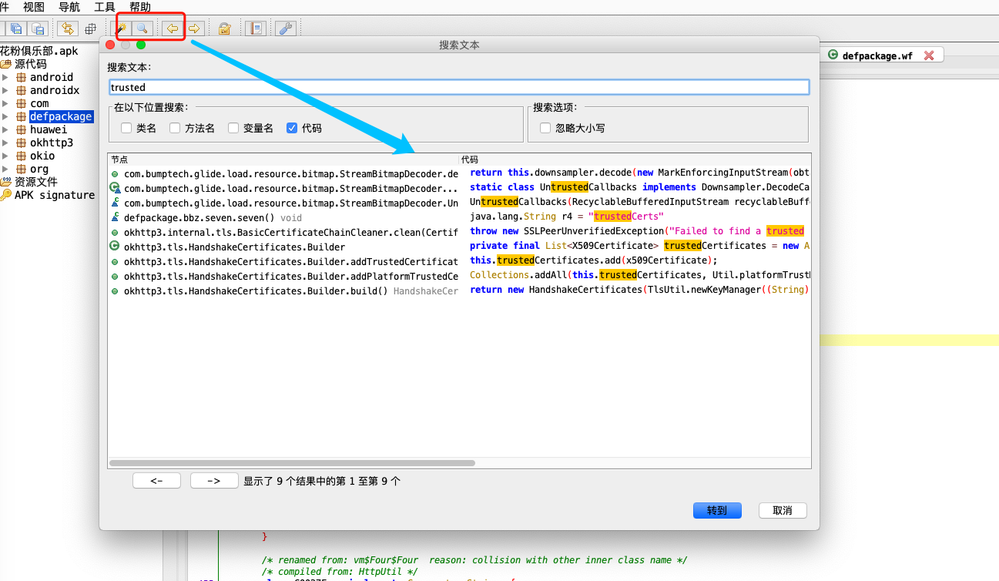  

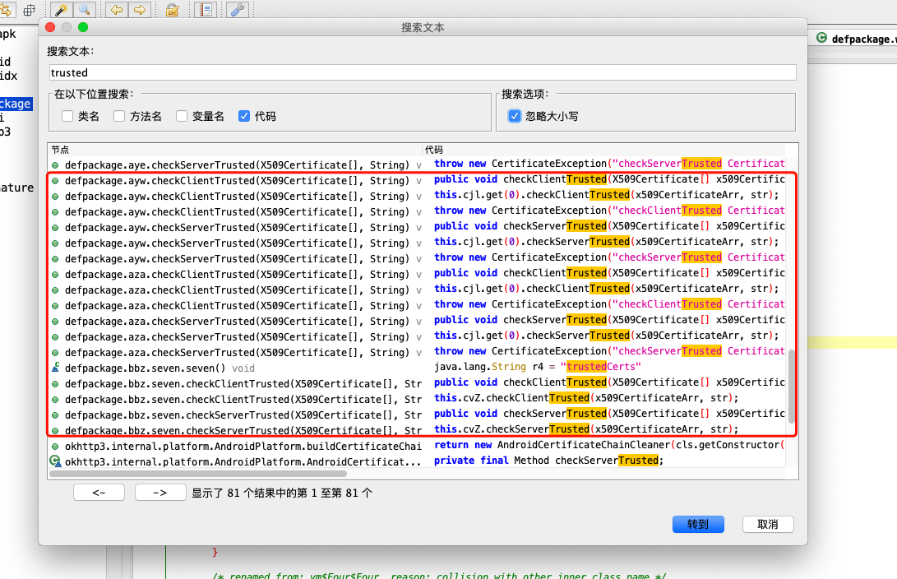  

观察以上，我们发现checkServerTrusted，checkClientTrusted是比较可疑的地方，我们进入详情看一下  

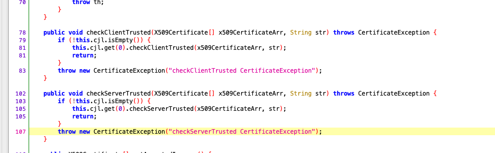  
```javascript
public void checkClientTrusted(X509Certificate[] x509CertificateArr, String str) throws CertificateException {
    if (!this.cjl.isEmpty()) {
        this.cjl.get(0).checkClientTrusted(x509CertificateArr, str);
        return;
    }
    throw new CertificateException("checkClientTrusted CertificateException");
}

public void checkServerTrusted(X509Certificate[] x509CertificateArr, String str) throws CertificateException {
    if (!this.cjl.isEmpty()) {
        this.cjl.get(0).checkServerTrusted(x509CertificateArr, str);
        return;
    }
    throw new CertificateException("checkServerTrusted CertificateException");
}
```  
这个方法可疑，我们可以尝试对所有类下的这个方法进行hook，直接返回，最终结果，我们定位到是aza这个类。
```python
# coding=utf-8
import frida
import sys

ip45 = frida.get_usb_device()
session = ip45.attach("com.huawei.fans")

jscode = """
Java.perform(function () {
    var HttpRequestEntity0 = Java.use('aza');//要hook的类名完整路径
    console.log("run script!");
    HttpRequestEntity0.checkServerTrusted.implementation = function (arg1, arg2) { // 重写要hook的方法getSign，当有多个重名函数时需要重载，function括号为函数的参数个数
        console.log('aza')
        return null
    };
});
"""

def on_message(message, data):
    print(message)


script = session.create_script(jscode)
script.on('message', on_message)
script.load()
sys.stdin.read()

``` 

# 正题，接口加密参数破解  
目前我们已经可以正常抓包了，如图
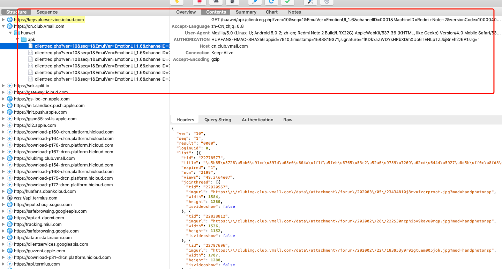  

在header中，我们发现了个比较头疼的参数，AUTHORIZATION。由3部分组成，分别是appid,timestamp,signature。
signature一看就是个认证参数，接下来，我们去代码里面找找这个参数是怎么生成的  

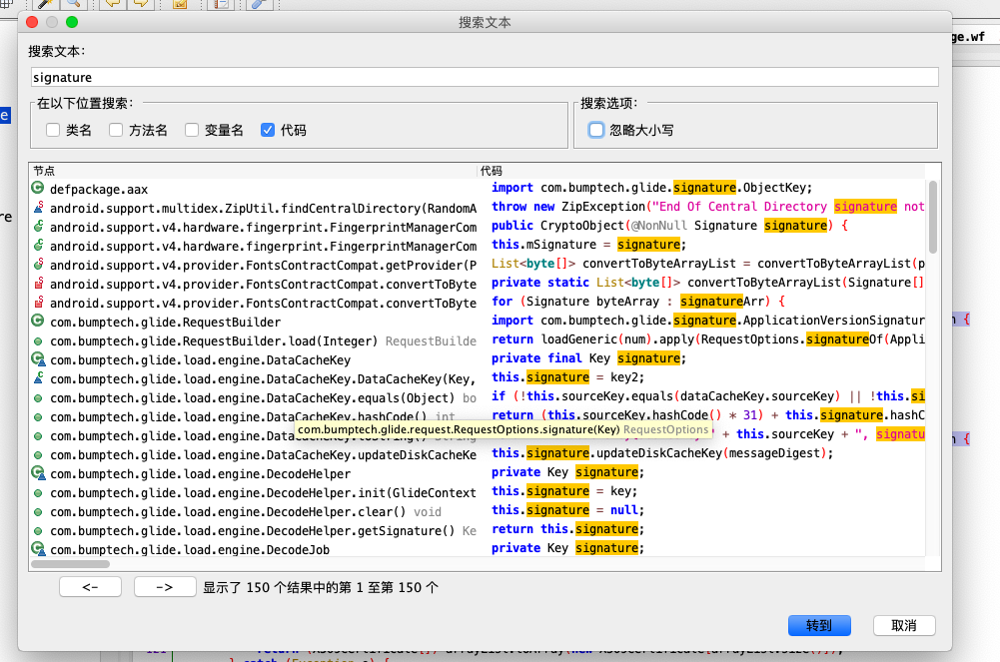  
在代码中查找关键字，太多了，不好找，我们有其他办法吗。不如去找下app的输出日志？  

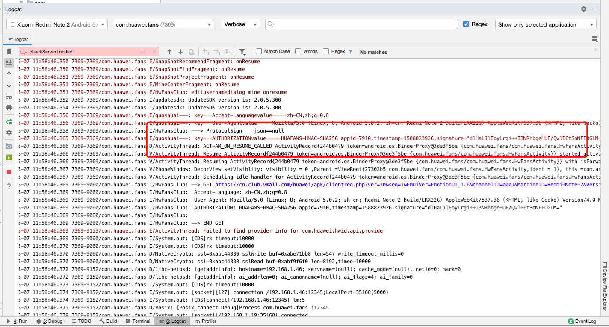  

  

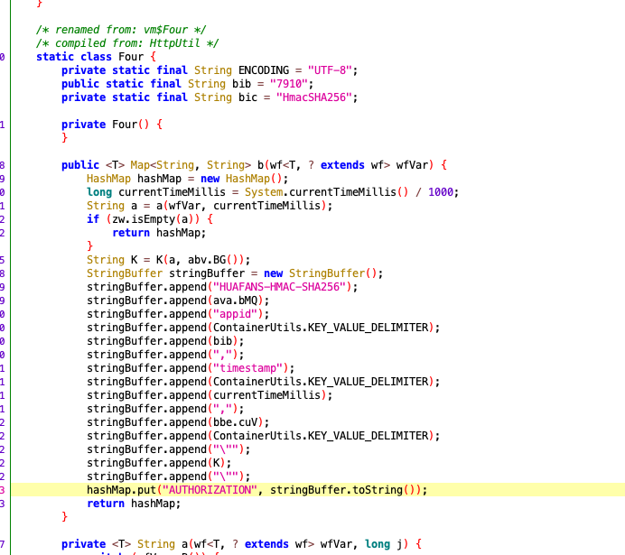  

```javascript
public <T> Map<String, String> b(wf<T, ? extends wf> wfVar) {
            HashMap hashMap = new HashMap();
            long currentTimeMillis = System.currentTimeMillis() / 1000;
            String a = a(wfVar, currentTimeMillis);
            if (zw.isEmpty(a)) {
                return hashMap;
            }
            String K = K(a, abv.BG());
            StringBuffer stringBuffer = new StringBuffer();
            stringBuffer.append("HUAFANS-HMAC-SHA256");
            stringBuffer.append(ava.bMQ);
            stringBuffer.append("appid");
            stringBuffer.append(ContainerUtils.KEY_VALUE_DELIMITER);
            stringBuffer.append(bib);
            stringBuffer.append(",");
            stringBuffer.append("timestamp");
            stringBuffer.append(ContainerUtils.KEY_VALUE_DELIMITER);
            stringBuffer.append(currentTimeMillis);
            stringBuffer.append(",");
            stringBuffer.append(bbe.cuV);
            stringBuffer.append(ContainerUtils.KEY_VALUE_DELIMITER);
            stringBuffer.append("\"");
            stringBuffer.append(K);
            stringBuffer.append("\"");
            hashMap.put("AUTHORIZATION", stringBuffer.toString());
            return hashMap;
        }

```  

现在，我们找到了认证的加密方法了，看代码，我们知道它的整个流程是这样子的  
建立一个hashmap集合，获取当前时间戳，新建一个stringbuffer，生成k值，stringbuffer一直append,
最后，返回hashmapp。里面有几个变量：ava.bMQ，ContainerUtils.KEY_VALUE_DELIMITER，bbe.cuV。
我们用jadx看一下  
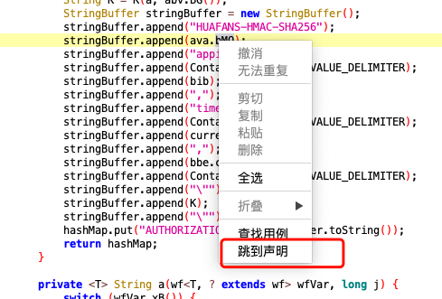    

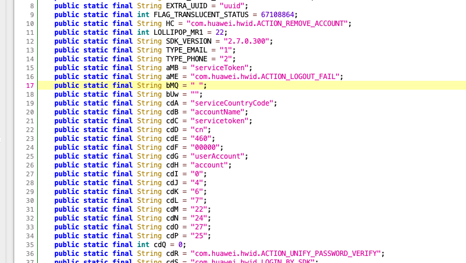  
可见，ava.bMQ == " ",同理，查看其他几个变量，ContainerUtils.KEY_VALUE_DELIMITER == "=",
bid == 7910。接下来，就剩下K了。  

分析一下这个K的生成过程  
```javascript
String K = K(a, abv.BG());
```
K是通过调用一个K函数，传入参数分别是a，abv.BG()  
这个a呢，生成过程是这样的,通过调用一个a函数，传入一个类和当前时间戳，看上去挺复杂的样子  
```javascript
String a = a(wfVar, currentTimeMillis);
```  
我们去看下这个wfvar的类长什么样子  
```javascript
package defpackage;

import android.text.TextUtils;
import com.huawei.fans.HwFansApplication;
import defpackage.wd;
import defpackage.wf;
import defpackage.xo;
import java.io.IOException;
import java.io.Serializable;
import java.util.List;
import java.util.Map;
import okhttp3.Call;
import okhttp3.OkHttpClient;
import okhttp3.Request;
import okhttp3.RequestBody;
import okhttp3.Response;

/* renamed from: wf  reason: default package */
/* compiled from: Request */
public abstract class wf<T, R extends wf> implements Serializable {
    private static final long serialVersionUID = -7174118653689916252L;
    protected String baseUrl;
    protected transient xj<T> bin;
    protected transient Request bit;
    protected transient vv<T> biu;
    protected transient wh<T> biv;
    protected transient xb<T> biw;
    protected transient wd.score bix;
    protected String cacheKey;
    protected wz cacheMode;
    protected long cacheTime;
    protected transient OkHttpClient client;
    protected xn headers = new xn();
    private vz mDefaultAuthPolicy;
    private boolean needSign = true;
    protected xo params = new xo();
    protected int retryCount;
    protected transient Object tag;
    protected String url;

    public abstract Request a(RequestBody requestBody);

    public abstract vk xB();

    /* access modifiers changed from: protected */
    public abstract RequestBody yb();

    public wf(String str) {
        this.url = str;
        this.baseUrl = str;
        vl xD = vl.xD();
        String yL = xn.yL();
        if (!TextUtils.isEmpty(yL)) {
            M(xn.bjM, yL);
        }
        String yM = xn.yM();
        if (!TextUtils.isEmpty(yM)) {
            M("User-Agent", yM);
        }
        if (xD.xJ() != null) {
            b(xD.xJ());
        }
        if (xD.xK() != null) {
            b(xD.xK());
        }
        M("Cookie", ng.W(HwFansApplication.jx(), nf.getServerUrl()));
        this.retryCount = xD.xG();
        this.cacheMode = xD.xH();
        this.cacheTime = xD.xI();
    }

    public void bP(boolean z) {
        this.needSign = z;
    }

    public R aJ(Object obj) {
        this.tag = obj;
        return this;
    }

    public R dS(int i) {
        if (i < 0) {
            throw new IllegalArgumentException("retryCount must > 0");
        }
        this.retryCount = i;
        return this;
    }

    public R c(OkHttpClient okHttpClient) {
        ym.checkNotNull(okHttpClient, "OkHttpClient == null");
        this.client = okHttpClient;
        return this;
    }

    public R a(vv<T> vvVar) {
        ym.checkNotNull(vvVar, "call == null");
        this.biu = vvVar;
        return this;
    }

    public R a(wh<T> whVar) {
        ym.checkNotNull(whVar, "converter == null");
        this.biv = whVar;
        return this;
    }

    public R b(wz wzVar) {
        this.cacheMode = wzVar;
        return this;
    }

    public R a(xb<T> xbVar) {
        ym.checkNotNull(xbVar, "cachePolicy == null");
        this.biw = xbVar;
        return this;
    }

    public R ep(String str) {
        ym.checkNotNull(str, "cacheKey == null");
        this.cacheKey = str;
        return this;
    }

    public R E(long j) {
        if (j <= -1) {
            j = -1;
        }
        this.cacheTime = j;
        return this;
    }

    public R b(xn xnVar) {
        this.headers.d(xnVar);
        return this;
    }

    public R M(String str, String str2) {
        this.headers.put(str, str2);
        return this;
    }

    public R eq(String str) {
        this.headers.ey(str);
        return this;
    }

    public R yc() {
        this.headers.clear();
        return this;
    }

    public R b(xo xoVar) {
        this.params.c(xoVar);
        return this;
    }

    public R a(Map<String, String> map, boolean... zArr) {
        this.params.b(map, zArr);
        return this;
    }

    public R a(String str, String str2, boolean... zArr) {
        this.params.b(str, str2, zArr);
        return this;
    }

    public R a(String str, int i, boolean... zArr) {
        this.params.b(str, i, zArr);
        return this;
    }

    public R a(String str, float f, boolean... zArr) {
        this.params.b(str, f, zArr);
        return this;
    }

    public R a(String str, double d, boolean... zArr) {
        this.params.b(str, d, zArr);
        return this;
    }

    public R a(String str, long j, boolean... zArr) {
        this.params.b(str, j, zArr);
        return this;
    }

    public R a(String str, char c, boolean... zArr) {
        this.params.b(str, c, zArr);
        return this;
    }

    public R a(String str, boolean z, boolean... zArr) {
        this.params.b(str, z, zArr);
        return this;
    }

    public R h(String str, List<String> list) {
        this.params.i(str, list);
        return this;
    }

    public R er(String str) {
        this.params.remove(str);
        return this;
    }

    public R yd() {
        this.params.clear();
        return this;
    }

    public R b(wd.score score) {
        this.bix = score;
        return this;
    }

    public String es(String str) {
        List list = this.params.urlParamsMap.get(str);
        if (list == null || list.size() <= 0) {
            return null;
        }
        return (String) list.get(0);
    }

    public xo.Four et(String str) {
        List list = this.params.fileParamsMap.get(str);
        if (list == null || list.size() <= 0) {
            return null;
        }
        return (xo.Four) list.get(0);
    }

    public xo ye() {
        return this.params;
    }

    public xn yf() {
        return this.headers;
    }

    public String getUrl() {
        return this.url;
    }

    public String yg() {
        return this.baseUrl;
    }

    public Object getTag() {
        return this.tag;
    }

    public wz xH() {
        return this.cacheMode;
    }

    public xb<T> yh() {
        return this.biw;
    }

    public String getCacheKey() {
        return this.cacheKey;
    }

    public long xI() {
        return this.cacheTime;
    }

    public int xG() {
        return this.retryCount;
    }

    public Request yi() {
        return this.bit;
    }

    public void b(xj<T> xjVar) {
        this.bin = xjVar;
    }

    public wh<T> yj() {
        if (this.biv == null) {
            this.biv = this.bin;
        }
        ym.checkNotNull(this.biv, "converter == null, do you forget to call Request#converter(Converter<T>) ?");
        return this.biv;
    }

    public Call yk() {
        RequestBody yb = yb();
        if (yb != null) {
            wd wdVar = new wd(yb, this.bin);
            wdVar.a(this.bix);
            this.bit = a((RequestBody) wdVar);
        } else {
            this.bit = a((RequestBody) null);
        }
        if (this.client == null) {
            this.client = vl.xD().xL();
        }
        return this.client.newCall(this.bit);
    }

    public vv<T> yl() {
        if (this.biu == null) {
            return new vu(this);
        }
        return this.biu;
    }

    public <E> E a(vw<T, E> vwVar) {
        vv vvVar = this.biu;
        if (vvVar == null) {
            vvVar = new vu(this);
        }
        return vwVar.a(vvVar, (vt) null);
    }

    public <E> E a(vt vtVar, vw<T, E> vwVar) {
        vv vvVar = this.biu;
        if (vvVar == null) {
            vvVar = new vu(this);
        }
        return vwVar.a(vvVar, vtVar);
    }

    public Response execute() throws IOException {
        if (this.needSign) {
            vm.a(this);
        }
        return yk().execute();
    }

    public void a(xj<T> xjVar) {
        if (this.needSign) {
            vm.a(this);
        }
        ym.checkNotNull(xjVar, "callback == null");
        this.bin = xjVar;
        yl().a(xjVar);
    }

    public vz ym() {
        return this.mDefaultAuthPolicy;
    }

    public void a(vz vzVar) {
        this.mDefaultAuthPolicy = vzVar;
    }

    private vz d(wf<?, ?> wfVar) {
        if (wfVar instanceof vz) {
            return (vz) wfVar;
        }
        return ym();
    }
}
```  
额，代码又臭又长，依赖还多，函数直接相互调用。这时候，我们应该停下来，不要去追踪函数的相互调用过程  
我们回到之前的步骤，看下代码，我们思考一下，这个K值生成过程，传入了参数a，abv.BG()  
这个a,abv.GB()是什么东西呢，我们不要去关心它的实现过程，我们关心它的结果。  
好，那么我么就hook下这个K 函数吧。  
```javascript
jscode = """
Java.perform(function () {    
    var b = Java.use('vm$Four');//要hook的类名完整路径
    b.K.implementation = function (arg1, arg2) { // 重写要hook的方法getSign，当有多个重名函数时需要重载，function括号为函数的参数个数
        console.log("Hook Start...");
        console.log('arg1:', arg1)
        console.log('argq2:', arg2)
        var result1 = this.K(arg1, arg2)
        console.log(result1)
        return result1
    }; 
});
"""
```
观察打印情况  
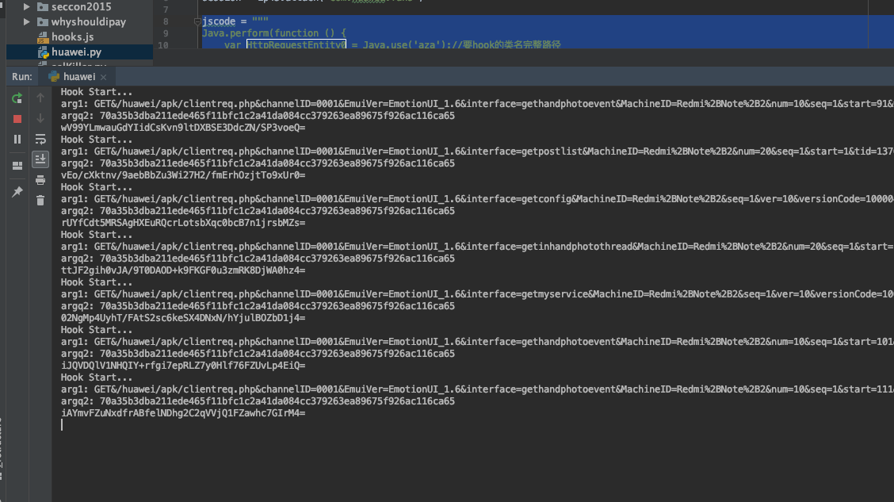  

通过规律，发现，这个a呢，是个url,abv.BG()是个固定值，真相大白了。那么，我们去找这个K函数,它定义如下，
依赖L函数。那么，这个加密值就完成了。
```javascript
private String K(String str, String str2) {
            return Base64.encodeToString(L(str, str2), 2);
        }

private byte[] L(String str, String str2) {
    try {
        SecretKeySpec secretKeySpec = new SecretKeySpec(str2.getBytes("UTF-8"), bic);
        Mac instance = Mac.getInstance(bic);
        instance.init(secretKeySpec);
        return instance.doFinal(str.getBytes("UTF-8"));
    } catch (Exception e) {
        zf.e(e.getMessage());
        return new byte[0];
    }
}
```
好，我们写个测试类验证一下。
```javascript

import javax.crypto.Mac;
import javax.crypto.spec.SecretKeySpec;
import android.util.Base64;

public class fans {
    private static final String bic = "HmacSHA256";
    private static final String arg1 = "GET&/huawei/apk/clientreq.php&channelID=0001&EmuiVer=EmotionUI_1.6&interface=gethandphotoevent&MachineID=Redmi%2BNote%2B2&num=10&seq=1&start=61&ver=10&versionCode=100004031&&appid=7910&timestamp=1588820053";
    private static final String arg2 = "70a35b3dba211ede465f11bfc1c2a41da084cc379263ea89675f926ac116ca65";
    private static final String result = "ZIrF5C0Iae6jSTdtT3/j1jT+5gVTxZr2qF1l0eunKIA=";


    private byte[] L(String str, String str2) {
        try {
            SecretKeySpec secretKeySpec = new SecretKeySpec(str2.getBytes("UTF-8"), bic);
            Mac instance = Mac.getInstance(bic);
            instance.init(secretKeySpec);
            return instance.doFinal(str.getBytes("UTF-8"));
        } catch (Exception e) {
//            zf.e(e.getMessage());
            return new byte[0];
        }
    }

    private String K(String str, String str2) {
        return Base64.encodeToString(L(str, str2), 2);
    }

    public static void main(String args[]){
        System.out.println(result.equals(new fans().K(arg1, arg2)));
    }
}

```  

python改写如下  
```python
from base64 import b64encode
from urllib.parse import urlparse
from Crypto.Hash import SHA256, HMAC


orgin_url = "https://cn.club.vmall.com/huawei/apk/clientreq.php?ver=10&seq=1&EmuiVer=EmotionUI_1.6&channelID=0001&MachineID=Nexus+5&versionCode=100004031&interface=getforumdisplay&typeid=0&fid=4355&begin=81&length=20&orderby=lastpost&maximgcount=3"
orgin_header = {
    'Accept-Language': 'zh-CN,zh;q=0.8',
    'User-Agent': 'Mozilla/5.0 (Linux; U; Android 6.0.1; zh-cn; Nexus 5 Build/M4B30Z) AppleWebKit/534.30 (KHTML, like Gecko) Version/4.0 Mobile Safari/534.30',
    'AUTHORIZATION': 'HUAFANS-HMAC-SHA256 appid=7910,timestamp=1588734974,signature="p3C/p5KCuMrXHxkdZHFESJcgF7MKI4B/xoC9Lv3lFoI="',
    'Host': 'cn.club.vmall.com',
    'Connection': 'Keep-Alive',
    'Accept-Encoding': 'gzip',
}

sha256_key = "70a35b3dba211ede465f11bfc1c2a41da084cc379263ea89675f926ac116ca65"


def encrypt(url, method="GET"):
    url_parse = urlparse(url)
    sig_str = "{method}&{url}&{param}&&appid={appid}&timestamp={timestamp}"
    sig_dict = {
        "method": method,
        "url": url_parse.path,
        "param": "&".join([p.replace("+", "%2B") for p in sorted(url_parse.query.split("&"), key=lambda x:x.split("=")[0].lower())]),
        "timestamp": "1588734974",  # 取自header中的AUTHORIZATION
        "appid": "7910",  # 取自header中的AUTHORIZATION
    }
    return b64encode(HMAC.new(key=sha256_key.encode(), msg=sig_str.format_map(sig_dict).encode(),
                              digestmod=SHA256).digest()).decode()


print(encrypt(orgin_url))
```

# 总结  
随着技术的发展，爬虫越来越成为一件不那么容易的事了，反爬工程狮会设置各种障碍阻止你抓包等等。正如上面这个华为的
其中一个app一样，反抓包，接口加密，爬虫工程狮的学习永不止步呀。以上教程仅供学习讨论，请勿商用。
